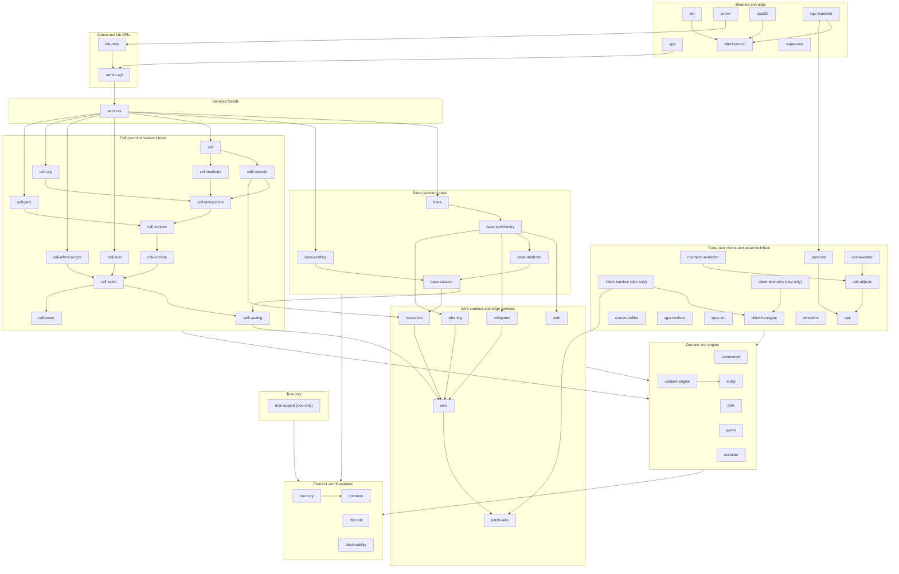

# Cimmeria — Stargate Worlds Server Emulator

[](https://github.com/SandboxServers/Cimmeria/actions/workflows/test.yml)
[](https://codecov.io/gh/SandboxServers/Cimmeria)

A server emulator for [Stargate Worlds](https://en.wikipedia.org/wiki/Stargate_Worlds), the cancelled Stargate MMO developed by Cheyenne Mountain Entertainment. The game was built on [BigWorld Technology](https://en.wikipedia.org/wiki/BigWorld) (networking/server) and Unreal Engine 3 (rendering/client), and reached a playable beta before the studio shut down in 2010.

Cimmeria reimplements the server infrastructure — authentication, world simulation, entity management, and game logic — allowing the original game client to connect and play.

## Status

The project tracks **<!-- gen:gap-count total -->491<!-- /gen:gap-count --> features** across <!-- gen:gap-systems -->45<!-- /gen:gap-systems --> systems against the Rust codebase. **<!-- gen:gap-pct CW+NT+IM 0 -->80%<!-- /gen:gap-pct --> have code** (<!-- gen:gap-count CW+NT+IM -->394<!-- /gen:gap-count --> of <!-- gen:gap-count total -->491<!-- /gen:gap-count -->); **<!-- gen:gap-pct CW 0 -->34%<!-- /gen:gap-pct --> are confirmed working** end-to-end with the live client (<!-- gen:gap-count CW -->167<!-- /gen:gap-count --> of <!-- gen:gap-count total -->491<!-- /gen:gap-count -->), and another <!-- gen:gap-count NT -->125<!-- /gen:gap-count --> are merged and waiting for a client test. These figures are generated from the gap analysis's summary matrix. See the [Gap Analysis](docs/gap-analysis.md) for the full per-system breakdown.

**Tested end-to-end with the game client:**
- Login and authentication (HTTP SOAP → shard select → Mercury UDP)
- Mercury reliable UDP transport with AES-256 encryption, per-channel fragment reassembly
- Game data pipeline (21 resource categories, 112,626 DB rows)
- Character creation and world entry, entity spawning, grid-based Area of Interest
- Castle Cellblock and Castle played end to end (2026-09-18 colo playtest): missions, dialogs, NPC combat, loot, ring transport, the Livewire minigame
- Contact lists and the GM command console
- Durable Base→Cell content event delivery via persistent outbox
- One-command build and setup

**Code exists, needs verification:**
Vendors | Chat | Trading | NPC AI restoration (September) | Stargate DHD and multi-player gate sync | Harset

**Implemented with known gaps:**
Combat & abilities | Effects | Missions (no cash or item rewards yet) | Spawn population control | Mail (read only) | Stats & leveling | Crafting (state only)

See [docs/project-status.md](docs/project-status.md) for the detailed breakdown.

## Tests & CI

The Rust workspace currently carries **<!-- gen:tests-total -->10,016<!-- /gen:tests-total --> `#[test]` / `#[tokio::test]` cases** across **<!-- gen:tests-files -->1,696<!-- /gen:tests-files --> files**, of which **<!-- gen:tests-ci-gated -->8,629<!-- /gen:tests-ci-gated --> are gated on every PR** (CI excludes the two Tauri editors, the egui launcher, the Tauri app, the Windows-only client-telemetry and client-patches cdylibs, and the live research lab). **<!-- gen:tests-live-db -->1,538<!-- /gen:tests-live-db --> are live-DB regression guards** (gated by `require_db_or_skip!`) and **3 are end-to-end PL/pgSQL smoke scripts** (vendor stack, inventory move, progression). GitHub Actions runs five gating jobs on every PR — `cargo fmt --check`, `cargo clippy -D warnings`, `cargo build`, `cargo nextest run` (workspace, no DB), and the live-DB tier (`tools/test-live-db.sh`: the lib tests of every crate with live-DB tests) against a `postgres:17.9` service container loaded from `db/database.sql`. nextest's JUnit output is uploaded to Codecov Test Analytics for per-test history and flake detection.

For the test-type taxonomy (unit / wire-format / live-DB / smoke / concurrency / chain-replay), when each is appropriate, common gotchas, and the patterns reviewers expect to see, read **[TESTING.md](TESTING.md)**.

## Quick Start

```bash
cargo run -p cimmeria-server
```

Handles login, Mercury protocol, character select, and world entry. Connect the game client to `localhost`.

**Test account:** `test` / `test`

### Run from a pre-built container (no Rust toolchain required)

A self-contained pre-release image with the server, cooked game data, and a pre-loaded Postgres is published to GHCR on demand — comment `/release` on a merged PR (or run the workflow manually) and the build at `main` HEAD ships. Versioned `YYYY-MM-DD.N` (UTC). See [docs/operations/container.md](docs/operations/container.md) for the release model.

```bash
docker run -d --name cimmeria \
  -p 13001:13001 -p 32832:32832/udp -p 50000:50000/udp \
  -p 8081:8081 -p 8443:8443 \
  -e BASE_EXTERNAL=<your-LAN-or-WAN-ip> \
  -v cimmeria-data:/var/lib/postgresql/data \
  ghcr.io/sandboxservers/cimmeria-server:latest-prerelease
```

`BASE_EXTERNAL` defaults to `127.0.0.1` and must be overridden for any client not on the host. See [docs/operations/container.md](docs/operations/container.md) for the full env reference, volume layout, and reset workflow.

## Architecture

```
                          ┌─────────────────┐
                          │   Game Client    │
                          │  (UE3 + BigWorld)│
                          └────────┬────────┘
                                   │
                    ┌──────────────┼──────────────┐
                    │              │               │
              HTTP :8081    Mercury UDP      Mercury UDP
                    │         :32832              :?
                    ▼              ▼               ▼
            ┌──────────┐   ┌──────────┐    ┌──────────┐
            │   Auth   │──▶│ BaseApp  │───▶│ CellApp  │
            │  Server  │   │          │    │          │
            └──────────┘   └──────────┘    └──────────┘
            Login, accounts  Entities,      World cells,
            Shard auth       persistence    movement, AoI
```

- **AuthenticationServer** — HTTP/SOAP login, account management, shard key exchange
- **BaseApp** — Persistent entity state, player data, character management
- **CellApp** — Spatial simulation, world cells, movement, Area of Interest
- **NavBuilder** — Offline navigation mesh generation (Recast/Detour)

## Crate Dependency Graph

The workspace crates and their **actual** inter-crate dependencies. An arrow
**A → B** means *crate A depends on crate B*. The diagram is generated from
`cargo metadata` and CI checks that it is current, so it always matches the
`Cargo.toml` files; GitHub renders the Mermaid below.

<!-- crate-graph:begin -->



*Generated by `tools/crate-graph/crate_graph.py` from `cargo metadata`: 57 workspace crates, 204 direct dependency edges (52 drawn crate to crate, after omitting edges already implied by a longer path; edges into the shared "Domain and engine" and "Protocol and foundation" layers are drawn as 6 layer-to-layer arrows). Dev-dependencies are not drawn. The `regen-docs` workflow regenerates this block on `main` after every merge (`python tools/docs-gen/regen.py`); `crate_graph.py --full` draws every edge.*

<!-- crate-graph:end -->

Every node is a workspace crate and the graph is a DAG rooted at **common** (the
shared types, config and error layer).

- **mercury** (reliable UDP, AES-256), **commands** (command and permission
  model), **entity** (live game objects), **game** and **content-engine** (the
  data-driven content pipeline) are the domain layer.
- **services** ties Auth, Base and Cell together. The **server** binary, the
  **admin-api** REST layer, **lab-mcp**, the **app** desktop GUI (repo-root
  `src-tauri/`, package `cimmeria-app`) and the headless **wireclient** test
  client build on it.
- **services has been split** into about 19 crates along its real seams: a
  wire contract (**wire**, **wire-log**), the edge services (**auth**,
  **resources**, **minigame**), a cell track (**cell-catalog**, **cell-cover** →
  **cell-world** → **cell-combat** → **cell-content** → **cell-interactions** →
  **cell-methods** / **cell-console** → **cell**) and a base track
  (**base-session** → **base-methods** → **base-world-entry** → **base**) that
  compile in parallel, with `cimmeria-services` left as a thin facade that
  re-exports each at its old paths. The plan, the target graph and each wave's
  status are in
  [docs/architecture/services-crate-split.md](docs/architecture/services-crate-split.md).
- **discord** (notifications) and **observability** (OTLP metrics) are
  cross-cutting libraries.
- The **upk** / **upk-objects** / **navmesh-extractor** / **occluder** crates
  plus the `scene-editor` tool form the Unreal-package, navmesh and
  line-of-sight toolchain.
- **test-support** is a dev-only crate shared by tests.

## Project Structure

```
Cimmeria/
├── crates/                 Rust server (active development — 19 crates)
│   ├── common/             Shared types, config, error handling
│   ├── mercury/            Mercury reliable UDP + AES-256 encryption
│   ├── defs/               Entity definition parser (XML → Rust types)
│   ├── entity/             Entity system (lifecycle, properties)
│   ├── commands/           Server command framework
│   ├── game/               Game mechanics and rules
│   ├── content-engine/     Data-driven content pipeline
│   ├── services/           Facade: orchestrator, DB pool, re-exports of the split service crates
│   ├── auth/               Auth service: SOAP login, TLS, credentials, login audit
│   ├── resources/          Cooked-data PAK cache, Cimmeria's overrides, CharDef table
│   ├── test-support/       Test helpers (live-DB gate, log capture); dev-only
│   ├── admin-api/          REST administration API
│   ├── supervisor/         Process supervision and service lifecycle
│   ├── server/             Binary entry point (cargo run -p cimmeria-server)
│   ├── discord/            Discord notification dispatch
│   ├── observability/      Metrics facade over the OpenTelemetry SDK
│   ├── wireclient/         Headless test client (Tier 3)
│   ├── upk/                UPK (Unreal Package) file parser
│   ├── upk-objects/        UPK object type definitions
│   ├── navmesh-extractor/  UE3 .umap geometry → .obj for NavBuilder
│   ├── occluder/           Collision-geometry occluders for server-side line of sight
│   ├── launcher/           egui game launcher + DLL injection (sgw-launcher)
│   └── client-telemetry/   Windows-only cdylib injected into SGW.exe
├── src-tauri/              Tauri desktop GUI wrapping the server (cimmeria-app)
├── entities/               XML entity definitions and type registry
├── data/                   Cooked game data (.pak) and navmeshes
├── db/                     PostgreSQL schemas
│   ├── database.sql        Database and role setup
│   ├── sgw/                Game schema (accounts, characters, items)
│   └── resources/          Resource data (abilities, effects, archetypes — 18 game systems)
├── docs/                   ~280 documents
├── tools/                  Editor tools, RE utilities, and live-DB smoke SQL scripts (vendor_store_smoke.sql, inventory_move_smoke.sql, progression_smoke.sql)
└── deprecated/             Retired C++/Python/MSVC sources kept for reference
```

## Tech Stack

| Crate | Purpose |
|---|---|
| `cimmeria-mercury` | Mercury reliable UDP, AES-256-CBC + HMAC-MD5 |
| `cimmeria-services` | Auth, Base, Cell service orchestration |
| `cimmeria-resources` | Cooked-data PAK cache and Cimmeria's in-memory overrides |
| `cimmeria-auth` | SOAP login handshake, auth TLS, credential storage, login audit |
| `cimmeria-cell-cover` | NPC cover: world-space cover loader, spatial index, slot reservation, scoring |
| `cimmeria-defs` | Entity definition parsing from XML |
| `cimmeria-content-engine` | Data-driven mission/effect/dialog runtime |
| `cimmeria-discord` | Discord notification dispatch (server + colo events) |
| `cimmeria-observability` | Metrics facade over the OpenTelemetry SDK (OTLP) |
| `cimmeria-wireclient` | Headless test client: SOAP auth, Mercury phase-3 handshake builders and a JSONL trace loader (no UDP socket or replay engine yet) |
| `tokio` | Async runtime and networking |
| `axum` | HTTP/REST for auth and admin API |
| `sqlx` | PostgreSQL async driver |
| `quick-xml` | SOAP/XML parsing |

## Database

PostgreSQL 17.9 schemas in `db/`:
- `db/database.sql` — Database and role setup (port 5433, role `w-testing`)
- `db/sgw/` — Game schema (accounts, characters, items, missions)
- `db/resources/` — Resource data (abilities, effects, loot, archetypes)

Test account: **test** / **test** (SHA1 hashed).

## Documentation

[docs/](docs/readme.md) contains **~270 documents** covering protocol, gameplay, engine internals, architecture, and reverse engineering.

**New here? Start with:**

- [Getting Started](docs/guides/getting-started.md) — first-time setup tutorial (prerequisites → `setup.ps1` → connecting the client → running tests)
- [Building the Server](docs/building.md) — how-to for cargo builds, the test suite, and CI checks
- [Troubleshooting](docs/troubleshooting.md) — common first-day problems and fixes

**Understand the codebase:**

- [How SGW Works](docs/how-sgw-works.md) — BigWorld + UE3 hybrid architecture
- [Connection Flow](docs/connection-flow.md) — End-to-end login and world entry
- [Game Systems](docs/game-systems.md) — Combat, abilities, stargates, missions, crafting
- [Service Architecture](docs/architecture/service-architecture.md) — Auth / Base / Cell topology

**Plan and contribute:**

- [Project Status](docs/project-status.md) — What works and what's left
- [Gap Analysis](docs/gap-analysis.md) — Per-feature completion tracking
- [Contributing](CONTRIBUTING.md) — Contribution scope, code style, PR conventions
- [Testing Guide](TESTING.md) — Test types, when to use which, common gotchas

**Operate and deploy:**

- [Container Distribution](docs/operations/container.md) — `docker run` the published GHCR image, env reference, release model
- [Integration Test Infra](docs/architecture/integration-test-infra.md) — Live-DB test setup and rationale

For reverse engineering: [docs/reverse-engineering/](docs/reverse-engineering/PLAN.md)

## Contributing

Contributions welcome. See **[CONTRIBUTING.md](CONTRIBUTING.md)** for scope, code style, PR conventions, and where to find a first issue. The pre-PR checklist lives in [CLAUDE.md](CLAUDE.md); test conventions in [TESTING.md](TESTING.md). Project conduct expectations are in [CODE_OF_CONDUCT.md](CODE_OF_CONDUCT.md).

## Security

If you find a security issue, **please do not open a public issue**. See [SECURITY.md](SECURITY.md) for the private reporting path.

## License

This project is a server emulator for research and preservation purposes. A formal license file is pending — until it lands, treat the source as available for reading, building, and contributing back, but ask before redistributing.
