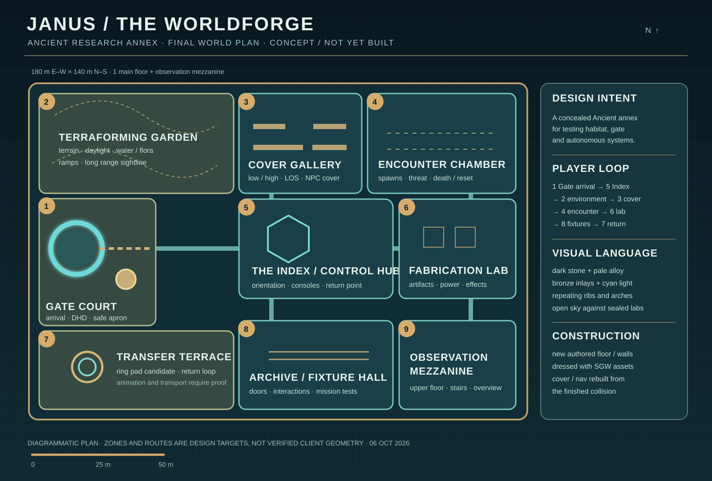

# Janus's Worldforge

This is a **design target**, not a client-loaded level. The story premise is a concealed Ancient annex where Janus experimented with gate-linked habitat construction, environmental controls, and autonomous machines. The premise is original to this project. It fits Janus's established role as an inventor and the series' hidden-lab precedent (["Before I Sleep" transcript](https://www.gateworld.net/atlantis/s1/before-i-sleep/transcript/), [Janus character account](https://www.gateworld.net/wiki/Janus)), but there is no claim that this specific lab exists in Stargate canon.

The architectural cues are grounded in [Cheyenne Mountain's Agnos concept art](https://www.gateworld.net/news/2007/09/stargate-worlds-reveals-ancient-planet/) and [James Robbins's Ancient chair and Atlantis production drawings shared by Joseph Mallozzi](https://josephmallozzi.com/2018/02/10/february-10-2018-the-stargate-concept-art-of-james-robbins/): monumental portal approaches, ribbed arches, strong symmetry, restrained blue light, and a contrast between massive stonework and precise machinery. This plan compresses that language into a navigable 180 × 140 m annex. The garden and gate court open to sky; the other chambers form an enclosed lab. The plan is original and does not reproduce concept art.

## Spatial program

| # | Zone | Narrative purpose | Proving-ground purpose |
|---:|---|---|---|
| 1 | Gate court | Secret arrival, ceremonial axis to the Index | Gate travel, DHD, safe spawn, collision |
| 2 | Terraforming garden | Small controlled habitat and exterior test plot | Terrain, slopes, water/foliage, daylight, long sightline |
| 3 | Cover gallery | Adjustable defenses for Janus's machines | Low/high cover, facing, NPC tactics, line of sight |
| 4 | Encounter chamber | Contained threat simulations | Spawn, aggro, abilities, death and reset |
| 5 | Index / control hub | The lab's organizing intelligence | Orientation, terminals, respawn, central route |
| 6 | Fabrication lab | Device assembly and energy distribution | Artifact, console, light and effect fixtures |
| 7 | Transfer terrace | Material/personnel transfer | Ring rig experiment and return route |
| 8 | Archive / fixture hall | Janus's stored projects and records | Doors, interactions, mission and inventory chains |
| 9 | Observation mezzanine | Elevated monitoring deck | Stairs, second-floor nav, vertical visibility |

The main circulation is a loop. Combat chambers branch from the hub so routine testing does not force a player through hostile spawns. The exterior garden is deliberately adjacent to the cover gallery for a clear indoor/outdoor sightline test. Zone 9 is the only upper floor in the first finished version; more stacked floors would complicate navigation before the one-floor level works.

## Verified client asset palette

These names were read from `--mesh-actors` in the eight largest `Agnos/*.umap` chunks in the local QA client on 2026-10-06. They are **asset references present in cooked maps**, not proof that the patcher can yet transplant each actor into a new world. The map geometry, walls, ceiling and terrain are to be newly authored; dress those surfaces with these assets.

| Use | Existing reference examples | Planned placement |
|---|---|---|
| Architectural ribs | `AN-Arch.AN-Arch01`, `AN-Arch.AN-Pillar_Medium00`, `AN-Arch.AN-Pillar_Large00`, `AN-Arch.AN-HollowWall_MID00` | Gate axis, Index, hall portals |
| Light and trim | `AN-Arch.AN-Lightstrip00`, `AN-Props.AN-Ceiling_Light01`, `AN-Props.AN-Wall_Light_Deco00` | Route inlays and room edges |
| Workstations | `AN-Props.AN-CommunicationsTerminal_01`, `AN-Props.AN-Mainframe_01`, `AN-Props.An-Monitor03`, `AN-Props.AN-Chair01` | Index and fabrication lab |
| Machinery | `AN-Props.AN-PlasmaPipe_Long00`, `AN-Props.AN-PowerGenerator_00`, `AN-Props.AN-RobotRepairStation_00` | Fabrication lab and maintenance edges |
| Archives and artifacts | `AN-Props.AN-Shelf_High00`, `AN-Props.An-Artifact01`, `AN-Props.An-Artifact02` | Archive and display bays |
| Ancient cover | `AN-Cover.AN-Cover_Med_Railing_I1`, `AN-Cover.AN-Cover_High_Railing_I1`, `AN-Cover.AN-Cover_High_Shield_I2` | Cover gallery and terraces |
| Habitat dressing | `AN-Arch.AN-Canal_Str00`, `AN-Arch.AN-Canal_Ramp02`, `AN-Props.AN-Bench00` | Garden and gate court |

`AGN-Prebuilt_MBD.upk` also contains redirects/prebuilds named `Buildings.AN_ResearchLabSmall_001`, `Computers.AN_ComputerWallTerminals_001`, `AN_ReflectionPool_001`, `AN_Gateway_001`, `AN_Steps_001`, and `Plants.AN_Planter_001`. These are promising compound sources, but they need prebuild expansion/placement research before use. A Stargate/DHD and working ring rig require separate donor identification, animation binding and an in-client test; the plan reserves their footprints without claiming those mechanics already work in a constructed level.

## Build sequence and gates

1. Save and load one genuinely new floor with a gate-court spawn. Confirm collision and correct world routing in the QA client. This is still the current campaign gate.
2. Author the hub, three laboratory chambers and exterior garden. Dress with verified Ancient assets; check each donor's material/package dependencies and lightmaps.
3. Rebuild server navmesh, occluders and cover from the finished collision. Prove NPC use of authored cover before adding decoration to the gallery.
4. Add gate, DHD, ring pad and interaction fixtures. Verify animations, functional travel, and a safe return/spawn point separately.
5. Generate minimap and map artwork from the finished top-down geometry, align world bounds, and check markers against the client map UI. This art cannot be final until geometry is final.

The [campaign work packets](work-packets.md) remain the implementation ledger. The first client load of the small base map is still the prerequisite for this final design.
