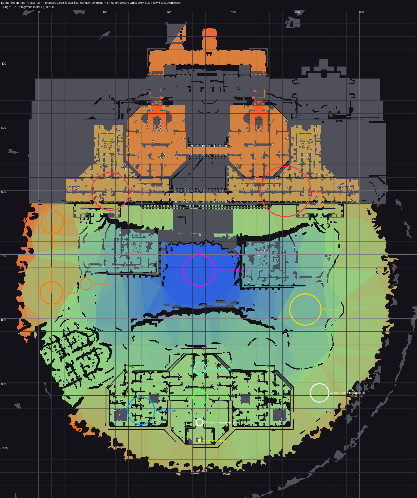

# Debug Area and Starter Kit

> Type: how-to and ledger. Audience: the coordinator, packet workers and the
> playtesters. Opened 2026-10-04 against `main` @ `bd020cb95`. Prefix `DA-` for the
> Debug Area, `SA-` for the starter kit. Same dispatch rules as the
> [ability mechanics ledger](../ability-mechanics/work-packets.md#dispatch-rules).

## Why

Maintainer feedback from playtesting on the colo (2026-10-04), which takes
priority over the rest of the ability-mechanics work:

1. "Starting classes should all spawn with at least pistol shot, focus regen
   and health regen abilities."
2. "We'll soon need some kind of test map which has all enemies, a grant all
   abilities NPC for my class etc. Basically like the debug rooms from Oblivion
   and Skyrim." The debug area "must be able to UAT all feature and system
   functionality we have implemented as best we can".
3. Perform a release once both are ready. A map may be patched or created, but
   no CME bytes in the repo: only diffs.

The owner added: the debug area should be "a bit more spread out and has cover
and rooms and stuff we can use to test all functionality like respawn and
friendly, neutral, enemy npcs, hostile npc battles", and the seeded playtest
characters should be Praxis Commandos identical to characters made through
normal character creation ("today they are half formed").

The existing [stasis-room debug hub](../../content/debug-hub.md) stays. It is
full, every player sees it, and it has no enemies, cover or room to fight in.

## What the starter-kit gap actually is

- `char_creation_abilities.sql` already grants every char_def 1-23 the abilities
  592 Pistol Shot, 594 Strike, 597 Heal Focus, 1646 Health Heal and 1218
  Recuperation (audit row B-01).
- The colo's seeded playtest characters (`db/sgw/Players/Seed/sgw_player.sql`:
  cady, jorsh, cake, lomiada1 and others) carry only `{592, 594, 597}`, spawn in
  SGC_W1 and lack most of what character creation writes. Confirmed on the colo
  2026-10-04: player 71, created in-game, has all five; players 62-70 have three.
- No character starts with a weapon. 592 has `required_ammo = 1`, so Pistol Shot
  is refused with NoAmmo at spawn.
- The action bar is client Lua state (`GActionProfiles`). The server cannot place
  abilities on it, so a fresh character's bar is empty and the granted abilities
  only appear in the Abilities window.

## Decisions taken for this campaign

The owner can reverse any of these. Each is recorded so a reviewer can find it.

| Id | Decision | Why |
|---|---|---|
| D-DA1 | The Debug Area is a new server world **1300 `DebugArea`** on the shipped client map **Ihpet_Crater_Light**. | Only candidate with rooms, dense map-authored cover (6,324 `SGWSpecCoverNode`s), a flat 60 m sunken pit for an arena, a 420 m terrace for a gallery and a crater wall as its boundary. Survey: [npc-ai-spawn-advisor memory](../../../.claude/agent-memory/npc-ai-spawn-advisor/debug-area-map-survey.md). The original test maps (Combat_Terrain_Test, Mob_TestMap, InteriorCombatTest, MissionTest*) were never recovered in any archived build. |
| D-DA2 | New id, served through cooked-data category 12 (`CookedWorldInfo`), not a remap of a shipped test world id (54, 53, 21, 1). | The category-12 route is proven in-client by the historical CellBlocks (1201-1207). Remapping a shipped `_N` entry breaks the "every shipped world served untouched" rule. |
| D-DA3 | Shared and always loaded (`Instanced="false"`, listed in `cell_spaces.xml`). | Two testers can meet, NPC battles and respawn timers keep running. |
| D-DA4 | GM-only travel: `.gotolocation DebugArea` (and the native `/gmgotolocation`). No stargate row. | Keeps ordinary players out without a client patch. The seeded playtest accounts are GMs. A teleporter NPC in the stasis hub is left to the owner. |
| D-DA5 | The world reads the client map's navmesh and occluder files (`ihpet_crater_light.nav/.occ`) when it has none of its own. | Avoids a 5 MB copy per added world. |
| D-DA6 | Tags `DebugArea_*`, never `DebugHub_*`. | The hub's tests count the `DebugHub_` prefix. |
| D-DA7 | Training dummies never retaliate. | A NEUTRAL faction-10 NPC still fires back with 592 when shot, which spoils damage and heal measurements. Reuse the `.dummy` "never attacks" mechanism as a seedable flag. |
| D-DA8 | NPC-vs-NPC arena runs two fights: a faction 3 vs 10 squad fight a player can join, and a spectator-only pair from the player-safe hostile pairs (2-19, 2-27, 2-29, 23-29, 27-29, 27-36). | 3 vs 10 is the only seeded mutual-hostile pair; the spectator pair shows NPC-only kills paying nothing (#1009). |
| D-DA9 | Gallery hostiles are seeded passive (`aggression_override`), so a tester walks the line and picks a fight. | 101 hostile templates in one line would otherwise chain-pull. They stay damageable. |
| D-SA1 | Every character starts with a basic pistol and ammo in the active bandolier slot. | Makes Pistol Shot usable at spawn, as asked. The Castle CellBlock tutorial still hands out its pistol; SA-01 records any deviation. |
| D-SA2 | A fresh character's action bar is filled once with its known abilities by client patch `009-starter-hotbar`, a delta on a UI file the testers' WQHD UI pack (v26) does not replace. | The server cannot write the bar. The pack replaces `ActionProfiles.lua`, so a delta on that file would not apply for them. |

## Zone layout (world 1300)

Heights are BigWorld metres. On open terrain the navmesh and the occluder terrain
disagree by up to 3.3 m, so terrain points use occluder heights; interiors, the
terrace and the pit agree within about 1 m. Every hostile pair of zones is at
least 86 m apart with a wall between, against an 18 m default aggro radius and
10 m assist radius.

| Zone | Point (x, y, z) | Contents | Packet |
|---|---|---|---|
| Z1 arrival + respawner A | (251.0, 8.0, -962.0) | Arrival, respawner 130 | DA-01 |
| Z2 services plaza | (252.0, 7.0, -923.0), clear radius 12 | Copies of every hub service, ability granter | DA-02 |
| Z3 dummies range | line x 240..264 at z -872, y 6.6 | Non-retaliating dummies, friendly heal target | DA-02 |
| Z4 faction yard | (416.0, -5.7, -786.0), radius 25 | Friendly row x≈400, neutral row x≈416, hostile pen x≈434 | DA-03 |
| Z5 AI behaviour slope | A (20.0, 13.9, -760.0) ↔ B (22.0, 20.6, -650.0); wanderer (74.0, -0.4, -746.0) | Patrol, wander, leash, assist pair | DA-03 |
| Z6 NPC-vs-NPC arena | pit (250.0, -32.4, -725.0), flat radius ≥ 25 | Squads at x 238 / 262 | DA-04 |
| Z7 enemy gallery | terrace y 23.1, rows z -592 / -612, x 55..170 and 305..465 | Every hostile template, passive | DA-03 |
| Z8 cover course | south compound west wing: entry (204, 7.0, -926), riflemen (166, 6.7, -930), (142, 6.7, -958) | `use_cover` riflemen among 161 cover nodes | DA-04 |
| Z9 death and respawn test + respawner B | (438.0, 10.4, -916.0) | Respawner 131, a lethal hostile | DA-04 |

## Id blocks

| Range | Owner |
|---|---|
| World 1300, respawners 130-131 | DA-01 |
| Templates 1300-1329, spawns 13000-13199 | DA-02 |
| Templates 1330-1369, spawns 13200-13599 | DA-03 |
| Templates 1370-1399, spawns 13600-13799 | DA-04 |

Check each range is free in the seed before using it; raise a clash with the
coordinator instead of moving into another packet's block.

## Packets

| Packet | Scope | Depends on | Status |
|---|---|---|---|
| SA-01 | Seeded playtest characters rebuilt as Praxis Commandos identical to normal creation; starter pistol and ammo for every char_def (D-SA1); live-DB guards that every char_def and seeded character holds 592, 597, 1646, 1218 and the pistol. | none | Writing |
| SA-02 | Client patch `009-starter-hotbar` (D-SA2), Lua logic UAT against stock and v26 `ActionProfiles.lua`. Publishing the manifest is a coordinator step. | none | Writing |
| DA-00 | This plan. | none | Review |
| DA-01 | World plumbing: world row, `spaces.xml`/`cell_spaces.xml`, a table of Cimmeria-added worlds feeding `world_id_for_name`, `client_map_for_world` and `WORLD_INFO_OVERRIDES` (also closing the missing shipped names: 50, 61, 62, 69, 70, 72, 73, 78), fail-closed `resolve_space_id_fallback`, nav/occ fallback to the client map (D-DA5), advisory list, respawners 130/131, generated cover nodes for world 1300, `.gotolocation DebugArea`. | none | Review (#1223) |
| DA-02 | Z2 services plaza (vendor, trainer, dialog NPC, terminal, loot crate, registrars, pet trainer, bankers, mail clerk, Black Market auctioneer, crafting stations) and an ability granter that gives the clicking player every ability of their archetype; Z3 non-retaliating dummies (D-DA7). | DA-01 | BlockedDependency |
| DA-03 | Z4 faction yard, Z5 patrol/wander/leash/assist, Z7 enemy gallery with every hostile template (D-DA9). | DA-01 | BlockedDependency |
| DA-04 | Z6 arena (D-DA8), Z8 cover course, Z9 death and respawn test. | DA-01 | BlockedDependency |
| DA-05 | `docs/content/debug-area.md`, `docs/guides/uat-specs/debug-area.toml`, unified UAT section mapping every system to a station. | DA-02..04 | BlockedDependency |
| DA-06 | Live-client check in the lab: the map loads as world 1300, spawn heights, doorway collision, map Kismet, every station answers. Fixes as `DA-F<n>`. | DA-01..04 deployed | BlockedDependency |
| REL | Close-out: status docs, unified UAT, content patch publish, `/release`. | all above | BlockedDependency |

## What each implemented system is tested with

DA-05 owns the final table; this is the target.

| System (unified UAT section) | Station |
|---|---|
| Ability mechanics, ability trees | Z2 ability granter and trainer, Z3 dummies, `.effects` / `.cooldowns` |
| NPC AI (aggro, assist, leash, patrol, wander, cover) | Z4, Z5, Z8 |
| NPC-vs-NPC (#1009) | Z6 |
| Combat, death, respawn | Z7, Z9, respawners 130/131 |
| Vendors, special ammo, consumables, deployables | Z2 vendor |
| Bank and vault, mail, organizations, Black Market, pets, crafting | Z2 copies of the hub services |
| Loot | Z2 crate, any Z7 kill |
| Minigames | Z2 terminal |
| Dialog UI | Z2 dialog NPC |
| GM console parity | anywhere in world 1300 |

Systems tied to a particular map (Castle CellBlock tutorial, Castle, Harset, ring
transport, historical CellBlocks, gate travel) stay tested in their own zones.

## Risks needing the live client

- The client loading Ihpet_Crater_Light under world 1300 / area name `DebugArea`.
- NPC heights on open terrain (navmesh vs terrain gap).
- Invisible walls or blockers at compound doorways.
- The map's own Kismet or stargate prefab firing on load with no gate row seeded.
- `.gotolocation DebugArea` from Ihpet_Crater_Light (world 73), and back. Both
  send `mapPath = Ihpet_Crater_Light`, and the client skips the UE3 load when
  `mapPath` equals the map it holds (SGW.exe `FUN_00df27f0`). Expected: no
  loading screen, world 73's level state (Kismet, map actors) carries over,
  and the entry still completes, because the client still sends
  `onClientReady` and the base already finishes cross-world entries from it
  (`handle_on_client_ready` synthesises `mapLoaded`). A stall would be fixed
  server-side.
- The minimap location text reads the world-1300 name
  (`getWorldInfo(1300).Name`, from `setupWorldParameters.worldId`), and the
  world map copes with an id that has no shipped map data.
