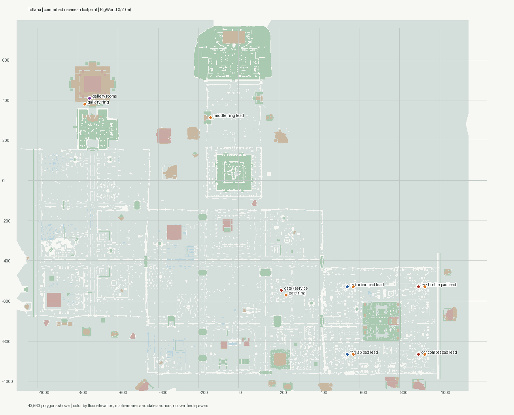
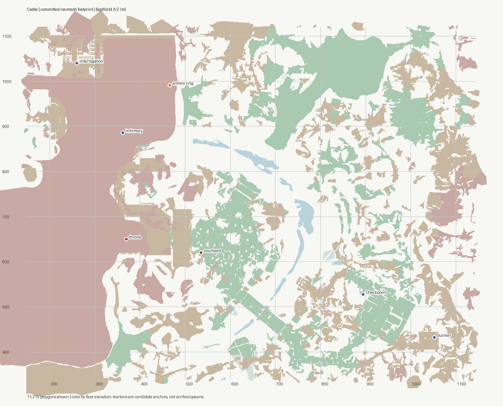
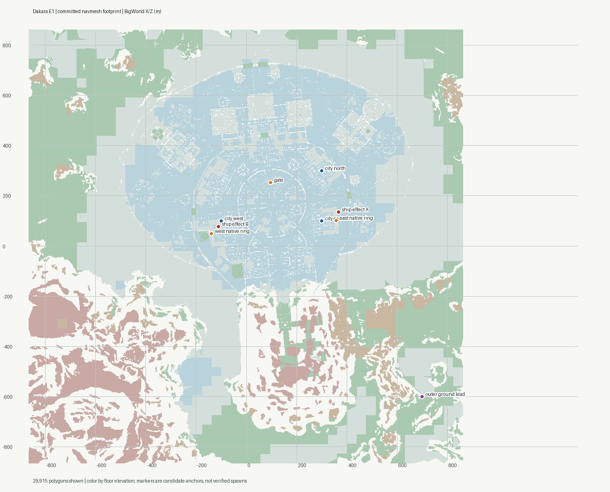
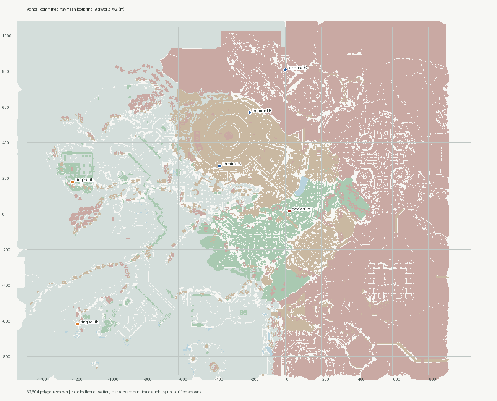

# Permanent proving ground: map selection study

Research only. This study does not move world 1300 or alter game content. It
compares the committed `.nav` files with the local QA cooked maps, current
seeds, and the [Debug Area reference](../../content/debug-area.md). Candidate
pins are survey points, not approved spawn positions. The companion images
draw the actual committed navmesh polygons, colored by floor elevation;
overlapping floors appear on top of one another. Reproduce them from the
project root with `map-footprint-source.py` and Pillow/NumPy.

## Recommendation

| Rank | Map | Why it sits here | Condition before selection |
|---:|---|---|---|
| 1 | **Castle** | Best practical conversion: rooms, corridors, stairs, courtyard, exterior checkpoints, a working armory arrival precedent, seeded cover and an existing populated playtest zone. The main proposed stations land on connected component 250. | Measure client RAM with representative appearance tours; visually check proposed ring and booth clearances; keep story tests in world 8. |
| 2 | **Tollana** | Best long-term campus layout: several city districts separated by ~335–355 m, a distant gallery, 69,054 authored cover nodes and three native ring rigs. Four sampled southern pad leads all land on component 89. | Seed and validate usable cover, wire ring travel, survey each station interior in the client, and measure empty-map and repeated-tour memory. |
| 3 | **Dakara_E1** | Best battle/effect annex: a distinct city and outer grounds, two native ring rigs, 9,847 authored cover nodes and two Ha'tak effect leads from the handed-off dossier. | Confirm safe effects, spectator placement and reset behavior; map the wall-gate navigation breaks. |
| 4 | **Agnos** | Strong specialist for Ancient machinery, terminals and mission-themed demonstrations. Current geometry supports elevated terminal areas, but their sampled floors and gate arrival span many nav components. | Prove actual client-accessible terminal interactions and ring behavior before considering it for the main world. |

**Castle remains first.** Tollana's district separation helps prevent a
single 150 m AoI circle from covering unrelated stations, and its native ring
rigs lower visual authoring work. It does not yet have working world-19 ring
regions, seeded cover, or a measured client memory baseline. The southern
district centers in the handoff are useful neighborhood labels but some land
on isolated prefab polygons rather than the district's main walkable floor.
That makes Tollana a strong prototype candidate, not a justified immediate
replacement. Agnos's terminal evidence improves its specialist case, not its
all-systems position.

Map file bytes and server `.occ` residency are not client texture-memory
measurements. No map here is claimed to win on RAM.

## Evidence and limits

The local QA install provided current cooked map chunks for all four maps.
The `someworlds.zip` dossier named in the handoff was not attached locally;
its reported effect and terminal bindings remain dossier claims. The QA
executable was present, but neither a game client nor a local server was
running during this study. This pass did **not** measure empty-map client RAM,
ring animation, repeated tours, multiple developers, GPU occlusion, water
behavior, or asset release after real client map travel.

`nav_inspect` directly decoded each committed mesh. `extract_map` processed
all cooked chunks with `--interp-actors classify`; `obj_slab` sampled collision
geometry in the named chunks. `cover_extract` wrote scratch SQL and the
50 m counts below are authored nodes within 5 m vertically of the sample,
not validated or seeded usable cover. This is the current local QA map,
not a multi-build object count.

| Map | QA chunks extracted | Collision triangles | Nav polys / components | Authored cover | Cover seeded now | Native animated ring pieces |
|---|---:|---:|---:|---:|---|---:|
| Castle | 144 | 4,142,421 | 19,815 / 549 | 3,788 | Yes, world 8 | One ring `InterpActor`; animation not verified |
| Tollana | 504 | 19,371,662 | 45,493 / 1,215 | 69,054 | No, world 19 | 15 pieces = **three** rigs |
| Dakara_E1 | 400 | 13,849,524 | 36,238 / 699 | 9,847 | No, world 61 | 10 pieces = **two** rigs |
| Agnos | 690 | 22,278,974 | 78,571 / 6,076 | 25,292 | No, world 10 | No animated ring pieces in the `InterpActor` extraction |

The navmesh dimensions and server occluder residency are documented in
[`data/spaces/README.md`](../../../data/spaces/README.md). Its `.occ` files
support **server** line of sight; they do not establish the client's render
occlusion or release of mesh/texture allocations. Castle's published
connectivity survey is [here](../../engine/castle-navmesh-connectivity.md).
The current Debug Area's all-161-client crash and five-group switching
measurements are [here](../../content/debug-area.md#arrival-load-and-client-memory).

## Actual footprints and station layouts

### Tollana: distributed campus

| District / proposed use | BigWorld X/Y/Z (m) | Nav result | Local collision and cover evidence |
|---|---|---|---|
| Gate, arrival and services | `211 / -1 / -548`; native rig `236 / -1.33 / -575` | Both component **89** | Gate floor around y=-1.04; 462 authored cover nodes within 50 m of gate. Existing DHD and one ring console spawn. |
| Middle transit / overflow | Native rig `-139.91 / 1.66 / 312.33` | Component **885**, separate from gate and gallery | Floor near y=1.94 and a surface near y=11.2. No seeded middle ring console or ring region. Reserve for travel and a modest display until access is verified. |
| Western gallery / selectable looks | Native rig `-769.80 / 9.30 / 381.97`; rooms near `-742 / 8.8 / 408` | Rig and room upper floor component **89**; ground below is component 0 | At the room sample: surfaces y=0.23, 7.52, 8.80 and 15.31, then an overhead surface around 16.48. Only 13 authored cover nodes within 50 m at y≈9: better for appearance booths than combat. Actor origins at y=7.52 are **not** safe player pins. |
| Urban cover / LOS course | Center `540 / -1 / -530`; **new pad lead** `570 / -1.04 / -530` | Center touches small component 550; pad lead is **89** | 549 cover nodes within 50 m; extracted pad box has a floor at y=-1.04 and no overhead surface at its center. |
| Target, status and pets lab | Center `540 / -1 / -865`; **new pad lead** `570 / -1.04 / -865` | Center's nearest polygon is 89 but an adjacent prefab island is component 180; pad lead is **89** | 544 cover nodes within 50 m; floor y=-1.04 at pad sample. |
| Hostile-template / faction rows | Center `895 / -1 / -530`; **new pad lead** `925 / -1.04 / -530` | Center component 559; pad lead **89** | 551 cover nodes within 50 m; pad's 12×12 m source-geometry box contained only 12 triangles, with floor y=-1.04. |
| Combat theatre and death yard | Center `895 / -1 / -865`; **new pad lead** `925 / -1.04 / -865` | Center component 189; pad lead **89** | 557 cover nodes within 50 m; pad box contained 18 triangles, with floor y=-1.04. |

These four southern neighborhoods are ~335 m apart north/south and ~355 m
east/west. Their pad leads have 2 m horizontal / 1 m vertical nav hits on
component 89. The extracted 12×12×16 m boxes and center columns are a
**screen** for plausible flat pads, not a ring-clearance proof: a client
walk, ring disc animation, player collision and streaming transition are
still required. Do not place an NPC patrol through a prefab island simply
because a center sample is near the main component. The gate and west rig
already have console spawns (`Tollana_Ring_fffa0002`,
`Tollana_Ring_0003fff8`), but `ring_transport_regions.sql` has no world-19
rows; the three native rigs are scenery until transport is wired.

**Suggested UAT loop:** gate services → urban cover → target lab → hostile
rows → opt-in combat theatre → gallery look batch → middle transit → gate.
Only a small selected appearance group should be resident per viewer in the
gallery. Nearby room walls alone do not hide these entities from AoI.

### Castle: practical main-world conversion

Keep the debug world a separate server world from Castle world 8, even if it
shares client art. Preserve world 8's missions, story actors and existing
playtests. Suggested stations:

| Station | Survey anchor (X/Y/Z) | Nav component | Notes |
|---|---|---:|---|
| Armory arrival, services, loadout/reset, return transit | Existing ring drop `466.365 / 70.397 / 991.466` | 250 | Existing cross-world Cellblock ring destination and floor precedent. New debug ring destinations still need separate authoring. |
| Infirmary, targets, healing/status, pets | `362 / 70.18 / 886` | 250 | Sampled floor y≈70.1, overhead around y≈78.1; 45 authored cover nodes within 50 m. Use adjacent clear floor after client inspection. |
| Interrogation appearance booths | `260 / 67.04 / 1040` | 250 | Sampled floor y≈67.0, overhead around y≈75.0; 291 cover nodes within 50 m. Do not use sealed mirror wing component 501. |
| Corridor/stairs: cover, LOS, pursuit and vertical movement | Main indoor spine between armory and throne | 250 | Current nav mesh joins the main indoor probes. Avoid moving NPCs between the distinct checkpoint component 116 and the interior. |
| Throne/courtyard: controlled NPC battles | `370 / 38.38 / 650`; `535 / 25 / 620` | 250 | Existing Castle population validates broad floor use. Keep spectators outside aggro and use opt-in fights. |
| Exterior patrol, factions, leash and assist | Checkpoint `894 / 29.09 / 527`; bunker `1052 / 48.18 / 432` | 116 | Separate from component 250; use a ring/teleport for developers, with local NPC cohorts inside each region. |

The first five sampled stations land on component 250. The checkpoint and
bunker land on 116. The armory is **not** an on-foot entrance from the exterior;
the physical terrain gap described in the Castle connectivity document
remains. A remote death/stress pocket still needs a client-safe site and
respawner survey. Castle's interior puts more stations close to the armory,
so a 150 m AoI can overlap services and appearance booths during a walk.

### Dakara_E1: battle and effects annex

The gate at `96.174 / -15.164 / 253.206`, native west rig near
`-139.33 / -16.36 / 48.95` and native east rig near
`358.03 / -16.21 / 102.07` all probe to component **279**. The two rigs
are ten animated pieces, not ten destinations. A city-east battle course
around `300 / -17 / 100` and a northern course around
`300 / -19 / 300` also probe to 279; a city-west sample at
`-100 / -21 / 100` is component **389**. The proposed outer ground around
`700 / 10 / -600` is another component. Ring travel does not make NPCs
path across those splits.

Use the gate for safe services, the two existing rigs as city anchors,
cover-rich city areas for faction/combat tests, and a remote outer-ground
ring only after an on-foot survey. The dossier's two distinct Ha'tak
reveal/explosion roots lie near X/Z `367/136` and `-112/78`, while their
reported Y≈354–360 is **effect geometry high above the ground**, not a
player floor. The nav samples beneath them are about y=-21 and y=-17.
Execution, repeatability, reset and spectator safety are unverified. The
Ha'tak station is opt-in and isolated from arrival.

### Agnos: specialist, not yet a finalist

The handoff names native ring leads near `-1194/179` and `-1167/-619` and
three terminal clusters. The current extraction found two animated Humvees
and **no** animated ring pieces; a static or prefab ring and its callable
sequence may still exist. `obj_slab` found surfaces near y=17.6 and 25.6
at the northern lead, and y=-5.1 and 3.2 at the southern lead. Only the
upper northern floor (component 3354) and lower southern floor (850) hit
the committed navmesh within 2 m in the sampled columns.

Terminal A near `-370/270` has floors y≈62 and 82 on components **3607**
and **2946**. Terminal B near `-200/570` has the same two heights on
**4693** and **2946**. Terminal C near `0/810` has several surfaces around
y≈136–147 on components **5645** and **5809**. The gate arrival
`20.64/34.939/15.89` is on **2513**. These are real elevated geometry
samples, but terminal actor counts, accessibility and interactions are not
proved by the map or mission descriptions. Keep native mission/Kismet
checks in their original worlds until there is a working callable chain.

## Client memory and interest design

The current 32-bit client's measured Debug Area failure is more useful than
any map-file proxy. All 161 distinct looks raised the working set from
1,135 to 3,227 MB in 10 s and failed `CreateTexture`. With one lineup group
at a time, the worst switch reached **3,936 MB virtual** of 4,096 MB;
cleared textures released in a burst **30–60 s** later. Three rounds did not
show accumulating private bytes, although the cache settled about 0.5 GB
above arrival ([measurements](../../content/debug-area.md#arrival-load-and-client-memory)).
Those are **Ihpet** results, not Castle/Tollana/Dakara baselines.

Current AoI is distance-based: a player enters entities within 150 m and
keeps them until 175 m (`crates/entity/src/cell_entity/witness_aoi.rs` and
`crates/cell-world/src/cell/space_manager/aoi.rs`). The cell sends
`EnteredAoI` to the base for every introducible candidate in that radius;
walls and floors do not filter it. A rendered occlusion or a hidden mesh
cannot be assumed to stop an appearance cascade or texture load.

Memory mitigation options, in order:

1. Keep the existing global default-off lineup batches as a safe baseline.
   Make the first migrated gallery groups **smaller** than the 42/44-look
   batches that produced the highest peaks, then measure before raising a
   cap. Do not lower texture resolution.
2. If independent inspection is required, add a **per-viewer** gallery
   selection to the cell's AoI eligibility check. Keep a chosen batch through
   a short exit margin, prewarm only the next small batch, and send proper
   `LeftAoI`/`EnteredAoI` changes. A global spawn toggle cannot let two
   developers inspect different groups concurrently.
3. Treat combat cohorts atomically for interest: everyone involved in a
   selected fight, their targets, and interactable observers stay visible
   for the fight. Do not drop a targetable opponent because it crossed a
   room boundary or selection filter. Explicit opt-in stress rooms can
   bypass the normal gallery cap.
4. If repeat tours retain substantial virtual memory, compare **real client
   map travel** against same-map world switching. World 1300→73 already
   switches server worlds without a loading screen, so that is not a valid
   proof of a texture-cache flush.

These are implementation options, not a claim that actor destruction frees
assets. Preserve target lifetime, witness fan-out and combat visibility in
any AoI change, with multi-client tests.

## Decision and authoring gates

Before migrating content, run the same instrumented QA-client sequence on
Castle, Tollana and Dakara: empty-map baseline; 16/24/32 identical-look
actors; equally sized distinct-look batches; one group switch with 60 s
settling; three ring-linked tours; true client map travel; and two developer
clients choosing different gallery groups. Sample process virtual, private
and working-set bytes each second, plus client entity counts, frame time,
texture-allocation failures, AoI enter/leave counts and reliable-packet
stalls. Record stock versus patched client and map build. No such comparison
was possible during this study.

After the benchmark, author a **minimal prototype** on the selected map:
one services hub, one ring to a gallery with a small selected look batch,
one cover/combat course, and a safe return/respawn. Client-walk every pad
for rendered floor, collision, rig animation, vertical clearance, doors,
water and camera sightlines. Then move the remaining currently implemented
stations from `docs/content/debug-area.md` and update the UAT spec. Keep
future props/interactables and native mission/Kismet cases explicitly
separate from implemented stations.

The full conversion would need world-1300 map identity and arrival data,
GM access/respawn checks, station coordinates and path regions, cover
extraction/seed for the new world, ring regions and chains, rig/map-data
patches where the selected map lacks them, map icons, and each relevant
`DebugArea_*` seed and test updated together. A client map patch affects
every world sharing that cooked map, so test the original Castle/Tollana/
Dakara world as well. The failed `010-debug-area-rings` patch and repaired
`011` sequence are a concrete warning to verify Kismet name-table and
dependency handling before shipping a new rig patch.

**Selection rule:** keep Castle unless an identical QA tour shows Tollana
has safe memory headroom and its prototype ring, cover and combat stations
work with no navigation or rendering surprises. Dakara is the battle annex
unless its wider terrain and effects are specifically needed in the main
world. No migration is authorized by this research alone.
