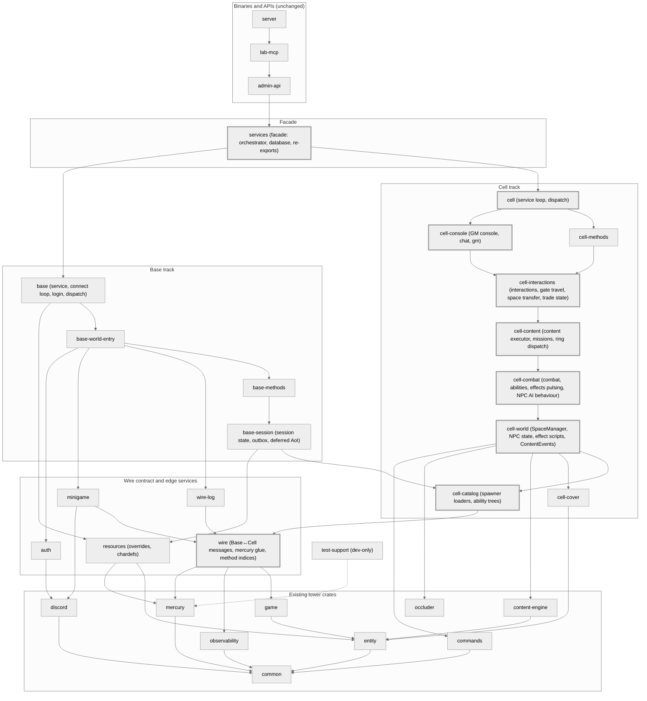

# Splitting `cimmeria-services` into an acyclic crate graph

> **Status:** Accepted, in progress on `build/toolchain-overhaul` (2026-09-26).
> **W0 done (2026-09-26):** `cimmeria-test-support`, the live-DB wrapper `tools/test-live-db.{sh,ps1}`, the layering guard `tools/layering/` (55 allowlisted edges) and the source-scan and stale-target guards are in. Deviations are listed under [§4](#deviations-found-during-the-waves).
> **W1b done (2026-09-26):** `cimmeria-resources` holds `base::{resources, mission_overrides, item_overrides, dialog_overrides, sequence_overrides, chardef}`; `cimmeria-services` re-exports them at the old paths.
> **Why:** `cimmeria-services` was one crate of 914 files: about 106k production lines plus 150k lines of tests. rustc does most of its work for a crate serially, so every edit re-checked the whole crate, every test run linked one ~250k-line test binary, and a machine's cores sat idle. On 2026-09-26, editing one file in `cell::content` and rebuilding the services test binary took **164.7 s**. This plan splits the crate along its real seams so Cargo can compile the pieces in parallel and an edit rebuilds only what depends on it. See [build-system.md](build-system.md) for the wider build overhaul.

Conventions: `file:line` paths are relative to `crates/services/src/` as of `origin/main` `f153138b` (2026-09-26), unless marked. "Lines" means production lines, comments included. Inline `#[cfg(test)]` modules and test files are excluded.

## 0. What the dependency graph actually looks like

A naive module graph reports one 117k-line cycle. That figure is inflated:

- The naive tool cut files at the first `#[cfg(test)] mod` (including `mod x;` declarations near the top of a `mod.rs`).
- It counted intra-doc links as edges: the only messages→space_transfer, base::world_entry, console and chat "edges" are doc links at `cell/messages/cell_to_base.rs:113,140,495` and `base_to_cell.rs:314`.
- It counted `pub(in crate::cell)` visibility as an edge.
- It also missed real edges from `use a::{b,c}` groups, `pub use` re-exports and parent→child relative paths.

Corrected, production code is **105.8k lines**, with 24.5k inline test lines and 124.3k lines in test files. There are two production cycles:

- **The cell cycle (71.5k lines):** all of `cell` except `kismet`, `player_journal` and `client_methods`, plus `mercury`, `firehose` and `base::{mod, helpers, contact_list}`. The base modules are pulled in by only four edges (§2A).
- **A base-internal cycle:** `base::{world_entry, world_entry_appearance, character}` (17.1k lines).

**`base::world_entry` is not in a cycle with `cell`.** Once the Base↔Cell message contract has its own crate, the base side splits independently and compiles in parallel with the cell side.

## 1. Target crate map

All crates sit at `crates/<dir>`, are `publish = false`, and use the `foo/mod.rs` style.

| Crate | Contents (current module paths) | Lines | Workspace deps |
|---|---|---|---|
| `cimmeria-test-support` (dev-only) | `live_db_gate.rs`, `LogCapture` from `test_support.rs`, `TestTransport` re-export | 0.6k | mercury[test-support] |
| `cimmeria-auth` | `auth/`, `audit.rs`, `credential_redaction.rs` | 2.0k | common, discord |
| `cimmeria-resources` | `base/{resources, mission_overrides, item_overrides, dialog_overrides, sequence_overrides, chardef}` | 2.7k | entity, mercury |
| `cimmeria-wire` | `mercury/`, `cell/{messages, client_methods, player_journal, kismet}`, `cell/dispatch/{constants,names}.rs`, `firehose/`, `base/contact_list/wire.rs`, plus the items moved down in §2A (cell-method index constants, BSF bits, `SpawnRecord`, serializers, `to_hex`, `bag_max_slots`) | 6.0k | common, mercury, entity, game, observability |
| `cimmeria-wire-log` | `wire_log/` | 2.7k | wire |
| `cimmeria-minigame` | `minigame/` | 2.3k | wire, discord |
| `cimmeria-cell-catalog` | `cell/spawner` (DB loaders), `ability_tree/`, `cell/respawner_fallback.rs`, `space_manager/navmesh_mode.rs` | 2.4k | wire |
| `cimmeria-cell-cover` | `cell/cover/` except `stance.rs` | 2.8k | common, entity, sqlx |
| `cimmeria-cell-world` | `cell/mod.rs` (`CellError`), `space_manager/`, `arrival.rs`, `playtest_friction*.rs`, ring `transporter/ regions.rs wire.rs wire_helpers.rs runtime/teardown.rs`, the synchronous effect-script layer, `cover/stance.rs`, `npc_ai/{detectors, transition.rs, movement_stop, leash/policy.rs}`, `combat/{aggression, faction_reaction}.rs`, `dispatch/gm_gate.rs`, and the new `ContentEvents` trait | 12.3k | catalog, cover, wire, content-engine, occluder, commands |
| `cimmeria-cell-combat` | `cell/{combat, abilities, effects/pulsing}`, `cell/service/npc_ai` (behaviour), `cell_methods/player/world/{reload,item_sequence}.rs`, `cell_methods/inventory/bandolier/` | 13.4k | world |
| `cimmeria-cell-content` | `cell/{content, missions}`, `ring_transport/{dispatch.rs, runtime/{entry,tick}}`, `interactions/dialog.rs`, and `EngineEvents` | 8.4k | combat |
| `cimmeria-cell-interactions` | `cell/{interactions, gate_travel, space_transfer}`, the handler half of `mail.rs`, `cell_methods/player/trade/{state,wire}.rs` | 3.4k | content |
| `cimmeria-cell-methods` | the rest of `cell/cell_methods`, plus `base_messages/player_init/resync.rs` | 5.1k | interactions |
| `cimmeria-cell-console` | `cell/{console, chat.rs}`, `cell_methods/gm/` | 10.1k | interactions |
| `cimmeria-cell` | `cell/service/{mod, startup, message_loop, base_messages, ticks}`, `cell/dispatch/{mod, router}` | 5.9k | methods, console |
| `cimmeria-base-session` | `base/mod.rs` types, `helpers/`, `outbox/`, `deferred_aoi*.rs`, `session_identity`, `gm_feedback`, `world_entry_chat`, `contact_list/`, `crafting/`, `console_authoring/`, `gm_spawn`, `tick_sync`, `cooked_data`, plus the moves in §2I | 5.5k | wire, catalog, resources |
| `cimmeria-base-methods` | `base/world_entry/methods/` | 9.6k | base-session |
| `cimmeria-base-world-entry` | the rest of `base/world_entry/`, `world_entry_appearance/`, `character/` | 7.3k | base-methods, wire-log, minigame, auth |
| `cimmeria-base` | `base/{service, connect_loop, dispatch, login, character_create}`; owns the `chaos-testing` feature | 3.1k | base-world-entry, auth, resources |
| `cimmeria-services` (facade) | `orchestrator*.rs`, `database.rs`, and re-exports of the old paths | 0.8k | cell, base, auth, minigame, wire |

Two crates are deliberately smaller or larger than a 3–20k band:

- **NPC AI is merged into combat.** Death→purge and threat→assist are synchronous, ordering-critical calls (§2D).
- **The spawner is split.** Its DB loaders go to catalog; its SpaceManager-populating functions go to world.

*Figure 1: planned crate graph after the split. An arrow A → B means A depends on B; edges implied by a longer path are omitted. Thick-bordered crates are the cell track's critical path. The live graph of what has actually landed is generated into the [README](../../README.md#crate-dependency-graph).*



- **Critical path (new crates):** wire 6.0 → catalog 2.4 → world 12.3 → combat 13.4 → content 8.4 → interactions 3.4 → console 10.1 → cell 5.9 → services 0.8 = **62.7k lines (59% of today's 105.8k)**.
- **Base track:** 25.5k lines after catalog. It finishes while the cell track is still building world and combat.
- **Off the critical path:** auth, resources, cover, wire-log, minigame and cell-methods.

## 2. Every cycle edge and its fix

"Move down" means the item moves into the lower crate and the old path keeps a `pub use`.

### A. Base↔cell edges, and the message contract into `cimmeria-wire`

| Edge (file:line) | Fix |
|---|---|
| `cell/abilities/death/mod.rs:34`, `cell/cell_methods/contact_list/mod.rs:15` → `base::contact_list::wire` | Move `base/contact_list/wire.rs` into wire |
| `firehose/emit.rs:13` → `base::helpers::to_hex` (helpers/mod.rs:185) | Move `to_hex` into wire |
| `cell/cell_methods/inventory/bandolier/active_slot.rs:128` → `base::resources::bag_max_slots` (resources/mod.rs:28, a pure table) | Move into wire, so combat does not depend on resources |
| `cell/messages/base_to_cell.rs:394` → `spawner::SpawnRecord` (npcs.rs:15) | Move `SpawnRecord` and `class_id_for_class` into wire; it is a message payload |
| `cell/dispatch/constants.rs:8-9` re-exports ~150 index constants from `cell_methods/*` | Move the constants to `wire::cell_methods::*`, mirroring `client_methods` |
| `ability_tree/points_property.rs:10`; `bandolier/active_slot.rs:12`; `bandolier/ammo_change.rs:10`; `player/world/reload.rs:273-274` → `inventory/constants.rs:25` | Move `inventory/constants.rs` and `points_property.rs` into wire |
| BSF bits used at `base/world_entry/cell_dispatch/state_field.rs:31,94`, `effects/scripts.rs:28`, `missions/progression.rs:71`, `service/ticks/cover.rs:160`, `console/bookmark.rs:360,412` → `combat/state.rs:12-67`, `cell_methods/combatant.rs:21` (duplicate at `ring_transport/wire_helpers.rs:22`) | Create one `wire::state_field` module |
| `content/executor/bark.rs:35` → `chat.rs:198` | Move the serializer into wire |
| `base/world_entry/methods/mail/mod.rs:10` (used at :97-254) → `cell/mail.rs` | Split `mail.rs`: `MailHeader` and serializers go to wire, the forwarding handlers go to interactions |
| `wire_log/client_names.rs:211,227` → `dispatch::cell_method_name` | Move `names.rs` into wire |
| `base/world_entry/reanchor_player.rs:222`, `progression/mod.rs:380`, `vendor/store.rs:17`, `teleport.rs:201,348`, `cell_dispatch/minigame.rs:74,109` | Resolved once player_journal, points_property, client_methods and `CLIENT_MG_*` are in wire |
| `mercury/aoi/create.rs:9`, `player_ghost.rs:21` → `cell::messages` | Nothing to do: both land in wire |

### B. Catalog and cover

- **`spawner/npcs.rs:11,351-480`** (calls `:439 detectors::spawn::check_spawn` and `:461-464 combat::aggression_*`): split the file. `spawn_npcs_from_records` and `spawn_instance_npcs_from_records` move to `space_manager/spawn.rs` in world.
- **`spawner/worlds.rs:25,64`** → `space_manager::navmesh_mode`: move `navmesh_mode.rs` into catalog; its impls at `:60,70` travel with it.
- **`cover/stance.rs:27-28`** (uses effects and SpaceManager): move `stance.rs` to world. The rest of `cover` then has no internal deps and becomes its own crate.
- **`base/gm_spawn.rs:29,190`** → spawner loaders: allowed, because catalog sits lower. `entity_template_select!` (`templates.rs:70`, a `macro_rules!` re-exported with `pub(crate) use`) needs `#[macro_export]`.

### C. The `cell::service` hub → `cimmeria-cell-world`

`npc_ai`'s state primitives are what lower systems call, so they move to world. Its behaviour joins combat (D).

| Edge | Fix |
|---|---|
| `space_manager/mod.rs:306` (NpcDetectors field); `cover_sight.rs:137,144`; `spatial.rs:42,81`; `spawner/npcs.rs:439` → `npc_ai::detectors` | Move `detectors/` to world |
| `combat/state.rs:108,126`; `combat/auto_cycle.rs:458,471`; `combat/threat/aggro.rs:192,197`; `abilities/death/mod.rs:320`; `use_ability/fire_los.rs:197`; `content/executor/world/mod.rs:15,198-319,647` → `world_label`, `set_ai_state_on`, `force_ai_state`, `stop_movement_on`, `AiTransitionReason` (`transition.rs:43-209`, `movement_stop/mod.rs:79,89`) | Move `transition.rs` and `movement_stop/` to world; npc_ai re-exports them |
| `combat/threat/aggro.rs:63`; `leash/policy.rs:83` (LEASH_DISTANCE) | Move `leash/policy.rs` and the constant to world |
| `detectors/sweep.rs:268` → `aggro_acquired.rs:37` `los_label` | Move `los_label` into detectors |
| `space_manager/spawn.rs:39,309,358`; `mod.rs:364`; `detectors/aggro_scan.rs:84,186`; `idle_parked.rs:18` → `NPC_DEFAULT_ABILITY` (threat/aggro.rs:116), `HOSTILE_FACTION` (combat/mod.rs:44), `HealthBelowSample` (damage_credit.rs:62), `aggression.rs:49-85` | Move `aggression.rs`, `faction_reaction.rs`, both constants and the struct to world |
| `space_manager/spawn.rs:339`, `lifecycle.rs:107` → `hold_spawn_cover` → `effects::dispatch_by_name` (stance.rs:74) | Move the synchronous effect-script layer to world: `EffectContext`, `EffectScript` and `dispatch_*` from `effects/mod.rs`, plus `registry.rs`, `scripts.rs`, `cover_stance.rs`. It depends only on SpaceManager; async pulsing stays in combat |
| `space_manager/mod.rs:392,445` → `StepRegionReplayGuard` (`step_activation/mod.rs:86`, impl at :94) | Move the struct and its impl to world |
| `space_manager/entities.rs:389` → `forget_player` (`runtime/teardown.rs:25`) → `dispatch_release_effects` (`dispatch.rs:232`); fields at `mod.rs:267-273` | Move `transporter/`, `regions.rs`, `wire.rs`, `wire_helpers.rs`, `teardown.rs` and `dispatch_release_effects` to world |
| `space_manager/client_move.rs:37` → `gm_gate.rs:210` | Move `gm_gate.rs` to world |
| `npc_ai/aggro_gates.rs:42`, `path_request.rs:126` → `console::is_gm` (console/mod.rs:114) | Move `is_gm` to world |
| `client_move.rs:655-660`, `entities.rs:111-112` | Move `playtest_friction*` to world; the journal goes to wire |

### D. Combat and NPC AI stay one crate

After the moves above, combat still needs NPC behaviour at `threat/aggro.rs:214` (`log_aggro_acquired`) and `:226` (`recruit_assisters`), and at `abilities/death/mod.rs:419` → `purge_dead_player_from_threat` → `leash::begin_leash` (`leash/begin.rs:182`) → `path_request`.

- **Ordering:** the purge is deliberately synchronous and ordered after the death broadcast (the NA24 comment at `death/mod.rs:414-418`). Deferring it would regress a UAT fix.
- **References the other way:** NPC AI makes 42 references into combat.
- **Split impls:** `impl AggroCause` is split across `combat/threat/aggro.rs:31,45` and `npc_ai/aggro_acquired.rs:20`, and inherent impls must live in the type's crate.

**Decision:** combat and NPC AI share one crate. An `NpcReactions` trait could separate them later.

### E. Combat → content: trait inversion

The edges:

- `abilities/use_ability/kill_credit.rs:78,116,130`
- `effects/pulsing/tick.rs:114,269` (per-pulse order "death, then health-below", tick.rs:106-114)
- `service/npc_ai/fight_cover.rs:339,343`

```rust
// cimmeria-cell-world
pub type EventFuture<'a> = Pin<Box<dyn Future<Output = ()> + Send + 'a>>;
pub trait ContentEvents: Sync {
    fn entity_death<'a>(&'a self, killer: u32, player_id: i32, tag: &'a str,
        tx: &'a Sender<CellToBaseMsg>, sm: &'a mut SpaceManager) -> EventFuture<'a>;
    fn pending_health_below<'a>(&'a self, tx: &'a Sender<CellToBaseMsg>, sm: &'a mut SpaceManager) -> EventFuture<'a>;
    fn npc_flanked<'a>(/* npc, target, template, tx, sm */) -> EventFuture<'a>;
    fn player_flanked_npc<'a>(/* same */) -> EventFuture<'a>;
}
// cimmeria-cell-content: a newtype, because `impl ContentEvents for ChainEngine` would
// violate the orphan rule (both the trait and ChainEngine are foreign there).
pub struct EngineEvents<'e>(pub &'e ChainEngine);
```

- **Signatures that change** from `engine: &ChainEngine` to `events: &dyn ContentEvents`: `kill_credit.rs:52`, `pulsing/tick.rs:49,216`, `npc_ai/mod.rs:119`, `dispatch.rs:101,263`, `fight.rs:20`, and the internal fight_cover path.
- **Callers that pass `&EngineEvents(&engine)`:** `message_loop.rs:147,159,202`, `ticks/auto_cycle.rs:225`, `ticks/pending_holster.rs:72`, `cell_methods/player/combat/mod.rs:90`, `interaction/interact.rs:142`, `player/world/auto_cycle.rs:114`.
- **Behaviour:** calls happen at the same points and in the same order, so nothing changes.
- **Tests:** `NoContentEvents` and `RecordingContentEvents` fakes go in world's test fixtures.

### F. Combat → cell_methods and service

- `use_ability/auto_reload.rs:63` and `handle.rs:355,367` → `player/world/reload.rs:25,71` and `item_sequence.rs:17`: move both files into combat.
- `content/executor/transport.rs:131`, `gate_travel/mod.rs:490`, `ring_transport/dispatch.rs:146`, `space_transfer/mod.rs:405` and `ticks/holster.rs:220` → `inventory/bandolier/active_slot.rs:19,81`: move `bandolier/` into combat.
- `active_slot.rs:199` → `ticks::HOLSTER_ANIMATION_DURATION`: move the constant into combat.

### G. Content ↔ ring transport: co-locate

This one is genuine recursion. `content/executor/transport.rs:28` calls `ring_transport::handle_interact` (`runtime/entry.rs:38`), which reaches `dispatch.rs:199` → `content::fire_teleport_in`.

- Ring `dispatch.rs` and `runtime/{entry,tick}` move into content. The finite-state machine itself stays in world.
- `content/executor/dialog/mod.rs:137` → `interactions/dialog.rs:35`: move `dialog.rs` into content.

### H. Interactions, methods, console and service

- **Trade state:** `gate_travel/mod.rs:524` and `space_transfer/mod.rs:449` call `player/trade/state.rs:247`. Move `trade/{state,wire}.rs` into interactions; the handlers stay in methods.
- **Resync:** `cell_methods/player/combat/respawn.rs:338` calls `player_init/resync.rs:88`. Move `resync.rs` and `send_known_abilities_update` into methods.
- **Chat:** `chat.rs:11` calls console, so chat joins the console crate.
- **GM commands:** `console/query.rs:265,430` and `console/mod.rs:90` call `cell_methods::gm`, so gm joins the console crate too. After that, console no longer depends on methods, and the two crates compile in parallel.
- **Service re-exports:** `cell/mod.rs:47` and `base/mod.rs:51` (`pub use service::{Cell,Base}Service`) move to the facade.

### I. Base-internal

- **`CinematicAoiHold`:** `base/mod.rs:220` and `deferred_aoi.rs:332` use it (`cinematic_aoi_hold/mod.rs:57,86`). The struct and `begin()` go to base-session. The release path (`:42`, which calls `cell_dispatch::flush_deferred_aoi`) stays in world-entry.
- **Cooked data:** `base/cooked_data.rs:12-14` (also :123, 230, 312, 440) uses `helpers` and `ConnectedClientState`, so it goes to base-session, not resources.
- **Character:** `base/character/mod.rs:200` uses the `player_load::core` constants, and character is in the same cycle as world-entry, so it goes into base-world-entry.
- **Space registry:** `methods/world_entry_db.rs:11` uses `space_registry.rs`. Move that to base-session.
- **Appearance builders:** `methods/inventory/appearance.rs:28,79` uses `world_entry_appearance/builders.rs`. Move `builders.rs` to base-session.

With this assignment no other upward edge remains, and the graph has no other cycles.

## 3. Test support

**`cimmeria-test-support`** is a dev-dependency only. It must never depend on a service crate: if it did, the test build would link two copies of the same crate ("expected `SpaceManager`, found `SpaceManager`") with separate statics. It contains:

- `live_db_gate.rs`, with `require_db_or_skip!` as `#[macro_export]` using `$crate::pool_or_skip`;
- `LogCapture`, `Captured` and `LogCaptureGuard` (`test_support.rs:183-441`) and their tests;
- `pub use cimmeria_mercury::test_transport::TestTransport`.

**Domain fixtures stay with their types**, behind a per-crate `test-support` feature:

- `cimmeria_cell_world::test_fixtures`: `make_space_manager*` and `seed_ability_defs` (`test_support.rs:40-91`), `occluder_fixtures`, the `arrival.rs:332,350` helpers, and the `ContentEvents` fakes.
- `cimmeria_base_session::test_fixtures`: `test_default_connected_client_state`.

Each crate keeps a shim, so `use crate::test_support::X` compiles unchanged in moved tests:

```rust
#[cfg(test)]
mod test_support {
    pub(crate) use cimmeria_test_support::*;
    pub(crate) use <lower>::test_fixtures::*;
}
```

**Test-only hooks.** About 25 `#[cfg(test)]` items live in production modules.

- A hook used only by the owning crate's tests stays `#[cfg(test)]`.
- A hook a higher crate's tests use becomes `#[cfg(any(test, feature = "test-support"))] #[doc(hidden)] pub`, and the higher crate enables the feature through `[dev-dependencies]`.
- Hooks that cross crates: `npc_ai_follow_for_test`, `npc_ai_tick_for_test`, `resolve_death_for_test`, `maybe_trigger_auto_reload_for_test`, `load_single_chain_for_test`, `load_chain_expansions_for_test`, `resolve_use_cover`, the `movement_telemetry` `tracked*` hooks, `crossing_hold`, `StepRegionReplayGuard::is_idle`, and `cover::TEST_WORLD_ID`.

**Where tests land.** A test moves up to the crate of its highest dependency, which is about 30 files and 12k lines. For example:

- the spawner live-DB tests go to world or combat;
- `mercury/aoi/tests.rs` goes to world;
- the npc_ai detector tests go to combat;
- `chain_replay_tests/{gc1_escort, mission_742, mission_relog_persistence}` go to cell;
- `chain_replay_tests/mission_701/persistence.rs` goes to the facade;
- the other ~24k lines of `chain_replay_tests` stay in content;
- `tests/chaos_lossy_transport_integration.rs` uses only `cimmeria_mercury`, so it moves to `crates/mercury/tests/`.

During migration, a test whose highest dependency is still in the monolith stays in the monolith at its current path.

**Live-DB CI.** After the split, `-p cimmeria-services --lib` would run only the facade's tests and stay green, which is the #615 "green but empty" failure.

- `tools/test-live-db.{sh,ps1}` holds the list of crates with live-DB tests and runs `cargo nextest run --profile=ci-live-db --lib -p …` for all of them. CI (`test.yml`, both the live-DB job and coverage) and `tools/build-lane/live-db-test.sh` call it.
- The `ci-live-db` profile's `threads-required = "num-test-threads"` applies across every binary in one nextest run, so serialisation holds across crates.
- A guard test fails if a crate with a `cimmeria-test-support` dev-dependency is missing from the list.

## 4. Migration waves

Every wave leaves the monolith plus the new crates acyclic and passes the full pre-PR checklist and the live-DB wrapper.

**How an extraction works:**

1. **Preparation (inside the monolith).** Make the §2 moves, leave a `pub use` at every old path, and shrink the layering-guard allowlist.
2. **Extraction.** `git mv` the files to `crates/<dir>/src/` at the same relative path. The new `lib.rs` recreates the module skeleton (`pub mod cell { pub mod combat; … pub use cimmeria_cell_world::cell::space_manager; }`), so `crate::cell::…` and `super::…` paths compile unchanged. The monolith swaps each `mod x;` for `pub use cimmeria_x::cell::x;`.

Keeping the nesting also keeps `include_str!` and `CARGO_MANIFEST_DIR/../../data` paths valid.

| Wave | Content | Parallelism |
|---|---|---|
| **W0 Scaffolding** | `cimmeria-test-support` and the shims; the live-DB wrapper and CI change; a layering guard (`tools/layering/`) run in CI, whose allowlist may only shrink; fix the source-scanning guards (§5); a stale-target guard for the logging filters | 1 agent, merges first |
| **W1** | 1a `cimmeria-auth`; 1b `cimmeria-resources`; 1c `cimmeria-wire` seeded with client_methods, player_journal, kismet and the §2A constants and serializers | 3 agents in parallel |
| **W2** | 2a `cimmeria-cell-cover`; 2b the `SpawnRecord` / `navmesh_mode` / spawn-function moves, then `cimmeria-cell-catalog` | 2 agents in parallel |
| **W3** | 3a finish wire (`mercury/`, `messages/`, dispatch constants and names, `firehose/`), then 3b `wire-log` and 3c `minigame` in parallel | 3a first |
| **Cell track** | C1 world (adds `ContentEvents`) → C2 combat → C3 content → C4 interactions → C5a methods and C5b console in parallel (C5b first) → C6 cell | Sequential; alongside the base track |
| **Base track** | B1 base-session → B2 base-methods → B3 base-world-entry → B4 base (with `chaos-testing`) | Sequential; alongside the cell track |
| **F Final** | Facade cleanup, cross-track tests, delete the layering allowlist, docs and CI paths | 1 agent |

The two tracks touch disjoint trees (`src/cell/**` and `src/base/**`). They conflict only on list files: workspace `members`, the services `Cargo.toml` and `lib.rs`, the logging filter rows, `IN_PROCESS_CRATES`, the live-DB crate list, `codecov.yml` and `spec-touch.yml`.

### Deviations found during the waves

W0:

- **`cimmeria-test-support` gained `source_scan`**, a walker over every crate's sources that names files by their path under `src/`. The §5.4 guards use it, so their scans and allowlists survive a move. The crate is also in the live-DB crate list: its gate tests ran in the services live-DB job before, and the live-DB run keeps the same test set.
- **Edges §2 does not list.** The layering guard found three production edges the plan missed:
  - `cell_methods::gm::world` → `player::combat::respawn` (`gmRespawn` calls `handle_respawn`). This is console → methods, so §2H's claim that console stops depending on methods needs one more move.
  - `player::trade::state` → `player::trade` (`MAX_INTERACT_DISTANCE`), which must move with `state.rs`.
  - `space_manager::navmesh_mode` → `space_manager`: `navmesh_mode.rs` also holds an `impl SpaceManager` block, which must stay in world when the file moves to catalog.

  The allowlist also holds the module re-exports that the planned moves leave behind (`cover` → `stance`, `effects` → `pulsing`, `ring_transport` and `ring_transport::runtime` → `runtime::{entry,tick}`), and `dispatch::gm_gate` → the `cell_methods` index constants, which §2A's constants move resolves.
- **`deferred_aoi.rs:332` (§2I) is test code**, inside a `#[cfg(test)]` module, so it is not a production edge.
- **A stale file-layer directive.** The stale-target guard found `cimmeria_services::base::world_entry_player` in `FILE_LAYERS` (world_entry.log). The module no longer exists, so the row matched nothing; it was removed.

W1b (`cimmeria-resources`):

- **No production workspace dependencies.** The moved code uses only `quick-xml`, `tracing` and `zip`, so the crate is a leaf and does not wait for `entity` or `mercury`. `cimmeria-entity` is a dev-dependency (the bag-table test pins the `INV_*` ids). `zip` left `cimmeria-services`' dependencies with it: nothing else there used it.
- **One test stayed in services.** `behavior_event_fragment_tags_category_21_on_the_wire` (was `resources::tests::category_map`) drives `crate::mercury::protocol::build_resource_fragment`, which is still in the monolith. It is now `base::resource_fragment_tests` in `cimmeria-services`, and `CATEGORY_BEHAVIOR_EVENTS` became `pub` for it. Its final home is base-session (next to `cooked_data`, above both wire and resources).
- **Listed in the live-DB wrapper without live-DB tests.** The crate dev-depends on `cimmeria-test-support` for `LogCapture`, and `live_db_wrapper_lists_every_test_support_crate` requires every such crate in `tools/test-live-db.{sh,ps1}`.
- **Tracing.** `cimmeria_resources=debug` joins `OTEL_FILTER`: the override modules had DEBUG export through `cimmeria_services=debug` and no file layer. `character.log`'s `chardef` and `resources` rows now name `cimmeria_resources::base::…`.
- **`unreachable_pub`** narrowed `CASTLE_DIALOG_PATCHES` and `CELLBLOCK_DIALOG_PATCHES` to `pub(super)`; they sit in private modules.
- **`bag_max_slots` stayed in resources**, as the wave brief asked. Its layering-allowlist line is gone anyway: `base::resources` is now a re-export of another crate, which the guard does not follow, so the edge left the scanned graph. W1c's copy in wire is the planned fix; the coordinator dedupes.
- **The `crate-map.toml` rows for the moved modules stay.** They now match no module in `crates/services/src`, which `check.py` allows. Deleting them is left to wave F, which retires the guard's lists.

W1a (`cimmeria-auth`):

- **No allowlist edge to remove.** No module of `auth`, `audit` or `credential_redaction` had a violating edge, so the allowlist keeps its 55 lines. Their three `crate-map.toml` rows are gone instead: `check.py` scans only `crates/services/src`, where the modules no longer exist, and a new `auth` module there would now be unmapped and fail the check. Later extractions do the same.
- **`cimmeria_services=debug` does not cover the new crate.** A directive matches by string prefix, and `cimmeria_services` is not a prefix of `cimmeria_auth`, so `OTEL_FILTER` gained `cimmeria_auth=debug` and `auth.log` names `cimmeria_auth::auth`. The same holds for every crate whose name does not start with an existing directive; the parity guard catches a missing row.
- **Auth-only dependencies left `cimmeria-services`:** `axum`, `tokio-rustls`, `rustls-pemfile`, `arc-swap`, `argon2` and `sha1`, and the dev-dependencies `reqwest`, `rcgen` and `tower`.

W1c (`cimmeria-wire`):

- **Where the cell-method indices landed.** They are at `cimmeria_wire::cell::cell_methods::<interface>`, the path the handlers already use, next to `cell::client_methods`, rather than at a top-level `wire::cell_methods`. `inventory/constants.rs` and `player/constants.rs` moved whole; the other ten interfaces had their constants lifted out of the handler files. `cell/dispatch/constants.rs` stays in the monolith until W3a. Its `super::super::cell_methods` paths reach wire through the re-exports now, and will resolve to wire's own module unchanged after the move.
- **Four small modules the plan does not name:**
  - `wstring`: `write_wstring`, which `contact_list/wire.rs` needs while `mercury/` stays behind. The copies in `mercury/mod.rs` and in `mail.rs` are now `pub use`s of it, so one encoder remains.
  - `hex`: `to_hex`, named for what it holds rather than recreating a `base::helpers` module.
  - `containers`: the `bag_max_slots` copy. `base::resources` keeps its own until W1b lands, and its two table-pin tests were copied with it.
  - `state_field`: the BSF bits, at the crate root.

  W3a must repoint `firehose/emit.rs` from `crate::base::helpers::to_hex` to `crate::hex::to_hex`, and fold the `write_wstring` re-export back into `mercury/mod.rs`.
- **The `EChannel` ids moved with the chat serializer.** `CHAN_*` are the values of the payload's `Channel` byte, and the two serializer tests use them, so the tests could move with the serializer.
- **The layering guard followed a glob into another crate.** `pub use constants::*` over a module that had moved out made the guard attribute every name behind it to the re-exporting module, which produced four false edges. `check.py` now treats such a name as belonging to the other crate.
- **`cimmeria-wire` is in the live-DB crate list** although it has no live-DB tests. Its tests use `LogCapture`, so it dev-depends on `cimmeria-test-support`, and the list guard requires the entry. Its lib tests also ran in the live-DB tier while they were in services.
- **`cimmeria_wire=debug` was added to `OTEL_FILTER`.** No moved code logs under a module-path target today; `player_journal` names `player.journal`. The row keeps moved code at the DEBUG export level `cimmeria_services=debug` gave it.

W2a (`cimmeria-cell-cover`):

- **`observability` is a dependency too.** `reservation.rs` counts `cover_reservation_state` through `cimmeria_observability::counter!`, which §1's "common, entity, sqlx" misses. The crate still depends on no split crate.
- **`stance.rs` stays at its old path, behind a shim.** `crates/services/src/cell/cover/mod.rs` is now `pub use cimmeria_cell_cover::cell::cover::*` plus `mod stance` and its re-exports, so every `crate::cell::cover::…` path in services compiles unchanged, `stance` included, and no call site was edited. `stance.rs` imports the two helpers it shares with the decision code from the shim: `lock_or_recover` (was `pub(super)`) and `horizontal` (was `pub(crate)`, also used by `space_manager::cover_hit` and `npc_ai::chase::cover_slot`) are now `pub`. Nothing else was widened.
- **`crate-map.toml` maps the shim to world, and the allowlist loses `cell::cover -> cell::cover::stance`.** What is left of `cell::cover` in services is the shim and `stance.rs`, and world takes both in C1, so `cell::cover` now maps to `cimmeria-cell-world` (the separate `cell::cover::stance` row became redundant and is gone). Every production importer of `cell::cover` is in world or above, so no new violation appears. The allowlist has 53 lines.
- **`TEST_WORLD_ID` is a `test-support` hook** (§3): `#[cfg(any(test, feature = "test-support"))] #[doc(hidden)] pub`, enabled by the services dev-dependency for the cover tests that stay there because they drive a `SpaceManager` (`service/tests/npc_ai_cover*.rs`, `ticks/cover.rs`, `space_manager/cover_hit.rs`).
- **All 71 cover tests moved**, the 6 live-DB loader tests among them, so the crate joins the live-DB wrapper list. None needed a helper from the monolith.
- **Tracing.** No file layer names cover, and the hand-named `cover.*` targets are unchanged. The untargeted rows (the loader's counts and skipped-row warnings, the poisoned-mutex warnings) now carry `cimmeria_cell_cover::…`; `OTEL_FILTER` gained `cimmeria_cell_cover=debug` to keep their DEBUG export, pinned by `cover_crate_events_keep_their_index`.

## 5. Risks and rules

1. **Orphan rule and inherent impls.** All `impl SpaceManager` blocks move with `space_manager/`. No new inherent impl may appear in a higher crate; use free functions or extension traits.
   - Inherent impls that must travel with their types: `StepRegionReplayGuard`, `AggroCause`, `NavmeshMode`, `StargateEntry`.
   - `EffectScript` impls move with the trait into world.
   - `ContentEvents` needs the `EngineEvents` newtype.
2. **Visibility.** Production code has 610 `pub(crate)`, 175 `pub(in crate::…)` and 614 `pub(super)`. About 300 items cross the planned boundaries, and roughly 220 of those are not `pub` today.
   - Widen only what the compiler asks for (E0603).
   - Turn on `#![warn(unreachable_pub)]` in new crates.
   - Use `#[doc(hidden)]` only for test hooks and path-compatibility shims.
   - Downstream crates depend only on the facade.
3. **Tracing targets change silently.** `pub use` does not change `module_path!()`, so these must be rewritten in every wave:
   - `crates/server/src/logging/filters.rs` (`OTEL_FILTER`, the `FILE_LAYERS` rows)
   - `crates/server/src/otel.rs`
   - `crates/server/src/logging/parity_tests.rs`
   - the docs and SigNoz saved queries

   EnvFilter matches targets by string prefix, so `cimmeria_cell=…` covers every `cimmeria_cell_*` crate and `cimmeria_base=…` every base crate. The W0 guard fails when a directive names a module that no longer exists.
4. **Source-scanning guards.**
   - `npc_ai/movement_stop/tests.rs:175` must scan all of `crates/`, not just its own crate.
   - The allowlist at `transition.rs:337-340` hardcodes `services/src/...` paths.
   - `target_scan_tests` fails until each new crate is added to `IN_PROCESS_CRATES`. That failure is useful: it forces the question for every new crate.
5. **Macros.** `entity_template_select!` and `require_db_or_skip!` need `#[macro_export]` and `$crate`.
6. **Monomorphization and inlining.** Dev builds share generics. Release builds without LTO duplicate them and cannot inline small hot accessors across crates, so mark those `#[inline]` or use `lto = "thin"`.
7. **`chaos-testing`.** It moves to `cimmeria-base`, and the facade forwards `chaos-testing = ["cimmeria-base/chaos-testing"]`.
8. **Test binaries.** There will be 19 test binaries instead of one. Watch link time and disk.
9. **Downstream compatibility.** The facade keeps the paths the rest of the workspace imports:
   - `orchestrator::Orchestrator`
   - `audit::{LoginEvent, LoginEventBuffer}`
   - `auth::{AuthService, ShardInfo}`
   - `base::{OnlinePlayer, BaseService}`
   - `cell::{messages, console::command_catalog, CellService}`
   - `database::{DatabasePool, read_only_query, LAB_QUERY_ROW_CAP}`
   - `firehose`, `wire_log::tap`, `mercury`
10. **Paths in tooling and docs.** Update `codecov.yml`, `.github/workflows/spec-touch.yml`, `tools/wire_decoder_codegen.py`, `tools/build-metrics/measure-build.ps1`, `CLAUDE.md`, `TESTING.md`, `crates/README.md`, `abilities-and-effects-system.md` and `docs/testing/inventory/`.

## 6. Expected build impact

The estimates below are line proportions. Measure the real figures with `tools/build-metrics/measure-build.ps1`.

- **Cold build.** The services segment of the critical path drops from 105.8k to 62.7k lines, and the base track and six side crates build in parallel with it.
- **Peak memory.** Peak memory per rustc drops from one ~250k-line test target to at most ~42k lines.
- **Test builds.** The longest test-build chains fall to about a third of today.

| Edit in | Crates rebuilt | Lines (today 105.8k) |
|---|---|---|
| `cell::content` | content, interactions, methods, console, cell, facade | ≈33.7k |
| `cell::service::npc_ai` | combat and everything above it | ≈47k |
| `base::world_entry::cell_dispatch` | base-world-entry, base, facade | ≈11.2k |
| `base::world_entry::methods` | base-methods and everything above it | ≈20.8k |
| `cell::messages` (wire) | all but auth and resources | ≈101k |

Weighted by the last 90 days of edits, the average edit would rebuild about 38k lines instead of 106k.

Later options:

- Make the console a plug-in registered by the facade, so `cell` no longer depends on it.
- Move `space_transfer` below interactions.
