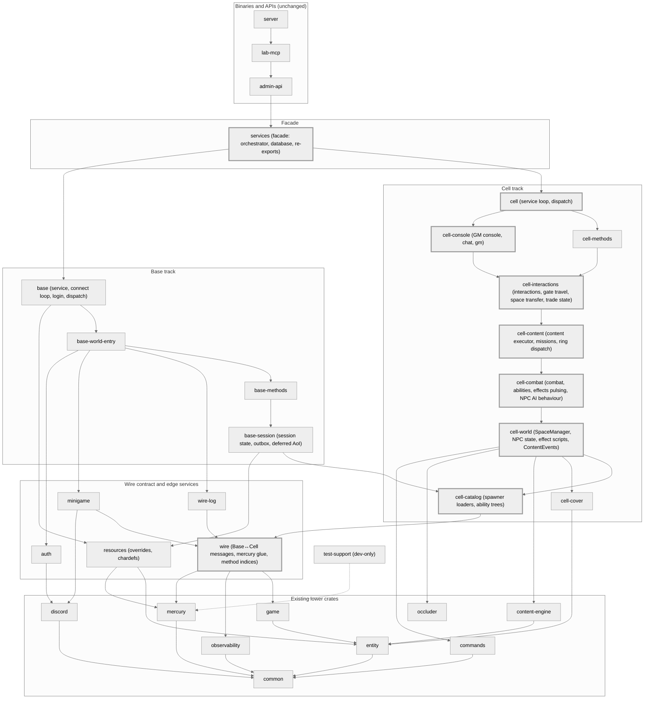

# Splitting `cimmeria-services` into an acyclic crate graph

> **Amended 2026-09-28 by [plugin-architecture.md](plugin-architecture.md)** (#962). The layer split below stays; features now leave the layers as plugins. A feature crate is a leaf that registers its cell-method handlers, hooks and per-entity state with core at startup, and only the composition root (`cimmeria-services`) depends on it. The rules in [§5](#5-risks-and-rules) still hold for the layer crates; the plugin rules (registration order, the method-index startup assertion, the extension map) are in that ADR. The "later options" in [§6](#6-expected-build-impact) are now its migration order.
>
> **Status:** Complete on `build/toolchain-overhaul` (2026-09-26). The final state:
>
> - **18 service crates and `cimmeria-test-support`.** The edge crates `cimmeria-auth`, `cimmeria-resources`, `cimmeria-wire`, `cimmeria-wire-log` and `cimmeria-minigame`; the cell track `cimmeria-cell-catalog`, `cimmeria-cell-cover`, `cimmeria-cell-world`, `cimmeria-cell-combat`, `cimmeria-cell-content`, `cimmeria-cell-interactions`, `cimmeria-cell-methods`, `cimmeria-cell-console` and `cimmeria-cell`; the base track `cimmeria-base-session`, `cimmeria-base-methods`, `cimmeria-base-world-entry` and `cimmeria-base`. The generated graph is in the [README](../../README.md#crate-dependency-graph).
> - **`cimmeria-services` is the facade.** It holds the orchestrator, the database pool, the re-exports of every split crate at its old module path (so the server, the admin API, the lab endpoint and the wire client, which depend only on it, did not change), and the two test modules that drive both tracks (`gate_round_trip_tests`, `mission_round_trip_tests`).
> - **No allowlisted edge is left, and the layering guard is retired.** The allowlist went from 55 edges (W0) to none (the C4-C6 preparation). Wave F deleted `tools/layering/` and its CI step: with the services crate a facade, Cargo's own crate graph enforces the DAG, since a crate cannot name a crate above it.
> - **Tracing parity holds per crate.** Each wave pinned its moved modules' log file and SigNoz index, and wave F added the generic guards (`parity_tests::crate_rows`): every in-process crate has its own `OTEL_FILTER` row, and no row reaches into two crates.
>
> **W0 done (2026-09-26):** `cimmeria-test-support`, the live-DB wrapper `tools/test-live-db.{sh,ps1}`, the layering guard `tools/layering/` (55 allowlisted edges) and the source-scan and stale-target guards are in. Deviations are listed under [§4](#deviations-found-during-the-waves).
> **W1b done (2026-09-26):** `cimmeria-resources` holds `base::{resources, mission_overrides, item_overrides, dialog_overrides, sequence_overrides, chardef}`; `cimmeria-services` re-exports them at the old paths.
> **W2b done (2026-09-26):** `cimmeria-cell-catalog` holds `cell::spawner` (the DB loaders), `ability_tree` and `cell::respawner_fallback`; `SpawnRecord` is `cimmeria_wire::cell::spawn_record`, and populating spaces from the records is `space_manager::npc_population`. `cimmeria-services` re-exports the moved modules at the old paths.
> **W3a done (2026-09-26):** `cimmeria-wire` also holds `mercury/` (the services-side packet builders), `firehose/`, `cell::messages` and `cell::dispatch::{constants, names}`; `cimmeria-services` re-exports them at the old paths.
> **W3b done (2026-09-26):** `cimmeria-wire-log` holds `wire_log/`; `cimmeria-services` re-exports it at the old path.
> **W3c done (2026-09-26):** `cimmeria-minigame` holds `minigame/` (the SmartFoxServer host, the Livewire game, ticket and result dispatch); `cimmeria-services` re-exports it at `minigame`.
> **B1 done (2026-09-26):** `cimmeria-base-session` holds the session types of `base/mod.rs` and `base::{helpers, outbox, deferred_aoi, deferred_aoi_lifecycle, cinematic_aoi_hold, session_identity, gm_feedback, world_entry_chat, contact_list, crafting, console_authoring, gm_spawn, tick_sync, cooked_data}`, `base::world_entry::space_registry` and `base::world_entry_appearance::builders`; `cimmeria-services` re-exports them at the old paths.
> **C1 done (2026-09-26):** `cimmeria-cell-world` holds `cell::space_manager`, `arrival`, `playtest_friction*`, the ring FSM half of `cell::ring_transport`, the synchronous half of `cell::effects`, `cell::cover` (the W2a shim and `stance`), the NPC AI's state primitives under `cell::service::npc_ai`, `cell::combat::{aggression, faction_reaction, health_threshold}`, `cell::dispatch::gm_gate`, `CellError` and the new `ContentEvents` trait; `cimmeria-services` re-exports each at its old path.

> **B2 done (2026-09-26):** `cimmeria-base-methods` holds `base::world_entry::methods` (player load, inventory, vendors, trade, mail, missions, progression); `cimmeria-services` re-exports it at the old path.
> **B3 done (2026-09-26):** `cimmeria-base-world-entry` holds the rest of `base::world_entry` (play-character, `ENABLE_ENTITIES`, map load, gate travel, reanchor, teleport and the `CellToBaseMsg` dispatch), `base::world_entry_appearance` (without `builders`, which is in base-session) and `base::character`; `cimmeria-services` re-exports `base::{world_entry, character}` at the old paths.
> **C2 done (2026-09-26):** `cimmeria-cell-combat` holds `cell::{combat, abilities}`, `cell::effects` (the async pulsing, beside a re-export of world's effect scripts), the NPC AI's behaviour under `cell::service::npc_ai`, and `cell::cell_methods::{inventory::bandolier, player::world::{reload, item_sequence}}`. Kill credit, the pulse tick and the NPC AI take `&dyn ContentEvents`; callers pass `EngineEvents(&engine)` (`cell::content::engine_events`). `cimmeria-services` re-exports each module at its old path.
> **B4 done (2026-09-26):** `cimmeria-base` holds `base::{service, connect_loop, dispatch, login, character_create}` and owns the `chaos-testing` feature, which `cimmeria-services` forwards; `cimmeria-services` re-exports `base::BaseService` at the old path. The base track is complete.
> **C3 done (2026-09-26):** `cimmeria-cell-content` holds `cell::{content, missions}` (with `EngineEvents`), `cell::ring_transport` (the dispatcher and the entry points, beside a re-export of world's ring FSM) and `cell::interactions::dialog`; `cimmeria-services` re-exports `cell::{content, missions, ring_transport}` at the old paths and its `cell::interactions` imports `dialog`. The content tests that drive code still in services are `cell::content_tests`.
> **C4 done (2026-09-26):** `cimmeria-cell-interactions` holds `cell::{interactions, gate_travel, space_transfer, respawn, trade, mail}`: the interaction handlers (beside a re-export of content's dialog display), gate travel, the GM space transfer, the respawn fork with its resync and region registration, the trade session state and the mail forwarding. `cimmeria-services` re-exports each at its old path with its old visibility.
> **C5b done (2026-09-26):** `cimmeria-cell-console` holds `cell::console`: the GM `.`-console (with the #523 authoring commands), the chat interceptor (`console::chat`) and the native GM cell methods (`console::gm`). It depends on interactions and not on the cell methods. `cimmeria-services` re-exports it at `cell::console`, and chat at `cell::chat`.
>
> **Since ORG-04 (2026-09-27)** the console depends on `cimmeria-cell-methods` too, one step above it: the GM `.squad_invite` and `.squad_join` commands call the ORG-03 squad invite handler and join fanout through `organization::squad::gm`, rather than copy about 100 lines of fanout into the console. The cost is that the two crates no longer compile in parallel.
> **C5a done (2026-09-26):** `cimmeria-cell-methods` holds `cell::cell_methods`: the per-interface cell-method dispatchers and the SGWPlayer handlers (combat and respawn, interaction, trade, vendors and trainers, world, crafting, social). The native GM cell methods are the console's. `cimmeria-services` re-exports `cell::cell_methods` at its old path.
> **C6 done (2026-09-26):** `cimmeria-cell` holds `cell::service` (`CellService`, the cell loop, the base-message handlers, the ticks) and `cell::dispatch` (the cell-method router), and the tests that drive them; the tests earlier waves had parked in services went to their highest dependency, among them `cell::spawner_tests` (world and combat) and the relog-hydration content tests (cell). `cimmeria-services` re-exports `cell::{dispatch, CellService}` and is the facade: the orchestrator, the database pool, the re-exports and the four cross-track test modules wave F takes over. The cell track is complete.
> **F done (2026-09-26):** the split is finished. The two cross-track tests that needed only base code went to the base crates, the chaos integration test to mercury, `parity_tests.rs` became a directory, two generic logging guards joined it, the layering guard was retired and the facade was tidied. `cimmeria-services` holds the orchestrator, the database pool, the re-exports and the two round-trip test modules that drive both tracks.
> **Why:** `cimmeria-services` was one crate of 914 files: about 106k production lines plus 150k lines of tests. rustc does most of its work for a crate serially, so every edit re-checked the whole crate, every test run linked one ~250k-line test binary, and a machine's cores sat idle. On 2026-09-26, editing one file in `cell::content` and rebuilding the services test binary took **164.7 s**. This plan splits the crate along its real seams so Cargo can compile the pieces in parallel and an edit rebuilds only what depends on it. See [build-system.md](build-system.md) for the wider build overhaul.

Conventions: `file:line` paths are relative to `crates/services/src/` as of `origin/main` `f153138b` (2026-09-26), unless marked. "Lines" means production lines, comments included. Inline `#[cfg(test)]` modules and test files are excluded.

## 0. What the dependency graph actually looks like

A naive module graph reports one 117k-line cycle. That figure is inflated:

- The naive tool cut files at the first `#[cfg(test)] mod` (including `mod x;` declarations near the top of a `mod.rs`).
- It counted intra-doc links as edges: the only messages→space_transfer, base::world_entry, console and chat "edges" are doc links at `cell/messages/cell_to_base.rs:113,140,495` and `base_to_cell.rs:314`.
- It counted `pub(in crate::cell)` visibility as an edge.
- It also missed real edges from `use a::{b,c}` groups, `pub use` re-exports and parent→child relative paths.

Corrected, production code is **105.8k lines**, with 24.5k inline test lines and 124.3k lines in test files. There are two production cycles:

- **The cell cycle (71.5k lines):** all of `cell` except `kismet`, `player_journal` and `client_methods`, plus `mercury`, `firehose` and `base::{mod, helpers, contact_list}`. The base modules are pulled in by only four edges (§2A).
- **A base-internal cycle:** `base::{world_entry, world_entry_appearance, character}` (17.1k lines).

**`base::world_entry` is not in a cycle with `cell`.** Once the Base↔Cell message contract has its own crate, the base side splits independently and compiles in parallel with the cell side.

## 1. Target crate map

All crates sit at `crates/<dir>`, are `publish = false`, and use the `foo/mod.rs` style.

| Crate | Contents (current module paths) | Lines | Workspace deps |
|---|---|---|---|
| `cimmeria-test-support` (dev-only) | `live_db_gate.rs`, `LogCapture` from `test_support.rs`, `TestTransport` re-export | 0.6k | mercury[test-support] |
| `cimmeria-auth` | `auth/`, `audit.rs`, `credential_redaction.rs` | 2.0k | common, discord |
| `cimmeria-resources` | `base/{resources, mission_overrides, item_overrides, dialog_overrides, sequence_overrides, chardef}` | 2.7k | entity, mercury |
| `cimmeria-wire` | `mercury/`, `cell/{messages, client_methods, player_journal, kismet}`, `cell/dispatch/{constants,names}.rs`, `firehose/`, `base/contact_list/wire.rs`, plus the items moved down in §2A (cell-method index constants, BSF bits, `SpawnRecord`, serializers, `to_hex`, `bag_max_slots`) | 6.0k | common, mercury, entity, game, observability |
| `cimmeria-wire-log` | `wire_log/` | 2.7k | wire |
| `cimmeria-minigame` | `minigame/` | 2.3k | wire, discord |
| `cimmeria-cell-catalog` | `cell/spawner` (DB loaders), `ability_tree/`, `cell/respawner_fallback.rs`, `space_manager/navmesh_mode.rs` | 2.4k | wire |
| `cimmeria-cell-cover` | `cell/cover/` except `stance.rs` | 2.8k | common, entity, sqlx |
| `cimmeria-cell-world` | `cell/mod.rs` (`CellError`), `space_manager/`, `arrival.rs`, `playtest_friction*.rs`, ring `transporter/ regions.rs wire.rs wire_helpers.rs runtime/teardown.rs`, the synchronous effect-script layer, `cover/stance.rs`, `npc_ai/{detectors, transition.rs, movement_stop, leash/policy.rs}`, `combat/{aggression, faction_reaction}.rs`, `dispatch/gm_gate.rs`, and the new `ContentEvents` trait | 12.3k | catalog, cover, wire, content-engine, occluder, commands |
| `cimmeria-cell-combat` | `cell/{combat, abilities, effects/pulsing}`, `cell/service/npc_ai` (behaviour), `cell_methods/player/world/{reload,item_sequence}.rs`, `cell_methods/inventory/bandolier/` | 13.4k | world |
| `cimmeria-cell-content` | `cell/{content, missions}`, `ring_transport/{dispatch.rs, runtime/{entry,tick}}`, `interactions/dialog.rs`, and `EngineEvents` | 8.4k | combat |
| `cimmeria-cell-interactions` | `cell/{interactions, gate_travel, space_transfer}`, the handler half of `mail.rs`, `cell_methods/player/trade/{state,wire}.rs` | 3.4k | content |
| `cimmeria-cell-methods` | the rest of `cell/cell_methods`, plus `base_messages/player_init/resync.rs` | 5.1k | interactions |
| `cimmeria-cell-console` | `cell/{console, chat.rs}`, `cell_methods/gm/` | 10.1k | interactions (methods since ORG-04) |
| `cimmeria-cell` | `cell/service/{mod, startup, message_loop, base_messages, ticks}`, `cell/dispatch/{mod, router}` | 5.9k | methods, console |
| `cimmeria-base-session` | `base/mod.rs` types, `helpers/`, `outbox/`, `deferred_aoi*.rs`, `session_identity`, `gm_feedback`, `world_entry_chat`, `contact_list/`, `crafting/`, `console_authoring/`, `gm_spawn`, `tick_sync`, `cooked_data`, plus the moves in §2I | 5.5k | wire, catalog, resources |
| `cimmeria-base-methods` | `base/world_entry/methods/` | 9.6k | base-session |
| `cimmeria-base-world-entry` | the rest of `base/world_entry/`, `world_entry_appearance/`, `character/` | 7.3k | base-methods, wire-log, minigame, auth |
| `cimmeria-base` | `base/{service, connect_loop, dispatch, login, character_create}`; owns the `chaos-testing` feature | 3.1k | base-world-entry, auth, resources |
| `cimmeria-services` (facade) | `orchestrator*.rs`, `database.rs`, and re-exports of the old paths | 0.8k | cell, base, auth, minigame, wire |

Two crates are deliberately smaller or larger than a 3–20k band:

- **NPC AI is merged into combat.** Death→purge and threat→assist are synchronous, ordering-critical calls (§2D).
- **The spawner is split.** Its DB loaders go to catalog; its SpaceManager-populating functions go to world.

*Figure 1: planned crate graph after the split. An arrow A → B means A depends on B; edges implied by a longer path are omitted. Thick-bordered crates are the cell track's critical path. The live graph of what has actually landed is generated into the [README](../../README.md#crate-dependency-graph).*


```mermaid
%%{init: {"flowchart": {"htmlLabels": false}, "theme": "neutral"}}%%
flowchart TD
    subgraph apps["Binaries and APIs (unchanged)"]
        server["server"]
        labMcp["lab-mcp"]
        adminApi["admin-api"]
    end
    subgraph facade["Facade"]
        services["services (facade: orchestrator, database, re-exports)"]
    end
    subgraph cellTrack["Cell track"]
        cell["cell (service loop, dispatch)"]
        cellMethods["cell-methods"]
        cellConsole["cell-console (GM console, chat, gm)"]
        cellInteractions["cell-interactions (interactions, gate travel, space transfer, trade state)"]
        cellContent["cell-content (content executor, missions, ring dispatch)"]
        cellCombat["cell-combat (combat, abilities, effects pulsing, NPC AI behaviour)"]
        cellWorld["cell-world (SpaceManager, NPC state, effect scripts, ContentEvents)"]
        cellCover["cell-cover"]
        cellCatalog["cell-catalog (spawner loaders, ability trees)"]
    end
    subgraph baseTrack["Base track"]
        base["base (service, connect loop, login, dispatch)"]
        baseWorldEntry["base-world-entry"]
        baseMethods["base-methods"]
        baseSession["base-session (session state, outbox, deferred AoI)"]
    end
    subgraph edgeSvc["Wire contract and edge services"]
        wire["wire (Base↔Cell messages, mercury glue, method indices)"]
        wireLog["wire-log"]
        minigame["minigame"]
        auth["auth"]
        resources["resources (overrides, chardefs)"]
    end
    subgraph lower["Existing lower crates"]
        contentEngine["content-engine"]
        game["game"]
        entity["entity"]
        occluder["occluder"]
        commands["commands"]
        mercury["mercury"]
        discord["discord"]
        observability["observability"]
        common["common"]
    end
    testSupport["test-support (dev-only)"]

    server --> labMcp --> adminApi --> services
    services --> cell
    services --> base
    cell --> cellMethods
    cell --> cellConsole
    cellMethods --> cellInteractions
    cellConsole --> cellInteractions
    cellInteractions --> cellContent --> cellCombat --> cellWorld
    cellWorld --> cellCatalog
    cellWorld --> cellCover
    cellWorld --> contentEngine
    cellWorld --> occluder
    cellWorld --> commands
    base --> baseWorldEntry --> baseMethods --> baseSession
    baseWorldEntry --> wireLog
    baseWorldEntry --> minigame
    baseWorldEntry --> auth
    base --> resources
    baseSession --> cellCatalog
    baseSession --> resources
    cellCatalog --> wire
    wireLog --> wire
    minigame --> wire
    minigame --> discord
    wire --> game
    wire --> observability
    wire --> mercury
    game --> entity
    contentEngine --> entity
    resources --> entity
    resources --> mercury
    cellCover --> entity
    auth --> discord
    entity --> common
    mercury --> common
    discord --> common
    observability --> common
    commands --> common
    testSupport -.-> mercury

    classDef critical stroke-width:3px
    class wire,cellCatalog,cellWorld,cellCombat,cellContent,cellInteractions,cellConsole,cell,services critical
```

- **Critical path (new crates):** wire 6.0 → catalog 2.4 → world 12.3 → combat 13.4 → content 8.4 → interactions 3.4 → console 10.1 → cell 5.9 → services 0.8 = **62.7k lines (59% of today's 105.8k)**.
- **Base track:** 25.5k lines after catalog. It finishes while the cell track is still building world and combat.
- **Off the critical path:** auth, resources, cover, wire-log, minigame and cell-methods.

## 2. Every cycle edge and its fix

"Move down" means the item moves into the lower crate and the old path keeps a `pub use`.

### A. Base↔cell edges, and the message contract into `cimmeria-wire`

| Edge (file:line) | Fix |
|---|---|
| `cell/abilities/death/mod.rs:34`, `cell/cell_methods/contact_list/mod.rs:15` → `base::contact_list::wire` | Move `base/contact_list/wire.rs` into wire |
| `firehose/emit.rs:13` → `base::helpers::to_hex` (helpers/mod.rs:185) | Move `to_hex` into wire |
| `cell/cell_methods/inventory/bandolier/active_slot.rs:128` → `base::resources::bag_max_slots` (resources/mod.rs:28, a pure table) | Move into wire, so combat does not depend on resources |
| `cell/messages/base_to_cell.rs:394` → `spawner::SpawnRecord` (npcs.rs:15) | Move `SpawnRecord` and `class_id_for_class` into wire; it is a message payload |
| `cell/dispatch/constants.rs:8-9` re-exports ~150 index constants from `cell_methods/*` | Move the constants to `wire::cell_methods::*`, mirroring `client_methods` |
| `ability_tree/points_property.rs:10`; `bandolier/active_slot.rs:12`; `bandolier/ammo_change.rs:10`; `player/world/reload.rs:273-274` → `inventory/constants.rs:25` | Move `inventory/constants.rs` and `points_property.rs` into wire |
| BSF bits used at `base/world_entry/cell_dispatch/state_field.rs:31,94`, `effects/scripts.rs:28`, `missions/progression.rs:71`, `service/ticks/cover.rs:160`, `console/bookmark.rs:360,412` → `combat/state.rs:12-67`, `cell_methods/combatant.rs:21` (duplicate at `ring_transport/wire_helpers.rs:22`) | Create one `wire::state_field` module |
| `content/executor/bark.rs:35` → `chat.rs:198` | Move the serializer into wire |
| `base/world_entry/methods/mail/mod.rs:10` (used at :97-254) → `cell/mail.rs` | Split `mail.rs`: `MailHeader` and serializers go to wire, the forwarding handlers go to interactions |
| `wire_log/client_names.rs:211,227` → `dispatch::cell_method_name` | Move `names.rs` into wire |
| `base/world_entry/reanchor_player.rs:222`, `progression/mod.rs:380`, `vendor/store.rs:17`, `teleport.rs:201,348`, `cell_dispatch/minigame.rs:74,109` | Resolved once player_journal, points_property, client_methods and `CLIENT_MG_*` are in wire |
| `mercury/aoi/create.rs:9`, `player_ghost.rs:21` → `cell::messages` | Nothing to do: both land in wire |

### B. Catalog and cover

- **`spawner/npcs.rs:11,351-480`** (calls `:439 detectors::spawn::check_spawn` and `:461-464 combat::aggression_*`): split the file. `spawn_npcs_from_records` and `spawn_instance_npcs_from_records` move to `space_manager/spawn.rs` in world.
- **`spawner/worlds.rs:25,64`** → `space_manager::navmesh_mode`: move `navmesh_mode.rs` into catalog; its impls at `:60,70` travel with it.
- **`cover/stance.rs:27-28`** (uses effects and SpaceManager): move `stance.rs` to world. The rest of `cover` then has no internal deps and becomes its own crate.
- **`base/gm_spawn.rs:29,190`** → spawner loaders: allowed, because catalog sits lower. `entity_template_select!` (`templates.rs:70`, a `macro_rules!` re-exported with `pub(crate) use`) needs `#[macro_export]`.

### C. The `cell::service` hub → `cimmeria-cell-world`

`npc_ai`'s state primitives are what lower systems call, so they move to world. Its behaviour joins combat (D).

| Edge | Fix |
|---|---|
| `space_manager/mod.rs:306` (NpcDetectors field); `cover_sight.rs:137,144`; `spatial.rs:42,81`; `spawner/npcs.rs:439` → `npc_ai::detectors` | Move `detectors/` to world |
| `combat/state.rs:108,126`; `combat/auto_cycle.rs:458,471`; `combat/threat/aggro.rs:192,197`; `abilities/death/mod.rs:320`; `use_ability/fire_los.rs:197`; `content/executor/world/mod.rs:15,198-319,647` → `world_label`, `set_ai_state_on`, `force_ai_state`, `stop_movement_on`, `AiTransitionReason` (`transition.rs:43-209`, `movement_stop/mod.rs:79,89`) | Move `transition.rs` and `movement_stop/` to world; npc_ai re-exports them |
| `combat/threat/aggro.rs:63`; `leash/policy.rs:83` (LEASH_DISTANCE) | Move `leash/policy.rs` and the constant to world |
| `detectors/sweep.rs:268` → `aggro_acquired.rs:37` `los_label` | Move `los_label` into detectors |
| `space_manager/spawn.rs:39,309,358`; `mod.rs:364`; `detectors/aggro_scan.rs:84,186`; `idle_parked.rs:18` → `NPC_DEFAULT_ABILITY` (threat/aggro.rs:116), `HOSTILE_FACTION` (combat/mod.rs:44), `HealthBelowSample` (damage_credit.rs:62), `aggression.rs:49-85` | Move `aggression.rs`, `faction_reaction.rs`, both constants and the struct to world |
| `space_manager/spawn.rs:339`, `lifecycle.rs:107` → `hold_spawn_cover` → `effects::dispatch_by_name` (stance.rs:74) | Move the synchronous effect-script layer to world: `EffectContext`, `EffectScript` and `dispatch_*` from `effects/mod.rs`, plus `registry.rs`, `scripts.rs`, `cover_stance.rs`. It depends only on SpaceManager; async pulsing stays in combat |
| `space_manager/mod.rs:392,445` → `StepRegionReplayGuard` (`step_activation/mod.rs:86`, impl at :94) | Move the struct and its impl to world |
| `space_manager/entities.rs:389` → `forget_player` (`runtime/teardown.rs:25`) → `dispatch_release_effects` (`dispatch.rs:232`); fields at `mod.rs:267-273` | Move `transporter/`, `regions.rs`, `wire.rs`, `wire_helpers.rs`, `teardown.rs` and `dispatch_release_effects` to world |
| `space_manager/client_move.rs:37` → `gm_gate.rs:210` | Move `gm_gate.rs` to world |
| `npc_ai/aggro_gates.rs:42`, `path_request.rs:126` → `console::is_gm` (console/mod.rs:114) | Move `is_gm` to world |
| `client_move.rs:655-660`, `entities.rs:111-112` | Move `playtest_friction*` to world; the journal goes to wire |

### D. Combat and NPC AI stay one crate

After the moves above, combat still needs NPC behaviour at `threat/aggro.rs:214` (`log_aggro_acquired`) and `:226` (`recruit_assisters`), and at `abilities/death/mod.rs:419` → `purge_dead_player_from_threat` → `leash::begin_leash` (`leash/begin.rs:182`) → `path_request`.

- **Ordering:** the purge is deliberately synchronous and ordered after the death broadcast (the NA24 comment at `death/mod.rs:414-418`). Deferring it would regress a UAT fix.
- **References the other way:** NPC AI makes 42 references into combat.
- **Split impls:** `impl AggroCause` is split across `combat/threat/aggro.rs:31,45` and `npc_ai/aggro_acquired.rs:20`, and inherent impls must live in the type's crate.

**Decision:** combat and NPC AI share one crate. An `NpcReactions` trait could separate them later.

### E. Combat → content: trait inversion

The edges:

- `abilities/use_ability/kill_credit.rs:78,116,130`
- `effects/pulsing/tick.rs:114,269` (per-pulse order "death, then health-below", tick.rs:106-114)
- `service/npc_ai/fight_cover.rs:339,343`

```rust
// cimmeria-cell-world
pub type EventFuture<'a> = Pin<Box<dyn Future<Output = ()> + Send + 'a>>;
pub trait ContentEvents: Sync {
    fn entity_death<'a>(&'a self, killer: u32, player_id: i32, tag: &'a str,
        tx: &'a Sender<CellToBaseMsg>, sm: &'a mut SpaceManager) -> EventFuture<'a>;
    fn pending_health_below<'a>(&'a self, tx: &'a Sender<CellToBaseMsg>, sm: &'a mut SpaceManager) -> EventFuture<'a>;
    fn npc_flanked<'a>(/* npc, target, template, tx, sm */) -> EventFuture<'a>;
    fn player_flanked_npc<'a>(/* same */) -> EventFuture<'a>;
}
// cimmeria-cell-content: a newtype, because `impl ContentEvents for ChainEngine` would
// violate the orphan rule (both the trait and ChainEngine are foreign there).
pub struct EngineEvents<'e>(pub &'e ChainEngine);
```

- **Signatures that change** from `engine: &ChainEngine` to `events: &dyn ContentEvents`: `kill_credit.rs:52`, `pulsing/tick.rs:49,216`, `npc_ai/mod.rs:119`, `dispatch.rs:101,263`, `fight.rs:20`, and the internal fight_cover path.
- **Callers that pass `&EngineEvents(&engine)`:** `message_loop.rs:147,159,202`, `ticks/auto_cycle.rs:225`, `ticks/pending_holster.rs:72`, `cell_methods/player/combat/mod.rs:90`, `interaction/interact.rs:142`, `player/world/auto_cycle.rs:114`.
- **Behaviour:** calls happen at the same points and in the same order, so nothing changes.
- **Tests:** `NoContentEvents` and `RecordingContentEvents` fakes go in world's test fixtures.

### F. Combat → cell_methods and service

- `use_ability/auto_reload.rs:63` and `handle.rs:355,367` → `player/world/reload.rs:25,71` and `item_sequence.rs:17`: move both files into combat.
- `content/executor/transport.rs:131`, `gate_travel/mod.rs:490`, `ring_transport/dispatch.rs:146`, `space_transfer/mod.rs:405` and `ticks/holster.rs:220` → `inventory/bandolier/active_slot.rs:19,81`: move `bandolier/` into combat.
- `active_slot.rs:199` → `ticks::HOLSTER_ANIMATION_DURATION`: move the constant into combat.

### G. Content ↔ ring transport: co-locate

This one is genuine recursion. `content/executor/transport.rs:28` calls `ring_transport::handle_interact` (`runtime/entry.rs:38`), which reaches `dispatch.rs:199` → `content::fire_teleport_in`.

- Ring `dispatch.rs` and `runtime/{entry,tick}` move into content. The finite-state machine itself stays in world.
- `content/executor/dialog/mod.rs:137` → `interactions/dialog.rs:35`: move `dialog.rs` into content.

### H. Interactions, methods, console and service

- **Trade state:** `gate_travel/mod.rs:524` and `space_transfer/mod.rs:449` call `player/trade/state.rs:247`. Move `trade/{state,wire}.rs` into interactions; the handlers stay in methods.
- **Resync:** `cell_methods/player/combat/respawn.rs:338` calls `player_init/resync.rs:88`. Move `resync.rs` and `send_known_abilities_update` into methods.
- **Chat:** `chat.rs:11` calls console, so chat joins the console crate.
- **GM commands:** `console/query.rs:265,430` and `console/mod.rs:90` call `cell_methods::gm`, so gm joins the console crate too. After that, console no longer depends on methods, and the two crates compile in parallel.
- **Service re-exports:** `cell/mod.rs:47` and `base/mod.rs:51` (`pub use service::{Cell,Base}Service`) move to the facade.

### I. Base-internal

- **`CinematicAoiHold`:** `base/mod.rs:220` and `deferred_aoi.rs:332` use it (`cinematic_aoi_hold/mod.rs:57,86`). The struct and `begin()` go to base-session. The release path (`:42`, which calls `cell_dispatch::flush_deferred_aoi`) stays in world-entry.
- **Cooked data:** `base/cooked_data.rs:12-14` (also :123, 230, 312, 440) uses `helpers` and `ConnectedClientState`, so it goes to base-session, not resources.
- **Character:** `base/character/mod.rs:200` uses the `player_load::core` constants, and character is in the same cycle as world-entry, so it goes into base-world-entry.
- **Space registry:** `methods/world_entry_db.rs:11` uses `space_registry.rs`. Move that to base-session.
- **Appearance builders:** `methods/inventory/appearance.rs:28,79` uses `world_entry_appearance/builders.rs`. Move `builders.rs` to base-session.

With this assignment no other upward edge remains, and the graph has no other cycles.

## 3. Test support

**`cimmeria-test-support`** is a dev-dependency only. It must never depend on a service crate: if it did, the test build would link two copies of the same crate ("expected `SpaceManager`, found `SpaceManager`") with separate statics. It contains:

- `live_db_gate.rs`, with `require_db_or_skip!` as `#[macro_export]` using `$crate::pool_or_skip`;
- `LogCapture`, `Captured` and `LogCaptureGuard` (`test_support.rs:183-441`) and their tests;
- `pub use cimmeria_mercury::test_transport::TestTransport`.

**Domain fixtures stay with their types**, behind a per-crate `test-support` feature:

- `cimmeria_cell_world::test_fixtures`: `make_space_manager*` and `seed_ability_defs` (`test_support.rs:40-91`), `occluder_fixtures`, the `arrival.rs:332,350` helpers, and the `ContentEvents` fakes.
- `cimmeria_base_session::test_fixtures`: `test_default_connected_client_state`.

Each crate keeps a shim, so `use crate::test_support::X` compiles unchanged in moved tests:

```rust
#[cfg(test)]
mod test_support {
    pub(crate) use cimmeria_test_support::*;
    pub(crate) use <lower>::test_fixtures::*;
}
```

**Test-only hooks.** About 25 `#[cfg(test)]` items live in production modules.

- A hook used only by the owning crate's tests stays `#[cfg(test)]`.
- A hook a higher crate's tests use becomes `#[cfg(any(test, feature = "test-support"))] #[doc(hidden)] pub`, and the higher crate enables the feature through `[dev-dependencies]`.
- Hooks that cross crates: `npc_ai_follow_for_test`, `npc_ai_tick_for_test`, `resolve_death_for_test`, `maybe_trigger_auto_reload_for_test`, `load_single_chain_for_test`, `load_chain_expansions_for_test`, `resolve_use_cover`, the `movement_telemetry` `tracked*` hooks, `crossing_hold`, `StepRegionReplayGuard::is_idle`, and `cover::TEST_WORLD_ID`.

**Where tests land.** A test moves up to the crate of its highest dependency, which is about 30 files and 12k lines. For example:

- the spawner live-DB tests go to world or combat;
- `mercury/aoi/tests.rs` goes to world;
- the npc_ai detector tests go to combat;
- `chain_replay_tests/{gc1_escort, mission_742, mission_relog_persistence}` go to cell;
- `chain_replay_tests/mission_701/persistence.rs` goes to the facade;
- the other ~24k lines of `chain_replay_tests` stay in content;
- `tests/chaos_lossy_transport_integration.rs` uses only `cimmeria_mercury`, so it moves to `crates/mercury/tests/`.

During migration, a test whose highest dependency is still in the monolith stays in the monolith at its current path.

**Live-DB CI.** After the split, `-p cimmeria-services --lib` would run only the facade's tests and stay green, which is the #615 "green but empty" failure.

- `tools/test-live-db.{sh,ps1}` holds the list of crates with live-DB tests and runs `cargo nextest run --profile=ci-live-db --lib -p …` for all of them. CI (`test.yml`, both the live-DB job and coverage) and `tools/build-lane/live-db-test.sh` call it.
- The `ci-live-db` profile's `threads-required = "num-test-threads"` applies across every binary in one nextest run, so serialisation holds across crates.
- A guard test fails if a crate with a `cimmeria-test-support` dev-dependency is missing from the list.

## 4. Migration waves

Every wave leaves the monolith plus the new crates acyclic and passes the full pre-PR checklist and the live-DB wrapper.

**How an extraction works:**

1. **Preparation (inside the monolith).** Make the §2 moves, leave a `pub use` at every old path, and shrink the layering-guard allowlist.
2. **Extraction.** `git mv` the files to `crates/<dir>/src/` at the same relative path. The new `lib.rs` recreates the module skeleton (`pub mod cell { pub mod combat; … pub use cimmeria_cell_world::cell::space_manager; }`), so `crate::cell::…` and `super::…` paths compile unchanged. The monolith swaps each `mod x;` for `pub use cimmeria_x::cell::x;`.

Keeping the nesting also keeps `include_str!` and `CARGO_MANIFEST_DIR/../../data` paths valid.

| Wave | Content | Parallelism |
|---|---|---|
| **W0 Scaffolding** | `cimmeria-test-support` and the shims; the live-DB wrapper and CI change; a layering guard (`tools/layering/`) run in CI, whose allowlist may only shrink; fix the source-scanning guards (§5); a stale-target guard for the logging filters | 1 agent, merges first |
| **W1** | 1a `cimmeria-auth`; 1b `cimmeria-resources`; 1c `cimmeria-wire` seeded with client_methods, player_journal, kismet and the §2A constants and serializers | 3 agents in parallel |
| **W2** | 2a `cimmeria-cell-cover`; 2b the `SpawnRecord` / `navmesh_mode` / spawn-function moves, then `cimmeria-cell-catalog` | 2 agents in parallel |
| **W3** | 3a finish wire (`mercury/`, `messages/`, dispatch constants and names, `firehose/`), then 3b `wire-log` and 3c `minigame` in parallel | 3a first |
| **Cell track** | C1 world (adds `ContentEvents`) → C2 combat → C3 content → C4 interactions → C5a methods and C5b console in parallel (C5b first) → C6 cell | Sequential; alongside the base track |
| **Base track** | B1 base-session → B2 base-methods → B3 base-world-entry → B4 base (with `chaos-testing`) | Sequential; alongside the cell track |
| **F Final** | Facade cleanup, cross-track tests, delete the layering allowlist, docs and CI paths | 1 agent |

The two tracks touch disjoint trees (`src/cell/**` and `src/base/**`). They conflict only on list files: workspace `members`, the services `Cargo.toml` and `lib.rs`, the logging filter rows, `IN_PROCESS_CRATES`, the live-DB crate list, `codecov.yml` and `spec-touch.yml`.

### Deviations found during the waves

W0:

- **`cimmeria-test-support` gained `source_scan`**, a walker over every crate's sources that names files by their path under `src/`. The §5.4 guards use it, so their scans and allowlists survive a move. The crate is also in the live-DB crate list: its gate tests ran in the services live-DB job before, and the live-DB run keeps the same test set.
- **Edges §2 does not list.** The layering guard found three production edges the plan missed:
  - `cell_methods::gm::world` → `player::combat::respawn` (`gmRespawn` calls `handle_respawn`). This is console → methods, so §2H's claim that console stops depending on methods needs one more move.
  - `player::trade::state` → `player::trade` (`MAX_INTERACT_DISTANCE`), which must move with `state.rs`.
  - `space_manager::navmesh_mode` → `space_manager`: `navmesh_mode.rs` also holds an `impl SpaceManager` block, which must stay in world when the file moves to catalog.

  The allowlist also holds the module re-exports that the planned moves leave behind (`cover` → `stance`, `effects` → `pulsing`, `ring_transport` and `ring_transport::runtime` → `runtime::{entry,tick}`), and `dispatch::gm_gate` → the `cell_methods` index constants, which §2A's constants move resolves.
- **`deferred_aoi.rs:332` (§2I) is test code**, inside a `#[cfg(test)]` module, so it is not a production edge.
- **A stale file-layer directive.** The stale-target guard found `cimmeria_services::base::world_entry_player` in `FILE_LAYERS` (world_entry.log). The module no longer exists, so the row matched nothing; it was removed.

W1b (`cimmeria-resources`):

- **No production workspace dependencies.** The moved code uses only `quick-xml`, `tracing` and `zip`, so the crate is a leaf and does not wait for `entity` or `mercury`. `cimmeria-entity` is a dev-dependency (the bag-table test pins the `INV_*` ids). `zip` left `cimmeria-services`' dependencies with it: nothing else there used it.
- **One test stayed in services.** `behavior_event_fragment_tags_category_21_on_the_wire` (was `resources::tests::category_map`) drives `crate::mercury::protocol::build_resource_fragment`, which is still in the monolith. It is now `base::resource_fragment_tests` in `cimmeria-services`, and `CATEGORY_BEHAVIOR_EVENTS` became `pub` for it. Its final home is base-session (next to `cooked_data`, above both wire and resources).
- **Listed in the live-DB wrapper without live-DB tests.** The crate dev-depends on `cimmeria-test-support` for `LogCapture`, and `live_db_wrapper_lists_every_test_support_crate` requires every such crate in `tools/test-live-db.{sh,ps1}`.
- **Tracing.** `cimmeria_resources=debug` joins `OTEL_FILTER`: the override modules had DEBUG export through `cimmeria_services=debug` and no file layer. `character.log`'s `chardef` and `resources` rows now name `cimmeria_resources::base::…`.
- **`unreachable_pub`** narrowed `CASTLE_DIALOG_PATCHES` and `CELLBLOCK_DIALOG_PATCHES` to `pub(super)`; they sit in private modules.
- **`bag_max_slots` stayed in resources**, as the wave brief asked. Its layering-allowlist line is gone anyway: `base::resources` is now a re-export of another crate, which the guard does not follow, so the edge left the scanned graph. W1c's copy in wire is the planned fix; the coordinator dedupes.
- **The `crate-map.toml` rows for the moved modules stay.** They now match no module in `crates/services/src`, which `check.py` allows. Deleting them is left to wave F, which retires the guard's lists.

W1a (`cimmeria-auth`):

- **No allowlist edge to remove.** No module of `auth`, `audit` or `credential_redaction` had a violating edge, so the allowlist keeps its 55 lines. Their three `crate-map.toml` rows are gone instead: `check.py` scans only `crates/services/src`, where the modules no longer exist, and a new `auth` module there would now be unmapped and fail the check. Later extractions do the same.
- **`cimmeria_services=debug` does not cover the new crate.** A directive matches by string prefix, and `cimmeria_services` is not a prefix of `cimmeria_auth`, so `OTEL_FILTER` gained `cimmeria_auth=debug` and `auth.log` names `cimmeria_auth::auth`. The same holds for every crate whose name does not start with an existing directive; the parity guard catches a missing row.
- **Auth-only dependencies left `cimmeria-services`:** `axum`, `tokio-rustls`, `rustls-pemfile`, `arc-swap`, `argon2` and `sha1`, and the dev-dependencies `reqwest`, `rcgen` and `tower`.

W1c (`cimmeria-wire`):

- **Where the cell-method indices landed.** They are at `cimmeria_wire::cell::cell_methods::<interface>`, the path the handlers already use, next to `cell::client_methods`, rather than at a top-level `wire::cell_methods`. `inventory/constants.rs` and `player/constants.rs` moved whole; the other ten interfaces had their constants lifted out of the handler files. `cell/dispatch/constants.rs` stays in the monolith until W3a. Its `super::super::cell_methods` paths reach wire through the re-exports now, and will resolve to wire's own module unchanged after the move.
- **Four small modules the plan does not name:**
  - `wstring`: `write_wstring`, which `contact_list/wire.rs` needs while `mercury/` stays behind. The copies in `mercury/mod.rs` and in `mail.rs` are now `pub use`s of it, so one encoder remains.
  - `hex`: `to_hex`, named for what it holds rather than recreating a `base::helpers` module.
  - `containers`: the `bag_max_slots` copy. `base::resources` keeps its own until W1b lands, and its two table-pin tests were copied with it.
  - `state_field`: the BSF bits, at the crate root.

  W3a must repoint `firehose/emit.rs` from `crate::base::helpers::to_hex` to `crate::hex::to_hex`, and fold the `write_wstring` re-export back into `mercury/mod.rs`.
- **The `EChannel` ids moved with the chat serializer.** `CHAN_*` are the values of the payload's `Channel` byte, and the two serializer tests use them, so the tests could move with the serializer.
- **The layering guard followed a glob into another crate.** `pub use constants::*` over a module that had moved out made the guard attribute every name behind it to the re-exporting module, which produced four false edges. `check.py` now treats such a name as belonging to the other crate.
- **`cimmeria-wire` is in the live-DB crate list** although it has no live-DB tests. Its tests use `LogCapture`, so it dev-depends on `cimmeria-test-support`, and the list guard requires the entry. Its lib tests also ran in the live-DB tier while they were in services.
- **`cimmeria_wire=debug` was added to `OTEL_FILTER`.** No moved code logs under a module-path target today; `player_journal` names `player.journal`. The row keeps moved code at the DEBUG export level `cimmeria_services=debug` gave it.

W2a (`cimmeria-cell-cover`):

- **`observability` is a dependency too.** `reservation.rs` counts `cover_reservation_state` through `cimmeria_observability::counter!`, which §1's "common, entity, sqlx" misses. The crate still depends on no split crate.
- **`stance.rs` stays at its old path, behind a shim.** `crates/services/src/cell/cover/mod.rs` is now `pub use cimmeria_cell_cover::cell::cover::*` plus `mod stance` and its re-exports, so every `crate::cell::cover::…` path in services compiles unchanged, `stance` included, and no call site was edited. `stance.rs` imports the two helpers it shares with the decision code from the shim: `lock_or_recover` (was `pub(super)`) and `horizontal` (was `pub(crate)`, also used by `space_manager::cover_hit` and `npc_ai::chase::cover_slot`) are now `pub`. Nothing else was widened.
- **`crate-map.toml` maps the shim to world, and the allowlist loses `cell::cover -> cell::cover::stance`.** What is left of `cell::cover` in services is the shim and `stance.rs`, and world takes both in C1, so `cell::cover` now maps to `cimmeria-cell-world` (the separate `cell::cover::stance` row became redundant and is gone). Every production importer of `cell::cover` is in world or above, so no new violation appears. The allowlist has 53 lines.
- **`TEST_WORLD_ID` is a `test-support` hook** (§3): `#[cfg(any(test, feature = "test-support"))] #[doc(hidden)] pub`, enabled by the services dev-dependency for the cover tests that stay there because they drive a `SpaceManager` (`service/tests/npc_ai_cover*.rs`, `ticks/cover.rs`, `space_manager/cover_hit.rs`).
- **All 71 cover tests moved**, the 6 live-DB loader tests among them, so the crate joins the live-DB wrapper list. None needed a helper from the monolith.
- **Tracing.** No file layer names cover, and the hand-named `cover.*` targets are unchanged. The untargeted rows (the loader's counts and skipped-row warnings, the poisoned-mutex warnings) now carry `cimmeria_cell_cover::…`; `OTEL_FILTER` gained `cimmeria_cell_cover=debug` to keep their DEBUG export, pinned by `cover_crate_events_keep_their_index`.

W2b (`cimmeria-cell-catalog`):

- **The spawn functions went to `space_manager/npc_population.rs`, not `spawn.rs`.** `spawn_npcs_from_records`, `spawn_instance_npcs_from_records` and their `log_spawn_behaviour` logged to `spawner.log`, and `aoi.log` keeps every `cell::space_manager` module. In a module of their own, `spawner.log` names them and `aoi.log` turns just that module off, so no event changes file. In `spawn.rs` the same two directives would also have moved `spawn.rs`'s own rows out of `aoi.log`. `npc_population_events_keep_spawner_log` pins the routing.
- **No shim at `spawner::spawn_*_from_records`.** A re-export there is a catalog → world edge, and it could not survive the extraction, so the four callers (`service/startup.rs`, `base_messages/lifecycle.rs` and two tests) name `space_manager::` directly.
- **`SpawnRecord` is `cimmeria_wire::cell::spawn_record`**, with `class_id_for_class`, named for what it holds. wire gained the `common` and `entity` dependencies its fields need. W3a must repoint `messages/base_to_cell.rs:394` from `crate::cell::spawner::SpawnRecord` to `crate::cell::spawn_record::SpawnRecord` when `messages` moves into wire.
- **`navmesh_mode.rs` is split in two.** The enum, `as_db_str`, `TryFrom`, `mode_from_db_value` and the two parser tests are `spawner/navmesh_mode.rs` in catalog, beside the world loader that reads them. The `impl SpaceManager` block and the three tests that build a `SpaceManager` are `space_manager/navmesh_containment.rs`, which stays for cell-world. `space_manager::NavmeshMode` is still a re-export. The crate-private `space_manager::mode_from_db_value` re-export is gone: its one user, `worlds.rs`, now sits beside the function.
- **Tests.** Moved with the code: the four loader-only live-DB files (`live_db_loaders`, `live_db_content_loaders`, `live_db_castle_seed`, `live_db_ability_animation_links`), the inline tests of the moved files, `ability_tree/tests/` and the respawner search's tests. Stayed in services, now at `cell::spawner_tests` (was `cell::spawner::tests`): `spawn_records`, `spawn_grounding`, `harset/`, `live_db_{aggression,assist,eye_heights,leash_distance,use_cover}` and `template_prototype_parity`. Each needs `SpaceManager`, combat, cover, NPC AI or `base::gm_spawn`. `harset/world57_placement.rs` imported the private `spawner::regions` module and now uses the spawner's re-exports.
- **Visibility.** `load_patrol_points` and `build_prototype` (GM spawn), `region_contains_xz` (playtest friction) and `nearest_valid_respawner` (arrival, movement recovery) became `pub`. `entity_template_select!` is `#[macro_export]`, re-exported as `spawner::entity_template_select`; its body uses only `concat!`, so it needs no `$crate::`. `unreachable_pub` narrowed `classify_holster_duration` to `pub(super)`.
- **Tracing.** `cimmeria_cell_catalog=debug` joins `OTEL_FILTER`, and `spawner.log` names `cimmeria_cell_catalog::cell::spawner`. `catalog_crate_events_keep_their_file_and_index` pins both.
- **Layering.** The allowlist went from 32 to 27 edges, all removed by the preparation moves. The `crate-map.toml` rows for `cell::spawner`, `ability_tree`, `cell::respawner_fallback` and `cell::space_manager::navmesh_mode` are gone.

W3a (finish `cimmeria-wire`):

- **What moved.** `mercury/`, `firehose/`, `cell/messages/` and `cell/dispatch/{constants,names}.rs` are in `crates/wire/src` at the same module paths. `cimmeria-services` re-exports `mercury` and `firehose` from `lib.rs` and `messages` from `cell/mod.rs`. `cell/dispatch/mod.rs` imports the two wire modules privately, so `gm_gate`'s `super::constants::…` and the `CM_*` and `cell_method_name` re-exports at `cell::dispatch::` are unchanged; wire's own `cell::dispatch` re-exports the same names.
- **Dependencies.** wire gained `mercury`, `game` (the XP curve in the world-entry payload), `tokio` (the `oneshot` reply channels in `BaseToCellMsg`) and `serde` (the lab query contract). It does not need `observability`, which §1 lists: no moved code records a metric.
- **One test stayed, not the file.** §3 sends `mercury/aoi/tests.rs` to world, but only `client_facing_bytes_round_trip_through_radians` drives a `SpaceManager`. The other eleven are builder tests and moved with the builders. The one that stays is `mercury_aoi_tests` at the services crate root, beside the precedent `base::resource_fragment_tests`; it goes to world in C1. Keeping the whole file would have made every AoI message id `pub` for tests alone.
- **The W1c and W2b follow-ups.** `write_wstring` is defined in `mercury/mod.rs` again, beside `read_wstring`, and the `wstring` module is gone; `cell/mail.rs` and `base/contact_list/wire.rs` import it from `crate::mercury`. `firehose/emit.rs` uses `crate::hex::to_hex`, `messages/base_to_cell.rs` names `crate::cell::spawn_record::SpawnRecord`, and `wire_log/client_names.rs` calls `cimmeria_wire::cell::dispatch::cell_method_name`.
- **Upward references were doc links only.** Six intra-doc links named higher modules: `cell::spawner`, `cell::chat`, `cell::space_transfer`, `base::world_entry::gate_travel` and `cell::console::seed` from `messages`, and `base::world_entry::teleport` from the moved AoI tests. They are now plain code spans naming the `cimmeria_services::…` facade paths. No item had to move down.
- **Visibility.** Widened to `pub` because services uses them (E0603): `pack_angle`, `unpack_angle`, `PLAYER_FACTION`, the four `compose_*_body` bundle composers, `encrypt_packet`, `REPLY_FLAGS`, `BASEMSG_CREATE_BASE_PLAYER`, `SGWPLAYER_CLASS_ID`, `SGWGMPLAYER_CLASS_ID`, `write_wstring` and the three firehose samplers. Nothing was narrowed.
- **Tracing.** `protocol.log` names `cimmeria_wire::mercury` instead of `cimmeria_services::mercury`; `cimmeria_wire=debug` (added in W1c) already carries the DEBUG rows to SigNoz. The firehoses and the AoI builders' `aoi.*` rows use hand-named targets and did not change. The glue's rows stay in the `cimmeria-server` index: `is_network_noise_target` matches `cimmeria_mercury::` (the transport crate), not `cimmeria_wire::mercury`, which a new assertion in `otel.rs` pins. `wire_mercury_events_keep_protocol_log_and_index` pins file and index per level, and fails with either the old `protocol.log` row or without `cimmeria_wire=debug`; `stale_target_tests` lists `cimmeria_services::mercury` as a target that must not resolve.
- **Layering.** No allowlisted edge involved these modules (W1c and W2b had already cleared §2A), so the allowlist keeps its 26 lines. Their five `crate-map.toml` rows are gone.
- **Docs.** Living docs, agent notes, seed comments, `codecov.yml` and `spec-touch.yml` name `crates/wire/src/…`. Two stale forms were fixed on the way: `mercury/aoi.rs` (a directory since long ago) and `mercury/method_idx.rs` (an inline module of `mercury/mod.rs`, which `spec-touch.yml` watched and so never matched).

W3b (`cimmeria-wire-log`):

- **What moved.** `wire_log/` (the `wire.in` / `wire.out` capture, the method-name tables, the schema decoders and the packet tap) is `crates/wire-log/src/wire_log/`, and `cimmeria-services` re-exports it from `lib.rs`, so the bundle scanner, the cell-dispatch fan-out and `lab-mcp`'s `cimmeria_services::wire_log::tap` are unchanged. The crate depends on `wire` (for `cell_method_name`), `serde`, `serde_json` and `tracing`, as §1 planned. No preparation move was needed: the module named nothing above wire.
- **Not in the live-DB crate list.** The crate has no live-DB tests and no `cimmeria-test-support` dev-dependency, so the list guard does not ask for it. Its 24 unit tests ran in the live-DB tier while they were in the services lib; they now run only in the normal tier, and the live-DB tier is 24 tests smaller.
- **Visibility.** Nothing was widened. `unreachable_pub` narrowed `decoders::{inbound, outbound}::decode`, `decoders::primitives::Cursor` and its methods to `pub(super)`; they sit in private modules.
- **Tracing.** The moved code logs only on the hand-named `wire.in` / `wire.out` targets, which did not change, so no `FILE_LAYERS` row changed (none ever named `cimmeria_services::wire_log`). `cimmeria_wire_log=debug` joins `OTEL_FILTER` although `cimmeria_wire=debug` already prefix-matches the crate name: the shared prefix is an accident of naming, and the row keeps wire-log's export level from following any change to wire's. `wire_log_events_keep_protocol_log_and_index` pins the two targets (INFO in `protocol.log` and `cimmeria-server`, not `server.log`), the crate's module-path level for any future untargeted row, and the independence from wire's row. `scan_finds_known_targets` now requires `wire.in` and `wire.out`, which only this crate emits, so the source-target scan cannot silently stop reading it; `otel.rs` pins all three as `cimmeria-server`, not network noise.
- **Layering.** No allowlisted edge involved `wire_log`, so the allowlist keeps its 26 lines. Its `crate-map.toml` row is gone.
- **Docs and tooling.** `tools/wire_decoder_codegen.py` writes to `crates/wire-log/src/wire_log/decoders/generated.rs` and formats with `-p cimmeria-wire-log`; `codecov.yml` ignores the generated file at its new path and counts the crate in the services component. One doc link to `crate::mercury` in the module docs is plain text now. The dated security audit is left as written.

W3c (`cimmeria-minigame`):

- **What moved.** All of `minigame/` is in `crates/minigame/src/minigame/`, at the same module path, so `crate::minigame::…` and `super::…` inside it are unchanged. `cimmeria-services` re-exports it from `lib.rs`; the orchestrator (`minigame::server::run`) and the base (`SessionRegistry`, in `base::service` and `cell_dispatch::minigame`) compile unchanged.
- **No `cell` skeleton.** The module's only path outside itself was `crate::cell::messages::CellToBaseMsg`, in `server/mod.rs` and `server/result_dispatch.rs`. Those two imports now name `cimmeria_wire::cell::messages` directly, as catalog's `ability_tree` does, rather than inventing a `cell` module in a crate that holds no cell code.
- **`sfs_vars!` (§5.5).** It is `#[macro_export]`, so it now sits at the minigame crate root, where `crate::sfs_vars` still finds it. Its body names only `std::` paths, so it needs no `$crate`. Only minigame uses it; `cimmeria_services::sfs_vars` is gone, with no user.
- **Dependencies.** `wire` and `discord`, as planned, plus `tokio`, `rand` (tickets, the Livewire layout seed), `quick-xml` (the SFS codec) and `tracing`. The `socket2` dev-dependency (the SO_LINGER handshake-failure guard) left `cimmeria-services` with its test. Services keeps tokio's `test-util` for the cinematic AoI hold tests.
- **Visibility.** Nothing was widened: everything services uses was already `pub`. `unreachable_pub` narrowed `LivewireGame`, `PlaceholderGame` and their `new` to `pub(super)`; they sit in the private `games::{livewire, placeholder}` modules.
- **Tests.** All 37 moved; none needed a helper from the monolith (`CellToBaseMsg` is wire, `LogCapture` is test-support). The crate dev-depends on `cimmeria-test-support` for the result-delivery negative-log guard, so it is in the live-DB crate list although it has no live-DB tests. Its lib tests ran in that tier while they were in services.
- **Tracing.** No file layer names minigame and it has no hand-named `target:`, so its rows reach `server.log` from INFO and SigNoz. `cimmeria_minigame=debug` joins `OTEL_FILTER` to keep the DEBUG export `cimmeria_services=debug` gave it. `minigame_crate_events_keep_their_index` pins file and index per level, and `otel.rs` pins the crate as not network noise.
- **Layering.** No edge from or into `minigame` violated the DAG, so the allowlist keeps its 26 lines. Its `crate-map.toml` row is gone.
- **Coverage.** `codecov.yml` had ignored `crates/services/src/minigame/server.rs`, which has matched nothing since #652 split it into `server/` (with a TCP session-lifecycle harness in `server/tests.rs`). The entry was dropped rather than re-pointed, so no coverage figure changes. `crates/minigame/**` joins the services component.

B1 (`cimmeria-base-session`):

- **Where the hold record went.** §2I sends the `CinematicAoiHold` struct and `begin()` to base-session. They are `base::cinematic_aoi_hold`, a module of their own, rather than a same-named module under a `world_entry_appearance` skeleton: the preparation commit had to give them a monolith path that maps to base-session, and two crates each holding a `world_entry_appearance::cinematic_aoi_hold` would be harder to follow. The release half (`arm_timeout`, `release_on_cancel`, `HOLD_DURATION`) stays at `world_entry_appearance::cinematic_aoi_hold` and re-exports `begin` and `CinematicAoiHold`, so `client_ready`'s `cinematic_aoi_hold::begin` call is unchanged. The `world_entry_appearance::CinematicAoiHold` re-export had no production user left and is gone; its one test importer names `base::cinematic_aoi_hold`.
- **The skeleton.** Base-session's `base/mod.rs` holds the session types and declares the moved modules, plus inline `world_entry { space_registry }` and `world_entry_appearance { builders }` modules for the two world-entry leaves (§2I). `lib.rs` imports `cimmeria_wire::mercury` privately and has a private `cell` module re-exporting `cell::messages` (wire) and `cell::spawner` (catalog), so the moved code's `crate::mercury::…` and `crate::cell::…` paths compile unchanged. The services `base/mod.rs` keeps the modules still there, `BaseService` and the resources re-exports, and re-exports each moved module and type at its old path with its old visibility (`pub` for `OnlinePlayer` and `BaseError`, `pub(crate)` for the rest). `world_entry/mod.rs` and `world_entry_appearance/mod.rs` re-export `space_registry` and `builders` the same way, so nothing under `base/world_entry*` changed.
- **Dependencies.** Beyond wire, catalog and resources, the moved code needs `common`, `entity`, `mercury`, `discord` (the disconnect and Mercury-timeout notifications in `helpers` and `tick_sync`) and `observability` (`mercury_rx_stalls_total` and the crafting persistence counters), plus `sqlx`, `tokio`, `serde`, `tracing` and `thiserror`. No services dependency became unused.
- **Visibility.** Widened to `pub` because services uses them (E0603, or dead in the new crate): the session types and their fields' types (`ConnectedClientState`, `PendingClientReadyInfo`, `DeferredAoiMsg`, `CinematicAoiHold`, `archetype_name`); the send helpers and their outcome enums (`send_to_witness{,_reliable}`, `send_bundle_to_witness_reliable`, `broadcast_to_witnesses`, `shadow_register_reliable_send`, `drain_acks_and_seq`, `get_enc_version`, `get_account_entity_id`, `get_access_level`, `destroy_client_entities`, the `to_hex` re-export, `WitnessSendOutcome` and `BundleSendOutcome` with `addr_resolved` and `failure_reason`); the deferred-AoI gates (`should_defer`, `should_hold_entity_traffic`, `cinematic_hold_active`, `push_deferred`, `drain_deferred`, `drain_deferred_self_methods`, `lifecycle_segments`); the contact-list handlers and their `handlers` module; `base::contact_list::wire` (the cell's death broadcast and contact-list methods import it through `crate::base::contact_list::wire`, so the cell crates must repoint those two imports to `cimmeria_wire::base::contact_list::wire` when they leave services); `run_tick_loop`, `identity_for_entity`, `send_gm_feedback_to_client`, the console-authoring and cooked-data handlers, `load_spawn_record_for_template` (a services spawner test), `register_space`, `resolve_space_id_fallback`, `build_welcome_message_args` and the four appearance builders (two were `pub(super)`). Nothing was narrowed.
- **Tests.** 112 tests moved with their code, among them the live-DB tests of the outbox, contact-list persistence, crafting, GM spawn and console authoring, so the crate joins the live-DB wrapper list. The one-test `world_entry/tests.rs` pins only the space registry and moved with it. `base::resource_fragment_tests` (parked in services by W1b) reached its planned home: it needs resources and wire, and base-session is the lowest crate above both. The `base/mod.rs` tests (the `BaseService` lifecycle and `SKIN_TINTS` checks) stay in services with `BaseService`. `test_default_connected_client_state` is `cimmeria_base_session::test_fixtures`, behind the `test-support` feature; services' `test_support` re-exports it, so none of its test users there changed.
- **Layering.** The preparation commit removed `base -> base::world_entry_appearance::cinematic_aoi_hold`. After the extraction `base/mod.rs` in services only declares the modules still there and re-exports the session crate and `BaseService`, which §2H sends to the facade, so `[exact] "base"` maps to `cimmeria-services` and `base -> base::service` left the allowlist too. The allowlist has 24 lines. The sixteen base-session `crate-map.toml` rows are gone.
- **Tracing.** `OTEL_FILTER` gained `cimmeria_base_session=debug`. `base.log` names `cimmeria_base_session::base::{helpers, tick_sync}` and `character.log` names `cimmeria_base_session::base::cooked_data`. `world_entry.log` gained `cimmeria_base_session::base::world_entry`, which by string prefix keeps `world_entry::space_registry` (its debug and warn rows), `world_entry_appearance::builders` and `world_entry_chat`, exactly the three moved modules the old `cimmeria_services::base::world_entry` row matched. `otel::is_network_noise_target` matches `cimmeria_base_session::base::tick_sync`, so tick sync keeps the `cimmeria-network` index. `base_session_events_keep_their_file_and_index` pins file and index per level for each (it fails without the `OTEL_FILTER` row or with the old `base.log` row); `stale_target_tests` lists the old `base.log` targets as must-not-resolve.
- **Doc links.** Six intra-doc links named modules left in services (`world_entry::map_loaded` twice, `world_entry::methods::inventory`, `world_entry_appearance::handle_on_client_ready` twice, `space_manager::SpaceManager`); they are plain code spans naming the `cimmeria_services::…` paths. The `CellToBaseMsg::RefreshAppearance` link on `ConnectedClientState::weapon_holstered` names `cimmeria_wire::cell::messages`.

C1 (`cimmeria-cell-world`):

- **Where the preparation moves landed.** Each keeps a re-export at its old path. `los_label` is in `npc_ai::detectors::los`, `LEASH_DISTANCE` in `npc_ai::leash::policy` (re-exported by `combat::threat::aggro`), `HOSTILE_FACTION` in `combat::faction_reaction`, `NPC_DEFAULT_ABILITY` in `combat::aggression`, `dispatch_release_effects` in `ring_transport::runtime::teardown` beside its one world caller, and `is_gm` with its `GM_ACCESS_LEVEL` in `dispatch::gm_gate`. `StepRegionReplayGuard`, its `MAX_REPLAY_DEPTH` and its two isolation tests are `space_manager::step_region_replay`, because the guard is a `SpaceManager` field. The allowlist went from 26 to 17 edges in the preparation commit.
- **`combat/health_threshold.rs` moved too.** `HealthBelowSample` carries a `HealthPct`, so the struct went into `health_threshold.rs`, and the file, which depends on nothing in the monolith, moved whole. §1 names only `aggression` and `faction_reaction`.
- **`ContentEvents`** is `cell::content_events` (the trait and `EventFuture`), with the §2E signatures and the dispatchers' parameter names. No combat signature changed yet (C2). The fakes are `test_fixtures::{NoContentEvents, RecordingContentEvents, RecordedContentEvent}`. Both drain `pending_health_below`, as the real drain does before it looks for chains, so a fake leaves the queue as production would. Two new tests pin that and the recorder's call order.
- **Five path shims stay in `cimmeria-services`**, each a glob re-export of the world half beside the files that stay: `cell::effects` (with `pulsing`), `cell::ring_transport` (with `dispatch` and `tests/`) and its `runtime` (with `entry` and `tick`), `cell::combat` (re-exports the three moved modules), `cell::dispatch` (imports `gm_gate` privately) and `cell::service::npc_ai` (imports `detectors`, `transition` and `movement_stop`; `leash` imports `policy`). `cell::cover`, `space_manager`, `arrival` and `playtest_friction*` are plain re-exports. The services `ring_transport::runtime` became `pub mod`: a private module that shadows a public glob re-export trips `hidden_glob_reexports`. World makes `transporter`, `regions` and `wire_helpers` public, and their `pub(super)` helpers `pub`, because the dispatcher and the runtime entry points reach them by path.
- **Layering.** `crate-map.toml` maps each shim to the crate that owns the files left beside it, the §2G and W2a precedent: `cell::effects` to combat, `cell::ring_transport` to content. `cell` (exact) maps to the facade: `cell/mod.rs` now holds only module declarations and re-exports, and `pub use service::CellService` belongs in the facade (§2H). No importer reaches through a shim to a higher crate (`check.py --edges`). The rows of the moved modules are gone. The allowlist went from 17 to 9 edges, and §2C has none left.
- **Tests.** Moved with their code: `space_manager/tests/`, the AoI smoke and differential tests, `movement_telemetry/tests.rs`, the transporter FSM tests, the ring-region live-DB test, the effect-script, registry and cover-stance tests, `movement_stop/tests.rs`, the transition and leash-policy tests, the three combat files' tests, the GM-gate, arrival and playtest-friction tests, and `mercury_aoi_tests`: 276 tests, which with the two new ones make world's 278. Stayed in services: `npc_ai/detectors/tests/`, now `cell::service::npc_ai::detector_tests`, because it drives the AI and movement ticks (§3 sends it to combat), and `ring_transport/tests/`, which drives the dispatcher and the runtime entry points.
- **Test hooks.** `test_fixtures` holds `make_space_manager*` and `seed_ability_defs` (from services' `test_support.rs`), `occluder_fixtures` (moved from `space_manager/`, re-exported at its old path) and re-exports the arrival mesh helpers. These `#[cfg(test)]` items became `#[cfg(any(test, feature = "test-support"))] #[doc(hidden)] pub`: `force_ai_state`, `StepRegionReplayGuard::is_idle`, `test_fixture_mesh`, `test_insert_navmesh_space`, `SpaceManager::crossing_hold`, `NpcDetectors::{tracks_world_summary, slots_for, fill_all_for_test}`, and the `tracked` / `tracked_for` counters of `LogThrottle` and `MovementTelemetry`. `resolve_use_cover` is a production `pub(crate)` fn, so its hook is a gated wrapper in `space_manager/mod.rs`: a `pub` item in a private module that is re-exported only under the feature trips `unreachable_pub` in a normal build. `force_ai_state_stays_test_only` now requires the `any(test, feature = "test-support")` gate on the function. World's `test-support` feature turns on cover's, so services reaches `TEST_WORLD_ID` through world.
- **Visibility.** Widened to `pub` only where the compiler asked. The `SpaceManager` fields services reads (`spaces`, `worlds`, `entity_space`, `occluders`, `movement_telemetry`, `zero_health_npc_log`, `npc_detectors`, `pending_content_actions`, `pending_health_below`, `pending_crossings`, `pending_gate_dials`) are `pub`; some only for services' tests, as are `parse_spaces_xml`, `create_startup_spaces`, `allocate_space_id`, `create_space_instance` and `destroy_space`. The detector submodules, the pending-work types, the step-replay guard and the movement-telemetry report types are `pub`. Items that were dead in world only because their callers were (private helpers behind a `pub(crate)` entry point) kept their visibility.
- **Dependencies.** World uses `mercury` (the ring FSM's injectable `Clock`) beyond §1's list. `cimmeria-services` dropped `cimmeria-commands` (only the GM gate used it), `cimmeria-cell-cover` (it comes through world, as a dependency and through world's `test-support`) and the `proptest` dev-dependency (only the AoI differential test used it). Its `respawner_fallback` and `access_level_from_u32` re-exports are gone: only world uses them now.
- **Tracing.** `OTEL_FILTER` gained `cimmeria_cell_world=debug`. The file layers name the world modules beside the services ones: `aoi.log` keeps `cimmeria_cell_world::cell::{service, space_manager}` and turns `npc_population` off, `combat.log` keeps `cimmeria_cell_world::cell::combat`, `spawner.log` keeps world's `npc_population` and `ring_transport`, and `dispatch.log` keeps world's `dispatch`. `world_crate_events_keep_their_file_and_index` pins file and index per level for each family, and fails with either the `OTEL_FILTER` row or a file row removed. `npc_population_events_keep_spawner_log` names the world targets. `stale_target_tests` lists `cimmeria_services::cell::space_manager` as a target that must not resolve.
- **Docs.** Living docs, agent notes, `CLAUDE.md`, `TESTING.md`, `codecov.yml` and the cover crate's comments name `crates/cell-world/src/…`. `docs/analysis/` worknotes, the dated audits and `db/scripts/` are left as written.

B2 (`cimmeria-base-methods`):

- **What moved.** All of `base/world_entry/methods/` is `crates/base-methods/src/base/world_entry/methods/`, and services' `world_entry/mod.rs` swaps `mod methods;` for `pub(crate) use cimmeria_base_methods::base::world_entry::methods;`, so `super::methods::…` in `cell_dispatch`, `play_character`, `map_loaded`, `gate_travel`, `character` and `client_ready` is unchanged. Inside the moved files only the visibility lines below and the missions test split changed; `crate::` and `super::` paths compile as they were, through B1's pattern. `base/mod.rs` re-exports privately what the handlers reach through `crate::base::…` and `super::super::…`: `helpers`, `outbox`, `gm_feedback`, `contact_list` and `ConnectedClientState` from base-session, `resources` from cimmeria-resources, `world_entry::space_registry`, and a private `world_entry_appearance` holding only `build_appearance_args`. `lib.rs` imports `cimmeria_wire::{ability_tree, mercury}` privately and has a private `cell` module with wire's `client_methods`, `mail` and `messages`.
- **No production edge pointed up.** The two edges into `cell::` resolve to wire: `mail/mod.rs:10` uses only `MailHeader` and the three serializers, which W1c moved to `wire::cell::mail` (the forwarding handlers left in services' `cell/mail.rs` are not used), and `progression/mod.rs:380`'s `crate::ability_tree::training_points_property_args` is wire's `ability_tree::points_property`, the function catalog re-exports. Everything else outside `methods` is base-session or resources. No item had to move down. The only upward edges were in three tests (below).
- **Dependencies.** Beyond base-session, the code needs `wire` and `resources` directly (both below base-session, so the DAG is unchanged), plus `entity`, `game` (the XP curve and the level cap), `mercury`, `discord` (the item-used and level-up notifications), `observability` (the trade outcome counters), `tokio`, `sqlx` and `tracing`.
- **Visibility.** Nothing was widened for E0603: everything services calls was already `pub`. `unreachable_pub` narrowed `query_inventory_items` to `pub(super)`; its `#[cfg(test)] pub use` in `player_load/core` became a private import, since only that module's tests use it. `progression::{persist_purchase, PurchaseResult}` is a `test-support` hook (§3): `#[cfg(any(test, feature = "test-support"))] #[doc(hidden)] pub use` instead of `#[cfg(test)] pub(crate) use`, because the AT-01 hydrate round-trip in services' `client_ready::player_init_row` drives `persist_purchase`; services enables the feature in its dev-dependencies. A build without the feature reaches the two items only through `handle_train_ability`, so they carry `#[cfg_attr(not(any(test, feature = "test-support")), allow(unreachable_pub))]`. Services' `base::gm_feedback` re-export is gone: the handlers were its only user.
- **Tests.** 177 of the 180 tests moved, all the live-DB guards among them (inventory; the vendor store data, purchase, buyback, repair, recharge and sell; the trade commit, container whitelist and slot reservation; mail, missions, progression and player load) and the vendor store and trade-execute unit and wire-format guards, so the crate joins the live-DB wrapper list. Three `sgw_mission` round-trip tests drive the cell's `accept_mission` and `complete_mission_direct` on a `SpaceManager`, and two of them also `handle_cell_message`, so they are `mission_round_trip_tests` at the services crate root, beside `mercury_aoi_tests`, with copies of the file's two fixture helpers and the same sentinels: `mission_completion_cell_to_base_to_db_to_relogin_round_trip`, `second_completion_advances_persisted_repeats_counter_end_to_end` and `frosts_letter_accept_round_trips_cell_to_base_to_db`. They need both tracks, so their final home is the facade. `test_support` re-exports base-session's `test_fixtures` next to `cimmeria-test-support`, as base-session's does.
- **Layering.** No allowlisted edge involved `methods`, so the allowlist keeps its 24 lines. The `base::world_entry::methods` `crate-map.toml` row is gone.
- **Tracing.** `OTEL_FILTER` gained `cimmeria_base_methods=debug`: neither `cimmeria_services` nor `cimmeria_base_session` prefix-matches the crate. `world_entry.log` gained `cimmeria_base_methods::base::world_entry::methods`; the old `cimmeria_services::base::world_entry` row stays for the world-entry modules still in services. The hand-named `progression`, `abilities` and `trade.atomic_swap` targets did not change. `base_methods_events_keep_their_file_and_index` pins file and index per level for eleven handler modules and fails without either new row. `scan_finds_known_targets` now requires `trade.atomic_swap` and `progression`, which only this crate emits, so dropping it from `IN_PROCESS_CRATES` fails. `stale_target_tests` lists `cimmeria_services::base::world_entry::methods` as must-not-resolve, and `otel.rs` pins the new path as not network noise.
- **Docs.** Living docs, agent notes, `TESTING.md`, `CLAUDE.md`, `clippy.toml`, two seed comments and comments in `entity`, `game` and `base-session` name `crates/base-methods/src/…`. On the way, the stale `methods/missions.rs` form (a directory since #529) in `TESTING.md`, the mission advisor's agent definition and the test inventory now names `missions/{mod,tests}.rs`, and every reference to the three tests that stayed names `mission_round_trip_tests.rs`, among them two comment-only edits under `src/cell/` (`chain_replay_tests/mission_1360.rs`, `console/tests/p05.rs`). `docs/analysis/`, the dated audits and reports, the v5-campaign checkpoint and this plan's historical references are left as written.

B3 (`cimmeria-base-world-entry`):

- **What moved.** `base/world_entry/` (all but `methods`, B2's, and `space_registry`, B1's), `base/world_entry_appearance/` (all but `builders`, B1's) and `base/character/` are in `crates/base-world-entry/src/base/`, at the same module paths. Services' `base/mod.rs` re-exports `world_entry` and `character` (`pub(crate)`, as before) for the connect loop, the character creator and `BaseService`. It does not re-export `world_entry_appearance`: the connect loop reaches its two handlers through `world_entry`, and nothing else in services used it. Inside the moved files only the visibility lines below, the three test cuts and one import (next item) changed; `crate::` and `super::` paths compile through B1's skeleton pattern. The crate's `base/mod.rs` re-exports privately the session modules and types the code names through `crate::base::…` and `super::super::…` (`cinematic_aoi_hold`, `console_authoring`, `contact_list`, `crafting`, `deferred_aoi`, `deferred_aoi_lifecycle`, `gm_spawn`, `helpers`, `session_identity`, `world_entry_chat`, `ConnectedClientState`, `PendingClientReadyInfo`). `lib.rs` imports `cimmeria_wire::{firehose, mercury}`, `cimmeria_wire_log::wire_log`, `cimmeria_minigame::minigame` and `cimmeria_auth::credential_redaction` privately, and has a private `cell` module with wire's `client_methods`, `dispatch`, `messages` and `player_journal`.
- **No production edge into the cell or into B4's modules.** The §2A row for `reanchor_player`, `teleport` and `cell_dispatch::minigame` resolved to wire as planned (`player_journal`, `client_methods`, the `CLIENT_MG_*` re-exports in `cell::dispatch`). The one import rewritten is `cell_dispatch/state_field.rs`'s: it named the BSF bits and `PERSISTED_STATE_FIELD_MASK` through `crate::cell::combat`, services' re-export of `cimmeria_wire::state_field`, and now names `cimmeria_wire::state_field` directly (the W3c precedent: no `cell::combat` skeleton in a crate that holds no combat). Nothing calls `base::service`, `connect_loop` or `dispatch`. The cinematic AoI hold's release path (`world_entry_appearance::cinematic_aoi_hold`: `arm_timeout` and `release_on_cancel`, which call `cell_dispatch::flush_deferred_aoi`) moved with this wave, as §2I planned; the hold record and `begin()` stay in base-session.
- **Dependencies.** Beyond §1's `base-methods`, `wire-log`, `minigame` and `auth`: `base-session` and `wire` directly (both below base-methods, so the DAG is unchanged), `entity` (`EntityManager`, the cell entity's `SystemOptions`), `mercury`, `discord` (the world-entry and world-exit notifications), `rand` (the Livewire layout seed), `tokio`, `sqlx` and `tracing`. `cimmeria-services` lost the `async-trait` dev-dependency and tokio's `test-util` (their last users, the send-failure fakes and the cinematic hold tests, moved), its `cimmeria-base-methods` dependency (it no longer names the crate: `methods` reaches it through world entry, whose re-export is now `pub`) and that crate's `test-support` dev-dependency (the AT-01 round trip moved).
- **Visibility.** Widened to `pub` because services calls them (E0603): `handle_cell_message`, `handle_enable_entities`, `handle_map_loaded`, `handle_play_character`, `handle_on_client_ready`, `handle_cancel_movie`, the four `character` handlers (`query_character_list`, `send_char_create_failed`, `handle_delete_character`, `handle_request_character_visuals`), and their re-exports in `world_entry` and `world_entry_appearance`. Nothing was narrowed, and `world_entry_appearance` stays a crate-private module, as it was: `world_entry` re-exports its two handlers. `world_entry::{handle_gate_travel, persist_arrival}` are `test-support` hooks in B2's shape: a gated `#[doc(hidden)] pub use`, and `#[cfg_attr(not(any(test, feature = "test-support")), allow(unreachable_pub))]` on the two functions; `gate_travel` keeps its private import of `persist_arrival` when the feature is off. Services enables the feature in its dev-dependencies. Services' `base/mod.rs` dropped seven session-module re-exports whose only users were the moved modules (`cinematic_aoi_hold`, `console_authoring`, `crafting`, `deferred_aoi`, `deferred_aoi_lifecycle`, `session_identity`, `world_entry_chat`); `gm_spawn` and `PendingClientReadyInfo` stay as `#[cfg(test)]` re-exports, which only tests use.
- **Tests.** 115 of the 118 tests moved, the live-DB guards among them (the character list, delete and visuals; the state-field and system-options persistence; the gate-travel arrival write, address grant and active-player-id guard), so the crate joins the live-DB wrapper list. Three drive the cell's gate handlers, which are cell-interactions code still in services, so they stay there as `gate_round_trip_tests/`: `stargate_fanout` (the file, `git mv`d back), `dial_to_gate_travel` (was `gate_travel::tests::dial_gate_to_handle_gate_travel_round_trips_destination_state`, with copies of that file's `make_state`, `make_socket` and `stub_pending_ready`) and `dial_refusal_persist` (was `persist_arrival::tests::a_dial_to_an_unheld_address_arms_nothing_and_leaves_the_row_untouched`, a live-DB test, with copies of the module's four fixture helpers and the same sentinels). They need both tracks, so their final home is the facade, like `mission_round_trip_tests`.
- **Layering.** No allowlisted edge involved these modules, so the allowlist keeps its 7 edges. The three `crate-map.toml` rows are gone.
- **Tracing.** `OTEL_FILTER` gained `cimmeria_base_world_entry=debug`: none of the services, session and methods rows prefix-matches the crate. `world_entry.log`'s two services rows became one, `cimmeria_base_world_entry::base::world_entry`, which also keeps `world_entry_appearance` by string prefix (as the session crate's row does); a second row would be redundant, and no guard could tell it was gone. `character.log` names `cimmeria_base_world_entry::base::character`; the old services row also prefix-matched `character_create`, which keeps its own row. No moved module landed under another file's prefix: `base.log` and `aoi.log` did not change. The AoI dispatch's module-path rows were always `world_entry.log`'s, and the hand-named `aoi.*` targets it and the cinematic hold emit are unchanged. `base_world_entry_events_keep_their_file_and_index` pins file and index per level for eleven moved modules, `character_create`'s file, and `aoi.cinematic_hold` and `aoi.create_emit`; it fails without the `OTEL_FILTER` row or with either old file row. `scan_finds_known_targets` requires `aoi.create_emit` and `aoi.cinematic_hold`, which only this crate emits, so dropping it from `IN_PROCESS_CRATES` fails. `stale_target_tests` lists `cimmeria_services::base::{world_entry, world_entry_appearance, character}` as must-not-resolve and `cimmeria_services::base::character_create` as real; `otel.rs` pins three moved paths as not network noise.
- **Docs.** Living docs, agent notes, `TESTING.md`, the test inventory, `codecov.yml`, `.github/instructions/rust-services.instructions.md` and comments in `wire-log`, `mercury`, `cell-cover` and services name `crates/base-world-entry/src/…`; the three tests that stayed are named at `crates/services/src/gate_round_trip_tests/`. Comments in `wire` and `base-session` that named `cimmeria_services::base::world_entry*` code paths name `cimmeria_base_world_entry::base::…`. Stale forms fixed on the way: `world_entry_appearance.rs` and `world_entry/cell_dispatch.rs` (directories long since), `gate_travel/tests.rs` (now `tests/mod.rs`), `world_entry/tests.rs` (the space-registry test, in base-session since B1), and an agent note's `world_entry/interactions/vendor.rs`, which was always the cell's `cell/interactions/vendor.rs`. `docs/analysis/`, the dated audits and reports, `.claude/plans/`, the v5-campaign checkpoint and this plan's historical references are left as written.
C2 (`cimmeria-cell-combat`):

- **The §2E signatures.** `engine: &ChainEngine` became `events: &dyn ContentEvents`, in the same argument position, in `handle_use_ability_with_kill_credit`, `effect_pulse_tick` and its private `dot_kill_credit`, `npc_ai_tick`, `npc_ai_retry_sweep`, `npc_ai_fight`, `fight_cover::route_via_cover` and its private `fire_flank_triggers`, and the test hook `npc_ai_tick_for_test`. Each `content::fire_*` call became the `ContentEvents` method of the same name at the same point: kill credit drains health-below, then raises the primary death, then one death per tagged cone kill; a pulse raises the death, then drains health-below; a flank raises `npc_flanked`, then `player_flanked_npc`. The NA24 purge in `death/mod.rs` makes no content call and did not change.
- **`EngineEvents` is `cell::content::engine_events`**, a `#[derive(Clone, Copy)]` newtype whose methods box the four dispatchers. The production callers are the ones §2E lists (`message_loop` three times, `ticks::{auto_cycle, pending_holster}`, `cell_methods::player::{combat, interaction::interact, world::auto_cycle}`); the content, chain-replay and service-level tests that stay in `cimmeria-services` pass `EngineEvents(&engine)` too, so they still run the real dispatchers.
- **Ordering guards.** `RecordingContentEvents` pins the sequences, and each test fails with its two calls swapped: `abilities::use_ability::tests::content_events::{a_killing_cast_drains_health_below_then_raises_the_death, a_wounding_cast_raises_only_the_health_below_drain, a_second_cast_at_the_corpse_raises_no_second_death}` and `effects::pulsing::tests::{a_lethal_pulse_raises_the_death_then_drains_health_below, a_wounding_pulse_raises_only_the_health_below_drain}` in the combat crate, and `service::tests::npc_ai_cover::npc_ai_fight_flanked_npc_raises_both_flank_events_in_order` in services. The content-side lifecycle tests could not see a swap: the real drain drops a lethal sample on `pct_after <= 0` whichever side of the death it runs on.
- **§2F.** `HOLSTER_ANIMATION_DURATION` is `combat::threat` (beside `OOC_HOLSTER_DELAY`), re-exported by `combat` and at its old `service::ticks` path. `reload.rs`, `item_sequence.rs` and `bandolier/` keep their `cell::cell_methods::…` paths under a small `cell_methods` skeleton in the combat crate (`inventory` re-exports wire's `constants`), so `crate::cell::cell_methods::player::world::handle_reload` and friends compile unchanged; the services `inventory` and `player::world` modules import them privately. The `requestReload` dispatch arm stays with the world dispatcher.
- **Paths repointed rather than shimmed:** the death broadcast's `EVENT_DEATH` names `cimmeria_wire::base::contact_list::wire` (the B1 follow-up), and the NPC AI's two GM checks name `cell::dispatch::is_gm` instead of the console re-export. Six intra-doc links into services modules (`ticks`, `message_loop`, `content`, `cell_methods::player::interaction`) are plain code spans naming the `cimmeria_services::…` paths.
- **Dependencies.** Beyond §1's `world`, the moved code needs `cell-catalog` (the spawner's event-set tables), `wire`, `common`, `entity`, `observability`, `discord` (the death notifications), `tokio`, `tracing`, `rand`, `rand_chacha` and `rand_distr`. It no longer needs `content-engine`. `cimmeria-services` dropped `rand_chacha` and `rand_distr`.
- **Tests.** Moved with their code: the abilities, combat, pulsing, bandolier, reload and NPC AI tests, 297 of them, which with the five new ordering guards make the crate's 302 (every test kept its name). Three groups stay in services because they drive a tick of the service loop: the detector tests `ground`, `stale_velocity` and one `state` test (`the_aoi_relay_carries_npc_moved_since_last`) call `ticks::npc_movement_tick`, still at `cell::service::npc_ai::detector_tests`; and the H08 surrender guards `auto_cycle` and `health_crossing` call `ticks::auto_cycle_tick` (and a chain engine), now at `cell::service::npc_ai::lifecycle_tests` (was `lifecycle::tests`; six tests renamed). The fixtures each split suite shares are `cimmeria_cell_combat::test_fixtures::{npc_detectors, npc_surrender}`, behind the crate's `test-support` feature. The service-level suite `cell::service::tests::npc_ai*` stays whole: it shares its fixtures with tick-driven tests. Moved tests that ran an empty `ChainEngine` pass `NoContentEvents`.
- **`test_fixtures` is test code to `source_scan`.** The nav-path guard (`movement_stop::tests`) flagged the surrender fixture's content-style `nav_path.clear()`; the walker now treats a `test_fixtures` directory like `test_support`, since both are compiled only for tests.
- **The `npc_ai` shim.** `crates/services/src/cell/service/npc_ai/mod.rs` is `pub use cimmeria_cell_combat::cell::service::npc_ai::*` plus the two test modules, so every `cell::service::npc_ai::X` path compiles unchanged. `crate-map.toml` maps it to combat; the rows of the other moved modules are gone.
- **Visibility.** Widened to `pub` because services uses them: the `abilities` re-exports (`kill_npc_out_of_band`, `INT_NORMAL_LOOT`, the five `messaging` senders, `fire_line_of_sight` with `FireLos`, `ClearRay` and `Refusal`), `npc_ai_tick` and `npc_ai_retry_sweep`, the NPC AI's re-exports of world's `detectors`, `movement_stop` and `transition` items, the bandolier handlers, `handle_reload`, `maybe_trigger_reload_on_activate`, `UNHOLSTER_DRAW_DURATION`, `ABILITY_RELOAD_WEAPON` and `fire_item_sequence`. `fight_cover` is a `#[doc(hidden)] pub mod` with `BlindInSlot` and `blind_in_slot` public, for the NA23 blind-slot guard in `service::tests::npc_ai_cover_peek`. Test hooks behind `test-support`: `resolve_death_for_test`, `maybe_trigger_auto_reload_for_test`, `npc_ai_tick_for_test`, `npc_ai_follow_for_test`, `compute_backup_waypoint_for_test` and `force_ai_state`; `choose_npc_ability`, `choose_npc_ability_within_reach`, `npc_is_incapacitated` and `ZERO_HEALTH_WARN_MIN_INTERVAL` are production items, so the hooks are thin wrappers (the C1 `unreachable_pub` rule). `unreachable_pub` narrowed `is_cone_effect`, `COVER_PCT_PER_STAT_POINT` and `COVER_PCT_PER_QR` to `pub(super)`. The services re-export of `UNHOLSTER_DRAW_DURATION` is gone: its users all moved.
- **Tracing.** `OTEL_FILTER` gained `cimmeria_cell_combat=debug` (`cimmeria_cell_cover=debug` does not prefix-match it). `combat.log` names `cimmeria_cell_combat::cell::{combat, abilities}` instead of the services rows, and `aoi.log` gained `cimmeria_cell_combat::cell::service`, which the services `cell::service` row used to cover for the NPC AI. The pulsing and the cell-method handlers had no file and keep `server.log` plus SigNoz. `combat_crate_events_keep_their_file_and_index` pins file and index per level and fails without the `OTEL_FILTER` row, the `aoi.log` row or the new `combat.log` rows; `stale_target_tests` lists the old `combat.log` targets as must-not-resolve; `scan_finds_known_targets` requires `movement.movement_type` and `abilities.qr`, which only this crate emits, and fails without the `IN_PROCESS_CRATES` entry.
- **Layering.** The preparation commit removed the §2E and §2F allowlist edges (7 to 3 lines). The combat crate has no live-DB tests; it is in the live-DB crate list for its `cimmeria-test-support` dev-dependency, and its lib tests ran in that tier as services tests.
- **Docs.** Living docs, agent notes, seed and schema comments, `TESTING.md`, `codecov.yml` and `spec-touch.yml` name `crates/cell-combat/src/…`; `docs/troubleshooting.md`'s `RUST_LOG` example names the new target. `docs/analysis/` worknotes, the dated audits, `.claude/plans/`, the V5 checkpoint JSON and `db/scripts/` are left as written.

B4 (`cimmeria-base`):

- **What moved.** `base/{service, connect_loop, dispatch, login, character_create}` are in `crates/base/src/base/`, at the same module paths, with `character_create_live_db_tests.rs` and `smoke_tests.rs`. §1 does not name `smoke_tests.rs` (the vendor, inventory-move and progression PL/pgSQL smoke scripts); it is a `base` test module that names nothing above test-support, and its `include_str!` paths sit at the same depth. The `BaseService` lifecycle and `SKIN_TINTS` tests in services' `base/mod.rs` moved with `BaseService` into the new crate's `base/mod.rs`. Services' `base/mod.rs` declares no module now. It re-exports `BaseService` from the new crate (§2H), the resources modules and `BaseError` and `OnlinePlayer` for the downstream crates, `contact_list` for the cell's death broadcast and contact-list methods, and `world_entry`, `gm_spawn`, `ConnectedClientState` and `PendingClientReadyInfo` for tests only. Inside the moved files only the visibility lines below and one doc comment's `RUST_LOG` hint changed; `crate::` and `super::` paths compile through B1's skeleton pattern. The crate's `base/mod.rs` re-exports privately the session modules and types the code names (`archetype_name`, `contact_list`, `cooked_data`, `helpers`, `outbox`, `tick_sync`, `BaseError`, `ConnectedClientState`, `OnlinePlayer`), `resources` and `chardef`, and `world_entry` and `character`. `lib.rs` imports `cimmeria_auth::{auth, credential_redaction}`, `cimmeria_minigame::minigame`, `cimmeria_wire::{firehose, mercury}` and `cimmeria_wire_log::wire_log` privately, and has a private `cell` module with wire's `messages`.
- **No edge into the cell, tests included.** Nothing in the moved tree names cell code beyond wire's messages, so no test stayed behind, unlike B2 and B3.
- **`chaos-testing`.** The feature is `cimmeria-base`'s (`chaos-testing = ["cimmeria-mercury/test-support"]`), with everything it gates: `BaseService::set_transport_override`, the `transport_override` field and `start()`'s override branch. Services keeps `chaos-testing = ["cimmeria-base/chaos-testing"]`, as §5.7 planned, because `cimmeria-wireclient`'s dev-dependency turns it on through services. No CI workflow, doc command or other crate enables it any other way. `tests/chaos_lossy_transport_integration.rs` stays in services: it is not behind the feature, it names only `cimmeria_mercury`, and §3 sends it to `crates/mercury/tests/`, which is not a base-track move.
- **Dependencies.** Beyond §1's `base-world-entry`, `auth` and `resources`: `base-session` and `wire` directly, `wire-log` (the bundle scanner's `wire.in` log), `minigame` (`BaseService`'s `SessionRegistry`), `common`, `entity`, `game` (`STARTING_TRAINING_POINTS`), `mercury`, `discord` (the login, logout, character-created and wire-format-error notifications), `tokio`, `sqlx` and `tracing`. Each sits below base-world-entry or outside the split, so the DAG is unchanged. The receive-order tests use `cimmeria_mercury::test_transport` directly, so the crate re-pulls mercury with `test-support` as a dev-dependency, as services does. `cimmeria-services` lost `cimmeria-game` (its last user was the character creator), its normal `cimmeria-base-world-entry` dependency (only tests name the crate now; the `test-support` dev-dependency stays) and the crate-private `credential_redaction` re-export in `lib.rs` (the connect loop and login were its last users).
- **Visibility.** Nothing was widened: `BaseService` and its methods were already `pub`, and the orchestrator is their only user outside the crate. `unreachable_pub` narrowed the twelve `pub const`s in `dispatch::{speaker_flags, sgw_player_base}` to `pub(crate)`; both modules are `pub(crate)`. The moved modules keep their `pub(crate)` visibility.
- **Tests.** All 66 moved: the connect loop's scanner and receive-order tests, the base-method dispatch's chat and routing-log guards, login, the character creator's unit and live-DB tests, the three SQL smoke tests and the six `BaseService` and `SKIN_TINTS` tests. The crate dev-depends on `cimmeria-test-support` and has live-DB tests, so it joins the live-DB wrapper list. Services' lib went from 2182 tests to 2116, and the live-DB tier over the two crates is 2182 tests before and after.
- **Layering.** No allowlisted edge involved these modules, so the allowlist keeps its 7 edges. The five `crate-map.toml` rows are gone; `[exact] "base"` still maps to the facade.
- **Tracing.** `OTEL_FILTER` gained `cimmeria_base::base=debug`, not `cimmeria_base=debug`. A directive matches by string prefix, so the bare crate name would also match `cimmeria_base_session`, `cimmeria_base_methods` and `cimmeria_base_world_entry`; removing any of their three rows would then change nothing, and the guards that pin those rows could no longer fail. §5.3 treats that prefix match as a convenience; here it would hide a regression. The crate holds only the `base` module, so the narrower row covers all of it. `base.log` names `cimmeria_base::base::{service, connect_loop, login}`, `character.log` names `cimmeria_base::base::character_create` and `dispatch.log` names `cimmeria_base::base::dispatch`. `otel::is_network_noise_target` compares whole targets for the encrypted-bundle scanner and the cell-method arms and now names `cimmeria_base::base::connect_loop::{encrypted, cell_arms}`, so they keep the `cimmeria-network` index below WARN. `base_events_keep_their_file_and_index` pins file and index per level for ten moved modules, and that each sibling base crate's DEBUG export depends on its own row. It fails without the new `OTEL_FILTER` row, with `cimmeria_base=debug` in its place, or with any of the old file rows. `stale_target_tests` lists the five old services targets as must-not-resolve. The moved code has no hand-named target, so `scan_finds_known_targets` gains nothing; `every_crate_is_classified` forces the `IN_PROCESS_CRATES` entry.
- **Docs.** Living docs, agent notes, `TESTING.md`, the test inventory, `codecov.yml`, `.github/instructions/rust-services.instructions.md`, the network-chaos ADR, the SigNoz runbook (`cimmeria_base::base::connect_loop::*`) and comments in `mercury`, `wire-log`, `wireclient`, `base-session` and `base-world-entry` name `crates/base/src/…` or `cimmeria-base`. A reference to `crates/services/src/base/` as the whole BaseApp names the base-track crates instead. Stale forms fixed on the way: `base.rs` and `base/dispatch.rs` in agent notes (a directory since #529; their line numbers now point into `dispatch/{mod,chat}.rs`), `login.rs` in `wireclient`'s handshake notes, the cooked-data pipeline's override modules (in `cimmeria-resources` since W1b), and `spec-touch.yml`'s missions row, which named `crates/services/src/base/missions/` and so never matched; it now names `crates/base-methods/src/base/world_entry/methods/missions/`. `docs/analysis/`, the dated audits and reports, `.claude/plans/`, the v5-campaign checkpoint, the quarantined database-persistence snapshot, the black-market notes (they describe an unmerged branch) and this plan's historical references are left as written.
C3 (`cimmeria-cell-content`):

- **What moved.** `cell/content/` (with `engine_events.rs`, so `EngineEvents` is `cell::content::EngineEvents` in the new crate), `cell/missions/`, `cell/interactions/dialog.rs` and all of the services `cell/ring_transport/`: not just `dispatch.rs` and `runtime/{entry, tick}`, but the path shim beside them (`mod.rs`, `runtime/mod.rs`, still glob re-exports of world's FSM) and `ring_transport/tests/`, which C1 had kept in services. Those tests drive only the dispatcher, the entry points and the world FSM, so nothing of `ring_transport` is left in services, which now re-exports it plainly. `cell/interactions/mod.rs` in the new crate declares only `dialog` and re-exports `send_dialog_display`; services' `interactions` swaps `mod dialog;` for `use cimmeria_cell_content::cell::interactions::dialog;`, so `dispatch`'s `super::super::dialog::send_dialog_display` is unchanged. The crate's `cell/mod.rs` imports privately what the moved code names through `crate::cell::…`: `abilities`, `combat`, `effects` and `service` (combat), `arrival`, `content_events`, `cover`, `playtest_friction`, `playtest_friction_watch` and `space_manager` (world), `spawner` (catalog) and `client_methods`, `messages` and `player_journal` (wire); `lib.rs` imports `cimmeria_wire::mercury`.
- **No production edge pointed up.** `check.py --edges` showed none. Four production paths reached a services module that only re-exports a lower crate, and name the lower crate now, as B3 and C2 did rather than inventing skeletons: the bark's chat serializer (`cimmeria_wire::cell::chat`), `BSF_CROUCHING` in the step-activation log (`cimmeria_wire::state_field`), and the bandolier flush before a ring or content cross-world trip (`cimmeria_cell_combat::cell::cell_methods::inventory::bandolier`, twice). No item had to move down.
- **Dependencies.** Beyond §1's `combat`: `cell-world`, `cell-catalog` and `wire` directly (all below combat, so the DAG is unchanged), `content-engine`, `common`, `entity`, `observability` (the cover-trigger counters), `discord` (the dialog and mission notifications), `tokio`, `tracing`, `sqlx` (the chain loader) and `serde_json` (chain params). `mercury` is a dev-dependency, for the ring tests' fake `Clock`. No services dependency became unused. Its `rand`, `quick-xml` and `serde` dependencies have had no user since earlier waves; they were left for wave F rather than touching the list file wave B4 is also editing.
- **Visibility.** Widened to `pub` because services calls them: `deferred_content_action_tick` (the message loop), `fire_mission_abandoned` and `fire_step_activation_regions` (the Missionary and GM cell methods), each with its re-export chain. Nothing was narrowed. Test hooks behind the new crate's `test-support` feature, for the content tests that stay in services: `load_single_chain_for_test` (was `#[cfg(test)] pub(super)`; a §3 hook), and `execute_actions` and `populate_mission_context`, which §3 does not list. Those two are production `pub(super)` fns, so they take B2's shape: `pub` with `#[cfg_attr(not(any(test, feature = "test-support")), allow(unreachable_pub))]`, re-exported from `cell::content` by a gated `#[doc(hidden)] pub use`. The feature turns on combat's. Services dropped two re-exports whose only users moved: `cell::playtest_friction_watch` (the dialog executor) and `service::npc_ai_follow_for_test` (`gc1_escort`, which now names `service::npc_ai::npc_ai_follow_for_test` through combat).
- **Tests.** 741 moved with their names unchanged. 16 stay in services because they drive code still there, as `cell::content_tests::*` (renamed): `mission_relog_persistence` (7, the relog hydration `player_init::mission_restore`) and `mission_701_persistence` (2, the base's `query_saved_missions`) moved whole; `mission_abandoned` keeps 4 of `event_dispatch::mission_abandoned_tests`' 5 (the Missionary and GM dispatchers; the chain-action test went to the content crate with copies of the fixtures); and three single tests were cut out with copies of their files' fixtures, B3's precedent: `mission_742_hydration` (from `chain_replay_tests::mission_742`, the hydration), `aoe_health_below` (from `event_dispatch::lifecycle::tests`, the `useAbilityOnGround` cell method) and `stargate_grant_dial` (from `executor::tests::stargate`, `gate_travel::handle_dial_gate`). §3 sent `gc1_escort` and `mission_742` to `cell` and `mission_relog_persistence` too: since C2 the NPC AI `gc1_escort` drives is combat's, so it moved whole, and only one `mission_742` test needs services. `mission_701/persistence` needs nothing from the cell at all; §3 sends it to the facade. The crate dev-depends on `cimmeria-test-support` and has live-DB tests (the chain replays), so it joins the live-DB crate list.
- **Layering.** No allowlisted edge involved these modules, so the allowlist keeps its 3 lines. The `cell::content`, `cell::missions`, `cell::ring_transport` and `cell::interactions::dialog` `crate-map.toml` rows are gone; `content_tests` is test-only and invisible to the guard.
- **Tracing.** `OTEL_FILTER` gained `cimmeria_cell_content=debug`: neither `cimmeria_cell_combat` nor `cimmeria_cell_cover` is a prefix of it. `content.log` and `missions.log` name `cimmeria_cell_content::cell::{content, missions}`; `spawner.log`'s services `ring_transport` row names the content crate (world's FSM row stays); `interactions.log` gained `cimmeria_cell_content::cell::interactions` beside the services row, for the dialog display. `content_crate_events_keep_their_file_and_index` pins file and index per level for eight moved modules, one services interaction handler and the world FSM, and fails with the `OTEL_FILTER` row or any one of the four file rows reverted. `scan_finds_known_targets` requires `content.deferred` and `mission.step_context` beside `dialog.display`, which only this crate emits, so dropping it from `IN_PROCESS_CRATES` fails. `stale_target_tests` lists `cimmeria_services::cell::{content, missions, ring_transport, interactions::dialog}` as must-not-resolve; `otel.rs` pins three moved paths as not network noise.
- **Docs and tooling.** Living docs, agent notes and definitions, seed comments, the test inventory, `TESTING.md`, comments in `wire`, `cell-world` and `cell-combat` that named the services paths, `codecov.yml` and `tools/build-metrics/measure-build.ps1` (its default edit file; the edited crate stays `cimmeria-services`, so the edit-rebuild measurement still rebuilds the services test binary) name `crates/cell-content/src/…`. Stale forms fixed on the way: `content/executor.rs`, `executor/dialog.rs`, `chain_replay_tests.rs`, `chain_replay_tests/mission_1361.rs`, `ring_transport/runtime.rs` and `ring_transport/tests.rs`, all directories long since. `docs/analysis/`, the dated audits, `.claude/plans/`, `db/scripts/` and this plan's historical references are left as written.
C4–C6 preparation (inside `cimmeria-services`, no new crate):

- **What moved.** Chat is `cell::console::chat` (was `cell::chat`) and the native GM cell methods are `cell::console::gm` (was `cell::cell_methods::gm`), as §2H planned. The trade session state and its wire (`state.rs`, `wire.rs`, with `MAX_INTERACT_DISTANCE`) are `cell::trade`. The respawn fork (`cell_methods/player/combat/respawn.rs`), the client-cache resync (`player_init/resync.rs`, now with `send_known_abilities_update`) and the region registration (`cell_methods/player/world/region_registration.rs`) are `cell::respawn`. `cell::trade` and `cell::respawn` map to interactions. The trade handlers, the handoff and the `callForAid` / `respawn` dispatch arms stay in the cell methods, which import `state`, `wire` and `respawn` privately, so their `super::` paths are unchanged. The layering allowlist is empty (3 to 0 lines).
- **The GM respawn edge (not in §2).** `gmRespawn` calls `handle_respawn`. The fork moved one layer below both the cell methods and the GM console, to interactions, beside gate travel and the space transfer, the other paths that relocate a player. Combat could not take it: the resync it queues calls `missions::resend_missions`, which is content. The console names `cell::respawn::handle_respawn`, and the methods' `pub(crate) use respawn::handle_respawn` re-export, which only the GM handler used, is gone.
- **The resync went to interactions, not to methods.** §1 lists `player_init/resync.rs` under cell-methods, but `handle_respawn` calls `resync_after_pawn_recreate`, so the resync has to sit at or below the fork. The region registration moved for the same reason: the fork re-registers the regions after the reanchor. World entry (`InitPlayerState`) sends both at login, so `player_init` imports `resync` and re-exports `send_known_abilities_update` for `ability_granted`, and `cell_methods::player::world` still re-exports `send_client_hinted_regions` and `ClearFirst`. The `player_init::resync_after_pawn_recreate` re-export, which only the fork used, is gone.
- **`cell::trade`, not `cell::interactions::trade`.** `interactions.log` keeps `cimmeria_services::cell::interactions` whole, and the trade rows have never been in that file. Under `cell::interactions` they would have joined it, and an `=off` row could not keep them out of the trace index, which is derived from the `=trace` rows only. Gate travel and the space transfer name `cell::trade::cancel_trade_on_disconnect`. The old path, `cell_methods::player::trade::cancel_trade_on_disconnect`, is still a re-export, which `base_messages::lifecycle` in the cell service uses.
- **No production shim at `cell_methods::gm`.** A re-export there would be a cell-methods → console edge between siblings, which C5a could not keep (the W2b precedent). The router, `base_messages::gm_spawn` and `dispatch/gm_dispatch_tests.rs` name `cell::console::gm`. A `#[cfg(test)] pub(crate) use` keeps the old path only for `content/event_dispatch/mission_abandoned_tests.rs`, which is in C3's tree. Drop it once that test names the new path. `cell::chat` is a `pub use console::chat` in `cell/mod.rs`, which maps to the facade, so it is not a layering edge.
- **Tests moved with their code.** The four respawn test files (`respawn_{fork,regions,resync,target}`) are `cell::respawn::tests`. The trade wire tests are `cell::trade::tests::wire`. Each suite has its own copy of the fixture it shares with the handler tests (`make_mgr_with_player`, `make_two_players`). The GM tests moved with `gm/` and chat's inline tests moved with `chat.rs`. That renames 101 tests (the module path only) and changes no count.
- **Paths through higher modules, repointed.** A path can name an item that resolves lower through a module that belongs to a higher crate. `check.py` does not see that, but the extracted crate would not have the module. Gate travel, the space transfer and the fork called `flush_dirty_bandolier_ammo` through `cell_methods::inventory`, and now name `cimmeria_cell_combat::cell::cell_methods::inventory::bandolier`. The console's `net`, `patrol` and `spawn` imported `npc_ai` through `cell::service` (the cell crate), and now name `cimmeria_cell_combat::cell::service::npc_ai`. `console::bookmark` read `BSF_CROUCHING` through `cell_methods::combatant`, and now names `cimmeria_wire::state_field`. Six such paths remain, all in C3's tree: `content::executor::{bark, dialog, transport, world}`, `missions::progression` and `ring_transport::dispatch`.
- **Also checked.** No inherent or trait `impl` crosses a planned crate, and `crates/services/src` defines no macros. No test under the interactions, methods or console trees names a higher crate through a `crate::` path.
- **Tracing.** `interactions.log` names `cimmeria_services::cell::console::chat` in place of `cell::chat`. `aoi.log` gained `cimmeria_services::cell::respawn::resync`: the resync and the hotbar seed sat under `player_init`, which `aoi.log`'s `cell::service` row kept. The fork, the region registration, the trade state and the GM handlers had no file and have none. `cell_prep_moves_keep_their_file_and_index` pins file and index per level. It fails with the old chat row, without the resync row, or with the trade state in `interactions.log`. `stale_target_tests` lists `cimmeria_services::cell::chat` as must-not-resolve.
- **Docs.** Living docs, agent notes, two seed comments and code comments in `entity`, `cell-world`, `cell-catalog` and `base-world-entry` name the new paths. `docs/analysis/`, the dated audits, `.claude/plans/`, this plan's historical references and the trees of waves B4 (`src/base/`) and C3 are left as written. B4 owns one comment in `base/dispatch/tests/chat_speaker_flags.rs` that still names `cell/chat.rs`.

C4 (`cimmeria-cell-interactions`):

- **What moved.** `cell/{interactions, gate_travel, space_transfer, respawn, trade}` and `cell/mail.rs` are in `crates/cell-interactions/src/cell/`, at the same module paths. `mail.rs` moved whole: W1c had already moved `MailHeader` and the serializers to wire, so it held only the forwarding handlers and a re-export of wire's, which it keeps. `cell::respawn` is not in §1's row; the C4-C6 preparation put it here. `interactions/mod.rs` still imports the content crate's `dialog` under its old name. The crate's `cell/mod.rs` imports privately what the moved code names through `crate::cell::…`: `spawner` (catalog), `abilities` and `combat` (combat), `content`, `missions` and `ring_transport` (content), `arrival`, `playtest_friction` and `space_manager` (world), and `client_methods`, `kismet` and `messages` (wire); `lib.rs` imports `ability_tree` (catalog) and `mercury` (wire). Services re-exports each module with its old visibility (`gate_travel`, `interactions` and `mail` `pub`, `space_transfer`, `respawn` and `trade` `pub(crate)`) and dropped its `kismet` re-export, whose last user was gate travel.
- **No production edge pointed up, and no path needed repointing.** The preparation had already repointed the bandolier flush in gate travel, the space transfer and the fork, and the crate compiles on its own, so no path passes through a module of a higher crate. `crate::cell::ring_transport::BSF_MOVEMENT_LOCK` passes through the content crate's module, which is below this one. Only doc text changed in the moved files: three intra-doc links to `console::gm::travel` (above the crate) and two `crate::base::world_entry::…` paths became code spans naming `cimmeria_services::…` and `cimmeria_base_world_entry::…`, and `trade::wire`'s link to the private `UNRESOLVED_INV_ITEM_FIELD` became a code span, because a public module's doc may not link a private item (`private_intra_doc_links`).
- **Dependencies.** Beyond §1's `content`: `cell-combat`, `cell-world`, `cell-catalog` and `wire` directly (all below content, so the DAG is unchanged), `content-engine`, `entity`, `observability` (the trainer-offer counters), `discord` (the respawn notification), `tokio` and `tracing`. `common` is a dev-dependency (one test's `EntityId`). No services dependency became unused.
- **Visibility.** Widened to `pub` because services calls them: the `trade::{state, wire}` modules with `begin_trading`, `apply_proposal`, `cancel_session`, `clear_trade_state`, `partners_in_range`, `send_on_trade_results` and `send_on_trade_state_to_both` (the trade handlers and the base handoff); `handle_respawn` and `send_known_abilities_update`, and the `respawn::{region_registration, resync}` modules with `send_client_hinted_regions`, `ClearFirst` and `send_active_slot_resend` (the combat dispatch, the GM `gmRespawn`, `player_init` and the world cell methods); and `interact_target_in_range` and `try_open_trainer` (the outer interact dispatcher, the trainer agreement and `ability_granted`). The three modules services held `pub(crate)` are `pub` in the new crate and `pub(crate)` re-exports in services, so the facade's surface is unchanged; the comment that keeps `space_transfer`'s destructive entry point crate-internal now describes the facade, since downstream crates depend only on it (§5.2). One test hook, behind the new crate's `test-support` feature: `gate_travel::send_gate_sequence`, for the gate fan-out byte test in `gate_round_trip_tests`, which stays in services because it also drives the base's world entry. It is a production `pub(crate)` fn in a `pub(crate)` module, so it takes B2's shape: `pub` with `#[cfg_attr(not(any(test, feature = "test-support")), allow(unreachable_pub))]`, re-exported from `gate_travel` by a gated `#[doc(hidden)] pub use` beside a cfg-split private import (B3's E0252 pair). The test calls `gate_travel::send_gate_sequence` instead of `gate_travel::sequences::send_gate_sequence`, its one edited line. Nothing was narrowed.
- **Tests.** 121 moved with their code and their names: interactions 37, gate travel 33, the space transfer 26, respawn 17, the trade wire 4 and mail 4. One more moved from services: `cell::content_tests::stargate_grant_dial`, which C3 cut out of the content crate because it drives the gate dial. The dial is this crate's now, so the test's highest dependency is too; it is `cell::gate_travel::tests::stargate_grant_dial` (renamed), and reaches `execute_actions` through a `cimmeria-cell-content` `test-support` dev-dependency. None of the moved tests drives the service loop, a cell method or the console, so none stayed. Services' lib went from 1079 tests to 957, the crate has 122, and the totals over services, world, combat, content and interactions are 2402 before and after; the server gained one (`interactions_crate_events_keep_their_file_and_index`, 49 to 50). The crate has no `require_db_or_skip!` test. It is in the live-DB crate list for its `cimmeria-test-support` dev-dependency (`LogCapture`), and its tests ran in that tier as services lib tests: 1079 before and after over the two crates.
- **Layering.** The allowlist stays empty. The six `crate-map.toml` rows (`cell::{interactions, gate_travel, space_transfer, respawn, trade, mail}`) are gone.
- **Tracing.** `OTEL_FILTER` gained `cimmeria_cell_interactions=debug`; no other row is a prefix of it, and it is a prefix of none. `interactions.log` names `cimmeria_cell_interactions::cell::{interactions, mail}` beside content's dialog row, `spawner.log` names `cimmeria_cell_interactions::cell::gate_travel`, and `aoi.log` names `cimmeria_cell_interactions::cell::respawn::resync`. The space transfer, the fork, the region registration and the trade state had no file and have none. `interactions_crate_events_keep_their_file_and_index` pins file and index per level for seven moved modules and content's dialog row, and the fileless four at DEBUG. It fails without the `OTEL_FILTER` row or with any one of the four old services file rows restored (for each of which `stale_target_tests` fails too). `cell_prep_moves_keep_their_file_and_index` and `content_crate_events_keep_their_file_and_index` name the moved modules at their new paths. `scan_finds_known_targets` requires `bandolier.resend`, which only the resync emits, so dropping the crate from `IN_PROCESS_CRATES` fails it as well as `every_crate_is_classified`. `stale_target_tests` lists the four old services targets as must-not-resolve and the new ones as must-resolve; `otel.rs` pins three moved paths as not network noise. A future `cimmeria_cell` crate (C6) must not add a bare `cimmeria_cell=…` row, which would prefix-match this crate's (the B4 rule).
- **Docs and tooling.** Living docs, agent notes, the seed comment in `respawners.sql`, the test inventory, `TESTING.md` (where a content replay that drives the gate dial goes), `codecov.yml`'s services component and comments in `wire`, `cell-catalog`, `cell-content` and `game` name `crates/cell-interactions/src/…` or `cimmeria_cell_interactions::…`. Stale forms fixed on the way, with the anchors of the items they name today: `gate_travel.rs`, `interactions/dispatch.rs` and `interactions/dispatch/tests.rs`, all directories long since. `docs/analysis/`, the dated audits, `.claude/plans/`, `db/scripts/` and this plan's historical references are left as written.

C5b (`cimmeria-cell-console`):

- **What moved.** All of `cell/console/` is `crates/cell-console/src/cell/console/`, at the same module paths: 70 files, 10.5k lines outside the test directories (§1 estimated 10.1k) and 8.7k in them. Since the C4-C6 preparation that includes `chat.rs` and `gm/`, so §1's `cell/chat.rs` and `cell_methods/gm/` came with it. Services' `cell/mod.rs` swaps `pub mod console;` for `pub use cimmeria_cell_console::cell::console;`, and its `pub use console::chat` keeps `cell::chat`. The crate's `cell/mod.rs` imports privately what the moved code names through `crate::cell::…`: `abilities` and `combat` (combat), `content` and `missions` (content), `gate_travel`, `interactions`, `respawn` and `space_transfer` (interactions), `dispatch`, `playtest_friction` and `space_manager` (world), and `client_methods`, `messages` and `player_journal` (wire), plus `spawner` (catalog) for the tests only; `lib.rs` imports `cimmeria_wire::mercury`. Inside the moved files only the visibility lines below, two doc links and three path comments changed. The #523 authoring commands (`seed.rs`, `spawn/`, `patrol.rs`) moved unchanged, with the tests that pin their SQL text.
- **One path passed through a higher crate's module, and needed no edit.** `console/mod.rs` re-exports `is_gm` from `crate::cell::dispatch`, the services module that holds the router (the cell crate). The preparation's scan did not list it. World already has a `cell::dispatch` module at the same path, holding `gm_gate` and `is_gm`, so the skeleton imports world's, and `crate::cell::dispatch::{is_gm, gm_gate}` resolve unchanged. No production edge pointed up (`check.py` and `check -p cimmeria-cell-console` on its own), and no item had to move down.
- **Dependencies.** Beyond §1's `interactions`: `cell-content`, `cell-combat`, `cell-world` and `wire` directly (all below interactions, so the DAG is unchanged), `content-engine`, `common`, `entity`, `discord` (the GM-command audit and forced mission-failure notifications), `tokio`, `tracing` and `serde_json` (the `.bug` bookmark's snapshot). `cell-catalog` is a dev-dependency only: nothing in production names the spawner, but the tests seed spawn records, stargates and mission definitions. `cimmeria-services` dropped `cimmeria-discord`, whose last users were the console's two emits. Its long-unused `rand`, `quick-xml` and `serde` are still left for wave F.
- **Visibility.** Widened to `pub` because services calls them: `handle_console_command` and the `is_gm` re-export (the lab console exec in `base_messages::lab_console`), and the `gm::feedback` module with `send_gm_feedback` (`base_messages::gm_spawn`). One test hook, behind the new crate's `test-support` feature: `console::exec`, for the three `.speed` tests in services' `ticks::npc_movement`, which stay because they drive the NPC movement tick after the command. `exec` is a production fn in a private module, so it takes B2's shape: `pub` with `#[cfg_attr(not(any(test, feature = "test-support")), allow(unreachable_pub))]`, re-exported by a gated `#[doc(hidden)] pub use` (was `#[cfg(test)] pub(crate) use`). `unreachable_pub` narrowed four methods of the P46 test fixture `Traffic` to `pub(super)`. Services dropped two re-exports whose only users moved: `cell::dispatch::is_gm` (the console now re-exports world's directly) and `cell::space_transfer` (the `.goto`, `.summon` and `.gotolocation` commands). The comment that kept the destructive `transfer_player_to_space` crate-internal now says why the facade does not re-export it.
- **Tests.** All 256 moved with their names unchanged: chat 5, the GM handlers 75, the parser 13, the registry 2, query 2, seed 4, stats 2 and the console suite 153. None stayed: no console test drives the service loop, the router or a cell method. The services tests that drive the console stay because they also drive code still there: the `.speed` tests (the movement tick), `dispatch::gm_dispatch_tests` (the router), `base_messages::tests::lab_console` (the service loop) and, of the `*_tests` directories earlier waves left, `content_tests::mission_abandoned` (the Missionary cell methods; it reaches the GM dispatcher through the preparation's test-only `cell_methods::gm` re-export, which C5a repoints). Services' lib went from 957 tests to 701, and the crate has 256. The totals over services, the console and the server are 1009 before and 1010 after: the server gained `console_crate_events_keep_their_file_and_index`. The crate has no `require_db_or_skip!` test; it is in the live-DB crate list for its `cimmeria-test-support` dev-dependency (`LogCapture`). The live-DB tier over services and the console lists 957 tests before and after. The seed-authoring tests write their session logs under the crate directory, so `.gitignore` gained `crates/cell-console/logs/` beside the `crates/services/logs/` they used before.
- **Layering.** The allowlist stays empty, and `check.py` reports no violation. The `cell::console` `crate-map.toml` row is gone.
- **Tracing.** `OTEL_FILTER` gained `cimmeria_cell_console=debug`. It shares the `cimmeria_cell_co` prefix with the combat, content and cover rows, but none of the four is a prefix of another. `interactions.log`'s chat row names `cimmeria_cell_console::cell::console::chat`. The rest of the console and the GM handlers had no file and have none. The hand-named `console.feedback`, `authoring`, `playtest.bookmark` and `npc_ai.aggro` targets did not change. `console_crate_events_keep_their_file_and_index` pins chat's file and index per level and seven fileless console modules at DEBUG, and checks that the combat, content and cover rows each still export their own crate's DEBUG rows alone. It fails without the `OTEL_FILTER` row, with `cimmeria_cell_co=debug` in its place, or with the old services chat row restored. `cell_prep_moves_keep_their_file_and_index` names chat and `gm::world` at the new paths. `scan_finds_known_targets` requires `console.feedback`, `authoring` and `playtest.bookmark`, which only this crate emits, so dropping the crate from `IN_PROCESS_CRATES` fails it as well as `every_crate_is_classified`. `stale_target_tests` lists `cimmeria_services::cell::{console, console::chat}` as must-not-resolve and the new paths as must-resolve. `otel.rs` pins three moved paths as not network noise.
- **Docs.** Living docs, agent notes, the test inventory, `codecov.yml`'s services component and comments in `wire`, `base-session`, `cell-world`, `entity` and `cell-interactions` name `crates/cell-console/src/…` or `cimmeria_cell_console::…`. `lab-mcp` still imports `command_catalog` through the facade (§5.9). Stale forms fixed on the way: the `base-session`, `cell-world` and `entity` comments named `crate::cell::console::…`, a path those crates never had. The inventory's five chat rows now carry today's anchors; two of those tests, the serializer's, have been wire's since W1c. `crates/README.md`'s key-files row for services still listed interactions and gate travel (C4), and now has a cell-interactions row beside the console's. Two intra-doc links to `crate::cell::chat` in `console::dispatch` name `crate::cell::console::chat`. Services' `ticks::npc_movement` doc link to the private `console::stats::set_speed` crossed the new crate boundary and is a code span now. The `console` and `gm` module docs' links to private items, and eight unresolved links, predate the move (the modules were public in services too) and are left. `docs/analysis/`, the dated audits, `.claude/plans/`, `db/scripts/` and this plan's historical references are left as written.
C5a (`cimmeria-cell-methods`):

- **What moved.** All of `cell/cell_methods/` is in `crates/cell-methods/src/cell/cell_methods/`, at the same module paths. §1's row also lists `player_init/resync.rs`; the C4-C6 preparation put that in interactions. The crate's `cell/mod.rs` imports privately what the moved code names through `crate::cell::…`: `spawner` (catalog), `abilities` and `combat` (combat), `content`, `missions` and `ring_transport` (content), `gate_travel`, `interactions`, `mail`, `respawn` and `trade` (interactions), `playtest_friction` and `space_manager` (world), and `client_methods`, `messages` and `player_journal` (wire); `lib.rs` imports `ability_tree` (catalog) and `mercury` (wire). Services' `cell/mod.rs` swaps `pub mod cell_methods;` for `pub use cimmeria_cell_methods::cell::cell_methods;`, so the router's `super::super::cell_methods` and the service loop's `crate::cell::cell_methods::…` paths are unchanged.
- **The test-only `cell_methods::gm` re-export is gone.** It was the preparation's `#[cfg(test)]` shim for the GM test in `cell::content_tests::mission_abandoned`, which now names `cell::console::gm`. Kept, it would have been a methods → console edge between siblings.
- **No production edge pointed up, and one path was repointed.** The crate compiles on its own, so no path passes through a module of a higher crate. `contact_list` named `MAX_MEMBERS_PER_REQUEST` through services' `base::contact_list` re-export; it now names `cimmeria_wire::base::contact_list::wire`, as the death broadcast has since C2, rather than growing a `base` skeleton in a crate with no base code. Only comments and doc text changed otherwise.
- **Dependencies.** Beyond §1's `interactions`: `cell-content`, `cell-combat`, `cell-world`, `cell-catalog` and `wire` directly (all below interactions, so the DAG is unchanged), `content-engine`, `entity`, `tokio` and `tracing`. The dev-dependencies are `cimmeria-test-support`, world's and combat's `test-support` features (the world fixtures, `maybe_trigger_auto_reload_for_test`) and `common` (the trade range tests' `Vector3`). No services dependency became unused.
- **Visibility.** Seven items in path-compatibility re-exports went from `pub(crate) use` to `pub use`, because the cell service still in services names them through `cell_methods` (E0603): `inventory::handle_request_active_slot_change`, `player::world::{fire_item_sequence, handle_reload, maybe_trigger_reload_on_activate, send_client_hinted_regions, ClearFirst}` and `combatant::BSF_CROUCHING`. They re-export combat's, interactions' and wire's items, and the cell crate (C6) sits above methods, so the paths stay legal after C6. Nothing was narrowed, and no test hook was needed. Services dropped two re-exports whose last user moved: `base::contact_list` (the contact-list methods) and `cell::trade` (the trade handlers).
- **Tests.** The 185 tests under `cell_methods` moved with their names. Four more moved from services' `cell::content_tests`, because their highest dependency is this crate now (the C4 precedent): `aoe_health_below`, which drives `useAbilityOnGround`, is `cell::cell_methods::player::combat::tests::aoe_health_below`, and the three `mission_abandoned` tests that drive the Missionary dispatcher are `cell::cell_methods::mission_abandoned_tests` (both renamed). The fourth, `both_gm_abandon_indices_fire_mission_abandoned_once`, drives the GM dispatcher in the console, so it stays at `cell::content_tests::mission_abandoned`; each half has its own copy of the fixtures. No moved test drives the service loop, the dispatch router or the console. Services' lib went from 957 tests to 768, the crate has 189, and the server gained one (`cell_methods_crate_events_keep_their_index`, 50 to 51). The crate has no `require_db_or_skip!` test; it is in the live-DB crate list for its `cimmeria-test-support` dev-dependency (`LogCapture`), and the tier over services and the new crate is 957 tests before and after.
- **Layering.** The allowlist stays empty. The `cell::cell_methods` `crate-map.toml` row is gone.
- **Tracing.** `OTEL_FILTER` gained `cimmeria_cell_methods=debug`; no other row is a prefix of it, and it is a prefix of none. No file layer named the cell methods before the move and none does now, so they keep `server.log` from INFO and SigNoz from DEBUG. `cell_methods_crate_events_keep_their_index` pins the index per level for nine moved modules, and that their DEBUG export depends on the crate's own row; it fails without the row and with a bare `cimmeria_cell=debug` beside it. The one hand-named target only this crate emits, `player.respawn`, is invisible to `target_scan_tests`: the scanner cuts a file at its first `#[cfg(test)] mod`, and `player/combat/mod.rs` declares its tests above the dispatcher. So, as in B4, `every_crate_is_classified` is what forces the `IN_PROCESS_CRATES` entry (it fails without it). `stale_target_tests` lists `cimmeria_services::cell::cell_methods` as must-not-resolve and the new paths as must-resolve; `otel.rs` pins two moved paths as not network noise.
- **Docs and tooling.** Living docs, agent notes, the test inventory, `TESTING.md` (where a replay that drives a cell method goes), `codecov.yml`, `spec-touch.yml` and comments in `wire`, `cell-combat` and `base-methods` name `crates/cell-methods/src/…` or `cimmeria_cell_methods::…`. `spec-touch.yml`'s world-entry row named `player/world.rs`, which has been a directory for a long time and so never matched; it now names `player/world/`. Stale forms fixed on the way, with the anchors of the items they name today: `cell_methods/inventory.rs` (the bandolier handlers, in combat since C2), `player/world.rs` (the reload, also combat's), `player/interaction.rs`, `contact_list.rs`, `player/constants.rs` (wire's since W1c), `player/trainer_interaction.rs` (interactions' `trainer.rs`) and `player/vendor.rs`. The cell service's one intra-doc link that the move broke (to `inventory::bandolier::…` through what is now another crate's private import) names the `inventory` re-export. Rustdoc problems the moved files already had are left alone: `player::trade`'s module doc links its private children, and `crafting.rs` and `system_options.rs` link items that are not in scope. `docs/gameplay/black-market.md` describes the unmerged black-market branch (`cell_methods/black_market/mod.rs`) and is left as written, as B4 left it. `docs/analysis/`, the dated audits, the v5-campaign checkpoint and this plan's historical references are left as written.

C6 (`cimmeria-cell`):

- **What moved.** All of `cell/service/` (`CellService`, `startup`, `message_loop`, `base_messages`, `ticks`, the NPC AI's path shim and every test directory under them) and `cell/dispatch/` (the router, with `tests.rs` and `gm_dispatch_tests.rs`) are in `crates/cell/src/cell/`, at the same module paths. The crate's `cell/mod.rs` declares `dispatch` (`pub`, as in services) and `service` (private, as in services), re-exports `service::CellService`, and imports privately what the moved code names through `crate::cell::…`: `spawner` (catalog), `abilities`, `combat` and `effects` (combat), `console` and `chat` (console), `content`, `missions` and `ring_transport` (content), `gate_travel`, `interactions` and `respawn` (interactions), `cell_methods` (methods), `cover`, `playtest_friction`, `space_manager` and `CellError` (world; `start()` returns `CellError`), and `client_methods`, `messages` and `player_journal` (wire); `lib.rs` imports `ability_tree` (catalog) and `mercury` (wire). Services' `cell/mod.rs` re-exports `cell::{dispatch, CellService}` from the new crate; the `CellService` re-export is the facade's (§2H). The `CellService` lifecycle tests in services' `cell/mod.rs` moved with it (`cell::tests`, same names).
- **No path passed through a higher crate's module, and none needed repointing.** The crate compiled on its own (`check -p cimmeria-cell`) at the first try after `CellError` joined the skeleton. Nothing in the moved tree, tests included, names base code: it reaches the base only through the `wire` messages. `check.py` reports 0 violations over 7 modules; the allowlist stays empty.
- **Services is the facade now.** `crates/services/src` holds `lib.rs`, `orchestrator*.rs`, `database.rs`, `base/mod.rs` and `cell/mod.rs` (re-exports only), `test_support.rs`, `live_db_wrapper_tests.rs` and the tests that drive base code: `gate_round_trip_tests/` (3), `mission_round_trip_tests` (3), `cell::content_tests::mission_701_persistence` (2) and `cell::spawner_tests::template_prototype_parity` (1). The last two drive only base code and catalog loaders (the base's `query_saved_missions` in base-methods; `base::gm_spawn::load_spawn_record_for_template` in base-session), so their highest dependency is on the base track alone: wave F moved them to `cimmeria-base-methods` and `cimmeria-base-session` rather than keep them in the facade. `cell/mod.rs` was rewritten as grouped re-exports, one group per crate, because rustfmt had sorted the earlier waves' one-line comments away from the re-exports they described. It keeps every `pub` re-export with its visibility and drops three crate-private ones whose last users moved (`playtest_friction`, `player_journal`, `respawn`).
- **Tests went to their highest dependency (§3), including the ones earlier waves had parked in services.** Everything under `cell/service/` and `cell/dispatch/` moved with the code. Of services' leftover test modules: `cell::content_tests::{mission_742_hydration, mission_relog_persistence}` drive the relog hydration (`player_init::mission_restore`), so they are the cell crate's `cell::content_tests` (same names); the GM half of `mission_abandoned`, which C5a left because it drives the console, is `cimmeria-cell-console`'s `cell::console::gm::mission_abandoned_tests` (renamed; it drives only the GM dispatcher); `cell::spawner_tests` split by file, W2b's list re-derived against today's crates: the Harset suite (`harset/`, 30 tests; `ability_sets` drives the NPC AI's ability selector) is `cimmeria-cell-combat`'s `cell::spawner_tests::harset`, and `spawn_records`, `spawn_grounding` and the five `live_db_*` files (27 tests; `SpaceManager`, cover, the aggression helpers) are `cimmeria-cell-world`'s `cell::spawner_tests`, both at the old path; `cell::harset_placement_tests` (4, arrival and the ring regions, both world's) is world's. Services' lib went from 512 tests to 33; the cell crate has 417, world gained 31, combat 30 and the console 1. Over services, the server and the seven cell crates the totals are 2454 before and 2455 after (the server gained `cell_crate_events_keep_their_file_and_index`); by name only `mission_abandoned`'s one test changed path. The new crate has live-DB tests, so it joins `tools/test-live-db.{sh,ps1}`; the live-DB tier over services and the seven cell crates lists 2400 tests before and after.
- **The NPC AI's path shim is private now.** `cell::service::npc_ai` was `pub(in crate::cell)` only so the Harset H09 guard in `spawner_tests` could reach `choose_npc_ability`; that guard is combat's now and names combat's own module. Its `pub use` of combat's NPC AI became `pub(crate) use`, which `unreachable_pub` required. Nothing else in the moved files changed but comments and one `RUST_LOG` hint.
- **Dependencies.** The crate depends on `cell-methods` and `cell-console` (§1), and directly on `cell-interactions`, `cell-content`, `cell-combat`, `cell-world`, `cell-catalog`, `wire`, `content-engine`, `common`, `entity`, `observability` (the movement-validation and NPC respawn counters), `tokio`, `sqlx` and `tracing`; `occluder` and `serde_json` are test-only. The combat crate gained an `sqlx` dev-dependency for the Harset guards. Services dropped the normal dependencies nothing left in it uses: `cimmeria-observability` and `cimmeria-occluder` (the cell loop's), `cimmeria-mercury`, `cimmeria-entity` and `cimmeria-content-engine` (now dev-dependencies: only the cross-track tests name them), and `rand`, `quick-xml` and `serde`, which have had no user since earlier waves: C3 left them for wave F because a parallel wave was editing the same list, and C5b kept them there. Its world, combat, content and console `test-support` dev-dependencies went with the tests that used them, and its `test_support` shim no longer re-exports the world fixtures.
- **Tracing.** `OTEL_FILTER` gained `cimmeria_cell::cell=debug`, never a bare `cimmeria_cell=debug`: EnvFilter matches by string prefix, and the bare name would match every `cimmeria_cell_*` crate, so removing any of their eight rows would change nothing and their guards could never fail again (the B4 rule). `aoi.log` names `cimmeria_cell::cell::service` and `dispatch.log` `cimmeria_cell::cell::dispatch` in place of the two services rows. `cell_crate_events_keep_their_file_and_index` pins file and index per level for ten moved modules, that their DEBUG export depends on the crate's own row, that no bare `cimmeria_cell` directive exists, and that each of the eight sibling rows alone exports its crate's DEBUG rows; its last block proves the guard can fail, by showing that under a bare row a sibling's DEBUG export survives the removal of its own row. Revert-proofed by running only that test: it fails with the bare row in place of the real one, beside it (also with the explicit directive check disabled), or with the row dropped, and with either old services file row restored (as does `stale_target_tests`). `IN_PROCESS_CRATES` gained `cell`, and `scan_finds_known_targets` requires `session.start` and `spawner.npc_respawn`, which only this crate emits; dropping the entry fails both it and `every_crate_is_classified`. `stale_target_tests` lists `cimmeria_services::cell::{service, dispatch}` as must-not-resolve and the new paths as must-resolve; `otel.rs` pins three moved paths as not network noise. Comments in `wire`, `cell-world` and `cell-combat` that named `cimmeria_services::cell::service::…` targets name `cimmeria_cell::cell::service::…` (and world's `path_failure` note names combat's module, where it has been since C2).
- **Layering.** The allowlist stays empty. The `cell::service`, `cell::dispatch` and `cell::service::npc_ai` `crate-map.toml` rows are gone; `[exact] "cell"` still maps to the facade.
- **Docs and tooling.** Living docs, agent notes, the test inventory (with today's anchors), `TESTING.md` (where a replay that drives the GM dispatcher or the relog hydration goes, and the combat fixtures' tick-driven users), `codecov.yml` (the startup ignore and the services component), the Dockerfile and wire-client comments on `entities_dir`, and comments in `cell-content`, `cell-console`, `cell-cover`, `cell-combat`, `cell-world` and `wire` that said the loop, the ticks or their tests "stay in `cimmeria-services`" name `crates/cell/src/…` or `cimmeria-cell`. The feature comments of world, combat, content and console name the crates that now turn them on. `CLAUDE.md` and `crates/README.md` name `cimmeria-cell` as the single-crate test example, since `cargo test -p cimmeria-services` now runs only the facade's tests; `README.md`'s split paragraph and the services tree line describe the facade. Stale forms fixed on the way: `docs/gameplay/weapon-ammo-reload.md` linked `service/mod.rs:383-681` (a 150-line file now) and now links the reload tick and the lifecycle handlers; `content-engine.md` and `equip-from-inventory-pattern.md` named `base_messages/mod.rs` for the item events, which are in `inventory_events.rs`; `bigworld-architecture.md`'s channel anchor; and two comments in the content crate that still named services' `content_tests::{aoe_health_below, mission_abandoned}`, which C5a moved. Rustdoc problems the moved files already had are left alone: `dispatch`'s public module doc links its private `router`, and `ticks::npc_respawn` links `spawner::npcs` and `abilities::death`, private modules of catalog and combat. `docs/analysis/`, the dated audits, the v5-campaign checkpoint, `.claude/plans/`, relative `cell/service/…` paths in agent notes (still valid under the new crate's `src/`) and this plan's historical references are left as written.

F (final wave):

- **The last cross-track tests went to their highest dependency.** `cell::content_tests::mission_701_persistence` (2 tests, live-DB) drives only the base's `query_saved_missions`, so it is `cimmeria-base-methods`' `cell::content_tests::mission_701_persistence`; `cell::spawner_tests::template_prototype_parity` (1, live-DB) drives only the catalog loaders and `base::gm_spawn`, so it is `cimmeria-base-session`'s `cell::spawner_tests::template_prototype_parity`. Both keep their module paths: each crate's private `cell` skeleton module declares the test module, so only the crate in the test id changed. `load_spawn_record_for_template` went back to `pub(crate)`, the visibility it had before B1 widened it for this test, and services' test-only `base::gm_spawn` re-export lost its last user and is gone. `gate_round_trip_tests` and `mission_round_trip_tests` stay: they drive both tracks, so the facade is their home. `crates/services/src/cell/` now holds only `mod.rs`, which is re-exports.
- **The chaos integration test is mercury's.** `tests/chaos_lossy_transport_integration.rs` names only `cimmeria_mercury` (§3), so it is `crates/mercury/tests/it/chaos_lossy_transport_integration.rs`, a module of a new `tests/it/main.rs` (build-system.md §7). `LossyTransport` is behind mercury's `test-support` feature, which an integration test can only turn on through a dependency edge, so mercury dev-depends on itself with the feature, as `cimmeria-navmesh-extractor` does. The feature only gates modules that are also `cfg(test)`, so mercury's unit tests build the same code. Services has no `tests/` directory now. The three tests (one of them the `#[ignore]`d transatlantic run) moved from services' `chaos_lossy_transport_integration` binary to mercury's `it` binary, under `chaos_lossy_transport_integration::`, with their names.
- **`parity_tests.rs` is a directory.** Every wave had appended a guard to it (519 lines at the start of the split, 1940 at the end), past the 700-line hard cap. `parity_tests/mod.rs` keeps the harness (the recorder, `harness`, `sinks_for`, `parity_violations`) and the tests moved byte for byte into one file per group: `guard` (the NA25 guard and the routing rules, 9 tests), `firehose_sampling` (3), `foundation_crates` (auth, cover, minigame, catalog, wire, wire-log: 6), `base_track` (4), `cell_track_lower` (world, the NPC population routing, combat, content: 4) and `cell_track_upper` (the C4-C6 preparation, interactions, console, cell methods, cell: 5). Each of the 31 tests is renamed by module path only, `logging::parity_tests::<test>` to `logging::parity_tests::<file>::<test>`. `stale_target_tests.rs` (389 lines), `target_scan_tests.rs` (360) and `filters.rs` (526) are under the cap and were not split. `otel.rs` was (730 lines, 609 before the split, grown by each wave's network-noise pins): its test module is `otel_tests.rs` beside it, declared with `#[path]` (the `character_create.rs` precedent), so its five tests keep their names.
- **Two generic logging guards (`parity_tests::crate_rows`).** They generalise what W2a, B4 and C6 each pinned for one crate. (a) `every_in_process_crate_has_its_own_otel_row`: every crate in `IN_PROCESS_CRATES` has an `OTEL_FILTER` row of its own, its crate name or `crate::module` rows that reach each of its top-level modules (an inline module of `use` lines only, like the split crates' `mod cell` skeletons, re-exports other crates' items and needs none). The eleven in-process crates that never had a row (`admin-api`, `commands`, `common`, `content-engine`, `defs`, `entity`, `game`, `lab-mcp`, `observability`, `occluder` and the `server` binary) are listed in `NO_OWN_ROW` with the reason: their DEBUG rows were never exported, and giving them a row would be a behaviour change, not a repair. A new crate must add a row or an entry, and `no_own_row_exemptions_are_in_process_and_rowless` keeps the list honest. (b) `no_filter_row_reaches_two_crates`: no module-path row of `OTEL_FILTER` or a file layer reaches the events of two workspace crates. Both check through `EnvFilter` itself with probe events, and both carry in-test revert-proofs. Revert-checked against real edits, one at a time: dropping `cimmeria_minigame=debug`, dropping one wire module row, or dropping an exemption fails (a); a bare `cimmeria_cell=debug` or `cimmeria_base=debug` in place of the module row, or wire's rows folded back into `cimmeria_wire=debug`, fails (b), along with the per-crate guards those rows shadow.
- **Wire's row names its modules.** Guard (b) found one violation in the filter as it stood: `cimmeria_wire=debug` also matched `cimmeria_wire_log`, so wire-log's own row could be removed with nothing failing (W3b had pinned only the other direction). The row is now eight rows, one per top-level wire module (`ability_tree`, `base`, `cell`, `containers`, `firehose`, `hex`, `mercury`, `state_field`); guard (a) fails when a new wire module has no row. The export is unchanged: wire's lib.rs emits no events itself, and every target the old row matched starts with one of the eight modules. `wire_log_events_keep_protocol_log_and_index` now pins that wire-log's DEBUG export depends on its own row, which it could not before.
- **The layering guard is retired.** `tools/layering/` (`check.py`, `crate-map.toml`, the empty `allowlist.txt`, the README) and the build job's "layering guard" step are gone, and `tools/README.md` no longer lists it. The mentions of the guard in this plan's history are kept as written. `CLAUDE.md` still names it in its pre-PR block, its build-failure note and its doc-update row; those lines belong to the build-rules rewrite running beside this wave.
- **The six `crate::` hops in the content crate.** The C4-C6 preparation listed six paths in C3's tree that reached a lower item through a higher crate's module. C3 had already repointed four (bark's chat serializer, the step-activation log's `BSF_CROUCHING`, and the bandolier flushes in `executor::transport` and `ring_transport::dispatch`). `executor::dialog`'s `cell::interactions::send_dialog_display` now resolves inside the content crate, which owns that `interactions` module since C3, so it is no hop. The last one, `executor::world`, named the NPC AI's state primitives (`world_label`, `set_ai_state_on`, `stop_movement_on`, `AiTransitionReason`, `detectors::MoveSource`) through the combat crate's `cell::service::npc_ai` re-exports; it names `cimmeria_cell_world::cell::service::npc_ai`, their owner, now. The content crate's `service` skeleton import is `#[cfg(test)]`: only the tests' NPC AI hooks use it.
- **The facade.** `lib.rs` opens with a module doc that says what the facade is. `base/mod.rs` and `cell/mod.rs` hold only re-exports: every `pub` path any workspace crate imports is kept, and the only re-export dropped is the test-only `gm_spawn`. No dependency was dropped: `cargo machete` reports nothing in the gated workspace, and a grep finds a user for each normal dependency (the orchestrator and the pool need `common`, `tokio`, `sqlx`, `serde_json`, `tracing` and `thiserror`; every service crate backs a re-export) and each dev-dependency (the round trips). The manifest's description and comments name the facade.
- **Tests.** Before and after over `cimmeria-services`, `-server`, `-mercury`, `-base-methods`, `-base-session` and `-cell-content`: 1399 and 1403 listed (services 33 lib + 2 integration to 30 lib, base-methods 177 to 179, base-session 112 to 113, mercury 281 to 281 lib + 2 integration, content 741 unchanged, the server 53 to 57 with the four `crate_rows` tests). The live-DB tier over services, base-methods, base-session and content lists 1063 tests before and after; no crate joined or left `tools/test-live-db.{sh,ps1}`.
- **§5, closed out.** (1) No inherent impl crossed a crate; `ContentEvents` needed the `EngineEvents` newtype, as planned. (2) Every widening was one the compiler asked for, every new crate carries `#![warn(unreachable_pub)]`, and the server, the admin API, the lab endpoint and the wire client depend on `cimmeria-services` and on no split crate. (3) Each wave rewrote its tracing targets and pinned them; `crate_rows` now catches a crate or module without its own row and a row that shadows another crate's. (4) The source-scanning guards walk every crate through `cimmeria-test-support`'s `source_scan` (W0). (5) `entity_template_select!`, `require_db_or_skip!` and `sfs_vars!` are `#[macro_export]`. (6) Not acted on: the release profile has no LTO and no accessor was marked `#[inline]`, so any cross-crate inlining loss shows in release builds only; §6's measurements are where to look. (7) `chaos-testing` is `cimmeria-base`'s and the facade forwards it. (8) The test binaries are one per crate plus the integration binaries; §6 records their link time. (9) Every path in the list still resolves (`cargo check --workspace --all-targets`). (10) The tooling and doc paths were updated by each wave; wave F updated `TESTING.md`'s chaos-test paths, the observability ADR and the SigNoz runbook (`parity_tests/`), `integration-test-infra.md`, `build-system.md` §7 and §9, and two test-inventory anchors C6 had left at `crates/services/src/cell/mod.rs`.

## 5. Risks and rules

1. **Orphan rule and inherent impls.** All `impl SpaceManager` blocks move with `space_manager/`. No new inherent impl may appear in a higher crate; use free functions or extension traits.
   - Inherent impls that must travel with their types: `StepRegionReplayGuard`, `AggroCause`, `NavmeshMode`, `StargateEntry`.
   - `EffectScript` impls move with the trait into world.
   - `ContentEvents` needs the `EngineEvents` newtype.
2. **Visibility.** Production code has 610 `pub(crate)`, 175 `pub(in crate::…)` and 614 `pub(super)`. About 300 items cross the planned boundaries, and roughly 220 of those are not `pub` today.
   - Widen only what the compiler asks for (E0603).
   - Turn on `#![warn(unreachable_pub)]` in new crates.
   - Use `#[doc(hidden)]` only for test hooks and path-compatibility shims.
   - Downstream crates depend only on the facade.
3. **Tracing targets change silently.** `pub use` does not change `module_path!()`, so these must be rewritten in every wave:
   - `crates/server/src/logging/filters.rs` (`OTEL_FILTER`, the `FILE_LAYERS` rows)
   - `crates/server/src/otel.rs`
   - `crates/server/src/logging/parity_tests.rs`
   - the docs and SigNoz saved queries

   EnvFilter matches targets by string prefix, so `cimmeria_cell=…` covers every `cimmeria_cell_*` crate and `cimmeria_base=…` every base crate. The W0 guard fails when a directive names a module that no longer exists.
4. **Source-scanning guards.**
   - `npc_ai/movement_stop/tests.rs:175` must scan all of `crates/`, not just its own crate.
   - The allowlist at `transition.rs:337-340` hardcodes `services/src/...` paths.
   - `target_scan_tests` fails until each new crate is added to `IN_PROCESS_CRATES`. That failure is useful: it forces the question for every new crate.
5. **Macros.** `entity_template_select!` and `require_db_or_skip!` need `#[macro_export]` and `$crate`.
6. **Monomorphization and inlining.** Dev builds share generics. Release builds without LTO duplicate them and cannot inline small hot accessors across crates, so mark those `#[inline]` or use `lto = "thin"`.
7. **`chaos-testing`.** It moves to `cimmeria-base`, and the facade forwards `chaos-testing = ["cimmeria-base/chaos-testing"]`.
8. **Test binaries.** There will be 19 test binaries instead of one. Watch link time and disk.
9. **Downstream compatibility.** The facade keeps the paths the rest of the workspace imports:
   - `orchestrator::Orchestrator`
   - `audit::{LoginEvent, LoginEventBuffer}`
   - `auth::{AuthService, ShardInfo}`
   - `base::{OnlinePlayer, BaseService}`
   - `cell::{messages, console::command_catalog, CellService}`
   - `database::{DatabasePool, read_only_query, LAB_QUERY_ROW_CAP}`
   - `firehose`, `wire_log::tap`, `mercury`
10. **Paths in tooling and docs.** Update `codecov.yml`, `.github/workflows/spec-touch.yml`, `tools/wire_decoder_codegen.py`, `tools/build-metrics/measure-build.ps1`, `CLAUDE.md`, `TESTING.md`, `crates/README.md`, `abilities-and-effects-system.md` and `docs/testing/inventory/`.

## 6. Expected build impact

The estimates below are line proportions. Measure the real figures with `tools/build-metrics/measure-build.ps1`.

- **Cold build.** The services segment of the critical path drops from 105.8k to 62.7k lines, and the base track and six side crates build in parallel with it.
- **Peak memory.** Peak memory per rustc drops from one ~250k-line test target to at most ~42k lines.
- **Test builds.** The longest test-build chains fall to about a third of today.

| Edit in | Crates rebuilt | Lines (today 105.8k) |
|---|---|---|
| `cell::content` | content, interactions, methods, console, cell, facade | ≈33.7k |
| `cell::service::npc_ai` | combat and everything above it | ≈47k |
| `base::world_entry::cell_dispatch` | base-world-entry, base, facade | ≈11.2k |
| `base::world_entry::methods` | base-methods and everything above it | ≈20.8k |
| `cell::messages` (wire) | all but auth and resources | ≈101k |

Weighted by the last 90 days of edits, the average edit would rebuild about 38k lines instead of 106k.

**Measured after wave F** (2026-09-26, the harness in `tools/build-metrics/`; the full table and method are in [build-system.md](build-system.md#results)):

- An edit in `cell::content` followed by the baseline's `cargo test -p cimmeria-services --no-run` took 16.3 s, against 164.7 s before the split (−90%). The same edit followed by `cargo check -p cimmeria-services` took 11.5 s, against 57.3 s.
- The cold build of the gated workspace took 146.2 s, against 254.7 s, and its peak build memory was 2.9 GB, against 9.4 GB.
- These figures include the rest of the build overhaul: the Dev Drive, incremental worktree builds, the dependency dedupe, `line-tables-only` and the workspace-hack. The split is what turns an edit from a ~240k-line recompile into a recompile of one crate and the handful above it.

Later options:

- Make the console a plug-in registered by the facade, so `cell` no longer depends on it.
- Move `space_transfer` below interactions.
