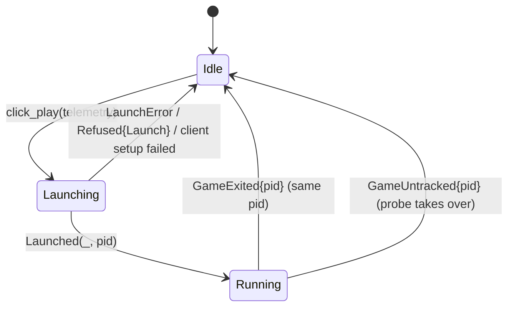

# SGW Launcher

A standalone Windows .exe that installs the SGW client from GitHub
Releases, applies declared patches in order, optionally launches the
debug-Atera path (with or without the dev-session telemetry pipeline),
and uploads debug logs to an Azure Blob SAS URL.

Located in [`crates/launcher/`](../../crates/launcher/) as the
`sgw-launcher` crate. Built with **eframe (egui)** for a small, native
window with no webview dependency.

> **Status:** rewritten 2026-05-20. Supersedes the Tauri prototype and the
> archive.org-RAR install flow described in
> [.claude/plans/2026-03-06-sgw-launcher-design.md](../../.claude/plans/2026-03-06-sgw-launcher-design.md)
> and the task-by-task plan in
> [.claude/plans/2026-03-06-sgw-launcher-plan.md](../../.claude/plans/2026-03-06-sgw-launcher-plan.md).
> Both are kept for historical context; do not implement from them.

---

## What the Launcher Does

| Function | Notes |
|----------|-------|
| **Fetch manifest** | Pulls `manifest.json` + `manifest.json.sig` from GitHub Releases (anonymous GET), and verifies the Ed25519 signature. |
| **Seed install** | Downloads the seed (the whole client) once, verifies sha256, unpacks it into the install dir. The seed is a zip, or the archive.org client RAR, whose installer cabinets (`Data\DATA1-4.CAB`) are expanded straight into the installed layout. |
| **Patch install** | Walks declared patches in order; downloads + unpacks each missing patch: overlay files, and patch sets whose deltas rebuild files from the player's own stock copies (`cimmeria-patchset`). |
| **Client setup** | Restores the stock spelling of patched files (`EULA.lua`), writes the configured login servers into `LoginInternal.lua` and switches ASLR off in `SGW.exe`, after every install and before every launch (`src/client_setup/`). |
| **Launch SGW** (**Play**) | Starts `SGW.exe` suspended, injects `cimmeria-client-patches.dll` (unless the player turned it off), and resumes it. The launcher follows the game until it exits, with or without telemetry; with telemetry on, a telemetry session follows it too. See [Client patches DLL](#client-patches-dll) and [UI and game lifecycle](#ui-and-game-lifecycle). |
| **Running-game probe** | Finds any `SGW.exe` running from the install folder, including one the launcher did not start, so the Play tab shows it and file operations wait for it (`src/game_process.rs`). |
| **Open in Explorer** | Shows the install folder; never creates it (`src/worker/open_folder.rs`). |
| **Launch Atera Debug** | `cmd /C AtreaGameDebug.bat` (enabled only if Atera files were dropped into the install dir). |
| **Launch + Telemetry** | Same as Atera Debug, plus the dev-session telemetry pipeline — mints a token, tails the client logs, and uploads chunks/bundles. It injects no DLL: the Atera bat starts `SGW.exe` itself. See `src/telemetry/` and [operations/telemetry.md](../operations/telemetry.md). |
| **Fix ASLR** | `cmd /C AtreaFixASLR.bat` (enabled only if the Atera fix-ASLR bat is present). |
| **Upload debug logs** | Zips `sgwdebuglog*` (case-blind) + `sessions/**` from the binaries directory and PUTs once to the Azure log SAS URL. |
| **Self-update** | Checks GitHub Releases for a newer `launcher-*` release at startup and, on one click, downloads it, verifies it against the release's `.sha256`, swaps it in for the running exe and relaunches. See [Self-update](#self-update-srcself_update). |

Play, the debug launches, client setup, adoption and the log upload all
find the game through `src/install_layout.rs`, which resolves the
directory holding `SGW.exe`: `<install>\Working\Binaries` in a full
install, or the install path itself when it points straight at it.

---

## Install Pipeline

```text
1. Fetch manifest.json AND manifest.json.sig from manifest_url
   (anonymous GitHub Releases GET — both URLs are HTTPS-enforced).
2. Verify the Ed25519 signature against the embedded public key. On
   mismatch, refuse the manifest entirely — no unsigned fallback.
3. Compare manifest.seed.sha256 vs installed.seed_sha256:
     - Mismatch → download seed blob, verify sha256, unpack into
       install_path, reset applied_patches to [].
     - Match    → skip seed.
4. Rename Working\SGWGame\Cache.en-US to SourceCache.en-us if needed.
5. For each manifest.patches[*] not in installed.applied_patches, in
   order:
     - Download patch blob → verify sha256 → unpack (overlay, or a
       patch set's deltas) into the install dir, or into the client's
       SGWGame/ directory for a "root": "sgw_game" patch.
     - Append the id (<id>@sgw_game for a sgw_game patch) to
       installed.applied_patches and persist.
6. Client setup: stock file names, LoginInternal.lua and ASLR (see below).
```

Resumable downloads use HTTP `Range`: the launcher tracks `existing_len`
on disk under the tmp path (`<install>/.tmp-seed-<sha-prefix>.download` or
`.tmp-patch-<id>-<sha-prefix>.download` — sha included so a republished
patch with the same id but a new sha doesn't accidentally resume against
stale bytes) and asks the server for `bytes=<existing>-` so a killed
seed download picks up where it left off on next run. A `416` for a
full-length file counts as downloaded, and a file that fails its hash is
deleted, so a bad download can't wedge every later attempt.

### Unpacking (`src/unpack/`)

The archive format comes from the file's magic bytes, not its name:

- **zip** — extracted directly (`enclosed_name` is the zip-slip gate).
- **RAR** — extracted with the `unrar` crate (RARLAB's UnRAR library)
  into `<install>/.tmp-unpack/`. Entry names are checked before writing.
  If the staged tree holds a MakeCAB cabinet set — an `.INF` with a
  `[cabinet list]` and `[file list]`, which is how the 2009 installer
  (`SetupQA.exe` + `Data\DATA.INF` + `DATA1-4.CAB`) ships its payload —
  the cabinets are expanded in order into the install dir. Otherwise the
  staged files are moved across. The staging dir is removed afterwards.

Cabinets are expanded with Windows' FDI API (`FDICreate`/`FDICopy` in
`cabinet.dll`, `src/unpack/fdi.rs`), because the installer's cabinets
are 1 GiB volumes with files continued across them, which pure-Rust cab
readers don't follow. The expansion fails if fewer files come out than
the INF lists. Hashing and unpacking run under `spawn_blocking`.

Extracted files keep the modified time the archive records, the way the
stock installer and `expand.exe` do. Cabinet and zip entries carry an
MS-DOS date/time in the builder's local time: `src/unpack/dos_time.rs`
converts it with `DosDateTimeToFileTime` then `LocalFileTimeToFileTime`,
the same calls as Windows' own extractors, and sets the modified and
accessed times. An invalid stamp, or the zip crate's 1980-01-01
"no time" placeholder, keeps the extraction time and never fails the
install. UnRAR restores RAR entry times itself, and the move out of
`.tmp-unpack/` is a rename, which keeps them. Files a patch set rebuilds
by delta are the launcher's own output and keep their write time.

This matters because Unreal Engine 3 stores each `Default*.ini`
timestamp in the `[INIVersion]` section of the player's generated
`Documents\My Games\Firesky\SGWGame\Config\SGW*.ini` and, when one
differs, asks on launch whether to regenerate the "outdated" ini. The
2009 cabinets date the client 2009-06-30, so a launcher that wrote
install-time mtimes triggered that dialog for anyone who had run SGW
before.

On every install, `install_layout::place_bundled_cooked_data` renames
`Working\SGWGame\Cache.en-US` (where the cabinets put the bundled PAKs)
to `SourceCache.en-us`, the read-only tier the client reads through
`SourceCachePath`. See the cache-tier table in
[launcher-guide.md](launcher-guide.md#install-layout).

Concurrency: a process-wide file lock at `<exe dir>/launcher.lock`
ensures only one launcher instance runs at a time, so two installs
can't race on the same `launcher-installed.json` or tmp file.

State files:

- `<install_path>/launcher-installed.json` — applied-patch ledger (in the
  game directory, so it survives launcher reinstalls and travels with the
  game).
- `<launcher.exe dir>/launcher-config.json` — schema version, install path,
  login servers, manifest URL, and telemetry preferences.
- `<launcher.exe dir>/uploaded.json` — log-upload dedupe ledger.
- `<launcher.exe dir>/telemetry-state.json` — per-session telemetry runtime
  state, kept out of the config file so config rewrites don't churn it
  ([`config.rs`](../../crates/launcher/src/config.rs)::`telemetry_state_path`).

---

## Manifest Schema

```json
{
  "schema": 1,
  "seed": {
    "blob": "seed/sgw-0.8348.1.4046.zip",
    "size": 5234567890,
    "sha256": "abc..."
  },
  "patches": [
    { "id": "001-base",    "blob": "patches/001.zip", "size": 123,  "sha256": "...", "after": null },
    { "id": "002-mercury", "blob": "patches/002.zip", "size": 2345, "sha256": "...", "after": "001-base" }
  ]
}
```

- `schema` must be `1`. Bumping invalidates older launchers; serve a
  legacy manifest at the old URL during transitions.
- `blob` may be either an absolute `http(s)://` URL (passed through
  unchanged) or a path relative to the manifest URL's container, in which
  case the launcher derives `<base>/<blob>` by stripping everything after
  the final `/` in `manifest_url`. The GitHub Releases hosting model uses
  absolute URLs so the rolling `content-current` manifest can point at
  immutable per-publication release tags. See
  [`manifest.rs`](../../crates/launcher/src/manifest.rs)::`blob_url`.
- `after` is a forward-declaration check: every referenced patch id must
  have appeared earlier in the array. Order in `patches[]` **is** the
  application order.
- `size` is informational (drives the progress bar's `total` when the
  server doesn't return `Content-Length` for some reason).
- `sha256` is hex, lowercase, of the patch zip contents.
- `root` (optional) is where the zip's entries go. Omitted or
  `"install_dir"`: the install directory, the one holding `SGW.exe`.
  `"sgw_game"`: the client's `SGWGame/` directory, found as
  `<install>/SGWGame` or, in the stock tree where `SGW.exe` is in
  `Working/Binaries/`, as `<install>/../SGWGame`. A `sgw_game` patch
  with neither fails the install. A launcher older than this field
  extracts such a patch into the install directory and records its id,
  so the launcher records a `sgw_game` patch as `<id>@sgw_game` and a
  newer launcher applies it again in the right place. The
  client-patches UI overlay ships this way; see
  [`patch_dest.rs`](../../crates/launcher/src/patch_dest.rs).
- `title` and `description` (optional) name the patch and say what it
  changes, for the launcher's [Changes to your client](#changes-to-your-client)
  list. They are signed with the rest of the manifest, and older
  launchers ignore them. `cimmeria-patchset build` copies them from the
  patch spec, and `pack-client-overlay` writes the overlay's.

---

## Client Setup (`src/client_setup/`)

**Stock file names.** The game looks some UI resources up
case-sensitively, even on Windows: with `EULA.lua` spelled `eula.lua`
its CEGUI resource provider reports `'EULA.lua' does not exist in group
lua`, and the login screen never appears. `launcher-20260929-f518b57`
did exactly that, because the published `005-login-delay` recipe spells
the file `eula.lua` and `cimmeria-patchset` wrote rebuilt files through a
rename under the recipe's spelling. `client_setup::stock_case` renames
every file in its `PATCH_TARGETS` list (each path a patch set writes,
spelled as the 2009 cabinets' `DATA.INF` spells it) back to that
spelling when only the case differs, so installs made with that launcher
repair themselves. A test keeps the list in step with every
`data/client-patches/*/patch.json` op target.

**Login servers.** The login screen's server list comes from
`LoginMod.loadServerSystems()` in
`Working\SGWGame\Content\UI\Startup\Login\LoginInternal.lua`. The stock
file lists CME's dead QA and production login servers; the launcher
rewrites it from the config's `login_servers` (`[{name, url}]`, default
`Cimmeria = http://play.cimmeria.app:8081`), CRLF and ASCII, only when the
content changes. Names and URLs with a quote or backslash are refused, so
a setting can't break out of the Lua string.

**ASLR.** `IMAGE_DLLCHARACTERISTICS_DYNAMIC_BASE` (0x0040) is cleared in
`SGW.exe`'s optional header (one byte, 0x186 in the 0.8348 build), because
the client-patches DLL and every RE address in `docs/` assume the image
base `0x00400000`. The stock exe with that byte cleared is byte-identical
to a known-good QA client's (`client_setup::aslr` has an opt-in test).

**The retired `.rdata` hostname patch.** Earlier launcher builds
overwrote `www.stargateworlds.com` in `SGW.exe`. Its only ASCII
occurrence is inside the SOAP namespace
`http://www.stargateworlds.com/xml/sgwlogin`, so the patch redirected
nothing and would have broken the namespace the auth server's requests
carry. No released launcher ran it; it was removed with its state field
(`patched_host`, now ignored) and the `server_host` setting.

## Changes to Your Client

The launcher's **Changes to your client** section lists every way it
makes the player's client differ from the stock 2009 install, whether
the launcher downloaded that install or the player pointed it at their
own copy. Since the redesign (#1153) it sits in Settings › Advanced; it
is open there by default until the launcher manages a client, so a
player who opens Advanced sees the list before **Install** or **Adopt**.
Nothing in it can be switched off except the two launch rows; the
patches are what Cimmeria needs to play.

The rows come from one pure function,
[`client_changes.rs`](../../crates/launcher/src/client_changes.rs)::`list`,
in four groups:

| Group | Rows |
|---|---|
| Launcher setup | `LoginInternal.lua` login servers, ASLR off and stock file names (all before every launch), `Cache.en-US` renamed to `SourceCache.en-us` (at install) |
| Patched files | One row per manifest patch, in manifest order, **applied** or **applied on the next Install / Update** from `launcher-installed.json` |
| Added when the game starts | The client-patches DLL (on, or off when **Load client patches** is off) and telemetry (off unless the player opted in; when on, it loads `cimmeria-client-telemetry.dll` too) |
| Sent by the server while you play | The server's cooked data in `Documents\My Games\Firesky\SGWGame\Cache.en-US` |

A patch row uses the manifest's `title` and `description` when present,
else the launcher's built-in text for the patches published before those
fields existed (`builtin_description`), else its id with "no description
yet". Every manifest patch gets a row, described or not. The test
`builtin_catalog_matches_every_patch_spec` fails when a spec under
`data/client-patches/` has no built-in text or its text differs from the
spec's.

### Telemetry is opt-in

`telemetry.opted_in` defaults to `false`. The only control is the
**Share diagnostic logs** checkbox in the footer of every view (Play,
Patch Notes, and with Settings open), drawn by
[`app/telemetry_panel.rs`](../../crates/launcher/src/app/telemetry_panel.rs).
A click calls `record_choice`, which sets `opted_in`, sets
`prompt_answered`, and saves the config at once. A failed save is shown
under the checkbox and in the activity log; the choice then holds in
memory for launches from that window. Installing, adopting and playing
never set it. The one-time "Help us fix bugs?" prompt is gone (#1153);
`prompt_answered` is still written so an older launcher reading the
same config does not show it again. The field used to be `enabled`,
default `true`, and every launcher that saved its config wrote
`"enabled": true` without asking; the rename means those configs load
opted out.

A launch reads the choice once, in `LauncherApp::start_play`, and the
reducer records it in `Lifecycle::Launching { telemetry }` /
`Running { telemetry, .. }`. The footer's `caption(pref, session)`
compares the two, so a change during play says it applies to the next
launch and what the running session keeps ("Off from your next game
launch. The game running now keeps sending diagnostics until it
closes."). For a game the probe found but the launcher did not start
(`Session::Unknown`), it claims nothing about that session.

Opting in also loads the telemetry DLL into the game (owner decision
2026-09-29). On **Play** the launcher starts the telemetry
session first (a handshake of at most 10 s that writes
`current-session.json`, which the DLL reads as it boots), then starts
`SGW.exe` with the client-patches DLL and, after it,
`cimmeria-client-telemetry.dll`. Release launchers embed the player
build of the DLL (no `lab-bridge` feature) and write it to
`<launcher dir>/client-telemetry/<sha256 prefix>/`; a dev launcher uses
one beside itself ([`client_telemetry_dll.rs`](../../crates/launcher/src/client_telemetry_dll.rs)).
A `lab-bridge` build is refused. When the session cannot start, or the
DLL is missing or refused, the activity log says so (`In-game telemetry:
unavailable: …`) and the game starts without it; if injecting both DLLs
fails, the launcher retries with the client patches alone, then plainly.
Opted out, the launch is the client-patches launch and nothing else. A
change to the checkbox applies from the next launch.

## Patch Sets (`cimmeria-patchset`)

A patch zip with a `cimmeria-patch.json` recipe rebuilds files from the
player's own stock client instead of shipping them, so the project never
hosts CME bytes. Each op names stock sources (with SHA-256), an optional
transform, a bsdiff delta and the result's SHA-256. `upk_normalize`
decompresses a stock package and writes it back through `cimmeria-upk`'s
append-only patcher, the starting point of every map our `upk_patch`
tool built, so a 4 MB map's delta is under 2 KB. The launcher computes all
ops before writing any, writes targets other ops read last, and skips ops
whose target already has the result. Every path is resolved against the
install's own directory listing first, so a file that exists keeps its
on-disk name whatever case the recipe uses, and `build` refuses a spec
path spelled in another case than the stock tree (`CaseMismatch`). The
shipped patches live in
[`data/client-patches/`](../../data/client-patches/README.md).

---

## UI and Game Lifecycle

The window follows the approved single-game design of #1153 (layout A of
the prototype at `e70b076a9`, `crates/launcher/prototype-macos/`). The
player-facing walk-through is
[launcher-guide.md § The launcher window](launcher-guide.md#the-launcher-window).
This section is the engineering view: which module draws what, the state
behind the one big button, and how the worker keeps conflicting jobs
apart.

### UI modules (`src/app/`)

`LauncherApp` in `app/mod.rs` owns the UI state, builds every worker
`Command`, and drains worker `Event`s once per frame (`drain_events`).
The views are split by responsibility:

| File | Draws / owns |
|---|---|
| `mod.rs` | `LauncherApp`, construction, the event drain, click handlers (`start_install`, `cancel_install`, `start_adopt`, `start_play`, `save_config`), the 2 s refresh (`refresh_install_state`) |
| `shell.rs` | `eframe::App::ui`: the gate side panel (left out below `NARROW_WIDTH` = 760 px), the footer, the main column, header, tabs and gear |
| `play_state.rs` | The reducer (`PlayState`), `install_status`, `primary_action`, and the guards `file_action_block` and `launch_block`. No egui, so it is unit-tested in `play_state_tests.rs` |
| `play_tab.rs` | The status card, the primary button, **Play without updating**, **View details** |
| `patch_notes.rs` | The Patch Notes tab; `rows()` projects the verified manifest |
| `settings_panel.rs` | Game settings: install folder, **Open in Explorer**, the folder-change flow (`check_new_folder`), the disabled **Repair game** / **Uninstall…** |
| `advanced_panel.rs` | Settings › Advanced: every tool the old single form had, and the reset confirmation modal |
| `telemetry_panel.rs` | The **Share diagnostic logs** footer and its caption |
| `client_changes_panel.rs` | "Changes to your client", inside Advanced |
| `update_banner.rs` | Self-update banner, `min_launcher` gate, **Check for updates** |
| `status_lines.rs` | Event → activity-log line (pure, tested) |
| `theme.rs`, `gate_art.rs` | The palette and the painted gate motif |

`theme::apply` calls `ctx.set_theme(egui::Theme::Dark)` and overwrites the
dark visuals with the prototype's palette (blue-gray `BG` `#15191e`, cyan
`ACCENT` `#87d5e7`), so the window stays dark when Windows is in light
mode. `main.rs` opens the window at 1030 × 720, minimum 560 × 520.

### The Play surface reducer (`app/play_state.rs`)

`PlayState` holds four things: the file `operation`
(`StartingInstall`, `Installing`, `Adopting`, or none), the game
`Lifecycle`, the `probed_pids` from the last process probe, and the
`ManifestSlot` (the verified manifest, the URL it came from, the last
fetch error). `PlayState::apply(&Event, manifest_url)` is the only way
events change it; the `click_*` methods give first-press feedback
before the worker answers.



`activity()` folds the lifecycle and the probe together: a followed game
wins, otherwise any probed pid means **Game running** with the
telemetry state unknown.

`primary_action(&PlayState, &Inputs)` picks the one button. Order
matters: a running operation, then the game, then the `min_launcher`
gate, then the install facts.

| `Primary` | When |
|---|---|
| `Installing` | operation is `StartingInstall` or `Installing` (button: **Cancel**, enabled once `InstallStarted` arrives) |
| `Busy("Adopting…")` | operation is `Adopting` |
| `Launching` / `Running` | `activity()` is launching / running |
| `Unavailable(reason)` | `launcher_blocked`; or the folder is not writable when an install, update or adopt would be next; or the manifest failed and nothing is installed; or the ledger says installed but `SGW.exe` is gone |
| `ChooseFolder` | no install path |
| `Adopt` | `SGW.exe` present and no `launcher-installed.json` |
| `Install` | no ledger, manifest loaded (`Busy("Checking for game content…")` while it loads) |
| `Update` | ledger seed differs from the manifest, or patches are missing; `offers_play_anyway` adds **Play without updating** when `SGW.exe` is present |
| `Play` | up to date, or installed with no manifest to compare (`InstalledUnchecked`) |

The play tab's `Unavailable` button is **Retry** (refetch the manifest)
when the manifest failed with nothing cached, otherwise **Open settings**.

`InstallComplete`, `InstallCancelled`, `InstallError`, `AdoptComplete`
and `AdoptError` all end the operation and return
`Effects { refresh_install: true }`, so the app re-reads
`launcher-installed.json` and the client layout. A cancelled or failed
install therefore shows whatever the ledger recorded, never an
optimistic state. `Refused { action: Install, .. }` clears the
operation; `Refused { action: Launch, .. }` drops a pending
`Launching` back to `Idle`.

**The manifest slot.** `begin_fetch(url)` drops a cached manifest that
came from a different URL, because its relative blobs would resolve
against the new URL. `ManifestFetched { url, .. }` and
`ManifestError { url, .. }` carry their URL, and the reducer ignores one
for a URL the app no longer uses. A failed refetch keeps the last
verified manifest and records the error beside it.

**The guards.** `file_action_block` (install, update, adopt, the
install-folder change, the two client-state resets) is `Some` while any
operation runs or the game is launching or running.
`launch_block` (Play and the Atera debug launches) is `Some` while an
operation runs, the game is launching or running, the launcher is below
`min_launcher`, or `SGW.exe` is missing. Controls use them to disable
themselves; the click handlers check them again.

**Refresh.** Every `REFRESH_EVERY` (2 s), and after any install or
folder change, `refresh_install_state` reloads the ledger, re-detects
the client layout, re-probes writability (`app::folder_writable`: a
missing folder is judged by its nearest existing parent, so the probe
never creates the install folder), and runs the process probe.
The frame asks for a repaint at that interval even with no input, so a
game closed outside the launcher returns the card to **Play** without
a mouse move.

### Worker commands and events

New with #1153 (all in [`worker/messages.rs`](../../crates/launcher/src/worker/messages.rs)):

| Message | Direction | Meaning |
|---|---|---|
| `Command::OpenInExplorer(path)` | UI → worker | Show the folder in `explorer.exe`. A missing folder is reported, never created (`open_folder::open_refusal`) |
| `Event::InstallStarted` | worker → UI | The worker accepted an Install and claimed the install slot |
| `Event::InstallCancelled` | worker → UI | The player cancelled; finished steps stay recorded |
| `Event::Refused { action: Busy, reason }` | worker → UI | A command conflicted with running work and was not started; `reason` is the player-facing `Conflict` text |
| `Event::GameExited { pid, exit_code }` | worker → UI | A game the launcher started and followed has exited, telemetry or not |
| `Event::GameUntracked { pid }` | worker → UI | The game started but its pid could not be opened to wait on; no `GameExited` will come, so the probe takes over |
| `Event::OpenFolderError(String)` | worker → UI | Explorer could not be opened, or the folder does not exist |
| `Event::ManifestFetched { url, manifest }`, `Event::ManifestError { url, message }` | worker → UI | Now carry the URL they were fetched for |

**Following the game.** `spawn_launch_sgw` wraps the game's exit future
in `notify_exit`, which frees the worker's game slot and sends
`GameExited` however the game was launched. Before #1153 only a
telemetry launch waited for the exit; a plain launch now waits too, just
to report it. If the helper's pid cannot be opened (`exit` is `None`),
the task sends `GameUntracked` instead.

### The activity guard (`worker/activity.rs`)

A disabled button is only a hint: a click racing a state change, a stale
frame, or a future caller can still dispatch. So `Worker::dispatch`
checks every file-mutating or launching command against `Activity`, a
`Mutex`-guarded record of what the worker itself is running, and answers
a conflict with `Event::Refused` instead of starting it.

| Command | Claims | Refused while |
|---|---|---|
| `Install`, `AdoptExisting` | `begin_install(install_dir)` → released by `end_install` when the task ends | an install runs, a launch is starting, the worker's game runs, or the probe finds an `SGW.exe` under `install_dir` |
| `LaunchSgw`, `LaunchAteraDebug`, `LaunchAteraDebugWithTelemetry` | `begin_launch(dir)` → `game_started(pid)` → `game_ended()` | the same |

The Atera launches hold the slot only until the bat starts, because the
bat starts `SGW.exe` itself and the worker cannot follow it; the probe
guards that game from then on. `WipeClientCache`, `WipeAllClientState`
and `LaunchAteraFixAslr` claim nothing but call `Activity::check_idle`
first, and are refused with `Busy::Files` while an install runs or a
game runs (any game for the resets, since the per-user client folders
are shared). Changing the install folder is a config edit on the UI
thread, so it re-runs the process probe and `file_action_block` at the
moment of the change, not only when the button was drawn.

### The process probe (`src/game_process.rs`)

`running_game_pids(install_dir)` walks a Toolhelp process snapshot for
images named `SGW.exe` (case-blind) and reads each one's full image path
with `QueryFullProcessImageNameW`. `select_game_pids` keeps a process
whose image is under the install folder, compared lower-case,
backslash-normalised, `\\?\`-stripped and by whole folder (so `SGW2`
does not match `SGW`). It is conservative: a process whose image path
cannot be read (another user's) counts as running from this install, and
with no install path every `SGW.exe` counts. A false "running" only
delays a file operation; a false "not running" could rewrite files under
the game. On non-Windows hosts it returns nothing.

The UI uses it every refresh (`PlayState::probed_pids`); the worker's
`Activity::production()` uses it on every claim. That is what covers a
reopened launcher, an Atera bat launch, another launcher window, and a
`GameUntracked` game. Closing the launcher never stops the game: nothing
in the launcher kills `SGW.exe`.

**Tests.** `app/play_state_tests.rs` drives the reducer through install,
cancel, failure, launch, exit (telemetry on and off), refusals and the
guards. `worker/guard_tests.rs` dispatches real commands to a worker and
checks refusals, a freed slot after a failed launch, and `GameExited` for
a plain launch; `worker/activity.rs` tests the claims, including a probed
game. `game_process.rs` tests the path match and the conservative cases,
`patch_notes.rs` the manifest projection (order, blank fields, markup-like
text, no fixed count), `settings_panel.rs` the folder check (it creates
nothing), `open_folder.rs` the refusal, and `telemetry_panel.rs` the
save round trip, a failed save and the captions.

### Not in this release

**Repair game** and **Uninstall…** are drawn disabled in
`settings_panel.rs::show_maintenance`; they arrive as later PRs of #1153
(see the [launcher-redesign ledger](../analysis/launcher-redesign/README.md)).
Install / Update is not a repair: `install_all` skips everything
`launcher-installed.json` records, so it cannot restore a deleted or
damaged file.

### Debug launches

| Button (Settings › Advanced) | Enabled when | Action |
|---|---|---|
| **Launch Atera Debug** | `AteraLoader.exe` **and** `AtreaGameDebug.bat` both present, and `launch_block` is `None` | `cmd /C AtreaGameDebug.bat` (cwd = binaries dir) |
| **Launch Atera + Telemetry** | Atera available, `telemetry.opted_in`, identity loaded, and `launch_block` is `None` | Atera debug launch plus the telemetry pipeline |
| **Fix ASLR** | `AtreaFixASLR.bat` present, and `launch_block` is `None` | `cmd /C AtreaFixASLR.bat` |

**Play** is the production launch: `SGW.exe` started suspended with
`cwd = <binaries dir>`, the client-patches DLL injected, then resumed.
When the player opted in (`telemetry.opted_in`) and the identity loaded,
a telemetry session starts first, the telemetry DLL goes in after the
client patches, and the session follows the game.

The Atera batch files are **not** shipped by the launcher. Players who
want the debug build drop the Atera tarball into the install directory
themselves; the launcher detects the files and surfaces the buttons.
The catalogue of what each bat does lives in
[docs/technical/atrealoader-exe.md](../technical/atrealoader-exe.md)
and [docs/technical/atrealoader-config.md](../technical/atrealoader-config.md).

Atera debug requires ASLR disabled on SGW.exe. The launcher's client
setup now clears it itself before every launch, so the **Fix ASLR**
button is only needed for installs the launcher has never launched.

### Client patches DLL

`cimmeria-client-patches.dll` restores client features the 2009 client
shipped unfinished, first the Black Market window. The decision record
is [client-patches.md](../architecture/client-patches.md). On **Launch
SGW.exe** (**Play**) the launcher:

1. Decides whether to load it ([`client_patches/plan.rs`](../../crates/launcher/src/client_patches/plan.rs)).
   The checkbox **Load client patches (restores the Black Market
   window)** in Settings › Advanced › Client patches is `client_patches.enabled` in
   `launcher-config.json`. It is on by default, saved as soon as it
   changes, and independent of the telemetry opt-in.
2. Finds the DLL ([`client_patches/dll_source.rs`](../../crates/launcher/src/client_patches/dll_source.rs)),
   in this order: `client_patches.dll_override` (a tester's own build);
   the copy embedded in release launchers, written to
   `<launcher dir>/client-patches/<sha256 prefix>/cimmeria-client-patches.dll`
   so that a DLL still loaded by a running game is never overwritten;
   then `cimmeria-client-patches.dll` beside the launcher (dev builds
   embed nothing).
3. Runs the 32-bit `sgw-start32.exe` helper, which starts `SGW.exe`
   suspended, injects the DLL, resumes it and reports the pid; the
   launcher then opens that pid to follow the game (see **Bitness**
   below). If injection fails, the helper kills the suspended process
   and the launcher starts the game without the DLL.

Every launch that does not load the DLL says why in the activity log
(`Client patches: off (launcher setting)…`, `…unavailable: …`, or
`…not loaded (…)`), so a missing Black Market window is never silent.
Atera debug launches never load it, because the bat starts `SGW.exe`
itself.

**Bitness.** Injection hands a remote thread the injector's own
`LoadLibraryW` address, which only exists in a process of the same
bitness. The launcher is 64-bit and `SGW.exe` is 32-bit, and a 64-bit
process cannot reach the target's 32-bit `LoadLibraryW` either: a
process created suspended has no 32-bit kernel32 mapped yet, and a
thread a 64-bit process starts there runs in 64-bit mode. So the
launcher runs `sgw-start32.exe`, a 32-bit helper (crate
[`cimmeria-start32`](../../crates/start32/), linking only
`cimmeria-client-launch`) that does the suspended launch and the
injection at the right bitness. Release builds embed it and keep it at
one stable path, `<launcher dir>/sgw-start32.exe`, rewritten only when a
new launcher carries different bytes. It has a version resource and an
`asInvoker` manifest, and it is never written to `%TEMP%`, so an
antivirus exclusion for the launcher's folder keeps working across
updates (see the
[launcher guide](launcher-guide.md#windows-defender-or-smartscreen-blocks-the-launcher)).
Releases are unsigned (code signing is deferred). Its
command-line contract is in the
[client-launch README](../../crates/client-launch/README.md); the
telemetry DLL and `cimmeria-lab` reuse it. A direct injection across
bitness is refused with `BitnessMismatch` instead of failing as a bare
`RemoteLoadFailed`. A dev build with no helper says `…unavailable…
sgw-start32.exe…` and starts the game without the DLL.

**Code signing: deferred.** The owner has deferred code signing, so
releases ship unsigned (the release notes say so) and rely on the
measures above plus the
[Defender / SmartScreen workaround](launcher-guide.md#windows-defender-or-smartscreen-blocks-the-launcher).
The two routes on the table for later:

- **SignPath Foundation**: free signing for open-source projects, but it
  needs an OSI-approved license on the repository first.
- **Azure Trusted Signing** (now Artifact Signing): a small monthly fee,
  and GitHub Actions signs in over OIDC, so no signing secret is stored.

Either would sign the launcher, `sgw-start32.exe` and the DLLs (the i686
artifacts before the launcher embeds them), between the stages of
`tools/launcher-release/build.sh`. A PFX-in-a-secret setup is not an
option for a new certificate: since June 2023 publicly trusted
code-signing keys must be generated and kept on hardware (an HSM or a
token), so they cannot be exported as a `.pfx`.

**Order with the telemetry DLL.** Both DLLs MinHook `FEngineLoop::Tick`
and the drop callee. When both go in (an opted-in **Play**,
and every lab launch), the client-patches DLL goes first. It hooks straight away and normally finds the stock prologues;
the telemetry DLL reads its session file first, then chains on top.
`injection_order` pins this order.

**Telemetry.** With telemetry on, the session reads
`cimmeria-client-patches.log` next to `SGW.exe` and records one
`client.patches.boot` event per session. It carries the launcher's
`injection` outcome (`injected`, `opted_out`, `unavailable`,
`inject_failed`), the DLL version, `fingerprint.<site>` for each hooked
site, `fingerprint_ok`, and the `verdict` (`installed`,
`nothing_installed`, `hook_failed`). See
[`telemetry/patch_log.rs`](../../crates/launcher/src/telemetry/patch_log.rs).
The same session records `client.patches.counts`, the DLL's claimed /
delivered / dropped counts with reasons
([`telemetry/patch_counts.rs`](../../crates/launcher/src/telemetry/patch_counts.rs)),
and an Install / Update run by an opted-in player queues one
`client.launcher.install_result` event with every patch's outcome
([`telemetry/install_result.rs`](../../crates/launcher/src/telemetry/install_result.rs)).
Both are described in
[dev-session-telemetry.md](../architecture/dev-session-telemetry.md#client-patches-counts-event).

---

## Debug Log Upload

Single-PUT upload to Azure Blob via a SAS URL baked into the .exe at
build time (`LAUNCHER_LOG_SAS_URL` env, consumed by `option_env!`).

```text
Inputs   <binaries>/sgwdebuglog*   (BigWorld unicode log, case-blind)
         <binaries>/sessions/**   (per-session logs)
Output   logs/<hostname>-<utc>-<digest12>.zip
Method   single PUT, x-ms-blob-type: BlockBlob, content-type: application/zip
Dedupe   sha256 of inputs (filename + bytes, sorted) → uploaded.json next to .exe
```

Wallet protection rules:

1. **One PUT per upload click**, never one-per-file. The zip is built
   in memory, hashed, and uploaded in a single call.
2. **Content digest, not zip-bytes hash.** The zip writer's per-entry
   timestamps differ between rebuilds; dedup uses a stable digest over
   `(rel_path, bytes)` pairs in sort order. So re-clicking with
   unchanged logs is free.
3. **Local ledger** at `<launcher.exe dir>/uploaded.json`. Already-seen
   digest → zero HTTP requests, button reports `"Already uploaded …"`.
4. **No background uploads.** Only fires on explicit button click.

The local dev / PR-build pipeline produces a launcher with
`LAUNCHER_LOG_SAS_URL = None`. The button is greyed out with a friendly
"Log upload disabled — built without LAUNCHER_LOG_SAS_URL" note. The
release workflow injects the secret.

See [docs/client/launcher-distribution-setup.md](launcher-distribution-setup.md)
for the operator side: GitHub Releases publish flow for content,
Ed25519 manifest signing setup, and the Azure Blob SAS for log uploads.

## Self-update (`src/self_update/`)

The launcher replaces itself with a newer launcher release. Maintainer
decisions of 2026-09-29: discovery and trust through GitHub Releases, a
one-click prompt, and an optional `min_launcher` gate in the manifest.
Player-facing behaviour: [launcher-guide.md](launcher-guide.md#launcher-updates).

**Identity.** The release workflow stamps the tag
(`launcher-YYYYMMDD-<sha7>`) and the job's start time (Unix seconds)
before it builds, and passes them to the launcher build as
`CIMMERIA_LAUNCHER_TAG` and `CIMMERIA_LAUNCHER_BUILD_EPOCH`
(`option_env!`, `build_info.rs`). A build missing either, or with a
malformed value, is a development build: it makes no request and offers
nothing. `build.sh verify` fails a release build that does not embed its
tag.

**Discovery.** One unauthenticated `GET
api.github.com/repos/SandboxServers/Cimmeria/releases?per_page=100` per
start (and per **Check for updates**), with a `sgw-launcher/<tag>`
User-Agent. `/releases/latest` is not enough: server releases (`v2026-…`)
and the `content-current` prerelease share the repository. Candidates are
non-draft, non-prerelease `launcher-*` releases that carry both
`sgw-launcher-<tag>.exe` and `sgw-launcher-<tag>.exe.sha256`; the newest
by `published_at` wins. 403 with `x-ratelimit-remaining: 0` and 429 are
reported as rate limiting, connection failures as offline; both are one
status-log line.

**Ordering (never downgrade).** A release is newer than the running
build when the tags differ, the release's tag date is not earlier, and
it was published after the running build's stamped start time. The last
rule orders two releases cut on one day. It is sound because the
`launcher-release` concurrency group runs one release job at a time and
each job publishes at its end: every later release is published after
this build started, every earlier one before. The rule and its tests
are in `version.rs`.

**`min_launcher`.** An optional top-level manifest field, a launcher tag
(no schema bump). A different day decides by date; the same day by the
required release's `published_at`, looked up in the last release list,
and the player is let through when it is not known. Malformed values are
ignored with a WARN; development builds are exempt. When it blocks,
Install / Update and every launch button are off and the banner is
mandatory.

**Download and verify.** The download goes to
`.sgw-launcher-update-<tag>.exe.part` beside the running exe, through
the install pipeline's Range-resuming downloader. It must match the size
the release lists and the SHA-256 in the `.sha256` asset (sha256sum
format; a file name in it must be the exe's) before anything else
happens; a mismatch deletes it. The updater's HTTP client is https-only
and follows redirects only to `github.com`,
`objects.githubusercontent.com` and
`release-assets.githubusercontent.com`; asset URLs are checked against
the same list before the first request. A directory the launcher cannot
write (a `Program Files` install) stops the update before any download,
and the banner links the release page.

**Swap.** Windows lets a running image be renamed but not replaced:

1. delete a leftover `<exe>.old`;
2. rename the running `<exe>` to `<exe>.old`;
3. rename the verified download to `<exe>`; if that fails, rename
   `<exe>.old` back;
4. start `<exe>` with the same arguments, `SGW_LAUNCHER_UPDATED_FROM`
   (the old tag) and `SGW_LAUNCHER_UPDATED_FROM_PID` (the old pid) set;
   if it will not start, delete it, rename `<exe>.old` back and keep
   running with the lock still held;
5. release `launcher.lock` and exit the process at once, from the worker
   thread (`self_update/handoff.rs`).

Step 5 does not wait for the window. `launcher-20260929-676f314` closed
its window instead, which in egui only happens on the next frame; with
no mouse input that frame never came, the old launcher kept the lock,
and the new one gave up with "another instance appears to be running".
So updating **from** `launcher-20260929-676f314` may show that box once
(the observed 676f314 to 4fcae33 update did); the update itself has
worked, and clicking OK and starting the launcher again finishes it.
Later launchers do not. Nothing touches install state between releasing the lock and exiting,
and the launcher saves nothing on exit (config and telemetry state are
written when they change), so the hard exit loses nothing.

Every path comes from `std::env::current_exe`, so a renamed launcher
stays renamed. The relaunched process sees `SGW_LAUNCHER_UPDATED_FROM`
and waits up to 10 s for the lock instead of failing with "another
instance". If the old launcher still holds it (an older launcher waiting
for its frame), the new one ends that process, the pid from
`SGW_LAUNCHER_UPDATED_FROM_PID` or, from launchers that predate it, its
parent process, but only when that process's image is this exe or
`<exe>.old`, then waits up to 10 s more. If that fails too, it says the
previous launcher window is still open rather than "another instance". A
normal start, without the variable, still refuses a second launcher at
once. The new process then deletes `<exe>.old` in the background,
retrying while the old process exits (the next start retries if it stays
locked).

**Telemetry.** Every step logs on target `launcher.update` with an
`event` field: `update_check` (`outcome` = `dev_build`, `no_release`,
`up_to_date`, `available`), `update_check_failed`, `release_skipped`
(DEBUG), `update_download_started`, `update_verified`, `update_swapped`,
`update_handoff_started` (`old_pid`), `update_relaunched` (the new
`pid`), `update_lock_released`, `update_rollback`, `update_failed`; in
the new process `update_relaunch_lock_acquired` (`waited_ms`, `killed`),
`update_relaunch_lock_timeout`, `update_fallback_kill` (`outcome` =
`killed` or `skipped`), `update_relaunch_lock_failed`,
`update_started_new`, `update_old_removed`, `update_old_remove_failed`.
Refusals and failures carry `reason` (`rate_limited`, `offline`,
`http_status`, `parse_failed`, `dir_not_writable`, `untrusted_url`,
`bad_checksum_file`, `http_failed`, `io_failed`, `size_mismatch`,
`sha256_mismatch`, `stale_old_locked`, `move_aside_failed`,
`install_failed_rolled_back`, `rollback_failed`, `relaunch_failed`,
`lock_not_held`, `old_launcher_still_running`, `lock_held_after_wait`,
`no_old_pid`, `own_pid`, `open_failed`, `not_our_exe`, `image_unknown`,
`terminate_failed`, `no_exe_path`, `unsupported_platform`,
`held_after_kill`, `still_locked`).

**Tests.** `self_update/` pins the ordering (same-day, same tag, no
downgrade, dev builds), the release filter over a realistic releases
fixture (`testdata/releases.json`), size and SHA-256 mismatches deleting
the download, the host allow-list and redirects, the swap and its
rollbacks in a temp directory, `.old` cleanup (including a locked file),
the relaunch lock wait, the handoff order against a real file lock
(start, then release, then exit, with no UI involved; a failed start
keeps the lock), a relaunch that outlives the first wait and ends the
old launcher, a normal start still refusing a second instance, ending a
real process running our exe and leaving one that is not, rate limiting
and offline against a loopback
stub, and `min_launcher` parsing and gating. `app/update_banner.rs` pins
the banner state machine.

Not done: a code-signed exe (deferred with the rest of launcher signing)
and a signed update manifest (trust is HTTPS plus GitHub, as for a manual
download). Only the first 100 releases are scanned, so a launcher release
buried under more than 100 newer server releases is not seen.

---

## Build

```bash
# Iteration (Windows host, native). Embeds nothing: it loads the patches
# only if cimmeria-client-patches.dll and sgw-start32.exe sit beside it.
cargo build -p sgw-launcher

# A launcher that injects, built the way the release workflow builds it:
# the i686 DLL and helper first, then the 64-bit launcher embedding both.
cargo build -p cimmeria-client-patches --release --target i686-pc-windows-msvc
cargo build -p cimmeria-start32 --release --target i686-pc-windows-msvc
CIMMERIA_CLIENT_PATCHES_DLL=$PWD/target/i686-pc-windows-msvc/release/cimmeria_client_patches.dll \
CIMMERIA_START32_EXE=$PWD/target/i686-pc-windows-msvc/release/sgw-start32.exe \
  cargo build -p sgw-launcher --release

# Output: target/release/sgw-launcher.exe (64-bit)
```

`LAUNCHER_LOG_SAS_URL` enables log upload in any of these builds.
Without `CIMMERIA_CLIENT_PATCHES_DLL` and `CIMMERIA_START32_EXE` the
launcher embeds neither and looks for each beside itself.

The release workflow runs these steps through
[`tools/launcher-release/build.sh`](../../tools/launcher-release/build.sh)
(`i686`, `launcher`, `verify`, `overlay`); `PROFILE=dev` runs them with the dev profile.

The same package builds `pack-client-overlay`, the release tool that
packs the client-patches UI overlay into a manifest patch; see
[launcher-distribution-setup.md](launcher-distribution-setup.md#publishing-the-client-patches-ui-overlay).

The icon at [`crates/launcher/icons/icon.ico`](../../crates/launcher/icons/icon.ico)
is embedded as a Win32 resource via [`build.rs`](../../crates/launcher/build.rs),
which also embeds the client-patches DLL and the `sgw-start32` helper
when `CIMMERIA_CLIENT_PATCHES_DLL` and `CIMMERIA_START32_EXE` are set. A
path that is not a PE image fails the build.

---

## CI

Three GitHub Actions workflows mirror the server's pattern:

| Workflow | File | Trigger |
|---|---|---|
| **launcher** | [`.github/workflows/launcher-build.yml`](../../.github/workflows/launcher-build.yml) | Path-filtered fmt/clippy/build/test/coverage (five jobs; the `coverage` job runs `cargo llvm-cov`) on PRs touching `crates/launcher/**`, `crates/client-launch/**`, `crates/client-patches/overlay/**` or `.github/workflows/launcher-*.yml`. Clippy covers `cimmeria-client-launch` and `cimmeria-start32` too. The test job builds the i686 `sgw-start32` helper and runs the x64 tests with `CIMMERIA_TEST_START32` set, so the helper injects a real DLL into a real 32-bit process. A `release-dry-run` job runs the release build stages (`tools/launcher-release/build.sh`) without signing or publishing, because the release workflow itself only runs on a release. |
| **launcher-release** | [`.github/workflows/launcher-release.yml`](../../.github/workflows/launcher-release.yml) | `workflow_dispatch`. Builds the i686 client-patches DLL and `sgw-start32` helper, then the 64-bit launcher embedding both with `LAUNCHER_LOG_SAS_URL` injected from secrets, verifies them, packs the UI overlay, and creates a GitHub Release tagged `launcher-<date>-<sha7>` with the exe, its `.sha256` (what self-update verifies against) and, when there is an overlay, its patch zip and `.entry.json`. The tag and the build time are stamped before the build and embedded in the launcher (`CIMMERIA_LAUNCHER_TAG`, `CIMMERIA_LAUNCHER_BUILD_EPOCH`). |
| **launcher-release-on-comment** | [`.github/workflows/launcher-release-on-comment.yml`](../../.github/workflows/launcher-release-on-comment.yml) | Mirror of `release-on-comment.yml` but matches `/release-launcher` on a merged PR. Validates commenter has write access, dispatches `launcher-release.yml`. |

Two repo secrets feed the release build: `LAUNCHER_LOG_SAS_URL` (log
upload) and `LAUNCHER_MANIFEST_PUBKEY_HEX` (the embedded Ed25519 manifest
verification key). PR / build jobs deliberately omit both; only
`launcher-release` reads them. Without `LAUNCHER_LOG_SAS_URL` the release
exe still builds and log upload is permanently disabled; without
`LAUNCHER_MANIFEST_PUBKEY_HEX`, manifest verification fails closed with
`ManifestError::SigningKeyUnavailable`.

The launcher is **excluded** from the main `ci` workflow ([`test.yml`](../../.github/workflows/test.yml))
via the `WORKSPACE_EXCLUDES` env (`--exclude sgw-launcher`) so eframe's
Linux system deps don't slow the rest of the workspace pipeline.

---

## File Layout

```text
crates/launcher/
├── Cargo.toml
├── build.rs                    # winres icon embed + client-patches DLL embed
├── binaries/                   # bundled 7za executables
├── gen/schemas/                # windows-schema.json
├── icons/
│   └── icon.ico
└── src/
    ├── main.rs                 # eframe entry, tokio runtime
    ├── app/
    │   ├── mod.rs              # LauncherApp: state, event drain, click handlers
    │   ├── shell.rs            # eframe::App::ui: side panel, header, tabs, footer
    │   ├── play_state.rs       # Play surface reducer, primary_action, guards
    │   ├── play_state_tests.rs # its tests
    │   ├── play_tab.rs         # status card + primary action
    │   ├── patch_notes.rs      # Patch Notes tab (verified manifest only)
    │   ├── settings_panel.rs   # Game settings: folder, Explorer, Repair/Uninstall stubs
    │   ├── advanced_panel.rs   # Settings › Advanced: the old form's tools
    │   ├── telemetry_panel.rs  # "Share diagnostic logs" footer
    │   ├── update_banner.rs    # self-update banner + min_launcher gate
    │   ├── client_changes_panel.rs  # "Changes to your client" list
    │   ├── status_lines.rs     # event -> activity-log line
    │   ├── theme.rs            # dark palette, buttons, cards
    │   └── gate_art.rs         # painted gate motif
    ├── client_changes.rs       # every deviation from the stock client
    ├── game_process.rs         # is SGW.exe running from this install? (Toolhelp)
    ├── config.rs               # LauncherConfig (next to .exe)
    ├── manifest.rs             # Manifest schema + fetch + Ed25519 verify
    ├── install.rs              # seed + patches + client setup orchestration
    ├── install_tests.rs        # its tests
    ├── install_report.rs       # per-patch outcomes of one install run (telemetry)
    ├── client_setup/
    │   ├── mod.rs              # prepare(): run the three steps
    │   ├── stock_case.rs       # rename eula.lua etc. back to the stock case
    │   ├── login_servers.rs    # LoginInternal.lua from the config
    │   └── aslr.rs             # clear DYNAMIC_BASE in SGW.exe
    ├── install_layout.rs       # where SGW.exe lives (Working\Binaries)
    ├── unpack/
    │   ├── mod.rs              # format detection, staging, dispatch
    │   ├── zip.rs              # zip extraction
    │   ├── rar.rs              # RAR extraction (unrar)
    │   ├── cab_set.rs          # MakeCAB installer INF + cabinet set
    │   ├── fdi.rs              # cabinet.dll FDI binding (Windows)
    │   └── test_fixtures.rs    # hand-built RAR + makecab test inputs
    ├── patch_dest.rs           # where a patch extracts (install dir or SGWGame/)
    ├── bundled.rs              # writes the embedded i686 artifacts to disk
    ├── start32_helper.rs       # keeps sgw-start32.exe beside the launcher
    ├── overlay_meta.rs         # UI overlay id prefix + list text (shared with the tool)
    ├── overlay_pack.rs         # UI overlay -> patch zip + entry (tests only here)
    ├── bin/
    │   └── pack-client-overlay.rs  # release tool around overlay_pack.rs
    ├── client_patches/
    │   ├── mod.rs
    │   ├── dll_source.rs       # override / embedded / beside-the-launcher DLL
    │   └── plan.rs             # inject decision + injection order
    ├── client_telemetry_dll.rs # opted-in telemetry DLL: source + lab-build refusal
    ├── client_paths.rs         # install-dir path resolution
    ├── identity.rs             # stable per-install identity
    ├── logs.rs                 # log collection + zip + Azure PUT
    ├── state.rs                # InstalledState + UploadedLedger
    ├── instance_lock.rs        # held launcher.lock, releasable by the update handoff
    ├── self_update/
    │   ├── mod.rs              # check() + apply() orchestration, startup cleanup
    │   ├── build_info.rs       # embedded release tag + build time
    │   ├── releases.rs         # GitHub Releases lookup, host allow-list
    │   ├── version.rs          # ordering rule + min_launcher gate
    │   ├── download.rs         # download beside the exe, size + SHA-256
    │   ├── swap.rs             # rename-aside swap, rollback, relaunch, lock wait
    │   ├── handoff.rs          # start new exe, release lock, exit; startup lock policy
    │   ├── old_process.rs      # end a stuck old launcher (pid or parent, our exe only)
    │   ├── *_tests.rs          # loopback-stub and temp-dir tests
    │   └── testdata/releases.json  # releases-list fixture
    ├── telemetry/
    │   ├── mod.rs
    │   ├── auth.rs             # dev-session token mint / refresh
    │   ├── session.rs          # session lifecycle
    │   ├── runner.rs           # pipeline driver
    │   ├── tail.rs             # client log tailing
    │   ├── events.rs           # parsed event shapes
    │   ├── queue.rs            # buffering
    │   ├── chunk.rs            # upload-chunk
    │   ├── endpoint.rs         # telemetry's own client + https/loopback policy
    │   ├── bundle.rs           # end-of-session upload-bundle
    │   ├── patch_log.rs        # client.patches.boot from the DLL's log
    │   ├── patch_counts.rs     # client.patches.counts (claimed / delivered / dropped)
    │   ├── install_result.rs   # client.launcher.install_result, queued after an install
    │   └── process_watch.rs    # game-exit detection
    └── worker/
        ├── mod.rs              # tokio worker, dispatch + Activity claims
        ├── activity.rs         # refuses conflicting install / launch commands
        ├── guard_tests.rs      # dispatch-level guard tests
        ├── open_folder.rs      # Open in Explorer (never creates the folder)
        ├── event_sender.rs     # event channel that wakes the UI
        ├── launch_sgw.rs       # SGW.exe launch, DLL attempts and fallbacks, GameExited
        ├── launch_sgw_tests.rs # its tests (exact helper command lines)
        ├── launch_telemetry.rs # opted-in session: start before the game, follow it
        ├── self_update.rs      # update check / apply tasks -> UpdateEvent
        └── messages.rs         # Command/Event channel types
```

Launch and injection (`launch`, `inject`) live in the shared
`cimmeria-client-launch` crate, and patch sets in `cimmeria-patchset`.
`unpack/` and `client_setup/` started as directories; `app/`, `worker/`, and
`telemetry/` were each promoted from a flat file once they crossed the
4-siblings-on-one-theme threshold in
[CLAUDE.md's file organization rules](../../CLAUDE.md).
