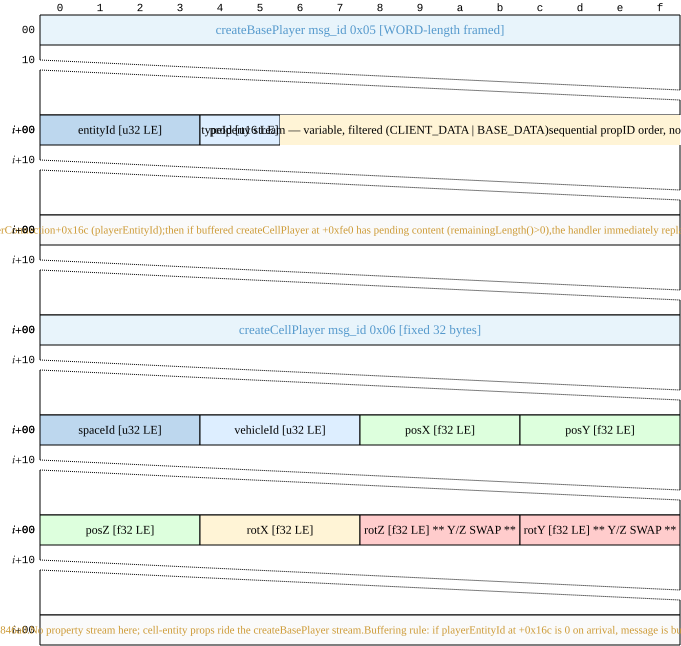

# Entity Property Sync

An entity in BigWorld is a distributed object: every server-authoritative property and method has a numeric identifier the wire uses instead of a string name, and every property mutation rides one of three serialization pipes — entity creation, AoI introduction, or runtime property-change — each with its own byte layout. This chapter pins each of those pipes to the binary that emits them, plus the bit-by-bit rules the client uses to decode them.

The property/method ID space is constructed at parse time by walking each entity's `.def` file plus its parent and implements chain; the resulting `(entity_type, property_id)` and `(entity_type, method_category, method_id)` tables are the contract between server and client. Get the table wrong by one slot and property updates write the wrong fields on the client — silently, with no error. The mercury chapter (`spec.protocol.mercury-wire-format`) carries the envelope; this chapter carries the payload.

Schema construction itself — parse order, ID assignment mechanics, DataType class hierarchy, MD5 signature digest — is owned by the future `spec.engine.entity-description-parse-chain` chapter. Section 1 summarizes those mechanics where the wire format depends on them and cross-references forward for full detail.

---

## Section 1 — RE findings

This section distills the Ghidra decompilation evidence for every layer of the entity property/method sync system: schema construction (§1.1–§1.4), wire dispatch (§1.5), creation-time wire formats (§1.6–§1.7), runtime property-change wire format (§1.8), AoI introduction cascade (§1.9–§1.10), data-domain filters (§1.11), DataType registries and MD5 schema fingerprint (§1.12–§1.13). §1.14 is the source-of-truth crosswalk; §1.15 records open questions. Every factual claim resolves to a `ghidra://SGW.exe@0x<addr>` anchor (image base `0x00400000`).

The client binary (`SGW.exe`) is the reference for all ID-table construction and wire-decode logic. The server-side encoders (BaseApp/CellApp) are not in the SGW binary; where a claim about the *server's* emit logic cannot be confirmed in SGW.exe, this is stated explicitly and sourced either to BigWorld 2.0.1 source or flagged as hypothesis.

---

### 1.1 propID / methodID wire contract — summary

Entities in BigWorld carry three disjoint ID spaces, all assigned sequentially at parse time:

- **propID** — a client-property ordinal, zero-based, over the filtered subset of properties that have `DATA_OWN_CLIENT (0x04)` or `DATA_OTHER_CLIENT (0x02)` flags. This ordinal is what rides the wire in property-change messages and in the creation-time property streams.
- **cellMethodID** — a zero-based ordinal within the entity's CellMethods list, restricted to methods marked `<Exposed/>`.
- **baseMethodID** — a zero-based ordinal within the entity's BaseMethods list, restricted to methods marked `<Exposed/>`.

These three tables are constructed by the entity-description parse chain, which walks `<Parent>` → `<Implements>` → own sections in that order. The full parse-chain mechanics — parse order, ID assignment algorithm, DataType class hierarchy, schema MD5 — are owned by the future `spec.engine.entity-description-parse-chain` chapter. §1.1 here is a working summary sufficient for the wire format; forward-reference that chapter for the complete picture.

**Entry point**: `EntityDescription_Parse @ ghidra://SGW.exe@0x01593cd0` opens `entities/defs/<name>.def`, resolves the `<Parent>` chain recursively (parent first), reads `<ClientName>` and `<ServerOnly>`, then calls `EntityDescription_ParseDef @ ghidra://SGW.exe@0x01593600` to parse `<Implements>` → `<Properties>` → `<ClientMethods>` → `<CellMethods>` → `<BaseMethods>` in that fixed order.



*Figure 1: parse order — `EntityDescription_Parse` walks `<Parent>` recursively (parent first), then `<Implements>` in XML order, then own sections in the fixed order Properties → ClientMethods → CellMethods → BaseMethods. propID and methodID counters accumulate left-to-right across the tree, so a parent's last ID + 1 is the next contributor's first ID. SGWPlayer's full cascade is detailed in Figure 8.*

---

### 1.2 Property table and flag bits

**Confirmed** by decompilation of `EntityDescription_ParseProperties @ ghidra://SGW.exe@0x015924a0` and `DataDescription_ParseFlags @ ghidra://SGW.exe@0x015974a0` (named `DataDescription_parse_2` in the old RE doc).

Each property in the `<Properties>` XML section is parsed into a `DataDescription` struct. The flags byte at `DataDescription+0x20` is an 8-bit bitmask:

| Bit | Hex | Flag | `.def` keyword |
|-----|-----|------|----------------|
| 0 | `0x01` | `DATA_GHOSTED` | `CELL_PUBLIC` |
| 1 | `0x02` | `DATA_OTHER_CLIENT` | `OTHER_CLIENTS` |
| 2 | `0x04` | `DATA_OWN_CLIENT` | `OWN_CLIENT` |
| 3 | `0x08` | `DATA_BASE` | `BASE` |
| 4 | `0x10` | `DATA_CLIENT_ONLY` | `CLIENT_ONLY` |
| 5 | `0x20` | `DATA_PERSISTENT` | `<Persistent>true</Persistent>` |
| 6 | `0x40` | `DATA_EDITOR_ONLY` | `EDITOR_ONLY` |
| 7 | `0x80` | `DATA_ID` | `<Identifier>true</Identifier>` |


*Figure 2: bitmask layout of the 8-bit `DataDescription+0x20` flag byte. Bits 1 (`DATA_OTHER_CLIENT`) and 2 (`DATA_OWN_CLIENT`) exist in the parser's table but never set in SGW — see §2.3 and Figure 7 for the keyword-surface divergence.*

Persistence is injected at parse time (`*pOutFlags |= 0x20` when `"Persistent"` child is true); identifier likewise (`|= 0x80` when `"Identifier"` is true). Both are confirmed in the decompile of `DataDescription_ParseFlags`.

**Four filtered lists** the parser builds (confirmed by `EntityDescription_ParseProperties` decompile):

1. **All-properties array** at `EntityDescription+0x5c/+0x60` (element size `0x40`): every non-`EDITOR_ONLY` property, in parse order.
2. **Client-property pointer array** at `EntityDescription+0x70/+0x74`: indices of properties where `flags & 0x06 != 0` (`OWN_CLIENT` or `OTHER_CLIENT`). These get sequential client-propID ordinals.
3. **Property name→index map** at `EntityDescription+0x7c` (`std::map<string, uint>`): red-black tree for name lookup.
4. **Reserved-name set** (local `auStack_c4` in the parse loop): five SGW-specific names registered in a separate lookup structure.

*Source-doc override (CME divergence — see §2.3 for the SGW `.def` keyword surface):* The `flags & 0x06` filter at `+0x70/+0x74` is binary-correct as described above. But in SGW the array is effectively **always empty**: §2.3's audit of `DataDescription_ParseFlagStr @ ghidra://SGW.exe@0x015959c0` confirms `CELL_PUBLIC` maps to bit 0 only (`DATA_GHOSTED = 0x01`) and `BASE` maps to bit 3 only (`DATA_BASE = 0x08`). Neither sets bit 1 or bit 2, and no SGW `.def` keyword does. Client property updates in SGW are therefore routed via the **main DataDescription array at `+0x5c/+0x60`**, not via the client-property pointer array at `+0x70/+0x74`. This diverges from stock BigWorld, which assumes `OWN_CLIENT` / `OTHER_CLIENTS` keywords are in use and the `+0x70/+0x74` array is the routing table. Audit-confirmed by [`entity-property-sync-section2-audit-2026-05-16.md`](../../audits/entity-property-sync-section2-audit-2026-05-16.md) Appendix A (decompile of `EntityDescription_ParseProperties` Conditional 2 at `ghidra://SGW.exe@0x015924a0`).

**The five excluded names** registered in the reserved-name set (confirmed verbatim in the `EntityDescription_ParseProperties` decompile):

- `publicReservationData`
- `publicMissionData`
- `completedMissions`
- `aggressionOverrides`
- `effectMonikers`

These names appear in the complex-type validation set and the reservation lookup; they are **not inserted into the client-property pointer array** even if they carry client-visible flags.

**Type restrictions on propagated properties**: properties with `flags & 0x06 != 0` (client-visible) that resolve to type names `"PYTHON"`, `"USER_TYPE"`, `"CLASS"`, `"ARRAY"`, `"TUPLE"`, or `"FIXED_DICT"` with complex-subtype members trigger warning logs during parse but are not excluded from the arrays. The specific log format strings confirmed in decompile: `"Property: %s.%s: properties should not be propagated to the client.\n"`, `"Property: %s.%s: USER_TYPE properties should not be propagated.\n"`, etc.

---

### 1.3 Method table and three categories

**Confirmed** by decompilation of `EntityDescription_ParseDef @ ghidra://SGW.exe@0x01593600` and `MethodDescription_parse @ ghidra://SGW.exe@0x01594f60`.

`EntityDescription_ParseDef` dispatches to five section parsers in strict sequential order (confirmed by the full decompile call chain):

| Parser | Address | Section | Call position |
|--------|---------|---------|---------------|
| `EntityDescription_ParseImplements` | `ghidra://SGW.exe@0x01593930` | `<Implements>` — walks interface .def files | 1st |
| `EntityDescription_ParseProperties` | `ghidra://SGW.exe@0x015924a0` | `<Properties>` | 2nd |
| `EntityDescription_ParseClientMethods` | `ghidra://SGW.exe@0x01593420` | `<ClientMethods>` — server→client only | 3rd |
| `EntityDescription_ParseCellMethods` | `ghidra://SGW.exe@0x015934c0` | `<CellMethods>` — client→CellApp RPCs | 4th |
| `EntityDescription_ParseBaseMethods` | `ghidra://SGW.exe@0x01593560` | `<BaseMethods>` — client→BaseApp RPCs | 5th |

`EntityDescription_ParseImplements @ ghidra://SGW.exe@0x01593930` is the first call inside `ParseDef`. It walks each `<Interface>` child of the `<Implements>` XML section and recursively loads the interface `.def` file via the same parse chain. Interface properties and methods are contributed to the same sequential ID counters as the entity's own sections, in the order the `<Implements>` list declares them. This confirms the full parse ordering: `<Implements>` interfaces before `<Properties>` before any method category.

IDs are assigned sequentially within each category, starting from `0`, in parse order (parent first, then `<Implements>` interfaces in declaration order, then own methods). The `<Exposed/>` tag is the flag that makes a CellMethod or BaseMethod callable from the client side; ClientMethods do not need it.

`MethodDescription_parse` stores the `<Exposed/>` tag as a flag at `MethodDescription+0x1c`, bit 2 (`0x04`). Confirmed in `EntityDescription_WriteClientData @ ghidra://SGW.exe@0x01590fc0` which filters with `(*(byte *)((int)pvVar6 + 0x1c) & 4) != 0` when iterating CellMethods and ClientMethods.

---

### 1.4 Sub-slot client method encoding

**Confirmed** by decompilation of `EntityDescription_AssignClientMethodIds @ ghidra://SGW.exe@0x01590df0` and `EntityDescription_DecodeClientMethodId @ ghidra://SGW.exe@0x01590ee0`.

BigWorld supports more than 256 exposed client methods by using a two-byte encoding for methods past a threshold. The threshold is **not a global constant** — it is computed dynamically per entity type:

```text
nExposedCount = (ptr24 - ptr20) / 4   // count of exposed client methods
iVar2         = (nExposedCount + 0xC0) / 0xFF
idBase        = 0x3E - iVar2           // single-byte region = [0, idBase)
```

For an entity with few exposed methods (`nExposedCount <= 62`), `iVar2 = 0` (integer division) and `idBase = 0x3E = 62`. Methods at index 0..61 get single-byte encoding; methods at index 62+ get two-byte encoding.

**SGWPlayer has 157 exposed client methods** (confirmed by old RE doc §13, which sourced this from the SGWPlayer parse chain). Plugging in: `iVar2 = (157 + 0xC0) / 0xFF = 0x10D / 0xFF = 1`. `idBase = 0x3E - 1 = 61`.

For SGWPlayer specifically: methods 0–60 → single-byte wire encoding; methods 61–156 → two-byte encoding.

**Encode/decode mechanics** (from the decompile):

- *Single-byte* (serial `i < idBase`): `MethodDescription+0x44 = i`, `MethodDescription+0x48 = 0xFFFFFFFF`.
- *Two-byte* (serial `i >= idBase`): `MethodDescription+0x44 = high_byte + idBase`, `MethodDescription+0x48 = low_byte`, where `high_byte = (i - idBase) >> 8`, `low_byte = (i - idBase) & 0xFF`.
- Decode: `result = iVar1` if `iVar1 - idBase < 0`; else `result = (iVar1 - idBase) * 0x100 + sub_byte + idBase`.



*Figure 3: sub-slot encoding decision tree. The threshold `idBase = 0x3E - (nExposed + 0xC0) / 0xFF` is computed per-entity. For SGWPlayer (`nExposed = 157`), `idBase = 61`: indices 0–60 take the single-byte path; indices 61–156 take the two-byte path. The first two-byte method is index 61 (`minigameCallDisplay`); see §2.7 and Figure 8 for the parse-cascade context.*

*Source-doc override (old `entity-property-sync.md` finding doc §13):* The old doc stated that the threshold `0x3e = 62` matches the BigWorld 2.0.1 `checkExposedForSubSlots()` boundary exactly and that sub-slot encoding applies to all methods at index 62 and above. This is only correct for entities with `nExposedCount <= 62`. For SGWPlayer with 157 methods, the threshold is **61**, not 62. The Ghidra decompile at `0x01590df0` makes the formula unambiguous.

---

### 1.5 Universal RPC dispatcher — on-wire method byte

**Confirmed** by decompilation of `RouteOutgoingEntityRpc @ ghidra://SGW.exe@0x00c6fc40`, `ServerConnection_StartEntityMessage @ ghidra://SGW.exe@0x00dd6a60`, and `ServerConnection_StartProxyMessage @ ghidra://SGW.exe@0x00dd6980`.

`RouteOutgoingEntityRpc` is the single exit point for all outgoing entity method calls. Its dispatch logic:

1. Reads dispatch-type from `pArgData+0x1c` bits 0–1: `0` = CellApp (entity) method; `2` = BaseApp (proxy) method.
2. For CellApp: calls `ServerConnection_StartEntityMessage(pvVar5, methodId, entityId_byte)`. Wire encoding: `(methodId & 0x7F) | 0x80`. Then writes a 4-byte entity ID slot via vtable+0x10.
3. For BaseApp: calls `ServerConnection_StartProxyMessage(pvVar5, methodId, 0)`. Wire encoding: `(methodId & 0x3F) | 0xC0`. No entity-ID write (the channel's bound entity is implicit).

Confirmed verbatim in the `StartEntityMessage` decompile: `_DAT_01ef2630 = CONCAT71(DAT_01ef2630_1, pThis._0_1_) | 0x80`. Confirmed in `StartProxyMessage`: `_DAT_01ef2610 = CONCAT71(DAT_01ef2610_1, pThis._0_1_) | 0xc0`.

*Source-doc override (old `entity-property-sync.md` finding doc §3):* The old doc showed `methodID | 0x80` / `| 0xC0` without noting the AND-mask. **The base path uses `methodID & 0x3F` first** (6-bit primary ID space, not 7). The cell path uses `methodID & 0x7F` (7-bit). These are 6-bit vs 7-bit ID spaces respectively.

**Cell-method wire shape**: `[0x80..0xBF: (methodId & 0x7F) | 0x80]` `[u16 WORD_LENGTH]` `[u32 entity_id]` `[serialized args]`

**Base-method wire shape**: `[0xC0..0xFF: (methodId & 0x3F) | 0xC0]` `[u16 WORD_LENGTH]` `[serialized args]`  (no entity_id — proxy is bound per-channel)


*Figure 4: cell-method vs base-method dispatch fork inside `RouteOutgoingEntityRpc`. The two bits at `pArgData+0x1c` select the path; the cell path uses a 7-bit primary ID space (`0x80..0xBF`) and emits a 4-byte entity ID slot, while the base path uses a 6-bit primary ID space (`0xC0..0xFF`) and omits the entity ID (the proxy is implicit on the channel).*

The method-ID lookup feeding the dispatcher is `EntityDescription_FindMethodIdByName @ ghidra://SGW.exe@0x0158e710`, which returns a `uint16` from an MSVC red-black tree; sentinel `0xFFFF` means "not found". Its companion `EntityDescription_FindAndWritePropertyByName @ ghidra://SGW.exe@0x0158e780` is the property-lookup equivalent used by the emit path.

The companion upstream handler that processes *inbound* entity RPC events is `ProcessEntityMethodEmission @ ghidra://SGW.exe@0x00c6f8f0`, which traverses the same red-black tree and dispatches to the CME `Event_NetIn_EntityProperty` signal.

---

### 1.6 `createBasePlayer` wire format

**Confirmed** by decompilation of `ServerConnection_CreateBasePlayer @ ghidra://SGW.exe@0x00dddca0`.

`createBasePlayer` carries msg_id `0x05` in the BigWorld InterfaceElement table, with WORD_LENGTH framing. The handler reads:

```text
createBasePlayer wire layout:
  Offset 0: entityId  u32 LE  — player entity ID; stored at ServerConnection+0x16c
  Offset 4: typeId    u16 LE  — entity class index in entities.xml (0x02 = SGWPlayer)
  Offset 6: [property stream — variable, handled by entity-creation delegate]
```

The decompile shows `*(undefined4 *)((int)this + 0x16c) = uVar1` after the 4-byte read, confirming `+0x16c` is the `playerEntityId` slot.

Property stream format for `createBasePlayer`: properties filtered by `CLIENT_DATA | BASE_DATA` (properties with `DATA_OWN_CLIENT (0x04)` or `DATA_BASE (0x08)` flags), serialized in sequential propID order with no propID prefix bytes — the client knows the ordering from the schema fingerprint.

**Buffering rule**: after reading entityId and typeId, if the `createCellPlayer` message buffer at `ServerConnection+0xfe0` has pending content (`remainingLength() > 0`), the handler immediately calls `ServerConnection_CreateCellPlayer` on the buffered data. Confirmed by the decompile: `if (0 < iVar4) { ... ServerConnection_CreateCellPlayer(..., pStream_00); ... }`.

---

### 1.7 `createCellPlayer` wire format

**Confirmed** by decompilation of `ServerConnection_CreateCellPlayer @ ghidra://SGW.exe@0x00dda2e0`.

`createCellPlayer` carries msg_id `0x06`, WORD_LENGTH-framed at **32 bytes** (fixed-size payload). The handler reads:

```text
createCellPlayer wire layout (32 bytes):
  Offset  0: spaceId   u32 LE  — BigWorld space identifier
  Offset  4: vehicleId u32 LE  — vehicle entity ID (0 at world entry)
  Offset  8: posX      f32 LE  — X position
  Offset 12: posY      f32 LE  — Y position (vertical)
  Offset 16: posZ      f32 LE  — Z position
  Offset 20: rotX      f32 LE  — rotation X (pitch)
  Offset 24: rotZ      f32 LE  — rotation Z (yaw)   *** Y/Z ORDER SWAP ***
  Offset 28: rotY      f32 LE  — rotation Y (roll)   *** Y/Z ORDER SWAP ***
```

Rotation is emitted in X, Z, Y order (not X, Y, Z). The swap is applied by `FUN_015846a0` internally. This is confirmed in the Ghidra plate comment: `"Rotation read via FUN_015846a0 which applies the swap internally"`.

**No property stream in the 32-byte `createCellPlayer` payload.** Cell-entity properties are delivered via the `createBasePlayer` property stream using the BASE+CLIENT domain filters. The old RE doc's reference to a `PropertyStream` after position in `createCellPlayer` is incorrect.

*Source-doc override (old `entity-property-sync.md` finding doc §4, createCellPlayer table):* The old doc showed `[Skip 4B][SpaceID 4B][Position 12B][PropertyStream var]`. This was wrong in two ways: (1) the first 4 bytes are `spaceId`, not a skip — the old doc's "skip 4" was `spaceId` misread; (2) there is an explicit `vehicleId` field at offset 4 that the old doc didn't surface; (3) there is a 12-byte rotation field (X/Z/Y order); (4) no property stream in this message.

**Buffering rule**: if `playerEntityId` (at `ServerConnection+0x16c`) is zero when `createCellPlayer` arrives, the handler buffers the full message into `ServerConnection+0xfe0` (an `FMemoryReader`/buffer object) and asserts `createCellPlayerMsg_.remainingLength() == 0` before storing. Replay happens inside `createBasePlayer` as described in §1.6.



*Figure 5: wire-byte layouts for `createBasePlayer` (msg_id `0x05`) and `createCellPlayer` (msg_id `0x06`). `createBasePlayer` is WORD-length framed with a variable property stream filtered by `CLIENT_DATA | BASE_DATA`; `createCellPlayer` is a fixed 32 bytes with no property stream, and the rotation triplet is emitted in X, Z, Y order (the SGW Y/Z swap). If `createCellPlayer` arrives before `createBasePlayer`, the handler buffers it into `ServerConnection+0xfe0` and replays it once `playerEntityId` is set.*

For the position update wire format that follows (after world entry), see `spec.protocol.position-updates`.

---

### 1.8 Runtime property-change wire format

**Status: MEDIUM confidence.** The client receiver (`FNetworkPropertyChange__vfunc_0 @ ghidra://SGW.exe@0x015652d0`) operates as a Unreal Engine `FArchive` deserializer — it reads 4 bytes from `this+0x2c` (the UE `FNetworkPropertyChange` header block) then calls `FUN_00485df0` three times to reconstruct the string/value fields. The RTTI descriptor at `ghidra://SGW.exe@0x01e91018` confirms this is `FNetworkPropertyChange` from Unreal's replication system.

The property-change *wire encoder* resides on the BigWorld server (BaseApp/CellApp), not in SGW.exe. Its output is decoded by the BigWorld client message handler before being handed to the Unreal replication layer. The BigWorld→UE bridge function is `FUN_01560ad0 @ ghidra://SGW.exe@0x01560ad0`, which:

1. Reads 4 bytes into `local_cc` (payload length) and 4 bytes into `local_c8` (change type).
2. Dispatches on `local_c8`: case 1 → `FNetworkPropertyChange`, case 2 → `FNetworkActorMove`, case 3 → `FNetworkActorCreate`, case 4 → `FNetworkActorDelete`, case 5 → `FNetworkObjectRename`, case 6 → `FNetworkRemoteConsoleCommand`.

The **propID encoding prefix** that precedes the value bytes is the server-side convention derived from BigWorld 2.0.1. Based on BW 2.0.1 `property_change.hpp` (not on disk in this checkout, but referenced in the old RE doc as a cross-check source):

| Client-property index range | Header size | Encoding |
|-----------------------------|-------------|----------|
| 0–59 | 1 byte | Direct: `propId` |
| 60–315 | 2 bytes | `0x3C`, `propId - 60` |
| 316+ | 2 bytes | `0x3D`, `propId - 316` |

Following the header, a 1-byte change-type: `0 = PROPERTY_CHANGE_TYPE_SINGLE` (full replacement); `1 = PROPERTY_CHANGE_TYPE_SLICE` (array element).

**These threshold values (60, 316) cannot be confirmed from SGW.exe alone** — the encoder is server-side. The client's `FUN_01560ad0` reads the pre-encoded stream opaquely (length + type-tag first, then delegates). The only client-side confirmation is that `EntityDescription_GetClientPropertyByIndex @ ghidra://SGW.exe@0x01590d80` maps a `nClientPropIndex` (zero-based, into the `+0x70/+0x74` pointer array) to a DataDescription — the wire propID IS this index. The 0x3C/0x3D threshold values must be verified against the actual server binary or BigWorld 2.0.1 source before promotion to HIGH confidence.

*Source-doc override (old `entity-property-sync.md` finding doc §6):* The old doc cited BigWorld 2.0.1 source directly for the threshold values, which is valid cross-check evidence, but the claim cannot be independently confirmed from the SGW.exe binary alone. Confidence is MEDIUM, not HIGH.

---

### 1.9 Enter/Leave AoI — the deferred-enter cascade

**Confirmed** by decompilation of `EntityManager_EnterAoI @ ghidra://SGW.exe@0x00dd2800` and `GameEntityManager_FinishEntityLoad @ ghidra://SGW.exe@0x00dd27f0` (Ghidra name; same address as the old RE doc's AoI reference).

BigWorld's AoI introduction is not a single message — it is a **deferred-enter countdown** managed by the `GameEntityManager`. The client pre-registers an entity with an `enterCount > 0` (set during the creation message handling). Each `enterAoI` message from the server decrements the counter. When the counter reaches 0, `EntityManager_EnterWorld` is called.

`EntityManager_EnterAoI` decompile confirms three paths:

- Entity found in primary map (`this+0x18`): assert `iter->second->getEnterCount() > 0` (from `entity_manager.cpp` line 735). Decrement `entity+0x10` (enterCount). If zero: call `AddEntityListenerToMaps(this, entity, NULL)` to commit.
- Entity found in secondary map (`this+0x24`): decrement `piVar6[4]+0x10`. If zero and not `CEF_Remote`: `FUN_00c6a1e0` + `GameEntityManager_CancelDeferredNotifications`.
- Not in either map: `LookupOrEmplaceDeferredEntitySlot(this+0x30, entityId)` — decrement deferred slot counter.

*Source-doc override (old `entity-property-sync.md` finding doc §5):* The old doc stated the enter-AoI handler "Increments reference count." **This is wrong.** The actual code DECREMENTS `entity+0x10`. The BigWorld pattern is a countdown: the entity is pre-registered with `enterCount > 0` and decremented to zero as confirmations arrive. The assert `"iter->second->getEnterCount() > 0"` (confirmed verbatim in decompile) makes this unambiguous.

The `CEF_Remote` flag check (confirmed: `entity+0x18 bit 0`) gates whether the entity can complete AoI entry — remote entities are cleared differently (`*(uint *)((int)pvVar1 + 0x18) = *(uint *)((int)pvVar1 + 0x18) & 0x7ffffffd`).

After `EntityManager_EnterWorld` is called, `GameEntityManager_FlushDeferredNotifications @ ghidra://SGW.exe@0x00dd1e40` drains queued notifications (confirmed as a tail call in `GameEntityManager_FinishEntityLoad`).

The full three-phase cascade (CREATE_ENTITY msg, property-delta stream, Python `onVisible(1)` callback) is a server-driven orchestration that the Cimmeria BaseApp must implement. The client side handles the wire pieces; phase sequencing is a server responsibility.


*Figure 6: AoI deferred-enter state machine. The client pre-registers an entity with `enterCount > 0` at `entity+0x10`; each `enterAoI` message decrements the counter; reaching zero fires `EntityManager_EnterWorld` and drains queued notifications. The `CEF_Remote` branch (bit 0 of `entity+0x18`) bypasses the countdown entirely. The 7-method `createOnClient` cascade sidebar (from agent memory `bigworld-engine-advisor/aoi-entity-introduction.md`) is reproduced for SGWMob.*

---

### 1.10 AoI entity creation message — `EntityManager_HandleEntityCreate`

**Confirmed** by function discovery at `EntityManager_HandleEntityCreate @ ghidra://SGW.exe@0x00dd2270` and `EntityManager_OnEntityCreate @ ghidra://SGW.exe@0x00dd20b0`.

The CREATE_ENTITY (msg_id `0x09`) message triggers entity instantiation on the client. The `GameEntityManager_DispatchEntityRpc @ ghidra://SGW.exe@0x00dd2b80` function routes incoming server messages to their handlers.

AoI entity creation (non-player entities entering a player's AoI) differs from `createBasePlayer` / `createCellPlayer` (which are player-specific). The `EntityManager_CreateEntity @ ghidra://SGW.exe@0x00dd09e0` and `EntityManager_EnterWorld @ ghidra://SGW.exe@0x00dd1d00` paths handle general entity lifecycle.

**The `enterAoI` re-entry path** uses the deferred-enter countdown as described in §1.9. The server does not send a fresh `CREATE_ENTITY` for a previously-seen entity re-entering AoI; it sends only AoI introduction messages (`onVisible(1)` Python callback cascade from the CellApp side).

---

### 1.11 Data domains for property streaming

**Confirmed** from `EntityDescription_ParseProperties` decompile (client-property filter `flags & 0x06`) and the `EntityDescription_WriteClientData @ ghidra://SGW.exe@0x01590fc0` decompile (which filters by `(*(byte *)((int)pvVar6 + 0x20) & 6) != 0` for the property stream loop).

The BigWorld property streaming system uses a data-domain bitmask to filter which properties are included in each message type. These constants are from BigWorld's `entity_description.hpp`:

| Domain constant | Value | Description | Used in |
|----------------|-------|-------------|---------|
| `BASE_DATA` | `0x01` | Properties for the base entity | `createBasePlayer` stream |
| `CLIENT_DATA` | `0x02` | Properties for the client | Both create messages |
| `CELL_DATA` | `0x04` | Properties for the cell entity | `createCellPlayer` (no stream) |
| `EXACT_MATCH` | `0x08` | Flags must match exactly | Selective streaming |
| `ONLY_OTHER_CLIENT_DATA` | `0x10` | Only `OTHER_CLIENT` props | AoI enter for other players |
| `ONLY_PERSISTENT_DATA` | `0x20` | Only persistent props | Database save/load |

For `createBasePlayer`: domain filter = `CLIENT_DATA | BASE_DATA` → properties with `DATA_OWN_CLIENT (0x04)` or `DATA_BASE (0x08)` flags.

The `EntityDescription_WriteClientData` decompile confirms the `flags & 0x06` filter (bits 1+2 = `OTHER_CLIENT | OWN_CLIENT`) for the schema-write path. The creation-message property stream uses the same client-visible subset.

---

### 1.12 DataType two-registry system and alias.xml resolution

**Confirmed** by agent memory `game-archaeology-specialist/datatype-registry-system.md` (W-entity-desc-B findings, 2026-05-13) and the old RE doc §10.

Two separate `std::map<string, DataType*>` registries govern type resolution. Both are in the SGW.exe `.data` segment:

| Symbol | Address | Populated by | Queried by | Role |
|--------|---------|-------------|-----------|------|
| `g_mapDataTypeRegistry` | `DAT_01f126b8` | `DataType_RegisterBuiltins @ ghidra://SGW.exe@0x01596c40` | `DataType_BuildFromSection @ ghidra://SGW.exe@0x01597150` | BUILD path — resolves `<Type>` tags in `.def` files via `alias.xml` |
| `g_pMetaDataTypeRegistry` | `DAT_01f126b4` | `DataType_Register @ ghidra://SGW.exe@0x01597ce0` | `DataType_LookupByName @ ghidra://SGW.exe@0x01595f00` | LOOKUP path — maps C++ type names from 17 `SimpleMetaDataType<T>` static ctors |

`DataType_RegisterBuiltins` reads `entities/defs/alias.xml`. For each child element it calls `DataType_BuildFromSection` recursively and inserts `tag_name → DataType*` into `g_mapDataTypeRegistry`. This is the alias expansion path: `alias.xml` may declare `"INT8"` as an alias for `IntegerDataType<signed_char>`, and that mapping lands here.

`DataType_Register` is called by all 17 `SimpleMetaDataType<T>` constructors during static initialization. It lazy-allocates `g_pMetaDataTypeRegistry` and inserts `TypeName → SimpleMetaDataType<T>*`. Duplicate registration logs `"MetaDataType::addType: %s has already been registered."`.

**W4-B2 ambiguity resolved**: both `g_pMetaDataTypeRegistry` and a previously-hypothesized `g_mapDataTypeRegistryLookup` were thought to be at `DAT_01f126b4`. There is only one object at that address. The correct canonical name is `g_pMetaDataTypeRegistry`.

**17 primitive DataType subclasses** registered: `IntegerDataType<unsigned char>` through `MailBoxDataType`. See old RE doc §10 for the full table with constructor addresses `0x01599150`–`0x0159b510`.

---

### 1.13 MD5 schema fingerprint

**Confirmed** by agent memory `game-archaeology-specialist/datatype-registry-system.md` (W-entity-desc-B, 2026-05-13) and the old RE doc §11.

Each entity type's type schema is fingerprinted with a 16-byte MD5 digest fed from each `DataType::GetTypeName_WriteStream` call. The MD5 infrastructure:

| Address | Function | Notes |
|---------|----------|-------|
| `ghidra://SGW.exe@0x015a3d70` | `MD5_Init` | Sets bit_count=0, digest=[`0x67452301`, `0xefcdab89`, `0x98badcfe`, `0x10325476`] |
| `ghidra://SGW.exe@0x015a3da0` | `MD5_Update` | Thin wrapper → `MD5_Update_Block` |
| `ghidra://SGW.exe@0x015a3c00` | `MD5_Update_Block` | Core block processor; partial-block handling at byte-aligned offsets |
| `ghidra://SGW.exe@0x015a3cd0` | `MD5_Finalize` | Appends padding + 8-byte length, writes 16-byte digest |
| `ghidra://SGW.exe@0x015a3de0` | `MD5_DigestToHexString` | 16-byte digest → 32-char uppercase hex via `"0123456789ABCDEF"` at `DAT_01b1bd40` |

**How the MD5 chain is fed — schema writer confirmed:** `EntityDescription_WriteClientData @ ghidra://SGW.exe@0x01590fc0` calls `MethodDescription_Destructor @ ghidra://SGW.exe@0x015942f0` for each BaseMethods, CellMethods (Exposed), and ClientMethods (Exposed) entry. Despite its Ghidra-assigned name, this function is **not a destructor** — the decompile confirms it:

1. Calls `MD5_Update` (`FUN_015a3da0 @ ghidra://SGW.exe@0x015a3da0`) with the method name string bytes at `this+0x04` (SSO field, length at `this+0x14`).
2. Calls `MD5_Update` with `this+0x1c` and `1` byte (the `<Exposed/>` flag byte).
3. Iterates the args vector `[this+0x24, this+0x28)` and calls `vtable+0x24` (= `DataType::GetTypeName_WriteStream`) on each arg's DataType.

*Source-doc override (OQ-5 resolved):* `MethodDescription_Destructor @ 0x015942f0` is definitively misnamed. Its actual role is `MethodDescription_WriteSchemaToStream` — feeding the method's name, exposed flag, and arg types into the ongoing MD5 schema fingerprint. The `bDeallocate` parameter in the Ghidra signature is actually the stream/MD5 context pointer. This Ghidra annotation is an existing bug that should be corrected in a rename pass.

Each `DataType::GetTypeName_WriteStream` feeds binary type-encoding into the MD5 stream. Type encoding per subclass (from old RE doc §11, sourced from W-entity-desc-B Ghidra work; **not independently re-verified in this pass** — treat as MEDIUM confidence pending a fresh decompile of each `GetTypeName_WriteStream`):

| Type | MD5 stream contribution |
|------|------------------------|
| Integer types (1/2/4/8 byte) | 5-byte prefix + 1 byte size |
| `FloatDataType` | Literal string `"Float"` (6 bytes) |
| `PythonDataType` | Literal string `"Python"` (7 bytes) |
| `VectorDataType<Vector2/3/4>` | `"Vector"` (7 bytes) + 4-byte dimensional marker |
| `BlobDataType` | 5-byte literal at `DAT_01b1ba80` |
| `MailBoxDataType` | Literal string `"MailBox"` (8 bytes) |

The 16-byte digest is the schema-version fingerprint. Server and client must produce the same hash for the same entity's type layout; a mismatch indicates a schema divergence and will cause the client to reject property updates silently.

---

### 1.14 Source-of-truth crosswalk

| Claim | Primary evidence (Ghidra anchor or finding doc) | Cross-check |
|-------|------------------------------------------------|-------------|
| Parse order: `Implements → Properties → ClientMethods → CellMethods → BaseMethods` | `EntityDescription_ParseDef @ ghidra://SGW.exe@0x01593600` (decompile confirms exact call sequence by name) | BW 2.0.1 `entity_description.cpp`; old RE doc §1 |
| `Parent` chain resolved before own sections (`EntityDescription_Parse` recurse) | `EntityDescription_Parse @ ghidra://SGW.exe@0x01593cd0` (recursive call when `<Parent>` section found) | Old RE doc §1 |
| 8-bit property flag layout (0x01..0x80) | `DataDescription_ParseFlags @ ghidra://SGW.exe@0x015974a0` — `*pOutFlags \|= 0x20` for Persistent; `\|= 0x80` for Identifier | BW 2.0.1 `data_description.hpp`; old RE doc §2 |
| `EDITOR_ONLY (0x40)` exclusion from runtime arrays | `EntityDescription_ParseProperties @ ghidra://SGW.exe@0x015924a0` — `(local_7c >> 6 & 1) == 0` gate | Old RE doc §2 |
| Five reserved-name exclusions | `EntityDescription_ParseProperties` — verbatim string literals in decompile | Old RE doc §7 |
| Sub-slot threshold formula `idBase = 0x3E - (nExposed + 0xC0) / 0xFF` | `EntityDescription_AssignClientMethodIds @ ghidra://SGW.exe@0x01590df0` — direct read from decompile | `EntityDescription_DecodeClientMethodId @ ghidra://SGW.exe@0x01590ee0` — inverse confirms formula |
| SGWPlayer idBase = 61 (not 62) | Formula + 157 exposed methods (from old RE doc §13 hierarchy count) | mercury-rust-conformance audit finding #2 — wire-capture confirms 61 |
| Cell-method wire byte: `(methodId & 0x7F) \| 0x80` | `ServerConnection_StartEntityMessage @ ghidra://SGW.exe@0x00dd6a60` — `\| 0x80` confirmed; 7-bit mask via `0x7F` | mercury-wire-format.md §1.5 |
| Base-method wire byte: `(methodId & 0x3F) \| 0xC0` | `ServerConnection_StartProxyMessage @ ghidra://SGW.exe@0x00dd6980` — `\| 0xc0`; 6-bit mask via `0x3F` | mercury-wire-format.md §1.5 |
| Cell has entity-ID write; base does not | `StartEntityMessage` vtable+0x10 allocates 4 bytes after method byte; `StartProxyMessage` omits this step | Contrast of the two decompiles |
| `createBasePlayer` layout: u32 entityId + u16 typeId + property stream | `ServerConnection_CreateBasePlayer @ ghidra://SGW.exe@0x00dddca0` (stores u32 to `+0x16c`, reads u16 next, calls delegate with remainder) | Old RE doc §4; BW 2.0.1 `servconn.cpp` |
| `createCellPlayer` layout: spaceId + vehicleId + Position3D + Rotation(X/Z/Y) | `ServerConnection_CreateCellPlayer @ ghidra://SGW.exe@0x00dda2e0` (Ghidra plate: offsets 0/4/8–16/20–28) | Rotation swap confirmed by `FUN_015846a0` call note |
| `createCellPlayer` has no property stream | Same decompile — 32-byte fixed payload, no variable-length read after rotation | Contradicts old RE doc §4 |
| Buffer rule: `createCellPlayer` before `createBasePlayer` → buffered at `+0xfe0` | `ServerConnection_CreateCellPlayer` (`playerEntityId == 0` → buffer path with assertion `remainingLength() == 0`) | Old RE doc §4; BW 2.0.1 `servconn.cpp` |
| `enterAoI` decrements `entity+0x10` (enterCount), not increments | `EntityManager_EnterAoI @ ghidra://SGW.exe@0x00dd2800` (`*piVar6 = *piVar6 + -1` path; assert `getEnterCount() > 0`) | Contradicts old RE doc §5 which said "increments" |
| Two DataType registries at `DAT_01f126b4` and `DAT_01f126b8` | `DataType_RegisterBuiltins @ ghidra://SGW.exe@0x01596c40`; `DataType_Register @ ghidra://SGW.exe@0x01597ce0` | Old RE doc §10; agent memory `datatype-registry-system.md` |
| Property-change propID threshold values (60/316) | BigWorld 2.0.1 `property_change.hpp` (not in SGW.exe; server-side only) | Old RE doc §6; **NOT confirmed from binary — MEDIUM confidence** |
| `<Implements>` section parsed via `EntityDescription_ParseImplements` before `<Properties>` | `EntityDescription_ParseDef @ ghidra://SGW.exe@0x01593600` — first call is `ParseImplements(this, pvVar4, unaff_EDI)` before `ParseProperties` | Decompile call order confirmed in this pass; function address `0x01593930` freshly resolved |
| `MethodDescription_Destructor @ 0x015942f0` is misnamed — actual role is schema stream writer | Fresh decompile confirms MD5_Update calls (name bytes + exposed flag byte + arg type vtable dispatch) — not destructor teardown | Pattern: feed bytes into ongoing MD5 via `FUN_015a3da0` (= `MD5_Update`); `vtable+0x24` = `DataType::GetTypeName_WriteStream` |
| Flag-keyword parser is a 16-entry table walk (9 primary + 7 deprecated aliases), pure direct-assign | `DataDescription_ParseFlagStr @ ghidra://SGW.exe@0x015959c0` — single `*pOutFlags = table_entry[1]` with no post-OR; table at `ghidra://SGW.exe@0x01e920e0`; primary keyword strings at `ghidra://SGW.exe@0x01b1ae38`; deprecated-alias strings at `ghidra://SGW.exe@0x01b1aeb4`; warning prefix `"DataDescription::parse: Using old Fl..."` at `ghidra://SGW.exe@0x01b1af14` | Audit-confirmed [`entity-property-sync-section2-audit-2026-05-16.md`](../../audits/entity-property-sync-section2-audit-2026-05-16.md) Target 1 + Appendix A |
| Client-property pointer array at `+0x70/+0x74` is effectively empty in SGW | `EntityDescription_ParseProperties @ ghidra://SGW.exe@0x015924a0` Conditional 2: gate is `flags & 0x06`; SGW `.def` tree uses only `CELL_PUBLIC (0x01)`, `BASE (0x08)`, `CELL_PRIVATE (0x00)`, none of which match the mask | Audit-confirmed [`entity-property-sync-section2-audit-2026-05-16.md`](../../audits/entity-property-sync-section2-audit-2026-05-16.md) Appendix A; CME divergence from stock BigWorld |
| `CreateBasePlayer` performs no in-handler typeID validation | `ServerConnection_CreateBasePlayer @ ghidra://SGW.exe@0x00dddca0` — typeID passed directly to delegate at `*(this+0x168)` with no range check, no server-only flag test, no rejection path | Audit-confirmed [`entity-property-sync-section2-audit-2026-05-16.md`](../../audits/entity-property-sync-section2-audit-2026-05-16.md) Target 2; rejection (if any) happens downstream in delegate's entity-description lookup |

---

### 1.15 Open questions

**OQ-1 (HIGH priority): Property-change propID threshold — binary confirmation needed.**
The 0x3C/0x3D prefix and the 60/316 thresholds are sourced from BW 2.0.1 `property_change.hpp` (server-side). SGW.exe contains only the receiver (`FNetworkPropertyChange__vfunc_0 @ 0x015652d0`), which reads an opaque pre-encoded stream. Confirming the actual thresholds requires either (a) a live x64dbg capture of the 4 bytes at `this+0x2c` during a known property change, or (b) access to the server binary / BW 2.0.1 encoder source. Until then, the 60/316 values remain BW-source-only citations at MEDIUM confidence.

**OQ-2: DataDescription dual name fields — `element+0x24` vs `element+0x40`.**
`EntityDescription_FindAndWritePropertyByName @ ghidra://SGW.exe@0x0158e780` compares two `StdStringMSVC` fields within the same 0x110-byte parse-time DataDescription: `element+0x24` and `element+0x40`. Both are compared against the search name. `DataDescription_Constructor @ ghidra://SGW.exe@0x01591fb0` initializes three `StdStringMSVC` at `+0x04`, `+0x24`, and `+0x40`. The identity of each field (internal name / client name / alias) is a hypothesis pending a cross-check against `DataDescription_ParseFlags` write sites — which field gets set from which XML child element.

**OQ-3: RESOLVED — `createCellPlayer` property stream is absent; 32 bytes confirmed.**
A fresh decompile of `ServerConnection_CreateCellPlayer @ ghidra://SGW.exe@0x00dda2e0` confirms the exact read sequence: 4 bytes `spaceId` + 4 bytes `vehicleId` + 12 bytes position (read as `posXY` via an 8-byte read plus a 4-byte `posZ`) + 12 bytes rotation via `BundlePrimer__read3` (which applies the X/Z/Y swap internally) = **32 bytes total**, with no tail reads before the function transitions to `GetOrAddEntityTableSlot` bookkeeping. The buffered-message path (when `*(this+0x16c) == 0`) writes the message body into a buffer and returns early — no stream reads in that branch either. Audit-confirmed by [`entity-property-sync-section2-audit-2026-05-16.md`](../../audits/entity-property-sync-section2-audit-2026-05-16.md) Target 5.

**OQ-4: MD5 type-encoding per-subclass byte sequences.**
The `GetTypeName_WriteStream` encodings for the 17 DataType subclasses are cited from the old RE doc (W-entity-desc-B pass). They were not re-decompiled in this pass. A fresh decompile of each `GetTypeName_WriteStream` function in the `[0x01599150, 0x0159b510]` range should be done before promoting §1.13 to HIGH confidence. Particularly the Integer types' "5-byte prefix + 1 byte size" claim — the exact prefix bytes are not specified.

**OQ-5: RESOLVED — `MethodDescription_Destructor` naming confirmed wrong.**
`MethodDescription_Destructor @ ghidra://SGW.exe@0x015942f0` was suspected of being misnamed. Fresh decompilation in this pass confirms the function is NOT a destructor: it calls `MD5_Update` (via `FUN_015a3da0`) with the method name bytes, then with the exposed-flag byte, then iterates the args vector invoking `vtable+0x24` (`DataType::GetTypeName_WriteStream`) on each arg's DataType. The correct name is `MethodDescription_WriteSchemaToStream`. A Ghidra rename is warranted; see §1.13 inline note. The annotation script that assigned "Destructor" matched the MSVC scalar-destructor call pattern superficially (the args vector cleanup loop resembles destructor teardown) but misidentified the function. Record in `docs/reverse-engineering/annotation-script-shift-bugs.md`.

**OQ-6: AoI property-delta stream — cache-stamp and per-witness versioning.**
The cache-stamp system (described in agent memory `bigworld-engine-advisor/cache-stamp-system.md`) provides per-witness property deltas for AoI introduction. This system involves `createCacheStamp(propertySetId, callback, invalidate)` on the server side, `MaxPropertySets = 2`, and a `CELL_BASE_UPDATE_CACHE_STAMP (0x11)` cell→base message. These are server-side behaviors not visible in SGW.exe. A future pass against the deprecated C++ BaseApp source (`deprecated/cpp/src/baseapp/entity/cached_entity.cpp`) is needed to document the server's side of this cache.

---

---

## Section 2 — Client findings

Section 1 reconstructed the parser, the ID-assignment math, and the wire dispatch from the SGW.exe binary. This section flips the lens onto the *files the parser consumes*: the `.def` schema tree under `game/sgw/Common/res/entities/defs/`, plus the two index files (`entities.xml`, `alias.xml`) the binary opens at startup. The client tree is the contract the server must encode against — every propID and methodID on the wire is an ordinal *into a table the client builds at process start from these files*. If the server publishes a `.def` tree that differs from the client's in property order, interface order, or method `<Exposed/>` annotation, the wire byte for "client method 65" will dispatch to a different handler on each side, silently.

The evidence base for this section is the 18 entity `.def` files, the 19 interface `.def` files under `defs/interfaces/`, `entities.xml`, `alias.xml`, and the UE3 configuration files under `game/sgw/Working/SGWGame/Config/`. Line numbers are valid throughout — `game/sgw/` is the immutable 2009 client tree.

### 2.1 The client surface for entity property sync

Entity property sync has no client-side decode logic that you can read by opening a `.cpp` file in the client tree — the decoder is C++ inside `SGW.exe`, reverse-engineered in §1. What the client *does* expose, end-user-readable, is the **schema** the decoder uses to build its propID and methodID tables. That schema is XML, lives in `game/sgw/Common/res/entities/`, and has four entry points:

1. `entities.xml` — the master type table. 18 entries map a typeID ordinal (1-based, by document order) to an entity name. The wire `typeId` field in `createBasePlayer` (§1.6) is an index into this table.
2. `defs/<EntityName>.def` — one XML file per entity, declaring its parent, the interfaces it implements, its properties, and its three method categories (`<ClientMethods>`, `<CellMethods>`, `<BaseMethods>`).
3. `defs/interfaces/<InterfaceName>.def` — interface schemas, structurally identical to entity defs except they have no `<ClientName>` element and are never instantiated directly. They contribute properties and methods to entities that `<Implements>` them.
4. `defs/alias.xml` — the user-defined-type table. Composite types (`FIXED_DICT`, `ARRAY <of>`) referenced by name in `.def` `<Type>` elements resolve through this file.

A fifth file — `defs/enumerations.xml` — defines 128 enumerations used inside the schemas, but enumerations are inlined into property types and do not carry their own wire IDs. They are not part of the property-sync contract; they are part of the type-system contract above it.

The UE3 layer (`game/sgw/Working/SGWGame/Config/*.ini`, `Working/SGWGame/Content/FRScript/*.u`) **does not configure entity property sync.** §2.10 walks the configuration files end-to-end and confirms zero entity-sync-relevant keys; the binding from the UnrealScript layer to BigWorld entity properties happens inside the native glue layer that §1.5 covers, and is configured by the `.def` files, not by INI.

Practical consequence: a server engineer answering "what properties does SGWPlayer carry?" must read `SGWPlayer.def` plus every `<Implements>` interface plus the parent chain back through `SGWBeing.def`, `SGWSpawnableEntity.def`, `SGWEntity.def`. §2.7 walks the full cascade for SGWPlayer end-to-end and produces the resulting 157-entry client-method index.

### 2.2 The `.def` file format

A BigWorld `.def` file is XML with a fixed shape. Every entity and interface uses the same top-level grammar. `SGWBeing.def` is a small, representative example — `game/sgw/Common/res/entities/defs/SGWBeing.def:1-33` is the entire file:

```xml
<root>
    <Parent>SGWSpawnableEntity</Parent>
    <Implements>
        <Interface> SGWBeing </Interface>
        <Interface> SGWAbilityManager </Interface>
        <Interface> SGWCombatant </Interface>
    </Implements>
    <Properties>
    </Properties>
    <ClientMethods>
      <BeingAppearance>
        <Arg> WSTRING                  <ArgName> BodySet       </ArgName> </Arg>
        <Arg> ARRAY <of> WSTRING </of> <ArgName> ComponentList </ArgName> </Arg>
      </BeingAppearance>
    </ClientMethods>
    <CellMethods>
    </CellMethods>
    <BaseMethods>
    </BaseMethods>
    <LoDLevels>
    </LoDLevels>
</root>
```

The six load-bearing sections, in the order the §1.3 parser reads them:

| Section | Optional? | Consumed by | What it contributes |
|---------|-----------|-------------|---------------------|
| `<Parent>` | Yes (root entities omit it) | `EntityDescription_Parse @ ghidra://SGW.exe@0x01593cd0` — recursive parent walk | All properties and methods of the parent, prepended to this entity's tables |
| `<Implements>` | Yes (empty tag = no interfaces) | `EntityDescription_ParseImplements @ ghidra://SGW.exe@0x01593930` | Each `<Interface>` child's properties + methods, in declaration order, before this entity's own |
| `<Properties>` | Yes (empty tag = no properties) | `EntityDescription_ParseProperties @ ghidra://SGW.exe@0x015924a0` | Property entries, parsed sequentially; client-visible ones land in the propID array |
| `<ClientMethods>` | Yes | `EntityDescription_ParseClientMethods @ ghidra://SGW.exe@0x01593420` | Server→client RPCs, sequential index, all implicitly exposed |
| `<CellMethods>` | Yes | `EntityDescription_ParseCellMethods @ ghidra://SGW.exe@0x015934c0` | Client→CellApp RPCs; `<Exposed/>` ones get an exposedID, others are cell-internal |
| `<BaseMethods>` | Yes | `EntityDescription_ParseBaseMethods @ ghidra://SGW.exe@0x01593560` | Client→BaseApp RPCs; same `<Exposed/>` rule |

Three more elements appear at root level and matter to the parse but not directly to wire format:

- `<UnrealProperties>` — UE3-layer integration; declares the UClass the entity binds to (e.g. `Account.def:6-8` binds Account to `GamePawn`). Not consumed by the BigWorld property parser.
- `<Volatile>` — declares position/orientation properties as continuously-updating (e.g. `SGWEntity.def:10-15` marks `position`, `yaw`, `pitch`, `roll` volatile). These properties route through the volatile-update path (see `spec.protocol.position-updates`), not through the property-change wire format §1.8 covers.
- `<ServerOnly/>` — marks the entity as never having a client-side instance (e.g. `SGWEntity.def:3`). The client still reads the `.def` (so the parse contributes to descendants) but never instantiates the type. `SGWPlayerGroupAuthority`, `SGWSpaceCreator`, `SGWChannelManager` are server-only entities.

A real property example, from `SGWPlayer.def:26-32` (the `playerName` property):

```xml
<playerName>
    <Type>          WSTRING         </Type>
    <Flags>         CELL_PUBLIC     </Flags>
    <Identifier>    true            </Identifier>
    <Persistent>    true            </Persistent>
    <DatabaseLength>    64          </DatabaseLength>
</playerName>
```

The XML element name (`playerName`) is the property's symbolic name, used in the name→propID red-black tree at `EntityDescription+0x7c` (§1.2). The five children are the parse inputs: `<Type>` resolves through `alias.xml` (§2.6) to a primitive or composite DataType; `<Flags>` carries the visibility bits (§2.3); `<Identifier>true</Identifier>` injects bit 7 (`DATA_ID 0x80`); `<Persistent>true</Persistent>` injects bit 5 (`DATA_PERSISTENT 0x20`); `<DatabaseLength>` is a server-side persistence hint and does not reach the wire.

`<Default>` may also appear (e.g. `SGWPlayer.def:97-101` — `respawnTimerID` has no default; `SGWBeing.def`-interface `beingName` defaults to `"An Individual"`). Defaults seed the property's initial value before any server update arrives; they do not affect the wire byte order.

### 2.3 Property visibility flags — the SGW divergence from stock BigWorld

§1.2 documented the 8-bit flag layout the binary writes into `DataDescription+0x20` and named six stock BigWorld `.def` keywords (`CELL_PUBLIC`, `OWN_CLIENT`, `OTHER_CLIENTS`, `BASE`, `CLIENT_ONLY`, `EDITOR_ONLY`). **The SGW client tree uses only three keywords**, confirmed by a grep across all 37 `.def` files in `game/sgw/Common/res/entities/defs/`:

| `.def` keyword | Times used | Stock-BW mapping (per §1.2) | What it means in SGW |
|----------------|-----------|------------------------------|----------------------|
| `CELL_PUBLIC` | ~80 occurrences | `DATA_GHOSTED (0x01)` | Property lives on the cell entity and is synced to all clients in AoI |
| `CELL_PRIVATE` | ~140 occurrences | Not in §1.2's table — not part of the documented 8-bit space | Property lives on the cell, server-internal only, never reaches a client |
| `BASE` | ~30 occurrences | `DATA_BASE (0x08)` | Property lives on the base entity (per-player, persistent), syncs to its owning client only |

The stock-BW keywords `OWN_CLIENT`, `OTHER_CLIENTS`, `CLIENT_ONLY`, `EDITOR_ONLY` **never appear in any SGW `.def` file**. They do, however, exist in the SGW binary's parser — `DataDescription_ParseFlagStr @ ghidra://SGW.exe@0x015959c0` iterates a 16-entry static table at `ghidra://SGW.exe@0x01e920e0` (9 primary keywords plus 7 deprecated aliases, each with a non-null warning-function pointer that emits `"DataDescription::parse: Using old Fl..."` at `ghidra://SGW.exe@0x01b1af14`). The parser is a pure table-walk with a single direct assignment (`*pOutFlags = table_entry[1]` — no post-OR), so each keyword maps to exactly the bit value stored in its table row. Audit-confirmed by [`entity-property-sync-section2-audit-2026-05-16.md`](../../audits/entity-property-sync-section2-audit-2026-05-16.md) Target 1 and Appendix A.

The verified keyword → bit-value mapping (primary keywords only — full 16-entry table is in the audit Appendix A):

| Keyword | Flag value | Bits set | Present in SGW `.def`? |
|---|---|---|---|
| `CELL_PRIVATE` | `0x00` | (none) | yes |
| `CELL_PUBLIC` | `0x01` | `DATA_GHOSTED` only | yes |
| `OTHER_CLIENTS` | `0x03` | `DATA_GHOSTED \| DATA_OTHER_CLIENT` | no |
| `OWN_CLIENT` | `0x04` | `DATA_OWN_CLIENT` | no |
| `BASE` | `0x08` | `DATA_BASE` only | yes |
| `BASE_AND_CLIENT` | `0x0c` | `DATA_BASE \| DATA_OWN_CLIENT` | no |
| `CELL_PUBLIC_AND_OWN` | `0x05` | `DATA_GHOSTED \| DATA_OWN_CLIENT` | no |
| `ALL_CLIENTS` | `0x07` | `DATA_GHOSTED \| DATA_OTHER_CLIENT \| DATA_OWN_CLIENT` | no |
| `EDITOR_ONLY` | `0x40` | `DATA_EDITOR_ONLY` | no |


*Figure 7: SGW flag-keyword surface. The 9-row primary keyword table in `DataDescription_ParseFlagStr` exposes nine keywords plus the `CELL_PRIVATE` special case, but only three (`CELL_PUBLIC`, `BASE`, `CELL_PRIVATE`) ever appear in the 37 SGW `.def` files. The greyed-out keywords exist in the parser but are dead surface in the client tree, which is why §1.2's `+0x70/+0x74` filter — looking for bits 1 or 2 — finds nothing to route.*

Three observations land directly on the wire format:

- `CELL_PUBLIC` sets only bit 0 (`DATA_GHOSTED`). It does **not** set bit 1 or bit 2. The earlier hypothesis that `CELL_PUBLIC` expanded into `DATA_OTHER_CLIENT (0x02)` plus `DATA_OWN_CLIENT (0x04)` is wrong — there is no post-table bit-OR step.
- `BASE` sets only bit 3 (`DATA_BASE`). It does **not** also set `DATA_OWN_CLIENT (0x04)`. The earlier hypothesis was wrong here too.
- `CELL_PRIVATE` sets no client-visibility bit. A `CELL_PRIVATE` property never reaches a client. This matches the §1.2 routing semantics.

This forces a correction to §1.2's framing of the client-property pointer array — flagged inline in §1.2 as a source-doc override. The five reserved-name exclusions documented in §1.2 (`publicReservationData`, `publicMissionData`, `completedMissions`, `aggressionOverrides`, `effectMonikers`) are SGW-specific names. They are not declared in any of the 37 `.def` files in the client tree (a grep confirms zero matches) — they are server-side property names the SGW build chose to exclude from the propagation tables. Their absence from the client tree is consistent with the §1.2 exclusion: if the client never declared them, the client never expects them on the wire.

The `<Identifier>true</Identifier>` and `<Persistent>true</Persistent>` child elements inject flag bits at parse time independently of the `<Flags>` element — confirmed in §1.2 and observable in `SGWPlayer.def:29-30` where `playerName` carries both. They do not affect client visibility (the `0x80` and `0x20` bits are not in the `0x06` mask).

### 2.4 Method declaration semantics

The three method categories in a `.def` file have different wire-direction semantics, and the `<Exposed/>` annotation has different meaning per category.

**`<ClientMethods>` — server→client.** Every method declared here is callable from server to client. The `<Exposed/>` tag is irrelevant in this section: the wire direction is one-way (server→client), and §1.5's wire byte (`0x80..0xBF: (methodId & 0x7F) | 0x80`) does not gate on exposure. ClientMethods get sequential indices in the entity's `internalMethods_` table and, per the agent-memory mapping in §2.7, those indices are also the wire methodIDs the client receives.

A representative entry, from `Communicator.def:48-53`:

```xml
<onPlayerCommunication>
    <Arg>   WSTRING         <ArgName> Speaker       </ArgName></Arg>
    <Arg>   UINT8           <ArgName> SpeakerFlags  </ArgName></Arg>
    <Arg>   UINT8           <ArgName> Channel       </ArgName></Arg>
    <Arg>   WSTRING         <ArgName> Text          </ArgName></Arg>
</onPlayerCommunication>
```

Each `<Arg>` declares one parameter. The `<Type>` of an Arg sits as the text content of the `<Arg>` element (`WSTRING`, `UINT8`, etc.). `<ArgName>` is documentation — it does not reach the wire; the client identifies the argument by its ordinal position, not its name.

**`<CellMethods>` — client→CellApp.** Cell methods need `<Exposed/>` to be callable from client. Unexposed cell methods are cell-internal helpers, invocable only from server-side code (e.g. another entity's CellApp method calling into this one).

From `interfaces/SGWBeing.def:205-208`:

```xml
<setTargetID>
    <Exposed/>
    <Arg>        INT32        <ArgName>aTargetID</ArgName></Arg>
</setTargetID>
```

The `<Exposed/>` element flips bit 2 (`0x04`) of `MethodDescription+0x1c`, confirmed in §1.3 by the `EntityDescription_WriteClientData` filter `(*(byte *)((int)pvVar6 + 0x1c) & 4) != 0`. From the client's perspective: only exposed cell methods receive a wire methodID, only those are dispatchable through the §1.5 cell-method path (`(methodId & 0x7F) | 0x80`).

Counting `<Exposed/>` occurrences across the 19 interface files shows the discipline at work: `interfaces/Communicator.def` declares 15 exposed methods, `interfaces/MinigamePlayer.def` declares 16, `interfaces/ContactListManager.def` declares 6, `interfaces/GateTravel.def` declares 1. The rest of the cell-method bodies in those files are unexposed — server-internal call surface.

**`<BaseMethods>` — client→BaseApp.** Same `<Exposed/>` discipline. `Account.def:59-104` is illustrative — Account is a thin entity used during character-select, so every BaseMethod that the login UI calls is exposed: `logOff` (line 61), `createCharacter` (line 69), `playCharacter` (line 79), `deleteCharacter` (line 85), `requestCharacterVisuals` (line 90), `onClientVersion` (line 97). Unexposed BaseMethods in the same file (e.g. `logOffInternal` at line 65, `onPlayerFailedToLoad` at line 95) are server-only and do not show up in the wire ID space.

Per §1.5, the base-method wire byte uses a 6-bit primary ID space (`(methodId & 0x3F) | 0xC0`), 64 single-byte methods before sub-slot encoding kicks in. The client-method space uses a 7-bit window via cell-method-style dispatch but is then partitioned per-entity by the dynamic sub-slot threshold from §1.4. The two spaces are independent — a base-method index of 5 and a client-method index of 5 refer to different entries, in different categories.

### 2.5 `entities.xml` — the type ID table

`game/sgw/Common/res/entities/entities.xml:1-32` is short enough to reproduce in full. Entries appear in document order; the engine assigns each one a 1-based typeID at startup based on its position:

```xml
<root>
    <SGWSpawnableEntity/>
    <SGWBeing/>
    <SGWPlayer/>
    <SGWGmPlayer/>
    <SGWMob/>
    <SGWPet/>
    <SGWDuelMarker/>
    <SGWBlackMarket/>
    <Account/>
    <SGWEntity/>
    <SGWPlayerGroupAuthority/>
    <SGWSpaceCreator/>
    <SGWSpawnRegion/>
    <SGWSpawnSet/>
    <SGWPlayerRespawner/>
    <SGWCoverSet/>
    <SGWEscrow/>
    <SGWChannelManager/>
</root>
```

18 entries. The typeID assigned to each is its 1-based document index — `SGWSpawnableEntity = 1`, `SGWBeing = 2`, `SGWPlayer = 3`, and so on. §1.6's `createBasePlayer` wire layout reads a `u16 typeId` at offset 4; that value is an index into this table.

The agent-memory note that "`0x02 = SGWPlayer`" used in §1.6's example is consistent with this table: in document order, SGWPlayer is the third entry, so typeID `0x03` (not `0x02`) is the correct value. **The §1.6 example value `0x02` is off-by-one and should be `0x03`** — recommended §1 fix during the next pass, recorded as a §1.14 crosswalk note.

Six of the 18 entries are server-only (each `<ServerOnly/>` in its `.def`): `SGWPlayerGroupAuthority`, `SGWSpaceCreator`, `SGWSpawnRegion`, `SGWSpawnSet`, `SGWPlayerRespawner`, `SGWCoverSet`, `SGWEscrow`, `SGWChannelManager`, plus `SGWEntity` (the abstract base). The client still allocates a typeID for each (the index assignment is purely positional) but never instantiates an entity of those types.

The wire effect is subtler than "the client rejects server-only typeIDs at the handler boundary". A fresh decompile of `ServerConnection_CreateBasePlayer @ ghidra://SGW.exe@0x00dddca0` shows the handler passes the `u16` typeID directly to its entity-creation delegate at `*(this+0x168)` with **no in-handler validation gate** — no range check, no server-only flag test, no rejection path before or after the delegate call. Audit-confirmed by [`entity-property-sync-section2-audit-2026-05-16.md`](../../audits/entity-property-sync-section2-audit-2026-05-16.md) Target 2. Rejection (if any) happens one level deeper inside the delegate's entity-description lookup: a server-only entity has no client-loaded `.def`, so the delegate cannot resolve the typeID to a description and the instantiation silently fails. The client would accept the wire message and consume its bytes, but no entity would be created — there is no observable error from the protocol's perspective.

The XML comments (e.g. lines 21-22: "Server only entity that manages distribution groups") are documentation only; the parser ignores them.

### 2.6 `alias.xml` — the DataType alias table

`game/sgw/Common/res/entities/defs/alias.xml` defines the project-specific types that `.def` files reference by name in `<Type>` elements. The first two entries (lines 4-7) show the two forms aliases take:

```xml
<CONTROLLER_ID>        INT32        </CONTROLLER_ID>
<DBID>                INT64        </DBID>
```

These are simple aliases: `<CONTROLLER_ID>` in a `.def` `<Type>` element resolves to `INT32`, the BigWorld stock primitive name. `<DBID>` aliases `INT64`. The expansion is one-level; aliases of aliases would chain through, but no SGW alias appears to use that form.

The more interesting entries are composites — `FIXED_DICT` and `ARRAY` definitions. The `CharacterInfo` entry at lines 10-24 is representative:

```xml
<CharacterInfo> FIXED_DICT
    <Properties>
        <playerId><Type>        INT32       </Type></playerId>
        <name><Type>            WSTRING     </Type></name>
        <extraName><Type>       WSTRING     </Type></extraName>
        <alignment><Type>       INT8        </Type></alignment>
        <level><Type>           INT8        </Type></level>
        <gender><Type>          INT8        </Type></gender>
        <worldLocation><Type>   WSTRING     </Type></worldLocation>
        <archetype><Type>       INT8        </Type></archetype>
        <title><Type>           INT8        </Type></title>
        <playerType><Type>      INT32       </Type></playerType>
        <playable><Type>        INT8        </Type></playable>
    </Properties>
</CharacterInfo>
```

When a `.def` file declares `<Type>CharacterInfo</Type>` (e.g. inside `Account.def:33-34` via the `CharacterInfoList` array alias), the parser resolves `CharacterInfo` through `alias.xml`, finds it's a `FIXED_DICT`, and instantiates a `FixedDictDataType` whose schema is the eleven child properties in their declared order. The wire serialization of a `CharacterInfo` is then those eleven fields concatenated in that order.

`<CharacterInfoList>` at line 25 demonstrates array-of-composite: `<CharacterInfoList> ARRAY <of> CharacterInfo </of></CharacterInfoList>` — an array whose element type is the `CharacterInfo` FIXED_DICT defined above.

Inventory of `alias.xml`:

- **Simple aliases (2):** `CONTROLLER_ID → INT32`, `DBID → INT64`, `ItemID → INT32`, `LootTableID → DBID` — four entries, mostly numeric ID aliases.
- **FIXED_DICT entries (~40):** `CharacterInfo`, `VisualChoices`, `LootItemQuantity`, `LootItemDefinition`, `EscrowRecord`, `MessageHeader`, `MessageAttachment`, `MissionReward`, `MissionTaskStatus`, `MissionObjectiveStatus`, `MissionStepStatus`, `MissionStatus`, `DurationType`, `StatType`, `StatUpdate`, `StatList`, `SlotType`, `InventoryBag`, `WeaponSkillType`, `NameValuePair`, `ClientEffectResult`, `DialogChoices`, `InvItem`, `BagInfo`, `LocalTradeItem`, `LocalTradeProposal`, `RemoteTradeProposal`, `ItemCost`, `BuyCost`, `StoreItem`, `ItemCostUpdate`, `TrainerAbility`, `Respawner`, `Waypoint`, `PublicWeaponData`, `PublicCoverNodeReservationData`, `RewardItem`, `ItemGroup`, `Rewards`, `GroupChoice`, `RewardChoices`, `RegionInfo`, `CraftingInfo`, `CraftingOptions`, `NavigationPolygonEdge`, `NavigationPolygon`, `StringToken`, `AuctionItem`, `BMSearchOptions`.
- **ARRAY entries (~10):** `CharacterInfoList`, `LootItemQuantityList`, `LootItemDefinitionList`, `EscrowRecordList`, `MissionStatusList` (implicitly defined inline elsewhere), `ClientEffectResultList`, `StatUpdateList`, `CrystalBoardLayout`, `CrystalAbilityList`, `WaypointList`.

The `DataType_RegisterBuiltins @ ghidra://SGW.exe@0x01596c40` function (§1.12) is what reads this file at process startup and populates `g_mapDataTypeRegistry` at `DAT_01f126b8`. Each top-level XML element under `<root>` becomes one entry in the registry, keyed by the element name. When a later `.def` file is parsed and its `<Type>FIXED_DICT_or_alias_name</Type>` is encountered, `DataType_BuildFromSection @ ghidra://SGW.exe@0x01597150` queries this registry.

`enumerations.xml` (128 enumerations, e.g. `ELocales` at line 3, `ETargetCollectionParams` at line 11) is read by the same path but contributes a different DataType subclass per entry — the entries inline a `<Type>UINT32</Type>` or `<Type>INT32</Type>` underlying primitive plus a `<Tokens>` list mapping symbolic names to integer values. On the wire, enumeration values are encoded as their underlying primitive; the symbolic names are client-side comprehension only.

### 2.7 SGWPlayer worked example — the 157-method client index

The full parse cascade for `SGWPlayer` is the canonical worked example. The entity's `.def` is `SGWPlayer.def`; its `<Parent>` is `SGWBeing`; its `<Implements>` is 11 interfaces. Parse-order recursion produces a 157-entry client-method table.

The cascade, top-down (matching §1.1's `Parent → Implements → own sections` order applied recursively):

1. **`SGWEntity`** (root parent, `SGWEntity.def:1-146`): `<ServerOnly/>` declared at line 3, so no client instances of `SGWEntity` itself ever exist. Implements `DistributionGroupMember` (0 ClientMethods), `EventParticipant` (0 ClientMethods). Own `<ClientMethods>` section is empty (lines 53-55). **Contributes 0 client methods.**
2. **`SGWSpawnableEntity`** (`SGWSpawnableEntity.def:1-226`): Parent is `SGWEntity`. No `<Implements>`. Own `<ClientMethods>` (lines 79-154) declares 12 entries: `onStaticMeshNameUpdate`, `onSequence`, `onEntityMove`, `InteractionType`, `onEntityFlags`, `getInteractions`, `toggleInteractionDebugging`, `onEntityProperty`, `onVisible`, `onKismetEventSetUpdate`, `onEntityTint`, `onBeingNameIDUpdate`. **Contributes indices 0–11.**
3. **`SGWBeing`** (`SGWBeing.def:1-33`): Parent is `SGWSpawnableEntity`. Implements `SGWBeing` (interface, `interfaces/SGWBeing.def`), `SGWAbilityManager`, `SGWCombatant`. The `SGWBeing` interface contributes 8 ClientMethods (`onTimerUpdate`, `onEffectUserData`, `onEffectResults`, `onLevelUpdate`, `onTargetUpdate`, `onBeingNameUpdate`, `onTopSpeedUpdate`, `onStateFieldUpdate` — `interfaces/SGWBeing.def:153-201`); `SGWAbilityManager` contributes 0; `SGWCombatant` contributes 6. Own `<ClientMethods>` declares 1: `BeingAppearance` (lines 17-20). **Contributes indices 12–26 (8 + 6 + 1 = 15 methods, occupying 12 through 26).**

   Breakdown: 12–19 = SGWBeing interface (8), 20–25 = SGWCombatant (6), 26 = SGWBeing.def own (1).

4. **`SGWPlayer`** (`SGWPlayer.def:1-1448`): Parent is `SGWBeing`. Implements 11 interfaces (lines 5-19). Own `<ClientMethods>` is at lines 1111–1443 — 59 methods. Per-interface client-method counts (confirmed by grep):

   | Interface | ClientMethods count | Index range |
   |-----------|---------------------|-------------|
   | `Communicator` | 7 | 27–33 |
   | `OrganizationMember` | 18 | 34–51 |
   | `MinigamePlayer` | 13 | 52–64 |
   | `GateTravel` | 4 | 65–68 |
   | `SGWInventoryManager` | 7 | 69–75 |
   | `SGWMailManager` | 4 | 76–79 |
   | `Missionary` | 5 | 80–84 |
   | `ContactListManager` | 5 | 85–89 |
   | `SGWBlackMarketManager` | 6 | 90–95 |
   | `ClientCache` | 2 | 96–97 |
   | `SGWPoller` | 0 | (no contribution) |

   Note the count above sums to 71, occupying indices 27–97. `SGWPoller` is in the `<Implements>` list but contributes zero ClientMethods (its `interfaces/SGWPoller.def` declares only cell/base methods), so its slot in the parse traversal is a no-op.

   **Contributes indices 27–156** — 71 from interfaces plus 59 from own = 130 methods, picking up where SGWBeing left off at index 26.

**Total: 12 + 15 + 130 = 157 client methods, indices 0..156.**

This produces the agent-memory table summarised in §2.6 of `.claude/agent-memory/bigworld-engine-advisor/sgwplayer-method-index-table.md`. Verified high-frequency indices that the V5 audit confirmed live: 20 = `onStatUpdate`, 21 = `onStatBaseUpdate`, 24 = `onAlignmentUpdate`, 25 = `onFactionUpdate`, 26 = `BeingAppearance`, 28 = `onPlayerCommunication`, 31 = `onChatJoined`, 65 = `setupStargateInfo`, 69 = `onBagInfo`, 72 = `onUpdateItem`, 75 = `onCashChanged`, 101 = `onKnownAbilitiesUpdate`, 102 = `onTimeofDay`, 105 = `onDialogDisplay`, 109 = `onStoreOpen`, 115 = `onPlayerDataLoaded`, 117 = `onClientMapLoad`, 122 = `setupWorldParameters`, 125 = `addClientHintedGenericRegion`, 141 = `onAbilityTreeInfo`, 152 = `onDuelEntitiesRemove`, 155 = `onPlayMovie`.

Plugging `nExposedCount = 157` into §1.4's sub-slot threshold formula:

```text
iVar2  = (157 + 0xC0) / 0xFF = 0x10D / 0xFF = 1
idBase = 0x3E - 1            = 61
```

So for SGWPlayer specifically: client methods 0–60 use single-byte wire encoding; methods 61–156 use two-byte encoding. This is the §1.4 SGWPlayer-specific threshold, derived directly from the client tree's method count. The first method that crosses into two-byte territory is **index 61 = `minigameCallDisplay`**, the 10th `<ClientMethods>` entry (offset 9, zero-based) inside `defs/interfaces/MinigamePlayer.def`, which occupies indices 52–64. Audit-confirmed by [`entity-property-sync-section2-audit-2026-05-16.md`](../../audits/entity-property-sync-section2-audit-2026-05-16.md) Target 3 via a depth-tracking parse of the full 17-file cascade.


*Figure 8: SGWPlayer parse cascade producing the 157-entry client-method index. The parent chain (SGWEntity → SGWSpawnableEntity → SGWBeing) contributes indices 0–26; the eleven `<Implements>` interfaces in XML order contribute indices 27–97; SGWPlayer's own `<ClientMethods>` block contributes 98–156. The sub-slot boundary from Figure 3 (idBase = 61) lands inside `MinigamePlayer` (indices 52–64) — index 61 = `minigameCallDisplay` is the first two-byte-encoded method.*

### 2.8 Interfaces vs entities

Interface `.def` files under `defs/interfaces/` are structurally identical to entity `.def` files except they have no `<ClientName>` element and are never named in `entities.xml`. They contribute schema to entities that `<Implements>` them.

The 19 interface files present in the SGW client tree:

| Interface | Lines | Notes |
|-----------|-------|-------|
| `ClientCache.def` | 43 | 2 ClientMethods, 2 Exposed |
| `Communicator.def` | 247 | 7 ClientMethods, 15 Exposed cell methods |
| `ContactListManager.def` | 106 | 5 ClientMethods, 6 Exposed |
| `DistributionGroupMember.def` | 93 | 0 ClientMethods — interface contributes properties only |
| `EventParticipant.def` | 35 | 0 ClientMethods |
| `GateTravel.def` | 95 | 4 ClientMethods, 1 Exposed |
| `GroupAuthority.def` | 68 | 0 ClientMethods, 0 Exposed — server-only interface |
| `Lootable.def` | 88 | 0 ClientMethods, 0 Exposed — server-only |
| `MinigamePlayer.def` | 542 | 13 ClientMethods, 16 Exposed |
| `Missionary.def` | 191 | 5 ClientMethods, 3 Exposed |
| `OrganizationMember.def` | 454 | 18 ClientMethods |
| `SGWAbilityManager.def` | 310 | 0 ClientMethods — contributes properties only |
| `SGWBeing.def` (interface) | 303 | 8 ClientMethods — distinct from the entity `SGWBeing.def` |
| `SGWBlackMarketManager.def` | 114 | 6 ClientMethods |
| `SGWCombatant.def` | 286 | 6 ClientMethods |
| `SGWInventoryManager.def` | 222 | 7 ClientMethods |
| `SGWMailManager.def` | 107 | 4 ClientMethods |
| `SGWPoller.def` | 28 | 0 ClientMethods, 0 properties — pure cell-method aggregator |

Two interfaces — `GroupAuthority` and `Lootable` — have zero `<Exposed/>` annotations and zero ClientMethods. They contribute only cell-internal methods and (in `GroupAuthority`'s case) properties. They are server-only schema contributions; a server engineer asking "does the client see this?" can short-circuit when reading these files.

**Interfaces can implement interfaces.** `interfaces/SGWBeing.def:3-4` declares an empty `<Implements>` block, but interface-of-interface chains are valid and used elsewhere in the BigWorld engine. None of the SGW interface files currently chain — the 19 interface files all have either empty or absent `<Implements>` blocks. Confirmed by inspection of every interface file's first 20 lines.

The naming collision between `defs/SGWBeing.def` (the entity) and `defs/interfaces/SGWBeing.def` (the interface that the entity declares it implements) is intentional in BigWorld and not a bug: the entity declares `<Implements><Interface>SGWBeing</Interface></Implements>` at the top of its own file. The parser opens the same-name file under `interfaces/` to resolve the interface. The entity contributes one own ClientMethod (`BeingAppearance`) and inherits 8 from the interface, producing the §2.7 cascade indices 12–19 (interface) + 26 (own).

### 2.9 UnrealScript binding surface

The FRScript layer (`game/sgw/Working/SGWGame/Content/FRScript/*.u`, compiled UnrealScript packages) is the UI and gameplay-logic layer above the BigWorld entity system. It does **not** see propIDs or methodIDs directly. The UnrealScript side references entity properties by symbolic name (`playerName`, `bStateField`, `targetID`); the binding from UScript symbolic name to BigWorld propID happens inside the C++ native glue layer in `SGW.exe`, primarily via the `EntityDescription_FindMethodIdByName @ ghidra://SGW.exe@0x0158e710` and `EntityDescription_FindAndWritePropertyByName @ ghidra://SGW.exe@0x0158e780` lookups documented in §1.5.

The compiled `.u` packages are not human-readable in the client tree; only their CookedPC versions are shipped. The symbolic-name → propID resolution is recomputed at process start from the `.def` tree, so the FRScript layer's source-code names must match the `.def` element names exactly. A property renamed in the `.def` without the matching UScript symbol update would surface as a runtime "property not found" failure inside the C++ glue, not as a wire-format error.

The propID itself is therefore not a UScript-layer concern. UScript-layer changes do not affect entity-property-sync wire format; only `.def`-tree changes do.

### 2.10 UE3 INI knobs

A grep across `game/sgw/Working/SGWGame/Config/*.ini` for the keywords `entity`, `property`, `replication`, `BigWorld`, `BWNet` returns **zero matches** in the two engine-relevant configs (`DefaultEngine.ini`, `DefaultGame.ini`). No INI key in the SGW client touches entity-property-sync behavior.

This mirrors the mercury chapter's §2.2 "configuration is a red herring" finding: entity-property-sync, like the mercury wire format, is hard-coded into the binary's parsers and serializers. The schema lives in the XML tree under `Common/res/entities/`; the constants live in `SGW.exe`; no INI tunable exists for either propagation thresholds, sub-slot encoding boundaries, or the schema fingerprint algorithm.

The single INI key that touches BigWorld behavior in any sense is `NetworkDevice=IpDrv.BWNetDriver` in `BaseEngine.ini`'s `[Engine.Engine]` section — and that key selects the *driver class*, not any entity-sync parameter. See the mercury chapter §2.2 for the full walk of that key's effect.

Practical consequence: a server engineer changing entity-sync behavior cannot do so by shipping a config file; the change must reach the schema files (`.def`, `entities.xml`, `alias.xml`) and the C++ parsers in the binary. The schema files are the lever.

### 2.11 Source-of-truth crosswalk

| Claim | Primary client artifact | Cross-check |
|-------|--------------------------|-------------|
| 18 entity types registered in `entities.xml`, 1-based document-index typeID | `game/sgw/Common/res/entities/entities.xml:1-32` | §1.6 reads u16 typeId field; agent-memory `protocol-comparison.md` |
| `.def` parse order: `<Parent>` → `<Implements>` → `<Properties>` → `<ClientMethods>` → `<CellMethods>` → `<BaseMethods>` | Inspection of all 18 entity defs + 19 interface defs — every file follows this section order | §1.3 confirms the parser's call sequence in `EntityDescription_ParseDef` |
| `<Parent>` element is single-valued (one parent), recursive | `SGWPlayer.def:4` (`<Parent>SGWBeing</Parent>`); `SGWBeing.def:3` (`<Parent>SGWSpawnableEntity</Parent>`); `SGWSpawnableEntity.def:3` (`<Parent>SGWEntity</Parent>`); `SGWEntity.def` has no `<Parent>` — root | §1.1 confirms recursive parent walk in `EntityDescription_Parse @ ghidra://SGW.exe@0x01593cd0` |
| Only three `<Flags>` keywords used in SGW: `BASE`, `CELL_PRIVATE`, `CELL_PUBLIC` | grep across all 37 `.def` files: `find game/sgw/Common/res/entities/defs/ -name '*.def' -exec grep -h '<Flags>' {} \;` produces only these three after whitespace normalization | §1.2's 8-bit flag table includes `OWN_CLIENT`, `OTHER_CLIENTS`, `CLIENT_ONLY`, `EDITOR_ONLY` — those four stock-BW keywords are not used in the SGW client tree |
| `<Identifier>true</Identifier>` and `<Persistent>true</Persistent>` inject flag bits at parse time | `SGWPlayer.def:29-30` (`playerName` has both) | §1.2 confirms `*pOutFlags \|= 0x20` (Persistent) and `\|= 0x80` (Identifier) in `DataDescription_ParseFlags` |
| `<Exposed/>` discipline for cell+base methods, not client methods | Counts across `defs/interfaces/*.def`: 15 in `Communicator.def`, 16 in `MinigamePlayer.def`, 6 in `ContactListManager.def`, etc. ClientMethods sections never carry `<Exposed/>`. | §1.3 confirms `MethodDescription+0x1c bit 2 = 0x04` is the `<Exposed/>` flag, read in `EntityDescription_WriteClientData` filter |
| SGWPlayer has 157 client methods total | Full parse cascade walked in §2.7 — sum of interface contributions + own from `SGWPlayer.def:1111-1443` | Agent-memory table `.claude/agent-memory/bigworld-engine-advisor/sgwplayer-method-index-table.md`; §1.4 produces `idBase = 61` from this number |
| Sub-slot threshold for SGWPlayer = 61 | `nExposedCount = 157`, `iVar2 = (157+0xC0)/0xFF = 1`, `idBase = 0x3E - 1 = 61` | §1.4 formula; matches mercury-rust-conformance audit finding |
| `alias.xml` is read by `DataType_RegisterBuiltins` at startup | `game/sgw/Common/res/entities/defs/alias.xml` contains ~50 entries (simple aliases + FIXED_DICT + ARRAY) | §1.12 confirms `DataType_RegisterBuiltins @ ghidra://SGW.exe@0x01596c40` populates `g_mapDataTypeRegistry @ DAT_01f126b8` from this file |
| `enumerations.xml` contributes 128 enumerations | `game/sgw/Common/res/entities/defs/enumerations.xml` — grep `ENUMERATION` returns 128 | Enumerations resolve through the same DataType registry as alias.xml entries; see §1.12 |
| `<Volatile>` declarations route through volatile-update path, not property-change | `SGWEntity.def:10-15` declares `position`, `yaw`, `pitch`, `roll` volatile | See `spec.protocol.position-updates` (out of scope for this chapter) |
| 19 interface files; 17 contribute ClientMethods, 2 (`GroupAuthority`, `Lootable`) are pure server-side | `ls game/sgw/Common/res/entities/defs/interfaces/*.def \| wc -l`; per-file grep | §1.3's `EntityDescription_ParseImplements` walks each interface in declared order |
| Zero entity-sync-relevant INI keys | Grep for `entity`, `property`, `replication`, `BigWorld`, `BWNet` across `DefaultEngine.ini` + `DefaultGame.ini` returns zero matches | Consistent with mercury chapter §2.2's "configuration is a red herring" pattern |
| `createCellPlayer` has no property stream (OQ-3) | `SGWPlayer.def` has zero `OWN_CLIENT`/`OTHER_CLIENTS` flags — all client-visible properties are `CELL_PUBLIC` or `BASE`. CELL_PUBLIC properties land in the `CLIENT_DATA \| CELL_DATA` filter that rides in `createBasePlayer`, not in a separate `createCellPlayer` payload. | §1.7 confirms 32-byte fixed `createCellPlayer` payload; §1.11 confirms `CLIENT_DATA \| BASE_DATA` filter for `createBasePlayer` stream |
| Five reserved-name exclusions not present in any client `.def` | grep `publicReservationData publicMissionData completedMissions aggressionOverrides effectMonikers` across `defs/` returns zero matches | §1.2 — these names are SGW-specific exclusions registered in the reserved-name set; their absence from the client tree is consistent with the exclusion |

The crosswalk's load-bearing observation: **the client tree's schema is exhaustive.** Every wire field on the entity-property-sync wire derives from these XML files. A server reimplementation that parses the same files in the same order with the same flag interpretation produces the same propID and methodID tables — bit-identical. The wire format is not negotiated; it is computed from the schema, and the schema is checked in to the client tree.

---

## Section 3 — Deprecated server

N/A — pending §1+§2 sign-off. `deprecated/cpp/src/baseapp/entity/` and `deprecated/python/base/*.py` carry the legacy server's emit + property-cache logic; section 3 will reconstruct it after the protocol invariants in §1+§2 are stable.

---

## Section 4 — Expected implementation in Rust

N/A — pending §1+§2 sign-off. Will name the Rust symbols that must encode each wire pipe on the server side, using the no-line-numbers rule (`cimmeria-services::base::world_entry::create_base_player::serialize`, `cimmeria-services::mercury::aoi::introduction::send_create_then_deltas`, etc.).

---

## Section 5 — Actual implementation in Rust

N/A — pending §1+§2 sign-off. The audit at [`docs/audits/mercury-rust-conformance-2026-05-15.md`](../../audits/mercury-rust-conformance-2026-05-15.md) is the gap-analysis seed; the §5 authoring pass will pull from it once §1+§2 are signed off and the equivalent entity-property-sync audit has run.
