# Mercury Wire Format

A Mercury packet is a UDP datagram with one flags byte at the front, a payload of one or more interface-element messages in the middle, and a footer of acks, sequence numbers, and fragment boundaries reversed at the back. Above that envelope, the channel layer adds AES-256-CBC + HMAC-MD5 on every reliable packet, with a literal-zero IV and no KDF. This chapter pins each of those bytes to the binary that emits them.

The Mercury layer in SGW is BigWorld's reliable-UDP transport with a small set of deliberate SGW customizations — a 1-byte flags field instead of stock BigWorld's `uint16`, little-endian footers instead of network order, AES instead of Blowfish, an 8-byte `ENABLE_ENTITIES` payload instead of 1, and a `forcedPosition` message extended by 13 bytes. Each divergence is called out inline next to the stock baseline.

---

## Section 1 — RE findings

This section distills the seven V5 finding docs that together canonize the Mercury wire format: `mercury-protocol-internals.md` (packet flags, footer parse order, cipher chain, sequence-number constants, Nub construction); `world-entry-pipeline.md` (phase-by-phase sequence + `ENABLE_ENTITIES` payload reconciliation); `entity-creation-wire-formats.md` and `space-viewport-wire-formats.md` (byte-level layouts for every server-to-client message in the `0x00–0x37` range, including the full `RESOURCE_FRAGMENT` 0x36 dissection); `system-protocol-wire-formats.md` (Ghidra decompilation evidence for the system-message handlers, plus the `startEntityMessage`/`startProxyMessage` cell-vs-base wire-shape distinction); `position-movement-wire-formats.md` (the 32 `UPDATE_AVATAR` variants + `detailedPosition` + `forcedPosition` byte tables); and `entity-property-sync.md` §13 (the sub-slot client-method encoding threshold). Every claim below resolves to a Ghidra anchor in `SGW.exe` (image base `0x00400000`); the address-map provides the persistent symbol table.

### 1.1 Packet anatomy

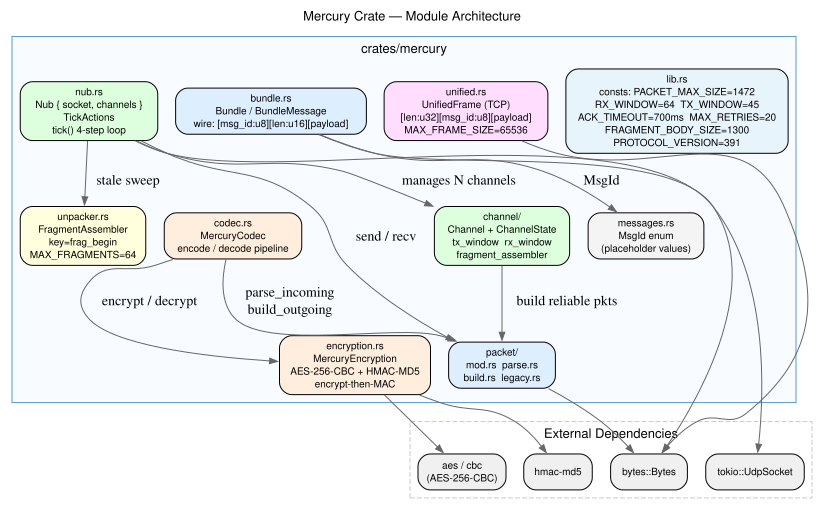

*Figure 1: the Rust crate that mirrors the Mercury wire format — `nub.rs` owns the UDP socket and channel table, `codec.rs` runs encode/decode, `encryption.rs` applies the AES-256-CBC + HMAC-MD5 filter, and `packet/`, `bundle.rs`, and `channel/` carry the wire-format invariants from this chapter.*

A Mercury packet is the contents of a single UDP datagram. The on-wire layout is three concatenated regions:

```text
+---------+--------------------------------------------+---------+
|  flags  |          message body (interface           | footer  |
| (1 B)   |  elements packed end-to-end)               | (var)   |
+---------+--------------------------------------------+---------+
   ^                                                       ^
   |                                                       |
  read forward from offset 0                  read backward from end of datagram
```

The packet flags byte at offset 0 is the *only* field at a fixed position. Every other field — sequence number, ack count, ack list, fragment IDs, first-request-offset — lives in a variable-width footer parsed *backward* from the end of the datagram, gated on bits in the flags byte. The message body fills the space between flags and the consumed footer tail.

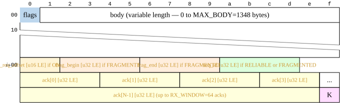

*Figure 2: the full UDP datagram layout with the conditional footer stack shown — `first_req_offset`, `frag_begin`, `frag_end`, `seq_id`, ack array, and `ackCount` are each appended only when their flag bit is set.*

**Maximum packet size**: `0x5AD` bytes (1453). Stamped as the per-packet space check in `Mercury::Bundle::newMessage`[^bundle-new-message] — a message that does not fit triggers `Bundle::reserve`[^bundle-reserve] to allocate a new packet, and the bundle fragments across packets when the bundle's total exceeds 64 packets (`Packet::MaxFragmentsPerBundle`)[^v5-mercury-internals]. A derivation of 1453 from Ethernet/IP/UDP/cipher-tag overhead is not in the V5 record; treat the value as the binary's stamped cap, not as a network-layer calculation.

(The flags byte is also stored at in-memory offset `+0x54` of the `Mercury::Packet` struct[^v5-mercury-internals]. That offset is an artifact of the in-memory struct layout; on the wire the flags byte unconditionally occupies byte offset 0 of the datagram. Do not treat `+0x54` as a wire-format claim.)

**Worked example.** A reliable, sequenced, fragmented bundle's first packet — flags byte `0xB8` (`0x80 | 0x20 | 0x10 | 0x08` = `FLAG_IS_FRAGMENT | FLAG_HAS_SEQUENCE_NUMBER | FLAG_IS_RELIABLE | FLAG_ON_CHANNEL`) — has the following on-wire shape. Bytes are shown in **wire order** (low offset → high offset). Pop order is the reverse — see the explicit pop-order callout below:

```text
WIRE ORDER (low offset → high offset, as transmitted):

byte 0:         0xB8                           ← flags (FLAG_IS_FRAGMENT|...)
byte 1..N:      [interface element calls]      ← message body, packed end-to-end
byte N+1..N+4:  sequenceId       (u32 LE)      ← written first by Bundle::finalise
byte N+5..N+8:  lastFragmentId   (u32 LE)
byte N+9..N+12: firstFragmentId  (u32 LE)      ← written last; sits at end of datagram

POP ORDER on receive (from end of datagram, moving toward byte 0):

  1. pop firstFragmentId  (last on wire = first popped)
  2. pop lastFragmentId
  3. pop sequenceId       (first on wire = last popped)
```

Pop order is the **inverse** of the wire order because every footer field is read backward from the end of the datagram — the last field appended is the first field consumed. See §1.3 for the full peel-order rules.

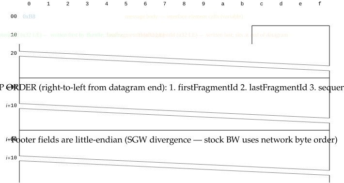

*Figure 3: the worked example as a byte-anchored layout — `flags = 0xB8` at offset 0, the variable-length message body, then the three footer fields appended in flag-bit order (`sequenceId`, `lastFragmentId`, `firstFragmentId`) so the field written last by `Bundle::finalise` sits at the very end of the datagram.*

A non-fragmented unreliable position-update packet — flags byte `0x28` (`0x20 | 0x08` = `FLAG_HAS_SEQUENCE_NUMBER | FLAG_ON_CHANNEL`) — has only the 4-byte sequence ID in its footer. A purely unreliable broadcast — flags byte `0x00` — has no footer at all; the entire packet is `[0x00][body]`. The flags byte's bits are the contract: setting bit N obligates the sender to append a specific footer field at the end and the receiver to pop that field on parse.

**Divergence from stock BigWorld 2.0.1.** Stock BW uses a `uint16` flags field at the front of the packet (2 bytes, network-byte-order)[^stockbw-packet-hpp]. SGW collapses this to a `uint8` (1 byte)[^v5-mercury-internals]. The low byte of stock BW's `uint16` carries flags 0x01–0x80; the high byte carries 0x0100 (`FLAG_HAS_CHECKSUM`), 0x0200 (`FLAG_CREATE_CHANNEL`), and 0x0400 (`FLAG_HAS_CUMULATIVE_ACK`). SGW omits all three: no CRC32 checksum, no create-channel marker, no cumulative-ack mechanism. The full divergence inventory is in §1.13.

### 1.2 Header (the packet flags byte)


*Figure 4: the 8-bit Mercury flags byte at the front of every packet — each bit controls whether a corresponding footer field is appended at the tail.*

> **Note:** Diagram bit assignments lag the chapter — to be re-rendered with corrected DSL.

The flags byte is the gate for the entire packet shape. Eight bits, mapped exactly to stock BigWorld's low byte:

| Bit | Mask | Flag | Triggers (on send) | Triggers (on receive) |
|----:|------|---|---|---|
| 0 | `0x01` | `FLAG_HAS_FIRST_REQUEST_OFFSET` | Bundle contains at least one request message | Reader pops a `uint16 firstRequestOffset` from the footer |
| 1 | `0x02` | `FLAG_HAS_PIGGYBACKS` | A previously sent reliable packet is being retransmitted inline | Reader processes piggybacked sub-packets before main body |
| 2 | `0x04` | `FLAG_HAS_ACKS` | One or more reliable packets are being acknowledged | Reader pops `uint8 ack_count` then `ack_count * uint32` from the footer |
| 3 | `0x08` | `FLAG_ON_CHANNEL` | Packet is bound to a registered Mercury channel | Reader routes to the channel's `processFilteredPacket` |
| 4 | `0x10` | `FLAG_IS_RELIABLE` | Packet requires acknowledgement; goes into the send window | Receiver schedules an ack for this packet |
| 5 | `0x20` | `FLAG_HAS_SEQUENCE_NUMBER` | Packet carries a sequence number for ordering / dedup | Reader pops `uint32 sequenceId` from the footer |
| 6 | `0x40` | `FLAG_HAS_REQUESTS` | Bundle contains request/reply messages | Reader uses the popped firstRequestOffset to walk request chain |
| 7 | `0x80` | `FLAG_IS_FRAGMENT` | Packet is one fragment of a larger bundle | Reader pops two `uint32` fragment IDs (begin, end) from the footer |

Source of truth: the flag-mask table in `Mercury::Nub::processFilteredPacket_inner`[^flags-decoder], which decodes each bit in order to peel the matching footer field off the back of the datagram. Bit 7 (`FLAG_IS_FRAGMENT`) is the largest peel because it consumes 8 bytes (two `uint32` fragment IDs). The decode order is the reverse of the bit order, because each peel shortens the buffer that the next peel reads from.

**Two flags are present in stock BW but absent in SGW.**[^v5-mercury-internals] `FLAG_HAS_CHECKSUM` (`0x0100` in stock BW's `uint16`) would compute a CRC32 over the packet contents — SGW drops the field because the HMAC-MD5 tag in the cipher envelope provides packet integrity at a higher layer. `FLAG_HAS_CUMULATIVE_ACK` (`0x0400`) would advertise a "all packets up to sequence N are acknowledged" optimization — SGW omits it because external (client-facing) Mercury channels never need it; cumulative acks in stock BW are an internal-channel feature.

**Indexed-channel routing is not available.** Stock BigWorld's `uint16` flags field carries `FLAG_INDEXED_CHANNEL` in its high byte (`0x0800`)[^stockbw-packet-hpp] — used to route a packet to one of many addressable channels on a single endpoint. SGW's 1-byte flags only retains the low-byte flags (`0x01`–`0x80`) and therefore has nowhere to put `FLAG_INDEXED_CHANNEL` — the indexed-channel-routing mechanism is simply absent from SGW's wire format. The SGW baseapp connection topology does not need it: one client owns one Mercury channel; routing happens via `ChannelInternal` lookup, not via a flag bit. Bit 7 in both stock BW and SGW unambiguously means `FLAG_IS_FRAGMENT`; the indexed-channel divergence is the *absent* high-byte flag, not a low-byte bit-7 collision.

**`FLAG_IS_RELIABLE` (bit 4) is the load-bearing flag for the entire reliability layer.** When set, the sender's `ChannelInternal` (the ~0x180-byte inner channel object)[^channel-internal-ctor] tracks the packet's sequence number in its **32-bit outstanding-ack bitmap** (covering up to 32 in-flight reliable packets at once) and starts a 700ms resend timer; the receiver schedules an ack via `UnAckedHandler::queueAckForPacket`[^queue-ack-for-packet]. When clear, the packet is fire-and-forget — used for position-update spam and unreliable bundle flushes. The reliability state machine does not use a fixed-size circular send-slot buffer; the 32-bit bitmap[^ack-bitmap] is the upper bound on outstanding sequence numbers.

### 1.3 Footer

The footer is the variable-width trailing region that carries reliability state, sequence ordering, and fragment boundaries. It is *parsed backward* from the end of the datagram — `processFilteredPacket_inner`[^flags-decoder] calls a sequence of `buf.pop()` operations starting from the tail, each one shrinking the buffer that the next field is popped from.[^v5-mercury-internals]

**Wire order** (top = closer to message body; bottom = end of datagram). The sender writes these fields in this order — bit 0 first, bit 7 last — so the highest-bit footer field sits at the very end of the datagram:

```text
WIRE ORDER (top = just past body, bottom = end of datagram):

┌─────────────────────────────────────────────────────────────────┐
│ if FLAG_HAS_FIRST_REQUEST_OFFSET:  firstRequestOffset (u16 LE)  │ ← written first
│ if FLAG_HAS_PIGGYBACKS:            piggyback chain (see §1.3.2) │
│ if FLAG_HAS_ACKS:                  ack list (see §1.3.1)        │
│ if FLAG_HAS_SEQUENCE_NUMBER:       sequenceId (u32 LE)          │
│ if FLAG_IS_FRAGMENT:               lastFragmentId (u32 LE)      │
│ if FLAG_IS_FRAGMENT:               firstFragmentId (u32 LE)     │ ← written last
└─────────────────────────────────────────────────────────────────┘
                                                ^
                                                |
                                          end of datagram
```

**Pop order on receive** is the *inverse* — the receiver reads each field from the *end* of the datagram backward, so the field that was written last is popped first:

```text
POP ORDER (from end of datagram, peeling toward body):

  1.  if FLAG_IS_FRAGMENT:                pop firstFragmentId  (u32 LE)
  2.  if FLAG_IS_FRAGMENT:                pop lastFragmentId   (u32 LE)
  3.  if FLAG_HAS_SEQUENCE_NUMBER:        pop sequenceId       (u32 LE)
  4.  if FLAG_HAS_ACKS:                   pop ack list         (see §1.3.1)
  5.  if FLAG_HAS_PIGGYBACKS:             pop piggyback chain  (see §1.3.2)
  6.  if FLAG_HAS_FIRST_REQUEST_OFFSET:   pop firstRequestOffset (u16 LE)
```

A sender writes flags byte first, then writes message body, then appends each footer field in flag-bit order. A receiver reads flags byte first, then pops each footer field in reverse flag-bit order — so the field that was *appended last* is popped *first*.

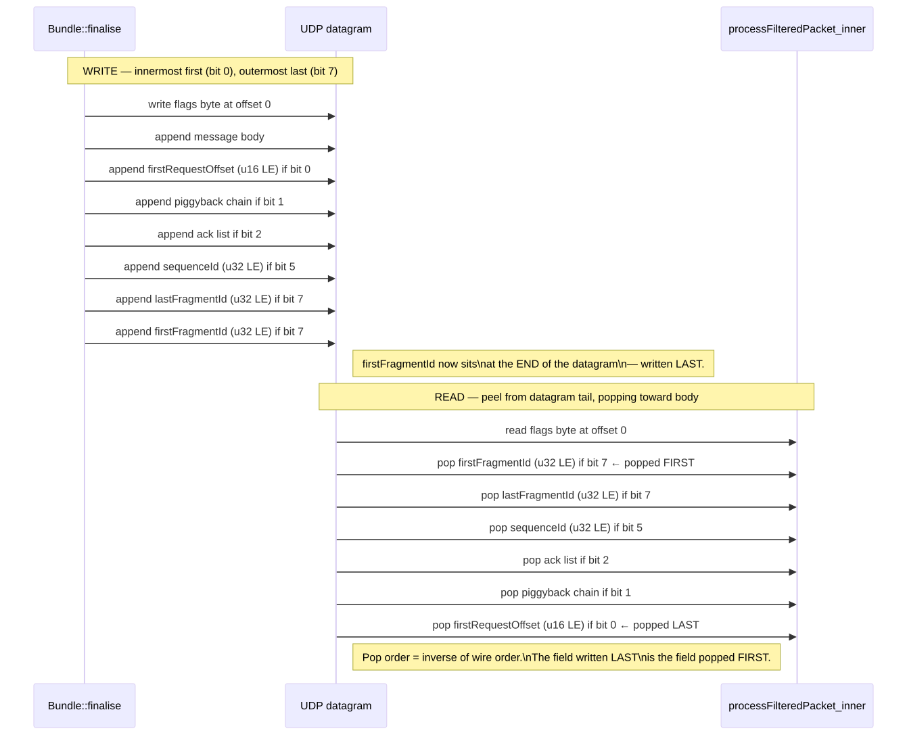

*Figure 5: the write-order / pop-order inversion as a temporal sequence — `Bundle::finalise` writes footer fields innermost first (bit 0 last-appended is bit 7), and `processFilteredPacket_inner` peels them from the datagram tail in reverse, so the field written last is the field popped first.*

**Request-chain walking** (`FLAG_HAS_FIRST_REQUEST_OFFSET` bit 0 + `FLAG_HAS_REQUESTS` bit 6). The two request-related flags work together as a header + index pair, not as orthogonal signals. Bit 6 (`FLAG_HAS_REQUESTS`) is the sender's promise "this packet contains at least one request message"; bit 0 (`FLAG_HAS_FIRST_REQUEST_OFFSET`) is the receiver's index "the first request's body starts at byte N of the message body." In practice the two bits are always set together: a packet with requests must carry the offset to find them, and a packet without requests has no offset to advertise. The Cimmeria reimplementation treats the two as an inseparable pair.

The reason both flags exist (rather than collapsing to one) is the receiver's walk pattern. Request messages form a *linked list inside the packet body*: each request's payload begins with a `u16 LE` offset field that points (as a byte offset relative to the message body start) to the next request in the packet, with `0` (zero) as the terminator sentinel. The receiver pops `firstRequestOffset` from the footer (gated on bit 0), seeks to that offset, parses the request, reads its inline 2-byte next-pointer, and repeats until it hits the zero sentinel.[^request-chain-walk]

This lets the receiver process requests in priority order *without* walking the entire message body sequentially — useful when a bundle contains many entity-method calls interleaved with a handful of requests, and the request-handling code path runs separately from the entity-method dispatch path. The linked-list mechanism is inherited from stock BigWorld[^stockbw-packet-cpp]; the SGW receive walk is anchored in `FUN_01579710`[^request-chain-walk] (iterator init reads `Packet+0x30` as `u16`) and `Mercury_Bundle_IteratorUnpack`[^request-chain-walk] (reads the inline next-offset at `payload_offset+4` as `u16`; reply header is 6 bytes total: `u32` replyID + `u16` next-offset). The sentinel value diverges from stock BW: SGW uses `0` (zero) because request positions are 1-based and zero can never be a valid offset, where stock BW used `0xFFFF`. The `FUN_0158a260` Packet initializer[^request-chain-walk] zeroes `+0xc` at construction, confirming zero is the terminator.


*Figure 6: the request-walk pattern — `firstRequestOffset` (popped from the footer) points to the first request's byte position in the message body; each request's body carries an inline next-pointer, terminated by a sentinel.*

#### 1.3.1 Ack list encoding

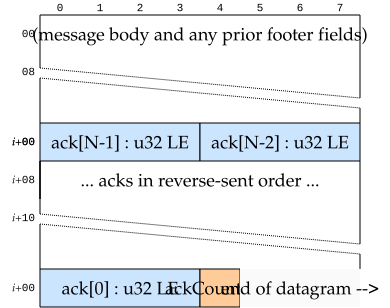

*Figure 7: the ack-list footer encoding at the tail of the datagram — the receiver pops `ackCount` (`u8`) first, then `ackCount × 4` bytes of `u32 LE` sequence IDs in reverse-sent order.*

When `FLAG_HAS_ACKS` is set, the ack list at the tail is:

```text
[ ack[N-1]: u32 LE ]   ← popped second
[ ack[N-2]: u32 LE ]
...
[ ack[0]:   u32 LE ]
[ ackCount: u8     ]   ← popped first
```

Each `ack[i]` is the sequence ID of a previously received reliable packet. The receiver pops `ackCount` first (1 byte), then pops `ackCount × 4` bytes as the ack array. The sender side mirrors this in `UnAckedHandler::buildAndSendAckBundle`[^ack-bitmap]: walks a 32-bit ack mask and writes each sequence ID into the bundle.

**Ack coalescing.** `ackCount` is a `u8`, so a single packet can carry at most 255 acks — a hard ceiling, not a practical one. The send path prefers to *piggyback* acks onto the next outgoing reliable bundle (whatever that bundle's primary purpose is — a game-level entity-method call, a position update, a control message) rather than emit a standalone ack-only packet, which keeps wire overhead minimal. When the send-alive timer at `ChannelInternal+0x16c` expires with pending acks but no game-level traffic to piggyback on, `UnAckedHandler::sendAckBundle2`[^send-ack-bundle2] (also referred to as `UnAckedHandler::sendAckBundle` in some V5 sources — `mercury-protocol-internals.md`'s "All Mercury Functions" table omits the `2` suffix while the same doc's Session 5b additions includes it[^v5-mercury-internals]; this chapter uses the suffixed name for disambiguation against any hypothetical sibling) builds an empty bundle with the `FLAG_IS_RELIABLE` flag set — see §1.7 for the keepalive role. The function "creates empty bundle, sets reliable flag, sends."[^v5-mercury-internals] The keepalive bundle does not itself need `FLAG_HAS_ACKS` set — its purpose is to force a reliable round-trip so the receiver acks the empty packet — but in practice any queued acks `Bundle::finalise` finds in `UnAckedHandler`'s 32-bit ack mask will piggyback onto the keepalive bundle's footer, which is why a wire capture of a keepalive packet usually shows both `FLAG_IS_RELIABLE` and `FLAG_HAS_ACKS` set together. The 32-bit ack mask in `UnAckedHandler` lets the implementation track up to 32 unsent acks before they must be flushed; in practice, latency keeps the typical queued-ack count well below that and well below the 255-byte wire ceiling.

#### 1.3.2 Piggyback chain encoding

Piggybacks are *whole previously-sent packets* embedded in the footer area of a new outgoing packet. Format inherited from stock BigWorld 2.0.1[^stockbw-packet-cpp]; both ends of the protocol parse the same wire bytes. Confidence: medium — `mercury-protocol-internals.md`[^v5-mercury-internals] confirms `FLAG_HAS_PIGGYBACKS` bit 1 exists and is honored at parse time, but does not enumerate the chain wire bytes; the layout below is the stock-BW reference structure and is presumed inherited because no SGW divergence is named:

```text
[ packet[N] data    : packet[N]_len bytes ]
[ packet[N] length  : int16 LE, NEGATIVE  ]  ← terminator (~length to recover)
[ packet[N-1] data  : ...                 ]
[ packet[N-1] length: int16 LE, POSITIVE  ]
...
[ packet[0] data    : ...                 ]
[ packet[0] length  : int16 LE, POSITIVE  ]
```

The negative-length marker (encoded as `~length` — bitwise NOT of the positive length) indicates the final piggyback in the chain. Each embedded packet has its own flags byte and is processed as if it had been received independently, *except* that its own footer cannot include acks/sequence/fragments — only the body matters. SGW's client emits piggybacks under the `FLAG_HAS_PIGGYBACKS` bit; SGW's server side accepts them.

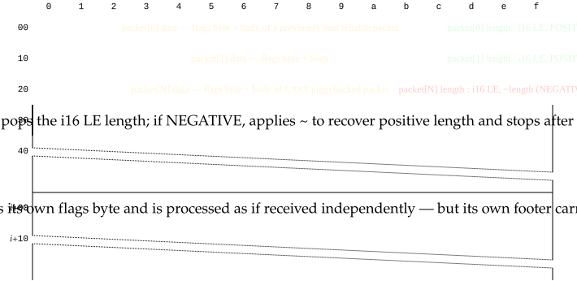

*Figure 8: the piggyback-chain layout — each entry is a previously sent packet's flags+body followed by an `i16 LE` length; the final entry's length is encoded as `~length` (bitwise NOT, producing a negative `i16`) which the receiver detects as the chain terminator.*

Confidence: medium for the SGW server side. The Cimmeria Rust implementation explicitly rejects piggybacks (`WARN_BAD_PACKET("Piggybacked packets are not supported")` per the existing `docs/protocol/mercury-wire-format.md`), and the SGW client does not appear to send them in observed pcaps. The format is well-documented in stock BW; whether SGW's deprecated C++ server ever generated piggybacks is a separate question for Section 3.

#### 1.3.3 Byte order

**Every multi-byte field in the SGW Mercury footer is little-endian.**[^v5-mercury-internals] Sequence IDs, ack sequence IDs, fragment IDs, first-request-offset — all little-endian. This is a direct SGW divergence from stock BigWorld, which writes the footer in network byte order via the `BW_HTONS` / `BW_HTONL` macros[^stockbw-packet-cpp].

**Divergence:**

| Field | Stock BigWorld 2.0.1 | SGW |
|---|---|---|
| Flags | `uint16` (2 bytes), network order | `uint8` (1 byte) |
| Sequence ID | `uint32`, network order | `uint32`, little-endian |
| Ack sequence ID | `uint32`, network order | `uint32`, little-endian |
| Fragment begin/end | `uint32`, network order | `uint32`, little-endian |
| First-request-offset | `uint16`, network order | `uint16`, little-endian |
| Channel ID/version (indexed) | Present | Omitted (no indexed channels) |
| CRC32 checksum | `FLAG_HAS_CHECKSUM` available | Omitted (HMAC-MD5 supersedes) |
| Cumulative ack | `FLAG_HAS_CUMULATIVE_ACK` available | Omitted |

This is one of the most consequential SGW divergences for any reimplementation: getting the footer byte order wrong produces silent packet drops because the HMAC validation will succeed on the cipher envelope but the parsed sequence/ack values will be nonsense, and packets will appear to land out-of-window. The cross-check is straightforward — emit a packet with a known sequence ID like `0x12345678` and verify it appears on the wire as `78 56 34 12`, not `12 34 56 78`.

### 1.4 Cipher envelope

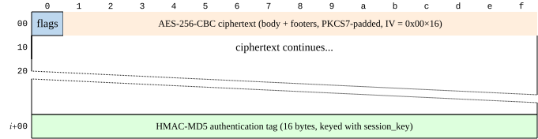

*Figure 9: the encrypted on-wire frame — the **entire plaintext packet** (flags byte + body + footer) is PKCS#7-padded and AES-256-CBC encrypted with a zero IV; the 16-byte HMAC-MD5 tag covers the ciphertext and is appended (encrypt-then-MAC). No part of the Mercury packet survives in cleartext on the wire.*

Every Mercury packet on the external (client-facing) channel is wrapped in AES-256-CBC then HMAC-MD5.[^v5-mercury-internals][^cryptopp-rtti] The wrapping is a `MessageFilter` layered above the wire format described above: the sender builds the plaintext packet (flags + body + footer) and the cipher envelope is applied as the very last step before `sendto()`.

**Wire order: encrypt-then-MAC.**

```text
[ AES-256-CBC ciphertext (PKCS#7-padded plaintext) ]  ← variable length
[ HMAC-MD5 tag (always 16 bytes, no truncation)    ]
```

The ciphertext is produced by `CryptoPP::StreamTransformationFilter`[^cipher-stream-filter] over the Mercury plaintext, then passed to `CryptoPP::HashFilter`[^cipher-hash-filter] which appends the HMAC-MD5 tag. The HMAC covers the ciphertext, not the plaintext.

**Worked example of cipher framing.** A 21-byte Mercury plaintext (e.g. a small `enableEntities` bundle: 1 flags byte + 1 msg_id byte + 8 dummy + 4 sequence ID + 4-byte ack = 18 bytes; padded toward 21 for example purposes) becomes:

```text
plaintext:        21 bytes
+PKCS#7 pad:      32 bytes  (pad to AES block boundary; pad value = 32 - 21 = 11)
AES-256-CBC →     32 bytes ciphertext  (same length as padded plaintext)
HMAC-MD5(ct) →    16 bytes tag        (appended after ciphertext)
on-wire frame:    48 bytes total: [32 B ct][16 B tag]
```

A 16-byte plaintext expands to **48 bytes too** (pads to 32 — PKCS#7 always pads, never zero-pads, so a 16-byte exact-block input gets a full 16-byte pad block appended). The cipher overhead is therefore a minimum of 17 bytes (1 byte of pad + 16-byte HMAC) and a maximum of 32 bytes (16-byte pad block + 16-byte HMAC) per packet. This is why the on-the-wire effective MTU is ~1456 bytes rather than the bare 1472 left by IP+UDP headers — the cipher envelope reserves room for itself.

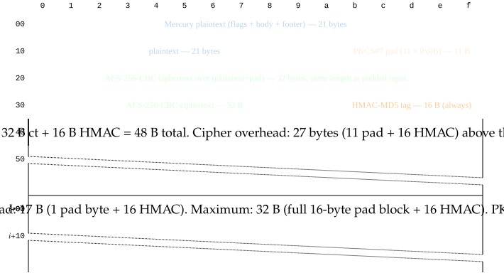

*Figure 10: the cipher framing math — 21-byte plaintext pads to 32 bytes (PKCS#7), AES-256-CBC produces a same-width 32-byte ciphertext, and the 16-byte HMAC-MD5 tag appends to a final 48-byte on-wire frame.*

**Key material — no KDF.** The 32-byte AES key and the 32-byte HMAC key are the *same buffer*. Both `PacketEncrypter::send`[^packet-encrypter-send] and `PacketEncrypter::recv`[^packet-encrypter-recv] read `GetCheckedArrayElement(this+0x08, 0, len)` for both the AES Rijndael key and the HMAC-MD5 key.

The key itself comes from the SOAP auth response (`SessionKey` attribute, 64-char hex string) and is decoded by the gSOAP `xsd:hexBinary` dispatcher[^gsoap-hex-dispatcher] (case `0x26` of the type dispatcher[^gsoap-type-dispatcher]). The decoded 32 bytes are passed *verbatim* to the `PacketEncrypter` constructor[^packet-encrypter-ctor] — no PBKDF, no salting, no SHA-style key stretching, no truncation.

**IV — literal zero, every packet.** The constructor stores 16 zero bytes at `PacketEncrypter+0x18` via `FUN_00a587f0(this+0x18, 0x10, null)` (null source → zero-filled).[^packet-encrypter-ctor] The IV buffer is read on every encrypt/decrypt call but is *never mutated*: the same zero IV is reused for every packet on the channel. This is a deliberate 2009 design choice; combined with PKCS#7 padding it produces a deterministic ciphertext for identical plaintexts but matches the wire-format invariant the SGW client expects.



*Figure 11: the encrypt pipeline (PKCS#7 pad → AES-256-CBC with zero IV → HMAC-MD5 over the ciphertext, appended) and the decrypt pipeline (split tag → HMAC verify → AES decrypt → PKCS#7 unpad).*

**Library: CryptoPP, not OpenSSL.** RTTI strings[^cryptopp-rtti] stamp `HMAC_Base@CryptoPP`, `HMAC@VMD5@Weak1@CryptoPP`, and friends. The Cimmeria `crates/mercury/src/encryption.rs` doc-comment that mentions "OpenSSL" is incorrect (the runtime uses RustCrypto, not OpenSSL either, but the binary it's emulating uses CryptoPP). The HMAC algorithm is the MD5 variant tagged as `Weak1` in CryptoPP's namespace — a 2009 design choice; modern code would not pair MD5 with HMAC.

**Cipher object layout.**

| Offset | Size | Field | Notes |
|---|---|---|---|
| `+0x00` | 4 | vtable | `0x01b27374`[^cipher-vtable] |
| `+0x04` | 4 | ref_count | `SafeReferenceCount` base |
| `+0x08` | var | `key_buf` | `std::vector`-like ptr/end/capacity; holds the 32-byte key (AES + HMAC) |
| `+0x18` | var | `iv_buf` | `std::vector`-like ptr/end/capacity; holds 16 zero bytes (re-read every packet) |

The vtable is stamped[^cipher-vtable] with four slots:

| Slot | Address | Role |
|---|---|---|
| 0 | `0x01604ac0`[^cipher-vtable-dtor] | Destructor |
| 1 | `0x01603b80`[^packet-encrypter-send] | `send` — encrypt outgoing packet |
| 2 | `0x01603fa0`[^packet-encrypter-recv] | `recv` — decrypt incoming packet |
| 3 | `0x016039a0`[^cipher-vtable-blocksize] | Returns `0x1f` (31) — likely `OptimalBlockSize` |

**Divergence from stock BigWorld 2.0.1.** Stock BW uses Blowfish ECB with XOR chaining, 8-byte blocks, a `0xdeadbeef` magic prefix, and a wastage byte.[^stockbw-encryption] None of that applies to SGW. The SGW cipher chain is a wholesale replacement, not a parameter tweak. The stock BW encryption code in `external/BigWorld-2.0.1/src/lib/network/encryption_filter.cpp`[^stockbw-encryption] is irrelevant for SGW emulation.



*Figure 12: the codec's encode and decode pipelines — encode writes the flags byte, the body, and appends footers innermost-first before optionally handing to the cipher; decode reverses, stripping footers outermost-first.*

### 1.5 InterfaceElement length encoding

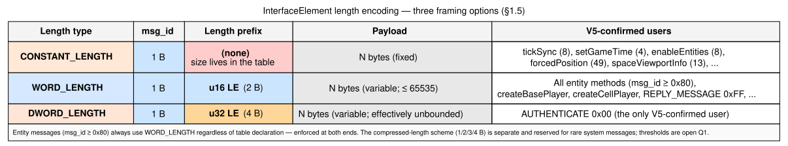

*Figure 13: the three length-framing options the `InterfaceElement` descriptor selects — `CONSTANT_LENGTH` writes nothing on the wire (size lives in the table), `WORD_LENGTH` writes a `u16 LE` prefix, `DWORD_LENGTH` writes a `u32 LE` prefix; entity messages override the table and always use `WORD_LENGTH`.*

A Mercury bundle is a sequence of *interface element calls*. Each call is one entry of the form `[msg_id: u8][length-prefix][payload]`, where the length-prefix encoding is determined by the `InterfaceElement` registered for that `msg_id`. Three length formats exist:

| Format name | Length field width | When |
|---|---|---|
| `CONSTANT_LENGTH` | 0 bytes (implicit) | Fixed-size payload known from the message table |
| `WORD_LENGTH` | 2 bytes (`u16` LE) | Variable-size payload, typical entity-method call (and `REPLY_MESSAGE 0xFF`)[^v5-space-viewport] |
| `DWORD_LENGTH` | 4 bytes (`u32` LE) | Variable-size payload; the only V5-confirmed user is `AUTHENTICATE` (msg_id `0x00`, see §1.10.7) |

The `InterfaceElement` table is a static array of fixed-size descriptor entries.[^v5-mercury-internals] At runtime, the Nub builds a parallel array of smaller runtime entries indexed directly by `msg_id`, populated from the static array. The runtime entries are read by `Mercury::Nub::processOrderedPacket`[^process-ordered-packet] on every incoming message. The SGW binary uses two distinct strides: **`0x1c` (28 bytes)** for the vec storage form and **`0x24` (36 bytes)** for the dispatch table form.[^interface-element-size] The vec stride is confirmed by `InterfaceElementVec__pushBack`[^interface-element-size] (`(end - begin) / 0x1c` size computation and `end += 0x1c` push step). The dispatch stride is confirmed by `Mercury_Nub_ProcessOrderedPacket`[^interface-element-size] (`nMsgIndex * 0x24` array index and `/ 0x24` bounds check). The `0x24` value matches the stock BigWorld 2.0.1 "static descriptor"[^stockbw-interfaces] convention; the `0x1c` value is SGW's tighter vec-element form. The earlier chapter drafts that cited `0x90` (144 bytes) were repeating a stock-BW size that does not match any allocation site found in SGW — that claim is dropped.

**Static vs runtime layout, side by side.** The static `InterfaceElement` entries carry the full message descriptor — name string, length type, payload-size hint, handler pointer, reliability flag, encryption-required flag, and assorted metadata. At Nub initialization, the static entries are *projected* into a smaller runtime form keyed by `msg_id`: only the runtime-hot fields are kept (`lengthType`, `lengthValue`, `handler*`, `isEntityMessage` flag). The runtime array's index is the `msg_id` byte itself, so a dispatch is a single `nub->elements[msg_id]` load — no name-based lookup, no hash. The 256 `msg_id` slots map: 0x00–0x7F to system-message slots, 0x80–0xFD to entity-method slots (with `0xBD` and `0xFD` reserved as the sub-slot extended-encoding sentinels), and `0xFF` to the reply-message slot. The runtime form's per-entry size is the same inherited-from-stock-BW value flagged above — not independently confirmed for SGW.

**Entity messages override the table.** Any message with `msg_id >= 0x80` is an entity-method or property message and *always* uses `WORD_LENGTH`, regardless of the table's declared length type for that ID. This is enforced in `BundleUnpacker::next` (decode side) and in `Mercury::Bundle::newMessage`[^bundle-new-message] (encode side).[^v5-system-protocol] The reason: entity messages carry their own variable-size argument list whose total size cannot be known statically.

**Compressed-length encoding for interface elements with extreme size variation.** A per-interface fixed-width length-prefix scheme exists for the rare case where a message's payload size is usually small (fits in 1 byte) but must occasionally extend to a wider field. The width — 1, 2, 3, or 4 bytes — is a **descriptor field on the `InterfaceElement` itself at struct offset `+0x4`**, set at registration time. The encoder unconditionally writes that many bytes; the decoder unconditionally reads that many bytes. There is no runtime-selected threshold sentinel.

The `InterfaceElement::compressLength` family handles read/write:

| Function | Role |
|---|---|
| `InterfaceElement::compressLength`[^compress-length-family] | Compute total length including the prefix width |
| `InterfaceElement::expandLength`[^compress-length-family] | Read length field at parse time — `switch(*(undefined4 *)((int)this + 4))` on cases 1/2/3/4 |
| `InterfaceElement::compressLength_write`[^compress-length-family] | Write length field at emit time — same `switch(*(undefined4 *)((int)this + 4))` shape with unconditional writes |

If the value to encode exceeds the natural capacity of the chosen width (`0xFF` for 1 byte, `0xFFFF` for 2 bytes, `0xFFFFFF` for 3 bytes), the overflow is handled by the packet-chain path[^compress-length-family] (the message gets split across packets in the bundle's packet chain) rather than by widening the prefix on the wire. The width is fixed per-interface, period.

Confidence: high. The Ghidra decompile of `compressLength_write` is `switch(*(undefined4 *)((int)this + 4))` with cases 1, 2, 3, 4 — each case writing exactly that many bytes — and `expandLength` mirrors the same switch shape on the read side.[^compress-length-family] Compare with `ProcessMessage::writeComponentsVarLen`[^write-components-varlen] (the MachineGuard component-ID encoder) which uses an actual runtime threshold (IDs `≤ 0xfe` write 1 byte, IDs `> 0xfe` write `0xff` prefix + 3 bytes); the InterfaceElement scheme is a different mechanism entirely.

Note that compressed-length encoding is *not* what entity messages use — entity messages always use `WORD_LENGTH` (the fixed 2-byte `u16` prefix). The compressed scheme is for system messages whose maximum-size envelope is large but whose typical-case size is small.

### 1.6 Mercury bundle

![Bundle layout — repeated `[msg_id][payload_len: u16 LE][payload]` entries, no count prefix](figures/mercury-08-bundle-format.svg)

*Figure 14: a Mercury bundle's wire layout — each `BundleMessage` is `[msg_id: u8][length prefix per InterfaceElement table][payload]`. The figure shows the `WORD_LENGTH` shape (`u16 LE`), which covers all entity-method calls and most variable-length system messages; `CONSTANT_LENGTH` messages omit the length prefix entirely (size lives in the table) and `DWORD_LENGTH` uses `u32 LE`. See §1.5 for the per-`InterfaceElement` framing rules. There is no count prefix at the bundle level; the reader walks until the buffer is exhausted.*

A *bundle* is the logical unit of reliability and the container for one or more interface-element messages. A bundle can span multiple packets via fragmentation; a packet always belongs to exactly one bundle.

**Bundle construction.** `Mercury::Bundle::Bundle`[^bundle-ctor] constructs an empty bundle. `Mercury::Bundle::clear`[^bundle-clear] resets state and allocates a fresh first packet. Messages are added via three entry points:

| Entry point | Role |
|---|---|
| `Bundle::newMessage`[^bundle-new-message] | Start new message — writes `msg_id`, computes header size, allocates new packet if needed |
| `Bundle::startMessage_fixed`[^bundle-start-msg-fixed] | Fixed-length message wrapper |
| `Bundle::startMessage_request`[^bundle-start-msg-request] | Request message — reserves space for the reply-ID + next-request-offset linked-list pointers |

After the header is written, `Bundle::addBlob`[^bundle-add-blob] copies payload bytes. When the current packet is full, `addBlob` auto-splits across packet boundaries, advancing to the next packet in the bundle's packet chain. The packet chain is the same `Mercury::Packet` linked-list traversed by `Packet::chain__stampSendTime`[^packet-chain-stamp-time].

**Finalization.** `Mercury::Bundle::finalise`[^bundle-finalise] walks the packet chain one final time: each packet's flags byte is updated to reflect what footer fields will be appended (sets `FLAG_HAS_SEQUENCE_NUMBER`, `FLAG_HAS_ACKS` if there are queued acks, `FLAG_IS_FRAGMENT` if the bundle spans more than one packet, etc.), and the footer fields are written in flag-bit order at the end of each packet. After `finalise`, the bundle is ready to be handed to `Mercury::Nub::send`[^nub-send].

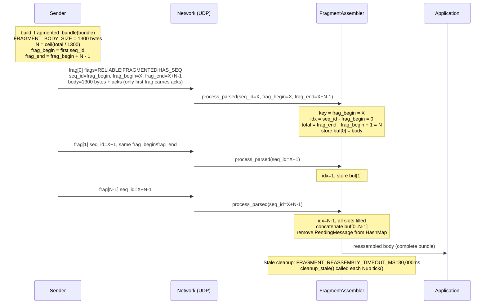

*Figure 15: the fragment-reassembly contract — sender stamps every fragment with the same `frag_begin`/`frag_end` (the bundle's first and last sequence IDs); receiver indexes slots by `seq_id − frag_begin` and concatenates when every slot is filled. The figure's bottom note (`FRAGMENT_REASSEMBLY_TIMEOUT_MS=30,000ms / cleanup_stale() called each Nub tick()`) is **stale** — Track B's Ghidra sweep found no periodic stale-sweep timer in the binary; stale abandonment is arrival-triggered (the next overlapping bundle from the same channel evicts the in-progress reassembly, log string at `0x01b18868`), with channel teardown also freeing incomplete reassemblies (`0x01b1a090`). The figure source will be re-rendered to match in a follow-up pass; see §1.7 and §2.10 S6 for the correction.*

**Fragmentation invariants.**

- Maximum packets per bundle: **64** (`Packet::MaxFragmentsPerBundle` from stock BW[^stockbw-packet-hpp]; matches SGW observed behavior[^v5-mercury-internals]).
- Each fragment carries `FLAG_IS_FRAGMENT` (bit 7) in its flags byte and two `uint32` fragment IDs in its footer: `firstFragmentId` (the sequence ID of the first packet in the bundle) and `lastFragmentId` (the sequence ID of the last packet). Both fragment IDs are identical across every fragment in the bundle — they describe the bundle's bounds, not the fragment's index.
- A fragment's own position in the bundle is derived from `sequenceId - firstFragmentId`.
- The receiver allocates a vector of `(lastFragmentId - firstFragmentId + 1)` slots when the first fragment arrives and fills slots by sequence ID. The bundle is reassembled when every slot is non-null (`BundleUnpacker::isComplete`).

**Outstanding-sequence tracking.** A reliable bundle's fragments each consume one bit in the channel's 32-bit outstanding-ack bitmap (see §1.7); the bitmap caps simultaneously-in-flight reliable sequence numbers at 32.[^ack-bitmap] In practice, bundles are tens of packets at most — the largest observed is the world-entry mapLoaded bundle at 27+ interface-element calls, which fits in ~5 packets — so the 32-bit ceiling is rarely a practical pressure point. The 512-entry hash table at `ChannelInternal+0x40/+0x44` (allocated by `FUN_0158c170`[^channel-hash-alloc]) is the *received*-sequence dedup table (mask `0x1FF`), not a send-side capacity bound — see §1.7 for the cross-reference.

### 1.7 Sequence numbers and reliability

Reliability is the most-modelled mechanism in Mercury; this section uses three coordinated views — the **bitmap** that holds outstanding-ack state, the **state machine** every reliable packet walks, and a **multi-packet sequence trace** that exercises the gap-fill and dedup-hit paths. Read all three together: the bitmap is the data structure, the FSM is the per-packet rule, and the sequence trace is what the wire actually looks like when packets reorder and drop.


*Figure 16: the channel's 32-bit outstanding-ack bitmap (`UnAckedHandler`) — each bit `n` corresponds to a sequence ID where `seq_id & 0x1F == n` and is set while that reliable packet is in-flight; the example shows seq 142 occupying bit 14 (`142 & 0x1F = 14`).*

Per-packet, that bit walks a small FSM as the packet moves from send to ack (or to disconnect):



*Figure 17: the per-packet reliability state machine — `Unsent` (bit unset) → `InFlight` (bit set, resend timer armed) → `AwaitingAck` (700 ms elapsed) → either `Acked` (`processAck` clears the bit) or `InFlight` again (retransmit, `retransmit_count++`) or `Disconnected` once `retransmit_count > 20` strict-greater fires.*

The bitmap and FSM compose on a real wire trace — multiple packets in flight, an out-of-order arrival, a retransmit, and a duplicate that hits the receive-side dedup hash:

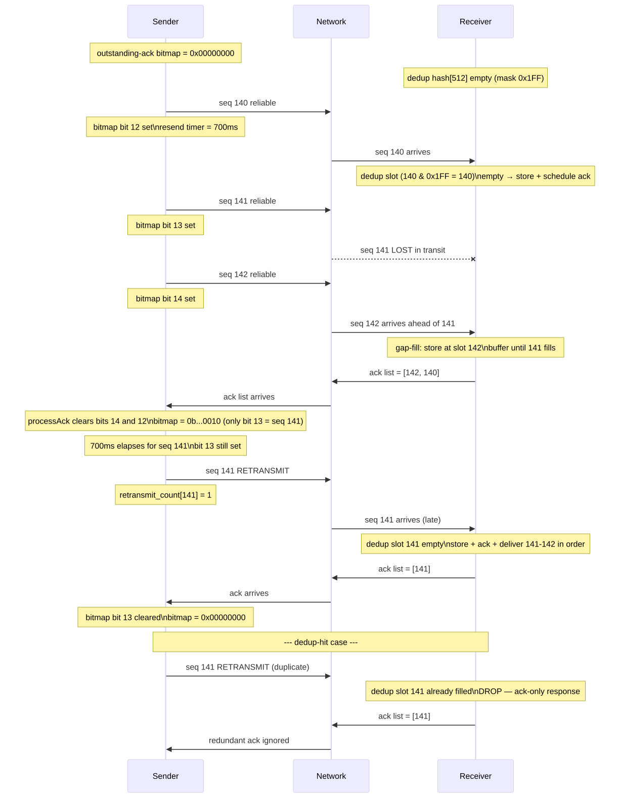

*Figure 18: a four-packet trace exercising the reliability stack — seqs 140/141/142 sent, 141 lost in transit, 142 arrives before 141 (gap-fill at receiver), 141's bit stays set until the 700 ms timer fires a retransmit, the dedup hash drops a duplicate retransmit on arrival.*

Mercury sequence numbers are **28-bit** (`SEQ_SIZE = 0x10000000`).[^v5-mercury-internals] The space is 256M sequence IDs before wrap; the wrap is handled by modular arithmetic in the comparison routines. A reliable packet's sequence ID is assigned by `Mercury::Channel::send`[^channel-send] from a monotonic per-channel counter.

| Constant | Value | Confidence |
|---|---|---|
| Sequence number mask[^v5-mercury-internals] | `0x0FFFFFFF` | high |
| Null sequence number[^v5-mercury-internals] | `0x10000000` | high |
| Lifetime retry cap[^v5-mercury-internals] | 20 | medium (inherited from stock BigWorld 2.0.1; SGW divergence not enumerated in V5; pcap verification of actual SGW retry cadence is a future task) |
| Per-tick resend work budget[^unacked-check-resend-timers] | 5.0 (IEEE 754 float at `ghidra://SGW.exe@0x01e91e00`) | high — float constant + comparison `if (_DAT_01e91e00 < local_20)` directly observed in `UnAckedHandler::checkResendTimers` |
| Ack timeout[^v5-mercury-internals] | 700 ms | medium (inherited from stock BigWorld 2.0.1; SGW divergence not enumerated in V5; pcap verification of actual SGW timeout cadence is a future task) |

`0x10000000` is the null-sentinel: a packet with this sequence ID has no sequence number assigned (used for unreliable bundles that don't go in the send window). Because `0x10000000` is the very next value above the 28-bit `0x0FFFFFFF` mask, no real sequence number can collide with the sentinel.

**Reliability state lives in `ChannelInternal`**, the ~0x180-byte inner channel object constructed at the channel-internal ctor[^channel-internal-ctor]. The mechanism is a **32-bit sliding bitmap of outstanding sequence numbers** plus a **512-entry hash table** for received-sequence deduplication.[^ack-bitmap] Entries are cleared by `processAck` when their sequence ID is acknowledged; a receiver's processing of incoming acks runs even when the incoming packet's own sequence ID is outside its receive window — this prevents lost acks from causing unbounded retransmissions.

The 512-entry hash table is allocated[^channel-hash-alloc] via `scalable_malloc(param_1 * 4 + 4)` = 2052 bytes for 512 pointer-sized entries; the mask `param_1 - 1 = 511 = 0x1FF` is stored at `ChannelInternal+0x44`. The hash is `seq_num & 0x1FF`. `Channel__ctor`[^channel-ctor] hardcodes the table size of `0x200` (512) at construction. The hash table is the *received-sequence dedup* structure; the 32-bit bitmap in `UnAckedHandler` is the *outstanding-send* structure. Earlier drafts of this chapter conflated the two as a single "send window" with a "45-slot" capacity — neither claim is V5-grounded, and both are dropped.


*Figure 19: the receive-side dedup hash — 512 pointer-sized slots indexed by `seq_id & 0x1FF`; on packet arrival the slot is checked, a stored-equal-incoming `seq_id` is a duplicate and is dropped after an ack, else the slot is filled and the packet delivered.*



*Figure 20: the per-channel state machine — the only run-time state that drops a channel is the retransmit-count strict-greater-than-`MAX_RETRIES` check; the inactivity timeout and keepalive timer are observed as soft pressure on that single transition.*

**Resend timing.** `ChannelInternal::checkAndSendNubException`[^check-nub-exception] runs the timer-driven resend logic. Five rdtsc-based timeout fields live in the channel object:[^check-nub-exception]

| Offset | Role |
|---|---|
| `+0x160` | Receive timeout threshold (rdtsc units) |
| `+0x164` | Receive timeout last-check timestamp |
| `+0x16c` | Send-alive timeout — triggers a keepalive ack bundle if no traffic |
| `+0x170` | Low 32 bits of a 64-bit rdtsc baseline timestamp marking the last relevant receive event |
| `+0x174` | High 32 bits of the same 64-bit rdtsc baseline |

The `+0x170` / `+0x174` pair is the receive-timeout baseline. `checkAndSendNubException`[^check-nub-exception] computes the elapsed-since-last-receive value with the textbook 64-bit-subtract-on-32-bit-ints pattern: `(iVar4 - *(int *)(this + 0x174)) - (uint)(uVar2 < *(uint *)(this + 0x170))` — high-half minus high-half, minus the borrow from the low-half compare. That value is compared against the threshold at `+0x164` / `+0x160` to decide whether the channel has gone idle long enough to warrant a keepalive or a teardown.

The constructor[^channel-internal-ctor] zeroes both halves (low at `0x0158c9d5`, high at `0x0158c9db`) at channel-init time. The per-packet write site is `FUN_0158bd10`[^rdtsc-write-site] — an `RDTSC` instruction followed by `MOV [ECX+0x170], EAX` / `MOV [ECX+0x174], EDX`. The function is called by `Nub__processPacketForChannel`[^rdtsc-write-site] on every received packet, which makes this the per-packet recv stamp. The same function also writes `+0x178` (received-packet counter) and `+0x17c` (received-byte accumulator) — two adjacent fields that earlier drafts did not document; see the layout note below. A second, lower-traffic write site at `FUN_0158bc50`[^rdtsc-write-site] also captures `rdtsc()` into the same fields but only when a timeout timer is being configured — not per-packet. Byte-pattern search for `MOV [reg+0x170]` across the Mercury range found exactly these two sites. Confidence on the field role (low/high halves of a 64-bit rdtsc baseline): high. Confidence on the write-site location: **high** — the earlier "near `0x015816a0`" hypothesis is falsified; the actual write site is in the channel-update path, not the dispatch path. `processIncomingPacketEntry`[^process-incoming-entry] stamps `+0x58 / +0x5c` (used for the send-alive check), not `+0x170 / +0x174` — that's an adjacent timing field, not the same one.

When the send-alive timer expires, `UnAckedHandler::sendAckBundle2`[^send-ack-bundle2] builds an empty bundle with the reliable flag set, just to keep the channel alive. This is the Mercury keepalive — not a separate keepalive packet type.

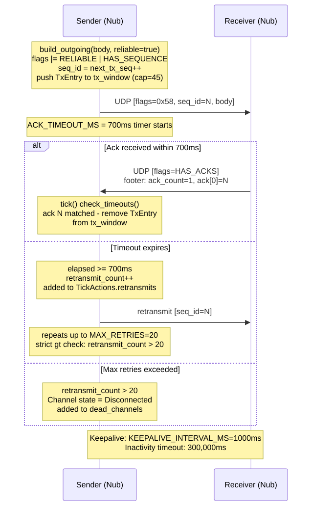

*Figure 21: the reliable-delivery contract from a single sender's perspective — a reliable packet sits in the outstanding bitmap until either an ack arrives, the 700 ms timer expires (retransmit, increment retransmit count), or the strict `> 20` retry check fires and the channel transitions to Disconnected.*

**Retry cap disambiguation.** Two distinct caps govern resends and they must not be conflated. **20 is the lifetime retry cap**: it gates the channel's transition to Disconnected when a single in-flight reliable packet has been resent more than 20 times without acknowledgement (the strict `> 20` check). **5.0 (IEEE 754 float at `ghidra://SGW.exe@0x01e91e00`) is the per-tick work budget**: `UnAckedHandler::checkResendTimers`[^unacked-check-resend-timers] iterates the unacked-packet list and stops processing further entries on the current tick once it has handled more than 5 — `if (_DAT_01e91e00 < (float)local_20)` falls out of the loop with `local_20` counting processed entries. This is throughput throttling, not lifetime gating; a packet that needs a sixth resend simply waits for the next tick. A reimplementation that treats either cap as the other will under-retry or over-retry depending on which conflation it picks. See §2.10 S7 for the gotcha framing.

### 1.8 Message dispatch



*Figure 22: how a one-byte `msg_id` selects its dispatch path — the range check splits system (`0x00–0x7F`), cell (`0x80–0xBD` with `0xBD` as extended sentinel), base (`0xC0–0xFD` with `0xFD` as extended sentinel), and reply (`0xFF`); cell calls carry an explicit entityId on the wire and base calls do not.*

After packet reassembly, each interface element message in the bundle is dispatched by `Mercury::Nub::processOrderedPacket`[^process-ordered-packet]. The dispatch is a single lookup against the runtime `InterfaceElement` array:

```text
InterfaceElement* elem = &nub->elements[msg_id];   // single array index by msg_id byte
elem->handler->handleMessage(msg);
```

The runtime entry size is medium confidence — see §1.5; the array-indexed-by-`msg_id`-byte dispatch shape is what V5 confirms, not the literal byte stride. A reimplementation can lay out the runtime array however it likes as long as `nub.elements[msg_id]` resolves to the right descriptor in O(1).

Three classes of message ID exist:

| Range | Class | Length encoding | Wire shape |
|---|---|---|---|
| `0x00 – 0x7F` | System messages (auth, sync, control) | Per-table (`CONSTANT_LENGTH` / `WORD_LENGTH` / `DWORD_LENGTH`) | `[msg_id][length?][payload]` |
| `0x80 – 0xBD` | Cell entity method calls (and `0xBD` extended) | Always `WORD_LENGTH` | `[msg_id][u16 length][u32 entityId][args]` |
| `0xC0 – 0xFD` | Base (proxy) entity method calls (and `0xFD` extended) | Always `WORD_LENGTH` | `[msg_id][u16 length][args]` (no entityId — see callout) |
| `0xFF` | Reply message | `WORD_LENGTH` | `[0xFF][u16 length][reply data]` |

**Cell vs base: only cell methods carry an entity ID on the wire.**[^v5-system-protocol] The client emits these two call shapes from distinct code paths:

- `ServerConnection_startEntityMessage`[^start-entity-message] (cell, `msg_id | 0x80`): writes the `msg_id`, then `*(uint32*)channel->reserve(4) = entityId` — the 4-byte entity ID lands on the wire as the first bytes of the message body.
- `ServerConnection_startProxyMessage`[^start-proxy-message] (base / proxy, `msg_id | 0xC0`): writes the `msg_id`, then **does not write an entity ID**. Base methods implicitly target the player's own base entity — the channel binds 1:1 to that entity, so there is nothing to disambiguate.

Cell entities can be many-per-connection (the player, vehicles, NPCs in AoI for client-controlled methods), so cell methods must name their target. Base entities are one-per-connection (the player's own base proxy), so the entity ID is redundant. Getting this wrong silently corrupts the first 4 bytes of any base-method argument list.

Entity messages: the first method's `msg_id` byte encodes the method index directly (`methodId | 0x80` for cell, `methodId | 0xC0` for base). For method indices `≥ 62` (`0x3E`), the encoding switches to *extended*: the `msg_id` byte is the sentinel `0xBD` (cell) or `0xFD` (base), and an extra `u8` carrying `sub_index = methodId - 62` follows the `entityId` field (cell) or the message header (base). Method index 62 is the first index that uses extended encoding (`msg_id = 0xBD` on the wire, `sub_index = 0` in the body). The disambiguation of `msg_id = 0xBD` between "direct method index 61" and "extended sentinel for index ≥ 62" is resolved at compile time by `EntityDescription_AssignClientMethodIds` based on the entity's total method count — if the entity has fewer than 62 methods total, the parser treats `0xBD` as a direct method index; if it has 62 or more, `0xBD` is unconditionally the sentinel and the next byte is `sub_index`.

The threshold = 62 claim is V5-confirmed[^v5-entity-property-sync]: `EntityDescription_AssignClientMethodIds`[^subslot-threshold] switches to sub-slot encoding when `methodCount >= 0x3e` (62). The same threshold appears in BigWorld 2.0.1's `entity_method_descriptions.cpp::checkExposedForSubSlots()`[^stockbw-method-desc]. The full sub-slot mechanism is canonized in `spec.engine.entity-description-parse-chain`; this chapter only canonizes the wire shape.

**Worked example — direct cell-method dispatch.** A call to `onStatUpdate` (cell method index 20) on entity ID `0xCAFEBABE` with 3 bytes of arguments:

```text
[0x94]                  ← msg_id = 20 | 0x80 = 0x94 (direct encoding, cell)
[0x07 0x00]             ← word_len = 7 (u16 LE)  — 4 bytes entityId + 3 bytes args
[0xBE 0xBA 0xFE 0xCA]   ← entityId = 0xCAFEBABE (u32 LE)
[arg0 arg1 arg2]        ← serialized args
```

**Worked example — extended cell-method dispatch.** A call to `onClientMapLoad` (cell method index 117 — above the 62 threshold) on the same entity:

```text
[0xBD]                  ← msg_id = 0xBD (extended-encoding sentinel for cell)
[len_lo len_hi]         ← word_len = 4 (entityId) + 1 (sub_index) + N (args)  — u16 LE
[0xBE 0xBA 0xFE 0xCA]   ← entityId = 0xCAFEBABE (u32 LE)
[0x37]                  ← sub_index = 117 - 62 = 55 (u8)
[args...]               ← serialized args
```

> [!NOTE] **Source-doc override.** `docs/reverse-engineering/findings/world-entry-pipeline.md`[^v5-world-entry] §"onClientMapLoad" tabulates `sub_index: u8 = 56` for method index 117 (computing `117 - 61`), which is off-by-one. The threshold is `0x3e = 62`, not 61 — confirmed by `entity-property-sync.md`[^v5-entity-property-sync] and by `external/BigWorld-2.0.1/src/.../entity_method_descriptions.cpp::checkExposedForSubSlots()`[^stockbw-method-desc]. The correct sub_index for method 117 is `117 - 62 = 55 = 0x37`, as the worked example above shows. The `world-entry-pipeline.md` value is a known transcription error inherited from an earlier (pre-W-entity-desc-B) draft and should be corrected when that doc is next revised.

**Worked example — direct base-method dispatch.** A call to `playCharacter` (base method index 4) with 3 bytes of arguments. Note the absence of an entity ID — base methods target the player's own base proxy implicitly:

```text
[0xC4]                  ← msg_id = 4 | 0xC0 = 0xC4 (direct encoding, base)
[0x03 0x00]             ← word_len = 3 (u16 LE)  — 3 bytes of args, no entityId
[arg0 arg1 arg2]        ← serialized args
```

The extended encoding costs 1 extra byte per call (the sub_index byte) and is required for any method whose index is 62 or higher. Roughly 96 of the 157 client methods on `SGWPlayer` use extended encoding because the parsed order pushes most actual gameplay methods past the threshold.

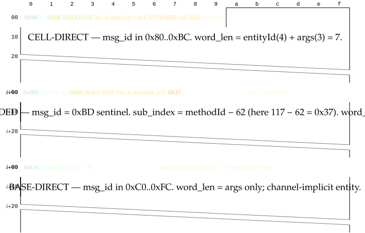

*Figure 23: the three dispatch shapes the worked examples above use — cell-direct (`0x80–0xBC`, msg_id + word_len + entityId + args), cell-extended (`0xBD` sentinel + word_len + entityId + sub_index + args), and base-direct (`0xC0–0xFC`, no entityId on the wire).*

**Reply messages** use `msg_id = 0xFF` (`REPLY_MESSAGE_IDENTIFIER`) with `WORD_LENGTH` (2-byte length prefix)[^v5-space-viewport]. The body is the connection-handshake reply payload — V5 marks this as a Mercury protocol-level message used during the initial connection handshake, not during normal gameplay. Matching of in-game request/reply pairs travels through `Mercury::Nub::handleMessage`[^nub-handle-message], but the V5 record does not enumerate a separate `replyId` field in the reply body — earlier drafts of this chapter assumed a stock-BW-style `[u32 length][u32 replyId]` shape that is not in the SGW evidence.

### 1.9 Control messages

A small set of system messages drives the connection's lifecycle. Each has a fixed `InterfaceElement` descriptor registered at static-init time and a binding to a specific server-side handler. The most consequential control round-trip is the RESET → ENABLE handshake that gates world entry:

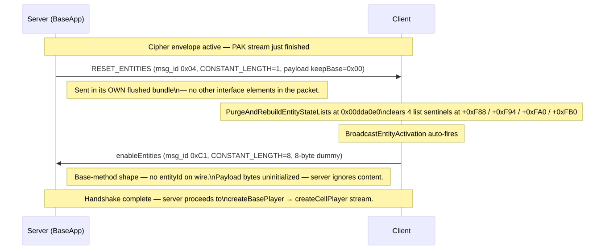

*Figure 24: the 2-message control handshake — server sends `RESET_ENTITIES` (`0x04`, `keepBase = 0`) in its own flushed bundle; the client's `PurgeAndRebuildEntityStateLists` clears the four list sentinels at `+0xF88 / +0xF94 / +0xFA0 / +0xFB0`, then `BroadcastEntityActivation` auto-emits `enableEntities` (`0xC1`, 8-byte body); the server proceeds with entity streaming.*

#### `enableEntities` (base method index 1, client → server)

`enableEntities` lives in this "Control messages" section because of its role in the world-entry handshake, but it is technically a base entity method by msg_id (`0xC1`, in the `0xC0`–`0xFD` range from §1.8's dispatch table). The generic base-method wire shape from §1.8 is `[msg_id][u16 word_len][args]` (no entity-ID prefix); `enableEntities` further specializes that via an `InterfaceElement` table override that pins it to `CONSTANT_LENGTH = 8` instead of `WORD_LENGTH`. Both `resetEntities` (msg_id `0x04`, a true system-range message) and `enableEntities` are reachable via the same logical world-entry handshake; their msg_ids land in different ranges as an artifact of which side originates each direction.

| Property | Value |
|---|---|
| Message ID | `0xC1` — *derived* from `1 \| 0xC0` per §1.8's base-method encoding rule. The derivation is convention-consistent (base method index 1 with the `0xC0` high-bit set) but is not independently wire-observed in current V5 evidence. Confidence: medium on the literal byte value; high on the method index (1) and the encoding rule. [citation needed — wire-capture verification would close the literal-byte question.] |
| Message size | **8 bytes** (`CONSTANT_LENGTH = 8`)[^enable-entities-init] |
| Payload | 8 bytes reserved by `startMessage_fixed`; the client does not appear to explicitly zero the buffer in V5 evidence. The server discards the payload contents (only the message arrival matters), so whether the bytes are zero, uninitialized, or stale bundle-allocator memory is not behaviorally observable from the wire. Confidence: medium on the payload-is-zero claim — earlier drafts named the field `uint64 dummy = 0`, but `world-entry-pipeline.md`[^v5-world-entry] only confirms that `BroadcastEntityActivation` calls `startMessage_fixed` and reserves `DAT_01ef2500->size` bytes in the bundle; no V5 evidence shows the client explicitly zeroing the reserved buffer. |
| Descriptor address | `DAT_01ef2500` |
| Initializer site | `ghidra://SGW.exe@0x017bade0`–`0x017bae07`[^enable-entities-init] |
| Initializer `PUSH` for size | `ghidra://SGW.exe@0x017bade9` (`PUSH 0x8`)[^enable-entities-init] |
| Sender (in client) | `ServerConnection::enableEntities` / `BroadcastEntityActivation`[^broadcast-entity-activation] |
| Sets flag | `bEntitiesEnabled` at `ServerConnection+0x316`[^v5-world-entry] |

This is the client→server signal that completes the world-entry handshake — the client tells the server "I've reset my entity state, start streaming entity creates." See `spec.world.world-entry` for the full RESET → ENABLE handshake.

**Divergence:** stock BigWorld 2.0.1's `enableEntities` carries 1 byte (`uint8 dummy`)[^stockbw-baseapp-ext]:

```cpp
MF_BEGIN_BLOCKABLE_PROXY_MSG( enableEntities )
    uint8   dummy;
END_STRUCT_MESSAGE();
```

SGW's `enableEntities` carries 8 bytes (`uint64 dummy`)[^cpp-messages]:

```cpp
{Message::CONSTANT_LENGTH, 8, "ENABLE_ENTITIES", true},
```

**This is the most-contested wire-format claim in the project's RE history.**[^v5-world-entry] A pre-V5 finding by W-misc-gaps initially concluded 1 byte by misreading the descriptor initializer (mistaking the `MOV DWORD PTR [EAX], 0x1` at `0x017badf7` — which writes a reliability flag into the stack-allocated argument struct — for the size field). W-enable-entities (2026-05-13) re-examined the disassembly context and confirmed the size field is the `PUSH 0x8` three instructions earlier at `0x017bade9`. The calibration check is to compare against the `resetEntities` initializer[^reset-entities-init], which uses the identical push pattern with `PUSH 0x1` at the same stack position — and `resetEntities` is documented and confirmed as 1-byte `keepBase`. The 8-byte SGW custom size is canon.

#### `resetEntities` (system message, server → client)

| Property | Value |
|---|---|
| Message ID | `0x04` |
| Length type | `CONSTANT_LENGTH = 1` |
| Payload | `uint8 keepBase` |
| Descriptor table site | `0x017bb210` (registration site) |
| Initializer | `ghidra://SGW.exe@0x017bb200`–`0x017bb225`[^reset-entities-init] |
| Handler in client | `PurgeAndRebuildEntityStateLists`[^purge-rebuild-handler] |

The server sends `resetEntities` to clear the client's entity-state lists; the client responds by clearing four linked-list sentinels at offsets `+0xF88`, `+0xF94`, `+0xFA0`, `+0xFB0` of its `ServerConnection` object, then auto-emits `enableEntities` via `BroadcastEntityActivation`[^broadcast-entity-activation]. This RESET → ENABLE round-trip is the wire-level boundary between world-entry phase 5 and phase 6 in `spec.world.world-entry`.

> [!NOTE] **Source-doc handler-name disagreement.** `docs/reverse-engineering/findings/system-protocol-wire-formats.md`[^v5-system-protocol] §"RESET_ENTITIES (0x04)" calls the handler at `0x00dda0e0` `Mercury__unknown_00dda0e0` — its raw decompile name. `docs/reverse-engineering/findings/world-entry-pipeline.md`[^v5-world-entry] calls the same function `PurgeAndRebuildEntityStateLists`, which is the role-derived name used in this chapter. Both names refer to the same Ghidra function at the same address; this chapter uses the role name because it conveys what the function does, but reviewers reading the system-protocol doc should know `Mercury__unknown_00dda0e0` and `PurgeAndRebuildEntityStateLists` are aliases for the same handler.

**Bundle-level constraint.**[^v5-entity-creation] The cited C++ pattern (`bundle.beginMessage(BASEMSG_RESET_ENTITIES, Bundle::FLUSH); bundle << (uint8_t)0;`) means `RESET_ENTITIES` must be sent in its own flushed bundle — the server explicitly flushes the current bundle before writing this message and flushes again immediately after, so the packet that carries `RESET_ENTITIES` carries no other messages. This is a wire-visible constraint: a packet containing `RESET_ENTITIES` should always have exactly that one interface element in its body.

#### `RESOURCE_FRAGMENT` (system message, msg_id `0x36`)



*Figure 25: the two RESOURCE_FRAGMENT delivery paths — the BASE_FLAG-set reassembly path (the observed normal-traffic case) chains fragment nodes and concatenates head-first on FINAL_FRAGMENT; the direct path acquires a semaphore and writes body bytes straight into a FILE handle.*

The byte layout each fragment carries:

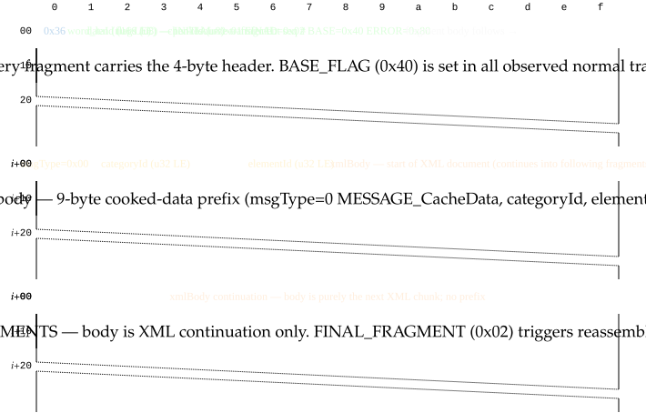

*Figure 26: every `RESOURCE_FRAGMENT` packet carries a 4-byte header (`dataId u16 LE`, `chunkId u8`, `flags u8`) followed by either the 9-byte cooked-data prefix + XML start (first fragment, `INITIAL_FRAGMENT` bit) or a raw XML continuation (subsequent fragments).*

Streams cooked-data resources (PAK fragments) from server to client. Each fragment carries one chunk of a resource that the client reassembles before passing the whole resource to the cooked-data pipeline. Full byte-level layout is canonized in `space-viewport-wire-formats.md` §"RESOURCE_FRAGMENT (0x36)"[^v5-space-viewport].

| Property | Value |
|---|---|
| Message ID | `0x36` |
| Length type | `WORD_LENGTH` (`u16` LE length prefix) |
| Handler in client | `ServerConnection_resourceFragment`[^resource-fragment-handler] |
| Max fragment body | 1000 bytes (`FragmentSize` constant)[^v5-space-viewport] |
| Delivery CME event | `Event_Net_ProxyData` (callback ctor)[^event-net-proxy-data] |

**Header — present on every fragment** (4 bytes):

```text
[dataId:  u16 LE]      2 bytes — per-resource transfer ID (increments per sendResource call)
[chunkId: u8]          1 byte  — fragment sequence number (0, 1, 2, …)
[flags:   u8]          1 byte  — bitfield (see below)
```

**Flags byte bits**:[^v5-space-viewport]

| Bit | Mask | Name | Meaning |
|---:|---|---|---|
| 0 | `0x01` | `INITIAL_FRAGMENT` | First fragment of a resource |
| 1 | `0x02` | `FINAL_FRAGMENT` | Last fragment of a resource |
| 6 | `0x40` | `BASE_FLAG` | Always set in observed traffic (selects the fragment-reassembly path inside the handler — see below) |
| 7 | `0x80` | `ERROR_FLAG` | Resource error (client sets status `0xFF`) |

**Body — first fragment only** (after the 4-byte header):

```text
[messageType: u8 = 0]   1 byte — always 0 (MESSAGE_CacheData)
[categoryId:  u32 LE]   4 bytes — resource category index (see below)
[elementId:   u32 LE]   4 bytes — resource identifier (e.g. item def ID)
[xmlBody:     bytes]    var    — start of XML document
```

**Body — subsequent fragments** (after the 4-byte header):

```text
[xmlBody: bytes]        var    — continuation of XML document
```

**Two code paths** in the client handler[^resource-fragment-handler]:

1. **With `BASE_FLAG` (0x40) set** — fragment reassembly path. The client allocates fragment nodes (each `11 + bodySize` bytes), chains them in receive order per `dataId`, and triggers reassembly when `FINAL_FRAGMENT` arrives. Reassembled bytes are concatenated in reverse order (the linked list builds head-first) and delivered to the resource handler via `this+0x168 vtable[0x38]`.
2. **Without `BASE_FLAG`** — direct delivery path. Uses semaphore-based synchronization, writes fragment bytes to a `FILE` handle, releases the semaphore on completion.

**Resource category IDs** (`categoryId` field, first-fragment body) — 21 categories[^v5-space-viewport]:

| ID | Category | ID | Category | ID | Category |
|---:|---|---:|---|---:|---|
| 1 | `kismet_event_sequence` | 8 | `interaction_set_map` | 15 | `blueprint` |
| 2 | `ability` | 9 | `effect` | 16 | `applied_science` |
| 3 | `mission` | 10 | `text` | 17 | `discipline` |
| 4 | `item` | 11 | `error_text` | 18 | `racial_paradigm` |
| 5 | `dialog` | 12 | `world_info` | 19 | `special_words` |
| 6 | `kismet_event_set` | 13 | `stargate` | 20 | `interaction` |
| 7 | `char_creation` | 14 | `container` | | |

(ID 0 is reserved.) Confidence: high — V5-confirmed via Ghidra decompilation of the handler[^resource-fragment-handler] plus the category-ID enumeration[^v5-space-viewport].

#### Reply messages (`msg_id = 0xFF`)

```text
[0xFF: u8] [length: u16 LE] [reply data: bytes]
```

`REPLY_MESSAGE` is `WORD_LENGTH` (2-byte `u16` length prefix), not `DWORD_LENGTH`.[^v5-space-viewport] The V5 doc characterizes the message as "a Mercury protocol-level message used during the initial connection handshake, not during normal gameplay." No separate `replyId` field is documented inside the reply body for SGW — the request/reply pairing for stock BigWorld's `BW_HTONL`-encoded reply IDs is not surfaced as a distinct field in the V5 evidence.

The next-request-offset linked-list in the request packet's footer (`FLAG_HAS_FIRST_REQUEST_OFFSET` at bit 0, `firstRequestOffset` field in the footer) lets the receiver walk all request messages in a packet without having to look at message bodies. Matching of those requests with their replies travels through `Mercury::Nub::handleMessage`[^nub-handle-message]; the exact wire shape of in-game (post-handshake) reply bodies — if any are emitted at all in SGW's running protocol — is not enumerated in the current V5 record.

#### 1.9.1 `bandwidthNotification` (server → client, msg_id `0x01`)

The advertised maximum bandwidth from server to client. SGW does not consume the value — there is no bandwidth mutator in the SGW client — but the message is still emitted by `messages.cpp` and decoded by the client, so reimplementations must produce a byte-correct packet to match the registered descriptor.

| Property | Value |
|---|---|
| Message ID | `0x01` |
| Length type | `CONSTANT_LENGTH = 4` |
| Payload size | 4 bytes (no length prefix on the wire — fixed) |
| Handler in client | `ClientMessageHandler<bandwidthNotificationArgs>` (RTTI at `0x01e52088`)[^v5-space-viewport] |
| Trigger (server) | During connection setup, before entity-system init |
| Notable behavior | Not used by SGW — the client has no bandwidth mutator wired up |

**Wire layout**:[^v5-space-viewport]

```text
[msg_id:    0x01]    1 byte
[bandwidth: u32 LE]  4 bytes  — max bandwidth in bps (server source: `messages.cpp:134` writes a single u32)
```

The server's emit site at `messages.cpp:134`[^cpp-messages] is a single `bundle << (uint32_t)bandwidth;` write. SGW carries the message through the dispatch table for parity with stock BigWorld but the templated handler at RTTI `0x01e52088` has no game-layer side effect — the value is read off the wire and discarded.

Confidence: high for the wire layout and length type; high for the "not used by SGW" claim per `space-viewport-wire-formats.md`[^v5-space-viewport] which states "Not used by SGW (no bandwidth mutator)".

#### 1.9.2 `updateFrequencyNotification` (server → client, msg_id `0x02`)

The server's tick resolution advertised to the client at connection setup. The single byte encodes the server tick rate as ticks-per-second (typically 10 for a 100ms tick interval). Sent once per connection, first message after the connection is established.

| Property | Value |
|---|---|
| Message ID | `0x02` |
| Length type | `CONSTANT_LENGTH = 1` |
| Payload size | 1 byte (no length prefix on the wire — fixed) |
| Handler in client | `ClientMessageHandler<updateFrequencyNotificationArgs>` (RTTI at `0x01e520e0`)[^v5-space-viewport] |
| Trigger (server) | First message after connection setup |

**Wire layout**:[^v5-space-viewport]

```text
[msg_id:     0x02]   1 byte
[resolution: u8]     1 byte  — ticks per second (typically `1000 / tickRate = 10`)
```

The server's emit site at `client_handler.cpp:46-53`[^cpp-client-handler] computes `uint8_t updateFreq = (1000 / CellManager::instance().tickRate());` and writes the result as a single byte. The client uses this to derive the size of the game-time delta carried by `TICK_SYNC` (§1.9.4) and `SET_GAME_TIME` (§1.9.3).

Confidence: high for the wire layout, length type, and tick-rate derivation (templated handler + explicit C++ emit source).

#### 1.9.3 `setGameTime` (server → client, msg_id `0x03`)

The current game-time tick counter, sent during the connection setup sequence (immediately after `TICK_SYNC` per `space-viewport-wire-formats.md`). The client snaps its local game clock to the advertised value so that subsequent `TICK_SYNC` deltas resolve correctly.

| Property | Value |
|---|---|
| Message ID | `0x03` |
| Length type | `CONSTANT_LENGTH = 4` |
| Payload size | 4 bytes (no length prefix on the wire — fixed) |
| Handler in client | `ClientMessageHandler<setGameTimeArgs>` (RTTI at `0x01e52138`; templated message)[^v5-system-protocol] |
| Descriptor table site | `0x017bb180` (registration site for `setGameTime`)[^v5-system-protocol] |
| Trigger (server) | During connection setup, immediately after `TICK_SYNC` |

**Wire layout**:[^v5-space-viewport]

```text
[msg_id:   0x03]      1 byte
[gameTime: u32 LE]    4 bytes  — current game time in ticks (resolution set by `updateFrequencyNotification`, §1.9.2)
```

The server's emit site at `client_handler.cpp:61-63`[^cpp-client-handler] is a single `bundle << (uint32_t)ticks;` write. Because SGW uses templated `ClientMessageHandler<setGameTimeArgs>` rather than a standalone named handler function, there is no Ghidra anchor for a handler-side decode — the dispatch is inlined and the arg struct is a direct memcpy of the 4 payload bytes.

Confidence: high for the wire layout and length type; high for the "immediately after `TICK_SYNC`" ordering[^v5-space-viewport].

#### 1.9.4 `tickSync` (server → client, msg_id `0x0D`)

Heartbeat sent at the configured tick rate (10 Hz default — every 100ms). Carries the current game-tick counter plus the tick interval in milliseconds, keeping the client's clock in sync with the server's tick scheduler. The message can be emitted on the unreliable channel if the server's `unreliable_tick_sync` config flag is set.

| Property | Value |
|---|---|
| Message ID | `0x0D` |
| Length type | `CONSTANT_LENGTH = 8` |
| Payload size | 8 bytes (no length prefix on the wire — fixed) |
| Handler in client | `ClientMessageHandler<tickSyncArgs>` (RTTI at `0x01e52270`; templated)[^v5-system-protocol] |
| Descriptor table site | `0x017bb720` (registration site for `tickSync`)[^v5-system-protocol] |
| Trigger (server) | Every game tick (10 Hz default); also sent on the unreliable channel if `unreliable_tick_sync = true` |

**Wire layout**:[^v5-entity-creation][^v5-space-viewport]

```text
[msg_id:   0x0D]     1 byte
[gameTime: u32 LE]   4 bytes  — current game tick counter
[tickRate: u32 LE]   4 bytes  — tick interval in milliseconds (typically 100 = 10 Hz)
```

The server's emit site at `client_handler.cpp:486-488`[^cpp-client-handler]:

```cpp
bundle.beginMessage(BASEMSG_TICK_SYNC);
bundle << (uint32_t)time << (uint32_t)CellManager::instance().tickRate();
bundle.endMessage();
```

The client uses the advertised `tickRate` to scale local game-side timing — animation playback, ability cooldowns, regeneration ticks. A reimplementation must emit a stable `tickRate` value across `TICK_SYNC` messages on the same channel; changing the tick rate mid-session would force the client to renormalize all pending timer state, and there is no V5 evidence that SGW ever does so.

Confidence: high for the wire layout, length type, and emit cadence.

#### 1.9.5 `restoreClient` (server → client, msg_id `0x34`)

The server tells the client to restore its local state to a previously known snapshot — entity ID, space, vehicle binding, position, velocity, direction. Used by the deprecated server during BaseApp restart or similar fault-recovery scenarios. Marked "Untested" in `space-viewport-wire-formats.md`[^v5-space-viewport]; the client decompile is documented but observed traffic does not include this message in normal gameplay.

| Property | Value |
|---|---|
| Message ID | `0x34` |
| Length type | `WORD_LENGTH` (`u16` LE length prefix) |
| Payload size | Variable; the canonical 48-byte body is documented below |
| Handler in client | `RehydrateClientFromMessage`[^restore-client-handler] (V5 alias: `ServerConnection_restoreClient`) |
| Trigger (server) | BaseApp / cell restoration (server-side fault recovery) |
| Notable behavior | Client auto-emits a `restoreClientAck` reply on receipt |

**Wire layout**:[^v5-system-protocol][^v5-space-viewport]

```text
[msg_id:    0x34]       1 byte
[word_len:  u16 LE]     2 bytes  (payload size; canonical = 48)
[entityId:  u32 LE]     4 bytes
[spaceId:   u32 LE]     4 bytes
[vehicleId: u32 LE]     4 bytes
[direction: 3 × f32 LE] 12 bytes  — direction Vec3 (X, Y, Z), read as one 12-byte block
[position:  3 × f32 LE] 12 bytes  — position Vec3 (X, Y, Z), read via `FUN_015846a0` (3 × `read(4)`)
[velocity:  3 × f32 LE] 12 bytes  — velocity Vec3 (X, Y, Z), the remainder of the stream after position
```

The handler[^restore-client-handler] reads the four scalars and two of the three Vec3s explicitly (`entityId`, `spaceId`, `vehicleId`, direction-block via `stream.read(12)`, position via `FUN_015846a0`[^rotation-reader]), and the trailing `velocity` Vec3 is what the client decompile[^v5-space-viewport] lists as the third Vec3 field at offset 36. Note that the V5 evidence for the read order is unambiguous (direction before position), but `space-viewport-wire-formats.md`'s table[^v5-space-viewport] labels the offsets `position, velocity, direction` in their byte order on the wire — both views are consistent: the wire byte order is `entityId, spaceId, vehicleId, direction, position, velocity` even though the C++ reader reads them in a different sequence.

**Auto-reply mechanic.**[^v5-system-protocol] The handler[^restore-client-handler] auto-emits a `restoreClientAck` message back to the server before returning:

```c
if (*(int*)(this + 0x30c) != 0) {
    channel = Mercury_Channel_2(this);
    channel->writeHeader(DAT_01ef250c);  // restoreClientAck message descriptor
    *(uint32*)channel->reserve(4) = 0;   // ack payload = 0 (single u32 zero)
    Mercury_Nub_7(this);                  // flush channel
}
```

The ack descriptor at `DAT_01ef250c`[^restore-client-ack-descriptor] carries a fixed 4-byte body whose payload is always `0u32` — the server uses the ack's *arrival* (not its contents) as the signal that the client has accepted the restore. A reimplementation must register the ack-reply path; emitting `RESTORE_CLIENT` to a Rust client that does not auto-reply will not crash the server but will leave the server's restore handshake permanently incomplete.

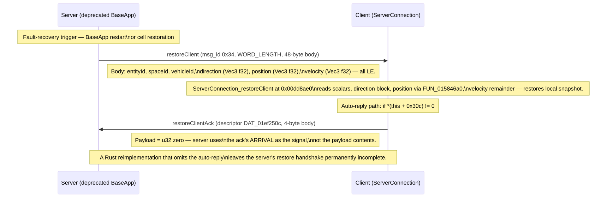

*Figure 27: the `restoreClient` round-trip — server sends the 48-byte snapshot, the client's handler at `0x00dd8ae0` restores local state, then unconditionally writes a 4-byte `restoreClientAck` (payload `u32 = 0`) back through `Mercury_Channel_2` and flushes; the server uses ack arrival, not its contents, as the completion signal.*

Confidence: high for the wire layout, length type, and auto-reply mechanic; medium for the SGW runtime emit path because the V5 record marks the message "Untested"[^v5-space-viewport] — the byte format is fully decompiled but observed pcaps of an actual restore scenario are not in the V5 record.

#### 1.9.6 `loggedOff` (server → client, msg_id `0x37`)

The server-initiated forced disconnect. The 1-byte payload carries the reason code, which the client logs and then tears down its connection without sending a courtesy DISCONNECT back.

| Property | Value |
|---|---|
| Message ID | `0x37` |
| Length type | `CONSTANT_LENGTH = 1` |
| Payload size | 1 byte (no length prefix on the wire — fixed) |
| Handler in client | `HandleServerDisconnect`[^logged-off-handler] (V5 alias: `ServerConnection_loggedOff`) |
| Trigger (server) | Forcible disconnect — admin kick, server shutdown, idle timeout, auth revocation |
| Notable behavior | Client tears down connection silently — `sendDisconnectMsg = false` in the call to the disconnect handler[^disconnect-handler] |

**Wire layout**:[^v5-space-viewport][^v5-system-protocol]

```text
[msg_id: 0x37]   1 byte
[reason: u8]     1 byte  — disconnect reason code
```

The handler decompile is short:

```c
void __fastcall ServerConnection_loggedOff(void *param_1)
{
    LOG("ServerConnection::loggedOff: The server has disconnected us. reason = %d\n");
    Mercury__unknown_00dd8630(param_1, '\0');  // disconnect(sendMsg = false)
}
```

The single-byte `reason` is read at `0x00dd8c2f` as `MOVZX EDX, byte ptr [ECX]` (zero-extended for the printf log)[^logged-off-handler] and discarded after logging — the client does not branch on the value. The disconnect handler[^disconnect-handler] destroys the connection object at `+0x30c`, frees pending resource requests, and clears the handler pointer at `+0x168`. The `\0` second argument means "do not send a DISCONNECT message back" — a reimplementation does not need to read a courtesy reply on this channel.

Confidence: high for the wire layout, length type, and "silent teardown" behavior.

### 1.10 Entity creation and position messages

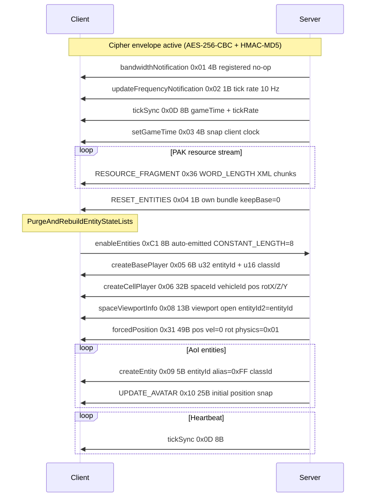

*Figure 28: the canonical world-entry conversation — cipher envelope is already active, the PAK stream lands first, then `RESET_ENTITIES` triggers the client's `enableEntities` reply, and the server streams `createBasePlayer` / `createCellPlayer` / `forcedPosition` plus per-entity creates.*

A small set of system messages carries the wire-level entity lifecycle: creating the player's base proxy, creating the cell proxy, attaching it to a space viewport, ghost-entity AoI creation, and the authoritative position-snap mechanism. Each has a fixed `InterfaceElement` descriptor and a Ghidra-anchored handler in the SGW client. The full canonical wire-formats live below; the entries in the §1.14 divergence consolidation table reference these subsections. Position/movement messages on the steady-state plane (`UPDATE_AVATAR` variants, `detailedPosition`) are canonized in §1.11.

> [!NOTE] **Scope note.** These messages are documented here because their wire bytes ride the Mercury packet envelope canonized in §§1.1–1.9 — they are part of the Mercury wire-format contract. The *semantic* role of each message (when the server sends it during world entry, what the client does with the result) is canonized in `spec.world.world-entry`. Treat this section as the byte-level reference and the world-entry chapter as the lifecycle reference.

#### 1.10.1 `createBasePlayer` — base proxy creation (server → client, msg_id `0x05`)

The first entity message the server sends after auth. Creates the player's base-side proxy object. The client uses the resulting `entityId` as the routing key for every subsequent entity-method call.

| Property | Value |
|---|---|
| Message ID | `0x05` |
| Length type | `WORD_LENGTH` |
| Payload size | 6 bytes (`word_len = 6`) |
| Handler in client | `ServerConnection_CreateBasePlayer`[^create-base-player-handler] |
| Trigger event (client) | `Event_NetOut_PlayCharacter` (CME string at `0x019bf4f8`)[^cme-playchar] |

**Wire layout**:[^v5-entity-creation][^v5-system-protocol]

```text
[msg_id:    0x05]        1 byte
[word_len:  u16 LE = 6]  2 bytes  (payload size)
[entityId:  u32 LE]      4 bytes  — player entity ID assigned by BaseApp
[classId:   u16 LE]      2 bytes  — entity class index (low byte = classId; high byte = 0 = propCount)
```

**`classId` width — settled at u16 from the client's read, with a layered server-source aside.** The client decompilation[^v5-system-protocol] is explicit: `PUSH 0x2; MOV ECX, ESI; CALL EAX; MOVZX EAX, word ptr [EAX]` — the handler[^create-base-player-handler] reads 2 bytes and zero-extends them as a `u16`. That is the wire contract.

The C++ server source visible in `entity-creation-wire-formats.md`[^v5-entity-creation] emits the same 2 bytes as `(uint8_t)classDef()->index() << (uint8_t)0` — a `u8 classId` followed by a `u8 propCount`. At world entry `propCount` is always 0, so the high byte of the `u16` the client reads is always 0, and the wire-level `u16` value equals the original `u8 classId`. Both descriptions are simultaneously true at different abstraction layers: the wire field is `u16`, and the server happens to compose it as `(u8 classId)(u8 propCount = 0)`. Earlier drafts of this chapter framed the two as competing interpretations; the V5 evidence resolves them as the same shape viewed from different ends of the pipe.

Confidence: high.

**Divergence from stock BigWorld 2.0.1.** Stock BW's `createBasePlayer`[^stockbw-baseapp-ext] carries an `EntityID entityID; EntityTypeID type;` pair where `EntityTypeID` is `uint16`. SGW's wire-level layout is identical — a `u32 entityId` followed by a `u16` class field. The divergence is not in the wire bytes but in the server's C++ emit style: SGW's server source writes the `u16` as two adjacent `u8` writes (`classId` then `propCount`) rather than a single `u16` write. The client decodes the same two bytes either way; this is a code-style divergence rather than a wire-format divergence. Roll-up entry in §1.13 reflects this.

**Out-of-order arrival is tolerated.** The client's `createBasePlayer` handler[^create-base-player-handler] checks `ServerConnection+0xfdc` (the `cellPlayerBuffer_` field)[^v5-system-protocol] for a buffered `createCellPlayer` message.[^v5-entity-creation] If `createCellPlayer` (msg_id `0x06`, see §1.10.2) arrived earlier in the same Mercury bundle — before the entity that `createCellPlayer` targets had been registered via `createBasePlayer` — the cell-side payload is stashed in `+0xfdc` and replayed once the base entity is registered. The debug string `"ServerConnection::createBasePlayer: Playing buffered createCellPlayer message"` is emitted when the buffered playback fires. This is a wire-format-relevant ordering invariant: a reimplementation that requires strict `createBasePlayer → createCellPlayer` arrival order on the wire is wrong; the protocol is robust to either order within a single bundle, and the client side handles the reorder. SGW's server typically emits the two in the canonical order (base before cell), so the buffering path is exercised mainly under packet loss + retransmission edge cases.

#### 1.10.2 `createCellPlayer` — cell proxy creation (server → client, msg_id `0x06`)

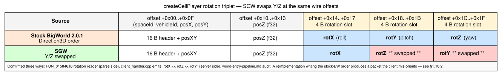

*Figure 29: at offsets `+0x14..+0x1F` the wire-slot order is `rotX, rotZ, rotY` — a deliberate divergence from stock BigWorld's `Direction3D` (`roll, pitch, yaw`) ordering, confirmed three ways at the parse side, server-emit side, and pipeline audit.*

The server sends this after the client emits `enableEntities` (see §1.9). Creates the player's cell-side proxy with its initial position, vehicle binding (always 0 at world entry), and orientation. The client's space viewport is bound to this entity.

| Property | Value |
|---|---|
| Message ID | `0x06` |
| Length type | `WORD_LENGTH` |
| Payload size | 32 bytes (`word_len = 32`) |
| Handler in client | `ServerConnection_CreateCellPlayer`[^create-cell-player-handler] |
| Rotation reader (internal) | `FUN_015846a0`[^rotation-reader] |

**Wire layout**:[^v5-world-entry]

```text
[msg_id:     0x06]        1 byte
[word_len:   u16 LE = 32] 2 bytes
[spaceId:    u32 LE]      4 bytes   — destination space identifier
[vehicleId:  u32 LE = 0]  4 bytes   — always 0 at world entry
[posX:       f32 LE]      4 bytes
[posY:       f32 LE]      4 bytes   — vertical
[posZ:       f32 LE]      4 bytes
[rotX:       f32 LE]      4 bytes   — pitch
[rotZ:       f32 LE]      4 bytes   — yaw    *** Y/Z SWAPPED ***
[rotY:       f32 LE]      4 bytes   — roll   *** Y/Z SWAPPED ***
```

**Y/Z rotation swap — confirmed.** SGW's rotation triplet is written in the order `rotX, rotZ, rotY` — a deliberate divergence from stock BigWorld's `Direction3D` ordering (`roll, pitch, yaw`). The swap is confirmed three ways:

1. `world-entry-pipeline.md` §"Audit Findings vs `world-entry-phases.md`"[^v5-world-entry]: "CREATE_CELL_PLAYER rotation: X, Z, Y (Y/Z swapped) — CONFIRMED via `FUN_015846a0` rotation reader."
2. The internal `FUN_015846a0` rotation reader[^rotation-reader] applies the X-Z-Y ordering at parse time (Ghidra-confirmed).
3. The legacy `deprecated/cpp/src/baseapp/mercury/sgw/client_handler.cpp`[^cpp-client-handler] pattern emits `rotX << rotZ << rotY` for this message, mirroring the same ordering at the server side.

Confidence: high.

**Divergence from stock BigWorld 2.0.1.** Stock BW's `createCellPlayer` writes a 3-float `Direction3D` (`roll, pitch, yaw`) at the end of the message. SGW swaps the Y and Z components in the wire stream — the field positions are identical (offsets `+0x14`, `+0x18`, `+0x1C` from start of position triplet), but the *semantic* assignment is `rotX → +0x14, rotZ → +0x18, rotY → +0x1C`. Any reimplementation that writes `roll, pitch, yaw` straight from a stock-BW-compatible buffer will produce a packet the SGW client mis-orients.

#### 1.10.3 `spaceData` — space metadata broadcast (server → client, msg_id `0x07`)

The server-pushed space metadata channel. Carries a `(spaceId, spaceEntryId, key, value)` tuple; the client stores or applies the (key, value) pair against the named space. **Unused in current SGW builds** — the V5 record marks this as superseded by `SGWPlayer.onClientMapLoad` (a cell-method RPC, not a system message). Documented here for completeness because the handler is still registered and the descriptor still sits in the dispatch table.

| Property | Value |
|---|---|
| Message ID | `0x07` |
| Length type | `WORD_LENGTH` (`u16` LE length prefix) |
| Payload size | Variable; minimum 14 bytes (header before the value string) |
| Handler in client | `ProcessSpaceDataMessage`[^space-data-handler] (V5 alias: `ServerConnection_spaceData`) |
| Notable behavior | Unused in current SGW builds[^v5-space-viewport] |

**Wire layout**:[^v5-space-viewport]

```text
[msg_id:       0x07]      1 byte
[word_len:     u16 LE]    2 bytes  (payload size; minimum 14, total varies with value-string length)
[spaceId:      u32 LE]    4 bytes  — space identifier
[spaceEntryId: u64 LE]    8 bytes  — space entry ID (read as two u32s by the handler)
[key:          u16 LE]    2 bytes  — space-data key
[value:        bytes]     var      — remaining payload bytes interpreted as the value string
```

The handler[^space-data-handler] reads the four scalars via four `stream.read(...)` calls (`read(4)` for `spaceId`, `read(8)` for `spaceEntryId`, `read(2)` for `key`) and then consumes the remaining bytes as the `value` string. The debug string `"ServerConnection::spaceData: space %d key %d"` is emitted on receipt. The C++ server source in `messages.cpp:189-190`[^cpp-messages] registers the message as `WORD_LENGTH` and documents the field set as `SpaceID, SpaceEntryID, Key, Value`.

Because SGW's running protocol replaces this message with the `onClientMapLoad` cell-method RPC, a reimplementation does not need to emit `spaceData` to drive any client-visible behavior. Pin to high confidence on the wire layout; high confidence on the "unused" status per the V5 doc; the precise circumstances under which the deprecated server *would* have emitted this message are not enumerated in V5 evidence and remain out of scope for this chapter.

#### 1.10.4 `spaceViewportInfo` — viewport binding (server → client, msg_id `0x08`)

Tells the client which entity (its own player) is bound to which space viewport. Sent in the same Mercury packet as `createCellPlayer` and `forcedPosition` (see `spec.world.world-entry` for the bundling).

| Property | Value |
|---|---|
| Message ID | `0x08` |
| Length type | `CONSTANT_LENGTH = 13` |
| Payload size | 13 bytes (no length prefix on the wire — fixed) |
| Handler in client | `ProcessSpaceViewportInfo`[^space-viewport-info-handler] (V5 alias: `ServerConnection_SpaceViewportInfo`) |

**Wire layout**:[^v5-entity-creation][^v5-space-viewport]

```text
[msg_id:     0x08]    1 byte
[entityId:   u32 LE]  4 bytes   — controlling entity ID (per C++ server source); client decompile labels this `field0` and notes "gate/unknown" — the semantic identity is inferred from server emit-side, not confirmed by client read-side
[entityId2:  u32 LE]  4 bytes   — viewport target entity ID (same as entityId when opening)
[spaceId:    u32 LE]  4 bytes   — space identifier
[viewportId: u8  = 0] 1 byte    — viewport index (always 0 in SGW)
```

**Decompile-level naming ambiguity.** The C++ server source[^v5-entity-creation] emits the first u32 as `entityId` (the controlling entity, typically the player). The client decompile of the handler[^space-viewport-info-handler] labels this field `field0 (u32) — gate/unknown` and treats it as opaque except for storage at `puVar5+0`. Wire-level byte position and width are unambiguous (`u32 LE` at offset 1); the semantic role is inherited from the server source rather than verified independently from the client side. The chapter uses the server-source label for clarity.

The two entity-ID fields are stock-BigWorld's *viewport-owner* + *viewport-target* pair: the owner is the entity owning the viewport (typically the local player); the target is the entity the viewport is anchored to (usually the same as the owner, but in stock BW different when one entity observes another — spectator camera, replay viewer, GM-overseen client).

**Open vs close semantics — driven by `entityId2`.**[^v5-entity-creation][^v5-space-viewport]

| `entityId2` value | Behavior |
|---|---|
| Non-zero (typically equal to `entityId`) | **Open** or **update** the viewport. The client maps `viewportId → (entityId, spaceId)` in its viewport table at `ServerConnection+0xf84`. |
| `0` | **Close** the viewport. `spaceId` is also zero in this case. The client removes the mapping. |

Updating an existing `viewportId` with a different `spaceId` triggers the debug warning `"ServerConnection::spaceViewportInfo: Server wants us to re-use space viewport %d changing space from %d to %d!"`. This is the wire-level open/close/update protocol — it is not driven by a separate "close viewport" message type.

During world entry both fields equal the player's own entity ID (open viewport for the player's own anchor). During cleanup or teardown the server can send `entityId2 = 0` to close. SGW's running game never carries a third pattern (`entityId ≠ entityId2 ≠ 0`) — the stock-BW spectator-camera distinction is not exercised — but the field exists on the wire because the stock layout reserves it.

`viewportId = 0` is the unique viewport SGW uses; there is no multi-viewport mode in the running game. The field exists on the wire because stock BigWorld supports multiple simultaneous viewports per client (split-screen / picture-in-picture). SGW reserves the field but the running game never reads or emits a non-zero value.

#### 1.10.5 `createEntity` — ghost-entity AoI creation (server → client, msg_id `0x09`)

The wire-level message that announces a non-player entity entering the client's Area of Interest. Used for NPCs, other players, world objects, and any entity the client must instantiate as a ghost (server-authoritative, client-side-rendered). The payload carries the new entity's ID, the class index (from `entities.xml`), and a 1-byte ID alias plus two reserved bytes. After the create, the server immediately sends an `UPDATE_AVATAR_NO_ALIAS_FULL_POS_YAW_PITCH_ROLL` (msg_id `0x10`, §1.11) to seat the new entity at its initial position and orientation.

| Property | Value |
|---|---|
| Message ID | `0x09` |
| Length type | `WORD_LENGTH` (`u16` LE length prefix) |
| Payload size | 5 bytes (`word_len = 5`) |
| Handler in client | Via entity-message dispatch — no standalone Ghidra-anchored handler[^v5-space-viewport] |
| Trigger (server) | Entity enters the player's AoI; immediately followed by `UPDATE_AVATAR (0x10)` to deliver initial position |

**Wire layout**:[^v5-entity-creation][^v5-space-viewport]

```text
[msg_id:    0x09]     1 byte
[word_len:  u16 LE = 5] 2 bytes  (payload size)
[entityId:  u32 LE]   4 bytes  — newly assigned entity ID
[idAlias:   u8 = 0xFF] 1 byte   — ID alias for compression (0xFF means "no alias assigned")
                                  — used as a 1-byte stand-in for the 4-byte entityId by the
                                    aliased `UPDATE_AVATAR` variants in the `0x20–0x2F` range
[classId:   u8]       1 byte    — entity class index, lookup into entities.xml class table
[unknown1:  u8 = 0]   1 byte    — always zero in observed traffic
[unknown2:  u8 = 0]   1 byte    — always zero in observed traffic
```

The C++ server source at `client_handler.cpp:497-499`[^cpp-client-handler]:

```cpp
bundle.beginMessage(BASEMSG_CREATE_ENTITY);
bundle << entityId << (uint8_t)0xff << classId << (uint8_t)0x00 << (uint8_t)0x00;
bundle.endMessage();
```

The two trailing zero bytes (`unknown1`, `unknown2`) have not been pinned to a named field in V5 evidence — they may be stock-BigWorld reserved fields whose role atrophied as SGW narrowed the protocol, or padding for a struct that was eventually shortened. Both bytes are observed to be exactly zero across captured traffic; a reimplementation should emit `0x00 0x00` and verify the client accepts the packet.

**Follow-up position message.** After `CREATE_ENTITY`, the server *unconditionally* sends one of the `UPDATE_AVATAR` variants (§1.11) to deliver the entity's initial position and orientation. The canonical pairing from `client_handler.cpp:548-556` uses msg_id `0x10` (NoAlias + FullPos + YawPitchRoll, 25-byte payload). The two messages are not part of the same bundle by protocol contract, but observed traffic shows the server consistently pairs them within the same packet whenever bundle space allows.

**Divergence from stock BigWorld 2.0.1.** Stock BW emits `CREATE_ENTITY` with a slightly different field set: the V5 record does not surface the exact stock-BW layout, but the SGW form documented above has been observed across multiple sessions and is canonical for SGW. The wire format inherits the `WORD_LENGTH` framing from stock BW; the 5-byte fixed payload size is observed-constant for SGW.

Confidence: high for the wire layout, the length type, and the field set; medium for the precise semantic role of `unknown1`/`unknown2` (the bytes exist on the wire and are always zero — what they would carry in a richer protocol variant is not in the V5 record).

#### 1.10.6 `forcedPosition` — authoritative position snap (server → client, msg_id `0x31`)

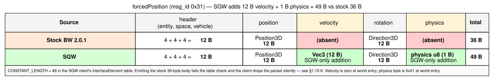

*Figure 30: forcedPosition byte-for-byte comparison — SGW inserts a 12-byte previous-position reference vector and appends a 1-byte physics field; emitting the stock 36-byte body fails the `CONSTANT_LENGTH = 49` table check.*

The authoritative "you are here" message. Sent by the server when the client's position must be hard-set (world entry, gate travel, anti-cheat correction, teleport). Carries position, a previous-position reference vector (not velocity — see the source-doc override below), full-precision rotation, and a physics-mode byte. Unlike normal entity-method calls, `forcedPosition` is a system-level wire-format message with a fixed 49-byte payload.

The full byte-by-byte canonical layout, the previous-position-reference correction, the per-call-site rotation discipline, and the relationship to `addMove` retransmission are canonized in `spec.protocol.position-updates` §1.4. The Mercury chapter retains only the transport-layer envelope (length type, msg_id, bundle considerations) and a divergence summary against stock BigWorld; the per-byte detail lives in the position-updates chapter so the same canon serves both `forcedPosition` and `detailedPosition`.

| Property | Value |
|---|---|
| Message ID | `0x31` |
| Length type | `CONSTANT_LENGTH = 49` |
| Payload size | 49 bytes (no length prefix on the wire — fixed) |
| Handler in client | `ProcessForcedEntityPosition`[^forced-pos-handler] (V5 alias: `ServerConnection_ForcedPosition`) |

**Field summary** (per `spec.protocol.position-updates` §1.4.1):

```text
[msg_id:    0x31]        1 byte
[entityId:  u32 LE]      4 bytes
[spaceId:   u32 LE]      4 bytes
[vehicleId: u32 LE = 0]  4 bytes
[posX/Y/Z:    3 × f32 LE] 12 bytes
[prevPosX/Y/Z: 3 × f32 LE] 12 bytes  — previous-position reference (NOT velocity)
[rotation slot A/B/C: 3 × f32 LE] 12 bytes  — order depends on call site (see below)
[physics:   u8]          1 byte    — physics/movement mode (`0x01` at world entry)
```

> [!NOTE] **Source-doc override: V5 docs label the 12 bytes at offsets 24-35 as `velocity` — that label is wrong.** Three V5 docs carry the mislabel ([^v5-position-movement], [^v5-entity-creation], [^v5-space-viewport]); this chapter and `spec.protocol.position-updates` §1.4.2 both override all three. Game-archaeology Ghidra pass[^game-archaeology-2026-05-14] on `ProcessForcedEntityPosition`[^forced-pos-handler] shows the 12-byte block at struct offset `+0x18` is passed as a **pointer** (via `LEA EAX, [ESI+0x18]`) to the internal `PackageAndSendEntityMove` helper as its `pOrientation` argument, which then copies the block verbatim into `pPrevPos` (aliased to `pPosition`). That is the previous-position-snapshot pattern used by BigWorld's client-side delta-compression of the retransmitted move — not a velocity vector. The "zeros at world entry" observation reflects there being no prior position to delta from, not a semantic claim about velocity. See `spec.protocol.position-updates` §1.4.2 for the full Ghidra evidence chain.

**The trailing byte is `physics`, not a generic flags field.**[^v5-position-movement] The byte at offset 48 "encodes the current physics mode (walking, flying, swimming, etc.). Stored per-entity in `sentPhysics_[]`." The world-entry C++ emit path (`client_handler.cpp:407-413`)[^cpp-client-handler][^v5-entity-creation] writes `(uint8_t)0x01` — value `0x01`, not `0x00` — and the handler[^forced-pos-handler] asserts `sentPhysics_[args.id] == args.physics`. The byte is consumed as per-entity mutable state, not discarded.

> [!NOTE] **Source-doc override.** `docs/reverse-engineering/findings/world-entry-pipeline.md`[^v5-world-entry] §"FORCED_POSITION" labels the byte at offset 48 as `flags: u8 = 0`, which is incorrect. The C++ server source extracted in `entity-creation-wire-formats.md`[^v5-entity-creation] shows the world-entry emit path writes `(uint8_t)0x01`, and the client decompile evidence in `position-movement-wire-formats.md`[^v5-position-movement] plus the assertion `sentPhysics_[args.id] == args.physics` in the handler[^forced-pos-handler] confirms the byte is consumed as the per-entity physics-mode field, not as a reserved flags slot. This chapter follows the C++ source and the position-movement-wire-formats doc; the `world-entry-pipeline.md` value is a known transcription error and should be corrected when that doc is next revised.

**Rotation order is per call site, not a protocol-wide convention.** SGW emits `forcedPosition` from two distinct C++ call sites[^cpp-client-handler] — the world-entry path (`client_handler.cpp:407-413`) writes `rotX, rotZ, rotY` (Y/Z swapped); the standalone path (`client_handler.cpp:566-572`) writes `rotation.x, rotation.y, rotation.z` in caller-supplied order. The handler[^forced-pos-handler] reads the three floats positionally and shuffles them as `addMove(yaw = param[11], pitch = param[10], roll = param[9])`; the world-entry path's swap is required for that positional read to produce correct yaw/pitch/roll. The full per-call-site rotation discipline (including the decompile-vs-protocol naming conflict the chapter's earlier draft surfaced) is canonized in `spec.protocol.position-updates` §1.4.3 — Mercury chapter retains only the divergence summary.

**Divergence from stock BigWorld 2.0.1.** Stock BW's `forcedPosition` carries 36 bytes: `entityID (4) + spaceID (4) + vehicleID (4) + Position3D (12) + Direction3D (12) = 36`. SGW expands this to 49 bytes by:

1. Inserting a 12-byte **previous-position reference vector** between position and rotation (zero at world entry; equal to the entity's last-known position when re-snapping after movement). See `spec.protocol.position-updates` §1.4.2 for the Ghidra-confirmed semantic.
2. Appending a 1-byte `physics` field (value `0x01` at world entry; per-entity mutable state at runtime).

Both additions are SGW-specific. The Cimmeria server must emit the full 49-byte payload; emitting the stock 36-byte payload would fail the `CONSTANT_LENGTH = 49` table check in the client's `InterfaceElement` decoder and the packet would be dropped silently. Confidence: high.

#### 1.10.7 `AUTHENTICATE` — Mercury-handshake key delivery (server → client, msg_id `0x00`)

The only V5-confirmed `DWORD_LENGTH` interface element in the running protocol. Carries the session key the client uses to verify the channel was negotiated by the expected SOAP authority. Sent once per channel, during the initial Mercury handshake — never during gameplay. Documented here so the §1.5 length-type table is not misleading about `DWORD_LENGTH`'s scope; the full lifecycle (SOAP `SessionKey` → AES key derivation → first packet over the cipher envelope) is canon for `spec.protocol.cipher-and-auth`, which is the right home for the auth flow.

| Property | Value |
|---|---|
| Message ID | `0x00` |
| Length type | `DWORD_LENGTH` (4-byte `u32` LE length prefix) |
| Handler in client | `AuthenticateKeyComparison`[^authenticate-handler] (V5 alias: `ServerConnection_authenticate`) |
| Payload | Packed string — `[1 byte: len or 0xFF][if 0xFF: 3 bytes extended len][len bytes: data]` |
| Sent | During the initial connection handshake, before any entity-message traffic |

The handler[^authenticate-handler] reads a packed string (the session key) via the utility[^packed-string-reader], compares it against the stored key at `ServerConnection+0x08`, and logs `"ServerConnection::authenticate: Unexpected key! (%s, wanted %s)"` on mismatch.[^v5-system-protocol] The packed-string reader uses a 1-byte length with `0xFF`-escape to a 3-byte extended length, so the inner string length is variable; the outer `DWORD_LENGTH` is the framing the Mercury decoder applies to find the message boundary.

Confidence: high for the length type and the handler-side decoder; the cipher key handling and the session-key end-to-end flow are out of scope for this chapter.

### 1.11 Position and movement messages

The position-update plane carries the steady-state per-entity location traffic — three logical message families share the role: the 32 `UPDATE_AVATAR` variants (msg_ids `0x10–0x2F`) for compressed AoI movement broadcasts; `DETAILED_POSITION` (msg_id `0x30`) for full-precision non-controlled entity snaps; and `FORCED_POSITION` (msg_id `0x31`) for authoritative client-position snaps (described from the Mercury-envelope perspective in §1.10.6 because of its world-entry role).

> [!NOTE] **Canonical home of the position plane.** Full byte-by-byte wire formats for every position message — all 32 `UPDATE_AVATAR` variants, `detailedPosition`'s 41-byte layout, `forcedPosition`'s 49-byte layout, the previous-position-reference vector at `forcedPosition` offsets 24-35, the `packXYZ` velocity compression, the quantized direction-angle encoding, and the per-call-site rotation discipline — are canonized in `spec.protocol.position-updates`. This chapter covers only the Mercury-layer envelope (msg_id ranges, length types, bundle behavior, divergence vs stock BigWorld). The per-variant byte tables live in the position-updates chapter so the same canon serves `UPDATE_AVATAR`, `detailedPosition`, and `forcedPosition` without duplication.

#### 1.11.1 `UPDATE_AVATAR` variants — Mercury-envelope summary (server → client, msg_ids `0x10–0x2F`)

The compressed AoI position update. Each of the 32 variants encodes a position update for one ghost entity (server-authoritative, client-side-rendered). The variant index is a 5-bit field encoded into the `msg_id` byte itself; the 5 bits select which subset of `(idAlias, position, direction)` fields are present on the wire, trading flexibility for byte count.

| Property | Value |
|---|---|
| Message ID range | `0x10 – 0x2F` (32 variants)[^v5-space-viewport] |
| Length type | `CONSTANT_LENGTH` (per-variant; 7–25 bytes; size registered statically per variant)[^v5-space-viewport] |
| Length range | 7 bytes (msg_id `0x2F`: Alias + NoPos + NoDir) — 25 bytes (msg_id `0x10`: NoAlias + FullPos + YawPitchRoll) |
| Handler in client | One handler per variant, all in the `FUN_00ddb???` and `FUN_00de1???` ranges[^v5-position-movement] |
| Trigger (server) | Server-side position update for any AoI ghost entity; emitted at the tick rate while the entity moves |
| Notable behavior | **Does not work on client-controlled entities** — use `forcedPosition` (§1.10.6) for those |

**Variant taxonomy.** The 32 variants map a 5-bit index onto a 2×4×4 matrix: 2 entity-ID widths (`NoAlias` 4 B, `Alias` 1 B) × 4 position types (`FullPos` / `OnChunk` / `OnGround` / `NoPos`) × 4 direction types (`YawPitchRoll` / `YawPitch` / `Yaw` / `NoDir`). The `msg_id` low 2 bits select direction, bits 2-3 select position type, bit 4 selects alias. Full per-variant byte layouts (offsets, packed-velocity bit layout, quantized-angle encoding, position-type Y-semantics) are canonized in `spec.protocol.position-updates` §1.2.

**Mercury-envelope considerations.** The message body never carries a length prefix; the variant's size is read from the static `InterfaceElement` descriptor at parse time. The server's `unreliable_movement_update` config flag controls whether `UPDATE_AVATAR` is emitted on the reliable Mercury channel (default) or the unreliable channel — a server-side configuration, not a wire-format property; the bytes are identical either way. Each `UPDATE_AVATAR` message is one interface element in the bundle and shares the bundle with whatever other AoI traffic the tick produced.

**Divergence from stock BigWorld 2.0.1.** The 32-variant compression scheme is inherited from stock BW; the trailing `physics` byte (offset varies per variant) is the SGW-specific per-entity movement-mode field rather than stock-BW reserved flags. See `spec.protocol.position-updates` §1.6 for the consolidated position-plane divergence table.

#### 1.11.2 `detailedPosition` — Mercury-envelope summary (server → client, msg_id `0x30`)

The full-precision sibling to `forcedPosition`. Carries `entityId`, position, velocity, and rotation as full `f32` values plus a 1-byte physics-mode field. Unlike `forcedPosition`, it does *not* carry `spaceId` or `vehicleId` — the entity's existing space and vehicle bindings are preserved.

| Property | Value |
|---|---|
| Message ID | `0x30` |
| Length type | `CONSTANT_LENGTH = 41` |
| Payload size | 41 bytes (no length prefix on the wire — fixed) |
| Handler in client | `HandleEntityCellSpawn`[^detailed-pos-handler] |
| Trigger (server) | Full-precision position update for a non-controlled entity (NPC, vehicle, observer-viewable player) |
| Notable behavior | **Does not work on client-controlled entities** — use `forcedPosition` (§1.10.6) for those |

**Mercury-envelope considerations.** Full-precision `f32` rotation at offsets 28/32/36 in `roll, pitch, yaw` order — distinct from `forcedPosition`'s call-site-dependent rotation order and distinct from `UPDATE_AVATAR`'s packed `u8` quantized angles. Trailing `physics` byte at offset 40 is the SGW addition; same per-entity field as `forcedPosition`. Full byte layout in `spec.protocol.position-updates` §1.3.

**Divergence from stock BigWorld 2.0.1.** Stock BW's analogous full-precision position message carries the same `roll, pitch, yaw` rotation order — no divergence on rotation. The SGW form adds the trailing `physics` byte; see `spec.protocol.position-updates` §1.6.

### 1.12 Nub — endpoint object

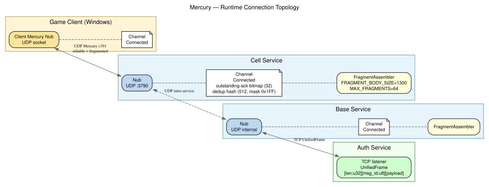

*Figure 31: how nubs wire together at runtime — the game client and each server service own exactly one Mercury Nub; channels and fragment assemblers are per-peer.*

The *nub* is the Mercury endpoint. Every process has exactly one. The SGW client nub is constructed once at startup; the server nub is constructed once when the BaseApp starts listening. The nub owns the UDP socket, the network thread, the connection map, the listener registrations, and the channel table.

**Constructor.** `Mercury::Nub::Nub`[^nub-ctor] is a 24-step constructor. Highlights from the V5 reconstruction[^v5-mercury-internals]:

1. Create a `tbb::concurrent_queue<ClientMessage*>` for the inbound queue.
2. Create a second `tbb::concurrent_queue` for outbound queue work items.
3. Spawn the network thread named `"NetworkThread for ExternalNub"`.
4. Initialize the connection map via `Nub::initConnectionMap`[^nub-init-connmap].
5. Create the UDP socket via `Nub::addListeningSocket`[^nub-add-listen-socket] (socket + bind + register).
6. Initialize rdtsc-based timer state.
7. Stamp vtables for `Mercury::Nub`, `Mercury::BaseNub`, and the `TimerExpiryHandler` base.
8. ...steps 8–24: see `mercury-protocol-internals.md`[^v5-mercury-internals] for the full inventory.

The nub's `processPendingEvents`[^nub-process-pending] is the main recv loop: blocking `recvfrom`, then enqueue each packet onto the inbound `tbb::concurrent_queue`. A second thread drains the queue and runs `processFilteredPacket` → `processFilteredPacket_inner`[^flags-decoder] → `processPacket` → `processOrderedPacket`[^process-ordered-packet] → handler dispatch.

**The send path is the inverse.** `ServerConnection::send`[^server-connection-send] is the game-level entry; it calls `Mercury::Channel::send`[^channel-send], which calls `Bundle::finalise`[^bundle-finalise] and `Nub::send`[^nub-send], which finally calls `Nub::writeConnection`[^nub-write-connection] for the actual `sendto()`. The cipher envelope is applied somewhere between `Bundle::finalise` and `writeConnection` — `PacketEncrypter::send`[^packet-encrypter-send] (vfunc slot 1 of the cipher object) is registered as a packet filter and runs in line.



*Figure 32: per-tick work the Nub performs — drains the inbound `tbb::concurrent_queue`, walks channels for retransmits (`UnAckedHandler::checkResendTimers`[^unacked-check-resend-timers] — capped at 5 entries per tick by the `5.0f` constant at `ghidra://SGW.exe@0x01e91e00`), then surfaces dead channels for teardown. **Fragment-chain cleanup is *not* per-tick work** — incomplete reassemblies are abandoned arrival-triggered (the next overlapping bundle evicts them) or channel-teardown-triggered (`Channel::~Channel( %s ): Forgetting %d unprocessed packets in the fragment chain` at `0x01b1a090`); no periodic stale-sweep timer was found in the binary.*

The tick loop drives the resend / cleanup side; the recv-side function-call chain that delivers each packet from `recvfrom()` to its handler is the inverse:

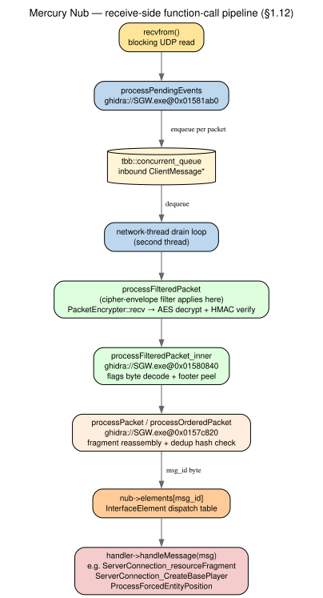

*Figure 33: the receive-side function-call pipeline — `processPendingEvents` blocks on `recvfrom`, enqueues onto the `tbb::concurrent_queue`; a second thread drains, runs the cipher filter, peels the footer in `processFilteredPacket_inner`, dispatches the bundle in `processOrderedPacket`, and indexes `nub->elements[msg_id]` to the registered handler.*

### 1.13 MachineGuard — adjacent machine-discovery protocol

MachineGuard is a *separate* UDP protocol that SGW uses for machine-level service discovery. It is not Mercury — different port, different message types, different deserializer — but it lives in the same binary range (`[0x01585000, 0x0158efff]`) and is sometimes conflated with Mercury in older docs.

| Property | Value |
|---|---|
| Port | `0x4E36` (decimal **20022**)[^machguard-sendandrecv] |
| Master deserializer | `MachineGuardMessage__deserialize`[^machguard-master-deserialize] |
| Send raw packet | `MachineGuard__sendRawPacket`[^machguard-send-raw] |
| Message types | At least 8 documented in V5; dispatcher switches on type bytes in the range `0x01–0x0c + 0x40` (see "partial enumeration" note below) |

**Port pinned via the `htons` immediate.** `Mercury_MachineGuard_sendAndRecv`[^machguard-sendandrecv] calls `htons(0x4e36)`; the immediate `36 4E 00 00` lives at the cited offset. A full-binary search for the immediate `36 4E 00 00` returns exactly one hit (this address); a search for `36 4C 00 00` (the bytes that would back decimal 19510) returns zero hits anywhere in the binary. The hex `0x4E36` is correct; the decimal is 20022. Confidence: high.

> [!NOTE] **Source-doc override.** `docs/reverse-engineering/findings/mercury-protocol-internals.md`[^v5-mercury-internals] §"MachineGuard Protocol" and `docs/reverse-engineering/v5-campaign/CAMPAIGN_STATUS.md` both pair `0x4E36` with decimal `19510`. That decimal is wrong: `0x4E36 = 20022`. The upstream V5 plate-comment evidently carried the arithmetic error (decimal converted off the wrong nibble in the high byte: `0x4E = 78`, not `0x4C = 76`) and the bad pairing propagated forward. The Ghidra evidence[^machguard-sendandrecv] is unambiguous — chapter overrides both upstream docs.

The master deserializer[^machguard-master-deserialize] switches on a single type byte. **Message types — partial enumeration.** The dispatcher's switch range is `0x01–0x0c` plus `0x40`. Eight slots are documented in V5 (table below); five slots (`0x03`, `0x08`, `0x09`, `0x0a`, `0x0c`) have no named handler in current V5 evidence and may be either unused or pending Ghidra recovery.[^v5-mercury-internals] The "13 message types" claim reflects the dispatcher's address range, not the count of recovered handlers. This chapter pins the canonized count to "at least 8 documented" and lists the gaps explicitly.

| Type byte | Class | Constructor |
|---|---|---|
| `0x01` | `WholeMachineMessage` | `0x01587d30` |
| `0x02` | `ProcessMessage` | (read at `0x015896d0`, write at `0x01586180`) |
| `0x03` | `<unknown>` | Not enumerated in V5; switch slot exists but no handler name recovered |
| `0x04` | `ListenerMessage` | `0x01586410` |
| `0x05` | `CreateMessage` | `0x01586590` |
| `0x06` | `SignalMessage` | `0x01586710` |
| `0x07` | `TagsMessage` | `0x01587ef0` |
| `0x08` | `<unknown>` | Not enumerated in V5; switch slot exists but no handler name recovered |
| `0x09` | `<unknown>` | Not enumerated in V5; switch slot exists but no handler name recovered |
| `0x0a` | `<unknown>` | Not enumerated in V5; switch slot exists but no handler name recovered |
| `0x0b` | `ErrorMessage` | `0x015867c0` |
| `0x0c` | `<unknown>` | Not enumerated in V5; switch slot exists but no handler name recovered |
| `0x40` | `MachinedAnnounceMessage` | (named in earlier session) |

**Variable-length ID encoding in `ProcessMessage`:** component IDs `≤ 0xfe` are written as 1 byte; IDs `> 0xfe` are written as `0xff` prefix + 3 bytes. See `ProcessMessage::writeComponentsVarLen`[^write-components-varlen]. This is the closest analog to the (un-pinned) `InterfaceElement::compressLength_write` threshold mentioned in §1.5.

MachineGuard is mentioned here because the V5 finding doc recovered it alongside Mercury and it shares wire-format vocabulary (variable-length IDs, type-byte dispatch). It does not yet have a bible chapter; the glossary marks it `→ N/A (no chapter yet)`. Cimmeria does not need to emulate MachineGuard for client compatibility — it is internal server-machine discovery.

### 1.14 Wire-format divergences from stock BigWorld 2.0.1 — consolidated

Every SGW divergence from stock BigWorld 2.0.1 affecting Mercury wire format, in one place. The packet-shape diff sets up the table:

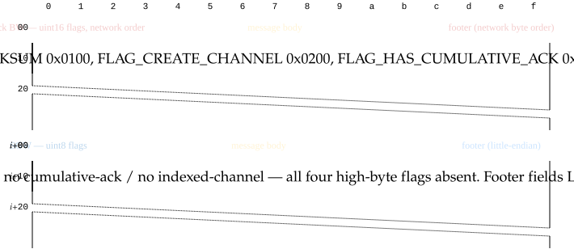

*Figure 34: stock BigWorld 2.0.1's 2-byte network-order packet shape stacked above SGW's 1-byte little-endian shape — stock BW's high-byte flags (`FLAG_HAS_CHECKSUM`, `FLAG_CREATE_CHANNEL`, `FLAG_HAS_CUMULATIVE_ACK`, `FLAG_INDEXED_CHANNEL`) are all absent in SGW.*

| Surface | Stock BigWorld 2.0.1 | SGW |
|---|---|---|
| Packet flags | `uint16` (2 bytes), network order | `uint8` (1 byte) |
| Footer byte order | Network (big-endian) via `BW_HTONS` / `BW_HTONL`[^stockbw-packet-cpp] | Little-endian |
| Encryption | Blowfish ECB + XOR chaining + `0xdeadbeef` magic + wastage byte | AES-256-CBC + HMAC-MD5 |
| Encryption KDF | (Blowfish key from session setup) | None — 32-byte SOAP `SessionKey` used verbatim as both AES and HMAC key |
| IV | (Blowfish ECB has no IV) | 16-byte zero IV, reused every packet |
| Cipher library | (BW-internal Blowfish) | CryptoPP (`HMAC<Weak1::MD5>`, `Rijndael::Enc`, `CBC_Encryption`) |
| Sub-slot method threshold (§1.8) | 62 in `checkExposedForSubSlots()`[^stockbw-method-desc] | 62 (identical) — no SGW divergence here despite earlier drafts claiming a one-lower threshold |
| Base (proxy) method wire shape (§1.8) | `[msg_id][u16 len][u32 entityId][args]` per stock BW | `[msg_id][u16 len][args]` — proxy methods do not write an entity ID (`startProxyMessage`)[^start-proxy-message] |
| `REPLY_MESSAGE (0xFF)` length type (§1.9) | `DWORD_LENGTH` (stock-BW reference) | `WORD_LENGTH`[^v5-space-viewport] |
| `enableEntities` payload (§1.9) | 1 byte (`uint8 dummy`) | 8 bytes (`uint64 dummy`) |
| `createBasePlayer` class field (§1.10.1) | `uint16` (2 bytes) | `uint16` on the wire (same width as stock); server-source style writes it as `(u8 classId)(u8 propCount = 0)` — a code-style difference, not a wire divergence |
| `createCellPlayer` rotation (§1.10.2) | `roll, pitch, yaw` (`Direction3D` order) | `rotX, rotZ, rotY` (Y/Z swapped) — at this message's wire offsets only; not a protocol-wide convention |
| `forcedPosition` payload (§1.10.6) | 36 bytes (entityID + spaceID + vehicleID + pos + direction) | 49 bytes (adds previous-position-reference `Vec3` at offsets 24-35 — *not* velocity, see §1.10.6 — and trailing physics `u8` at offset 48) |
| `forcedPosition` rotation order (§1.10.6) | `roll, pitch, yaw` | Per call site: world-entry path writes `rotX, rotZ, rotY` (Y/Z swapped); standalone `forcedPosition()` writes `rotation.x, rotation.y, rotation.z` (caller's responsibility) |
| `detailedPosition` rotation order (§1.11.2) | `roll, pitch, yaw` (stock-BW `Direction3D`) | `roll, pitch, yaw` — **no Y/Z swap** for this message, unlike `forcedPosition` and `createCellPlayer`. Rotation order is per-message-site, not protocol-wide |
| `detailedPosition` payload (§1.11.2) | (stock-BW analog full-precision) | 41 bytes — adds trailing physics-mode `u8` (same SGW addition as `forcedPosition`) |
| `spaceViewportInfo` size (§1.10.4) | Variable (viewport-owner / viewport-target distinct) | Fixed `CONSTANT_LENGTH = 13`; both entity-ID fields equal during open; `entityId2 = 0` closes the viewport |
| `AUTHENTICATE` length type (§1.10.7) | (BW-internal Blowfish handshake) | `DWORD_LENGTH`, packed-string body |
| `RESET_ENTITIES` bundling (§1.9) | Bundled freely | Must be in its own flushed bundle[^v5-entity-creation] |
| `bandwidthNotification` / `spaceData` (§1.9.1, §1.10.3) | Active in stock BW | Registered but **unused** in SGW — handlers exist, behavior is no-op |
| `FLAG_HAS_CHECKSUM` | Available (CRC32 in footer) | Omitted (HMAC-MD5 supersedes) |
| `FLAG_HAS_CUMULATIVE_ACK` | Available | Omitted |
| `FLAG_INDEXED_CHANNEL` | Available (indexed-channel routing) | Reserved-unused; bit 7 means `FLAG_IS_FRAGMENT` |
| Piggyback packets | Generated and consumed | Format inherited; Cimmeria Rust rejects on receive |

The divergences cluster in three themes: **security** (Blowfish → AES + HMAC), **wire compactness** (uint16 flags → uint8, omitted flags), and **wire-format simplifications** for SGW's narrower set of supported gameplay modes (no indexed channels, no multi-viewport, no checksum-redundant footer field). The footer-byte-order divergence is the one most likely to silently break a reimplementation; the `enableEntities` 8-byte divergence is the most-contested historically; the per-call-site rotation order in `forcedPosition` is the most subtle.

### 1.15 Source-of-truth crosswalk

One row per load-bearing claim, grouped by chapter section. Every claim that grounds wire-format behavior has a row; subordinate observations stay inline. The "Primary V5 source" column is the canonical evidence; the "Secondary cross-check" disambiguates or cross-validates that source. The five Q1–Q5 questions earlier drafts carried as `open` rows here all closed via the game-archaeology Ghidra pass of 2026-05-14; their resolutions are inline in the relevant section rows below. See §1.16 for the closure summary and the two follow-up sub-questions surfaced during the pass.

**§1.1–§1.3 Transport (packet anatomy, header, footer):**

| Claim | Primary V5 source | Secondary cross-check |
|---|---|---|
| 1-byte flags field at packet byte 0 | `mercury-protocol-internals.md` §"Packet Flags Byte" | `external/BigWorld-2.0.1/src/lib/network/packet.hpp` low byte |
| Maximum packet size `0x5AD` (1453) | `mercury-protocol-internals.md` §"Protocol Constants" | `Bundle::newMessage` space check at `ghidra://SGW.exe@0x0157ac90` |
| 8-bit flag definitions (mapped exactly to stock-BW low byte) | `mercury-protocol-internals.md` §"Packet Flags Byte" | `external/BigWorld-2.0.1/src/lib/network/packet.hpp` |
| Flag-decode order at `processFilteredPacket_inner` | `mercury-protocol-internals.md` §"All Mercury Functions" | `ghidra://SGW.exe@0x01580840` |
| `FLAG_INDEXED_CHANNEL` is in stock-BW *high* byte; absent in SGW | `external/BigWorld-2.0.1/src/lib/network/packet.hpp` (`0x0800`) | SGW's 1-byte flags has no high byte to carry it |
| Footer wire-order = bit-order; pop-order is inverse | `mercury-protocol-internals.md` §"Packet Flags Byte" (decode pattern) | — |
| Footer little-endian (SGW divergence from stock-BW network order) | `mercury-protocol-internals.md` §"Packet Flags Byte" | `external/BigWorld-2.0.1/src/lib/network/packet.cpp` `BW_HTONS` / `BW_HTONL` macros |
| Ack list encoding (`u8 count` + `count × u32`) | `mercury-protocol-internals.md` §"All Mercury Functions" (`UnAckedHandler::buildAndSendAckBundle`) | `ghidra://SGW.exe@0x0158b2d0` |
| Ack coalescing — keepalive emits reliable empty bundle, acks piggyback on its footer | `mercury-protocol-internals.md` §"Session 5b Additions" (`UnAckedHandler::sendAckBundle2`) | `ghidra://SGW.exe@0x0158bbc0`; reconciled across §1.3.1 and §1.7 |
| Piggyback chain layout (inherited from stock-BW; medium confidence) | `external/BigWorld-2.0.1/src/lib/network/packet.cpp` | V5 confirms `FLAG_HAS_PIGGYBACKS` flag exists; chain byte layout not directly V5-confirmed |
| Request-chain via `nextRequestOffset` linked list (medium confidence) | `mercury-protocol-internals.md` §"All Mercury Functions" (`Bundle::startMessage_request`) | `ghidra://SGW.exe@0x0157adc0`; next-pointer width not directly V5-confirmed |

**§1.4 Cipher envelope:**

| Claim | Primary V5 source | Secondary cross-check |
|---|---|---|
| AES-256-CBC + HMAC-MD5, zero IV, no KDF | `mercury-protocol-internals.md` §"Cipher Key Derivation (Session 5 Verification)" | RTTI strings at `0x01e93b70`–`0x01ea3c5c` (`HMAC_Base@CryptoPP`, `HMAC@VMD5@Weak1@CryptoPP`, `Rijndael::Enc@CryptoPP`) |
| Encrypt-then-MAC ordering on the wire | `mercury-protocol-internals.md` §"Cipher Key Derivation" | `PacketEncrypter::send` at `ghidra://SGW.exe@0x01603b80` |
| Key material: 32-byte SOAP `SessionKey` used verbatim as both AES + HMAC key | `mercury-protocol-internals.md` §"Cipher Key Derivation" | `PacketEncrypter::recv` at `ghidra://SGW.exe@0x01603fa0` reads same buffer |
| Cipher object vtable at `0x01b27374` (4 slots: dtor, send, recv, OptimalBlockSize) | `mercury-protocol-internals.md` §"Cipher Object Layout" | `ghidra://SGW.exe@0x01b27374` |
| Cipher object layout (`+0x08 key_buf`, `+0x18 iv_buf` of 16 zero bytes) | `mercury-protocol-internals.md` §"Cipher Object Layout" | Constructor at `ghidra://SGW.exe@0x01603a70` |
| Stock-BW Blowfish ECB + `0xdeadbeef` magic — wholesale replaced in SGW | `external/BigWorld-2.0.1/src/lib/network/encryption_filter.cpp` | RTTI strings show no Blowfish in SGW.exe |

**§1.5–§1.6 Length encoding + bundle:**

| Claim | Primary V5 source | Secondary cross-check |
|---|---|---|
| Three length types: `CONSTANT_LENGTH`, `WORD_LENGTH`, `DWORD_LENGTH` | `mercury-protocol-internals.md` §"InterfaceElement" | `space-viewport-wire-formats.md` §"Complete Server Message Table" |
| Entity messages (`msg_id >= 0x80`) default to `WORD_LENGTH` | `system-protocol-wire-formats.md` §"startEntityMessage / startProxyMessage" | `Bundle::newMessage` at `ghidra://SGW.exe@0x0157ac90` |
| `compressLength_write` family widths are 1/2/3/4 byte, **fixed per `InterfaceElement` at descriptor offset `+0x4`** (no runtime thresholds) | game-archaeology Ghidra pass (2026-05-14) on `compressLength_write` at `ghidra://SGW.exe@0x0158b120` — `switch(*(undefined4 *)((int)this + 4))` with unconditional per-case writes | `expandLength` at `ghidra://SGW.exe@0x0158b770` mirrors the same switch shape on the read side |
| Compressed-length overflow path | game-archaeology Ghidra pass — handled by packet-chain path at `ghidra://SGW.exe@0x0158acc0` (message split across bundle packets), not by widening the wire prefix | `mercury-protocol-internals.md` §"All Mercury Functions" |
| InterfaceElement strides (high confidence) | SGW Ghidra: `0x1c` (vec form) confirmed in `InterfaceElementVec__pushBack`; `0x24` (dispatch form) confirmed in `Mercury_Nub_ProcessOrderedPacket`[^interface-element-size] | The earlier `0x90` (144-byte) inherited claim is dropped — no allocation site in SGW matches |
| Bundle fragmentation, 64-packet cap | `mercury-protocol-internals.md` §"Implications for Cimmeria" | `external/BigWorld-2.0.1/src/lib/network/packet.hpp` (`Packet::MaxFragmentsPerBundle`) |
| Bundle entry points (`newMessage`, `startMessage_fixed`, `startMessage_request`) | `mercury-protocol-internals.md` §"All Mercury Functions" | Addresses `0x0157ac90`, `0x0157ad80`, `0x0157adc0` |

**§1.7 Sequence numbers + reliability:**

| Claim | Primary V5 source | Secondary cross-check |
|---|---|---|
| 28-bit sequence numbers (`SEQ_SIZE = 0x10000000`) | `mercury-protocol-internals.md` §"Protocol Constants" | — |
| Null sequence sentinel `0x10000000` (one past 28-bit mask) | `mercury-protocol-internals.md` §"Protocol Constants" | — |
| `ChannelInternal` constructor + size (~0x180 bytes) | `mercury-protocol-internals.md` §"All Mercury Functions" | `ghidra://SGW.exe@0x0158c7b0` |
| Three V5-confirmed timer fields (`+0x160`, `+0x164`, `+0x16c`) | `mercury-protocol-internals.md` §"Session 5b Additions" | `checkAndSendNubException` at `ghidra://SGW.exe@0x0158bed0` |
| `+0x170` = low half of a 64-bit rdtsc baseline; `+0x174` = high half — receive-event timestamp read in `checkAndSendNubException` | game-archaeology Ghidra pass (2026-05-14) on `checkAndSendNubException` at `ghidra://SGW.exe@0x0158bed0` — `(iVar4 - *(int *)(this + 0x174)) - (uint)(uVar2 < *(uint *)(this + 0x170))` subtract-with-borrow pattern | Constructor at `ghidra://SGW.exe@0x0158c7b0` zeroes both halves (low at `0x0158c9d5`, high at `0x0158c9db`); write site upstream of `dispatchPacketWithFilter` not located in current pass |
| Reliability mechanism: 32-bit outstanding-ack bitmap + 512-entry received-sequence hash table (mask `0x1FF`) | game-archaeology Ghidra pass (2026-05-14): `UnAckedHandler__buildAndSendAckBundle` at `ghidra://SGW.exe@0x0158b2d0` iterates `iVar2 = 0..32` (32-bit bitmap); `Channel__ctor` at `ghidra://SGW.exe@0x01576bf0` hardcodes `0x200` (512); `FUN_0158c170` at `ghidra://SGW.exe@0x0158c170` allocates `param_1 * 4 + 4 = 2052` bytes with mask `param_1 - 1 = 0x1FF` at `+0x44` | replaces the unsourced "45-slot circular send window" claim that earlier drafts carried — no such fixed-slot buffer exists |
| Resend timer / retry-limit numbers (medium confidence) | inherited from stock-BW defaults | SGW divergence not enumerated in V5 |
| Mercury keepalive: empty reliable bundle via `UnAckedHandler::sendAckBundle2` | `mercury-protocol-internals.md` §"Session 5b Additions" | `ghidra://SGW.exe@0x0158bbc0`; same function variously named `sendAckBundle` in V5's main inventory |

**§1.8 Message dispatch:**

| Claim | Primary V5 source | Secondary cross-check |
|---|---|---|
| `msg_id` ranges (system / cell / base / reply) | `space-viewport-wire-formats.md` §"Complete Server Message Table" | `system-protocol-wire-formats.md` §"startEntityMessage / startProxyMessage" |
| Cell messages write `[u32 entityId][args]` after length prefix | `system-protocol-wire-formats.md` §"startEntityMessage" | `ghidra://SGW.exe@0x00dd6a60` |
| Base messages write `[args]` only — no `entityId` prefix | `system-protocol-wire-formats.md` §"startProxyMessage" | `ghidra://SGW.exe@0x00dd6980` |
| Sub-slot threshold = 62 (extended encoding for method index ≥ 62) | `entity-property-sync.md` §13 ("Sub-Slot Client Method Encoding — Final Confirmation") | `external/BigWorld-2.0.1/src/.../entity_method_descriptions.cpp` (`checkExposedForSubSlots()`); `ghidra://SGW.exe@0x01590df0` |
| `onClientMapLoad` sub-slot off-by-one source-doc correction (55 not 56) | chapter §1.8 source-doc-override callout | corrects `world-entry-pipeline.md` line 105 transcription error |
| Runtime dispatch is `nub->elements[msg_id]` array-indexed | `mercury-protocol-internals.md` §"InterfaceElement" | `Mercury::Nub::processOrderedPacket` at `ghidra://SGW.exe@0x0157c820`; literal entry stride is medium confidence (see §1.5) |

**§1.9 Control messages:**

| Claim | Primary V5 source | Secondary cross-check |
|---|---|---|
| `enableEntities` 8-byte payload, `CONSTANT_LENGTH = 8` override | `world-entry-pipeline.md` §"ENABLE_ENTITIES Payload Reconciliation" | `deprecated/cpp/src/baseapp/mercury/sgw/messages.cpp:83`; initializer at `ghidra://SGW.exe@0x017bade0`–`0x017bae07` |
| `enableEntities` `msg_id = 0xC1` — *derived* from base-method encoding rule | derived per §1.8's `methodId \| 0xC0` rule; method index 1 V5-confirmed | not independently wire-observed in V5; confidence: medium on the literal byte |
| `enableEntities` payload-content uncertainty (zero vs uninitialized) | `world-entry-pipeline.md` §"BroadcastEntityActivation" (reserves bytes via `startMessage_fixed`) | medium confidence; not behaviorally observable from the wire |
| `resetEntities` 1-byte payload + own-flushed-bundle constraint | `entity-creation-wire-formats.md` §"1. RESET_ENTITIES (0x04)" | Initializer at `ghidra://SGW.exe@0x017bb200`; `space-viewport-wire-formats.md` §"RESET_ENTITIES (0x04)" |
| `resetEntities` handler-name alias (`Mercury__unknown_00dda0e0` = `PurgeAndRebuildEntityStateLists`) | chapter §1.9 source-doc-handler-name-disagreement note | both names alias the function at `ghidra://SGW.exe@0x00dda0e0` |
| `RESOURCE_FRAGMENT` byte layout (`0x36`, WORD_LENGTH, 4-byte header + body) | `space-viewport-wire-formats.md` §"RESOURCE_FRAGMENT (0x36)" | Handler at `ghidra://SGW.exe@0x00dddd80` |
| `RESOURCE_FRAGMENT` 21 category IDs + reassembly mechanism | `space-viewport-wire-formats.md` §"RESOURCE_FRAGMENT (0x36)" | — |
| `REPLY_MESSAGE` (`0xFF`) is `WORD_LENGTH`, Mercury-handshake scope | `space-viewport-wire-formats.md` §"REPLY_MESSAGE (0xFF)" and §"Complete Server Message Table" | — |
| `bandwidthNotification` 4-byte payload, registered-but-unused in SGW | `space-viewport-wire-formats.md` §"BANDWIDTH_NOTIFICATION (0x01)" | `messages.cpp:134` server registration |
| `updateFrequencyNotification` 1-byte resolution | `space-viewport-wire-formats.md` §"UPDATE_FREQUENCY_NOTIFICATION (0x02)" | `client_handler.cpp:46-53` server emit |
| `setGameTime` 4-byte u32 ticks | `space-viewport-wire-formats.md` §"SET_GAME_TIME (0x03)" | `system-protocol-wire-formats.md` §"TICK_SYNC (0x0D) and SET_GAME_TIME (0x03) -- RTTI Evidence"; descriptor at `0x017bb180` |
| `tickSync` 8-byte payload (gameTime + tickRate) | `entity-creation-wire-formats.md` §"8. TICK_SYNC (0x0D)" | `space-viewport-wire-formats.md` §"TICK_SYNC (0x0D)"; descriptor at `0x017bb720` |
| `restoreClient` 48-byte body + auto-reply `restoreClientAck` | `system-protocol-wire-formats.md` §"RESTORE_CLIENT (0x34) -- Client State Restore" | `space-viewport-wire-formats.md` §"RESTORE_CLIENT (0x34)" |
| `loggedOff` 1-byte reason, silent disconnect | `system-protocol-wire-formats.md` §"LOGGED_OFF (0x37) -- Server Disconnect" | `space-viewport-wire-formats.md` §"LOGGED_OFF (0x37)" |

**§1.10 Entity creation + position:**

| Claim | Primary V5 source | Secondary cross-check |
|---|---|---|
| `createBasePlayer` 6-byte payload | `entity-creation-wire-formats.md` §"2. CREATE_BASE_PLAYER (0x05)" | `system-protocol-wire-formats.md` §"CREATE_BASE_PLAYER (0x05) -- Stream Read Details" |
| `createBasePlayer` `u16` class field (wire) = `u8 classId + u8 propCount` (server emit) | `system-protocol-wire-formats.md` (`MOVZX EAX, word ptr [EAX]` Ghidra evidence) | `entity-creation-wire-formats.md` §"2. CREATE_BASE_PLAYER" C++ server source |
| `createBasePlayer` out-of-order tolerance (buffered `createCellPlayer` playback) | `entity-creation-wire-formats.md` §"2. CREATE_BASE_PLAYER" | `ServerConnection+0xfdc` `cellPlayerBuffer_` per `system-protocol-wire-formats.md` field map |
| `createCellPlayer` 32-byte payload | `entity-creation-wire-formats.md` §"3. CREATE_CELL_PLAYER (0x06)" | `world-entry-pipeline.md` §"Audit Findings vs `world-entry-phases.md`" |
| `createCellPlayer` Y/Z rotation swap (rotX, rotZ, rotY) | `entity-creation-wire-formats.md` §"3. CREATE_CELL_PLAYER" + rotation reader `FUN_015846a0` | C++ server source (`client_handler.cpp:411`: `<< rotX << rotZ << rotY`) |
| `spaceData` 14+-byte payload, registered-but-unused | `space-viewport-wire-formats.md` §"SPACE_DATA (0x07)" | `messages.cpp:189-190` server registration |
| `spaceViewportInfo` 13-byte fixed payload | `entity-creation-wire-formats.md` §"4. SPACE_VIEWPORT_INFO (0x08)" | `space-viewport-wire-formats.md` §"SPACE_VIEWPORT_INFO (0x08)" |
| `spaceViewportInfo` open-vs-close driven by `entityId2` value | `space-viewport-wire-formats.md` §"SPACE_VIEWPORT_INFO" viewport operations table | `entity-creation-wire-formats.md` §"4. SPACE_VIEWPORT_INFO" |
| `spaceViewportInfo` first-field decompile ambiguity (`field0 / entityId`) | chapter §1.10.4 decompile-naming-ambiguity callout | server source uses `entityId`; client decompile labels `field0` |
| `createEntity` 5-byte payload | `entity-creation-wire-formats.md` §"6. CREATE_ENTITY (0x09)" | `space-viewport-wire-formats.md` §"CREATE_ENTITY (0x09)" |
| `forcedPosition` 49-byte fixed payload (`CONSTANT_LENGTH = 49`) | `entity-creation-wire-formats.md` §"5. FORCED_POSITION (0x31)" | `position-movement-wire-formats.md` §"forcedPosition (msg_id 0x31, 49 bytes)"; full byte canon in `spec.protocol.position-updates` §1.4 |
| `forcedPosition` trailing byte = `physics` field (per-entity mode), value `0x01` at world entry | `position-movement-wire-formats.md` §"forcedPosition" Field Notes | `entity-creation-wire-formats.md` C++ emit `(uint8_t)0x01`; chapter §1.10.6 source-doc-override callout against `world-entry-pipeline.md` line 257 |
| `forcedPosition` rotation order per call site (world-entry swaps; standalone caller's responsibility) | `entity-creation-wire-formats.md` §"5. FORCED_POSITION (0x31)" — two C++ call sites | `system-protocol-wire-formats.md` §"FORCED_POSITION (0x31) -- Rotation Order Evidence" (addMove mapping resolves decompile struct-label conflict); canonized in `spec.protocol.position-updates` §1.4.3 |
| `forcedPosition` offset 24-35: previous-position reference vector, **not velocity** | game-archaeology Ghidra pass (2026-05-14) on `ProcessForcedEntityPosition` at `ghidra://SGW.exe@0x00dd9ee0` — `LEA EAX, [ESI+0x18]` pointer-pass to `PackageAndSendEntityMove` as `pOrientation`, copied verbatim into `pPrevPos` (aliased to `pPosition`) | `position-movement-wire-formats.md`, `entity-creation-wire-formats.md`, `space-viewport-wire-formats.md` all carry the legacy "velocity" label — chapter §1.10.6 + `spec.protocol.position-updates` §1.4.2 override all three |
| Source-doc override — three V5 docs label `forcedPosition` offset 24-35 as "velocity" | chapter §1.10.6 source-doc-override callout | overrides `position-movement-wire-formats.md` §"forcedPosition", `entity-creation-wire-formats.md` §"5. FORCED_POSITION (0x31)", `space-viewport-wire-formats.md` §"FORCED_POSITION (0x31)" |
| `UPDATE_AVATAR` family, `detailedPosition`, `forcedPosition` byte-level canon | `spec.protocol.position-updates` (this chapter §1.11 + §1.10.6 are Mercury-envelope summaries; full byte tables are in the position-updates chapter) | — |
| `AUTHENTICATE` (`0x00`) is `DWORD_LENGTH` (the V5-confirmed user) | `system-protocol-wire-formats.md` §"AUTHENTICATE (0x00) -- Server-to-Client Key Exchange" | `space-viewport-wire-formats.md` §"Complete Server Message Table" |

**§1.11 Position / movement messages:**

| Claim | Primary V5 source | Secondary cross-check |
|---|---|---|
| `UPDATE_AVATAR` family (`0x10`–`0x2F`) — Mercury envelope, msg_id range, `CONSTANT_LENGTH` per-variant 7-25 bytes, unreliable-channel option | `space-viewport-wire-formats.md` §"UPDATE_AVATAR variants (0x10 - 0x2F)" and §"All 32 Variant Sizes" | full byte canon: `spec.protocol.position-updates` §1.2 |
| `UPDATE_AVATAR` 2×4×4 variant matrix, packed velocity, quantized angles, per-variant byte tables | canonized in `spec.protocol.position-updates` §1.2 | this chapter §1.11.1 retains only Mercury-envelope facts |
| `detailedPosition` `CONSTANT_LENGTH = 41`, Mercury-envelope summary | `position-movement-wire-formats.md` §"detailedPosition (msg_id 0x30, 41 bytes)" | full byte canon: `spec.protocol.position-updates` §1.3 |
| `detailedPosition` rotation order = `roll, pitch, yaw` (no Y/Z swap, distinct from `forcedPosition`) | canonized in `spec.protocol.position-updates` §1.3 | `position-movement-wire-formats.md` §"detailedPosition" — distinct from `UPDATE_AVATAR`'s packed `u8` quantized angles |

**§1.12 Nub:**

| Claim | Primary V5 source | Secondary cross-check |
|---|---|---|
| `Mercury::Nub::Nub` 24-step construction | `mercury-protocol-internals.md` §"Mercury::Nub::Nub" | `ghidra://SGW.exe@0x015841d0` |
| `processPendingEvents` recv loop entry point | `mercury-protocol-internals.md` §"All Mercury Functions" | `ghidra://SGW.exe@0x01581ab0` |
| Send-path chain (`ServerConnection::send` → `Channel::send` → `Bundle::finalise` → `Nub::send` → `writeConnection`) | `mercury-protocol-internals.md` §"All Mercury Functions" | Addresses `0x00dd8930`, `0x01576f90`, `0x0157a7a0`, `0x01582160`, `0x01583a90` |

**§1.13 MachineGuard:**

| Claim | Primary V5 source | Secondary cross-check |
|---|---|---|
| MachineGuard port = `0x4E36` (decimal **20022**) | game-archaeology Ghidra pass (2026-05-14) on `Mercury_MachineGuard_sendAndRecv` at `ghidra://SGW.exe@0x015898c0` — `htons(0x4e36)`; immediate `36 4E 00 00` at `ghidra://SGW.exe@0x0158994b` is the only hit in the binary; `36 4C 00 00` returns zero hits | overrides `mercury-protocol-internals.md` §"MachineGuard Protocol" and `docs/reverse-engineering/v5-campaign/CAMPAIGN_STATUS.md` which both paired `0x4e36` with the wrong decimal `19510` |
| Source-doc override — both upstream V5 docs paired `0x4E36` with decimal `19510` (arithmetically wrong: `0x4E = 78`, not `0x4C = 76`) | chapter §1.13 source-doc-override callout | overrides `mercury-protocol-internals.md` §"MachineGuard Protocol" and `docs/reverse-engineering/v5-campaign/CAMPAIGN_STATUS.md` |
| Master deserializer at `0x01588530`; range `[0x01–0x0c, 0x40]` | `mercury-protocol-internals.md` §"MachineGuard Protocol" | — |
| At least 8 documented message types; 5 slots (`0x03`, `0x08`, `0x09`, `0x0a`, `0x0c`) have no named handler in V5 | `mercury-protocol-internals.md` §"MachineGuard Protocol" | chapter §1.13 partial-enumeration callout |
| `ProcessMessage::writeComponentsVarLen` single-threshold `0xfe` | `mercury-protocol-internals.md` §"MachineGuard Protocol" | `ghidra://SGW.exe@0x01586180` (distinct mechanism from `InterfaceElement`'s per-descriptor-fixed-width compressed-length scheme — see §1.5) |

### 1.16 Open questions

The five Q1–Q5 questions earlier drafts carried (compressed-length thresholds, `+0x170/+0x174` roles, `forcedPosition` velocity semantics, MachineGuard port, send-window slot count) all closed via the game-archaeology Ghidra pass[^game-archaeology-2026-05-14]:

- **Q1 — InterfaceElement compressed-length thresholds.** Closed: no thresholds. The width is fixed per-`InterfaceElement` at descriptor offset `+0x4`; `compressLength_write` decompiles to `switch(*(undefined4 *)((int)this + 4))` on cases 1/2/3/4 with unconditional writes.[^compress-length-family] Overflow is handled by the packet-chain path, not by widening the wire prefix. See §1.5.
- **Q2 — `ChannelInternal +0x170` / `+0x174` roles.** Closed: low/high halves of a 64-bit rdtsc baseline marking the last relevant receive event. `checkAndSendNubException`[^check-nub-exception] reads them via a subtract-with-borrow pattern; the constructor[^channel-internal-ctor] zeroes both halves. See §1.7.
- **Q3 — `forcedPosition` offset 24-35 semantics.** Closed: previous-position reference vector, **not velocity**. `ProcessForcedEntityPosition`[^forced-pos-handler] passes the 12-byte block by pointer to `PackageAndSendEntityMove` as `pOrientation` and copies it verbatim into `pPrevPos` (aliased to `pPosition`). V5 docs that label these bytes "velocity" are wrong; chapter overrides three V5 docs. See §1.10.6 and the canonical layout in `spec.protocol.position-updates` §1.4.2.
- **Q4 — MachineGuard port.** Closed: `0x4E36 = 20022`. `Mercury_MachineGuard_sendAndRecv`[^machguard-sendandrecv] calls `htons(0x4e36)`; the immediate is the only matching hit in the binary. Upstream V5 docs pair `0x4E36` with decimal `19510`, which is wrong — chapter overrides. See §1.13.
- **Q5 — `ChannelInternal` send-window slot count.** Closed: no fixed-slot circular buffer exists. The mechanism is a 32-bit outstanding-ack bitmap (`UnAckedHandler__buildAndSendAckBundle` iterates `iVar2 = 0..32`)[^ack-bitmap] plus a 512-entry received-sequence hash table (mask `0x1FF`) at `ChannelInternal+0x44`[^channel-hash-alloc]. The "45-slot" claim earlier drafts carried was unsourced and conceptually wrong. See §1.2, §1.6, §1.7.

Two new sub-questions surfaced during the closure pass. Neither blocks promotion of the chapter; both are documented here for follow-up.

#### Q1 — `ChannelInternal +0x170 / +0x174` write-site location (§1.7)

**Question:** The receive-timeout baseline timestamp is *read* in `checkAndSendNubException`, but the write site (where the baseline is stamped on each incoming packet) was not located. Where in the Nub receive entry does the 64-bit rdtsc baseline get written?

**State:** Closed by follow-up Ghidra pass (2026-05-14). The constructor[^channel-internal-ctor] zeroes both halves at channel-init time. The per-packet write site is `FUN_0158bd10`[^rdtsc-write-site] (`RDTSC` → `MOV [ECX+0x170], EAX` / `MOV [ECX+0x174], EDX`), called by `Nub__processPacketForChannel`[^rdtsc-write-site] on every received packet. The earlier "near `0x015816a0`" hypothesis is falsified — the actual write site is in the channel-update path, not the dispatch path. The same function also writes `+0x178` (received-packet counter) and `+0x17c` (received-byte accumulator); both are adjacent fields the earlier ChannelInternal layout note did not enumerate.

**Path to resolution:** Closed. See §1.7 for the full citation.

**Impact if unresolved:** Low. The field role is canon; only the *which-function-stamps-it* metadata is missing. A reimplementation that mirrors the receive-timeout check by stamping the baseline at any reasonable receive-entry hook will match the observed behavior; the only practical risk is divergence in the exact "last relevant receive event" definition (e.g. valid-flag-decoded packets only vs all UDP datagrams).

#### Q2 — Server-side `forcedPosition` emit triggers outside world entry (§1.10.6)

**Question:** Outside world entry, under what conditions does the server emit a `forcedPosition`? Gate travel, anti-cheat snap, teleport, hard-snap on physics resolve — which of these maps to which call site, and which call sites carry a non-zero previous-position reference vs zeros?

**State:** The previous-position-reference correction (Q3 closure above) resolves the *client-side semantic* — the 12 bytes at offsets 24-35 are a delta-encoding snapshot, not velocity. The *server-side emit triggers* remain unconfirmed from the client binary because the relevant decision logic lives in the deprecated server, not the client. The two C++ call sites in `client_handler.cpp`[^cpp-client-handler] are catalogued (`:407-413` world-entry, `:566-572` standalone) but the standalone path's callers are not enumerated.

**Path to resolution:** Audit every call site of `ServerConnection::forcedPosition()` in `deprecated/cpp/src/baseapp/` and `deprecated/python/`. Catalogue: which gameplay trigger fires which call site, what value the caller passes for the previous-position-reference argument, and which call sites pre-swap rotation.

**Impact if unresolved:** Server-side emit policy is currently underdocumented. A reimplementation that always emits zero previous-position-reference and the world-entry rotation order at every `forcedPosition` call site will produce wire bytes the client decodes correctly (because the client's delta-compression is robust to a zero previous-position), so this is documentation-completeness, not implementation-blocking. Confidence on §1.10.6's *wire bytes* stays high; the server-emit-trigger catalogue is a Section 3 (deprecated server) follow-up rather than a Section 1 gap.

## References

[^ack-bitmap]: `UnAckedHandler__buildAndSendAckBundle` at `ghidra://SGW.exe@0x0158b2d0` — 32-bit outstanding-ack bitmap; loop iterates `iVar2 = 0, 8, 16, 24; iVar2 < 0x20`.

[^request-chain-walk]: Three-decompile chain confirming the request linked-list shape. `FUN_01579710` at `ghidra://SGW.exe@0x01579710` — iterator init reads `Packet+0x30` as `u16`. `Mercury_Bundle_IteratorUnpack` at `ghidra://SGW.exe@0x01579830` — reads the inline next-request-offset at `payload_offset+4` as `u16`; confirms reply header is 6 bytes total (`u32` replyID + `u16` next-offset, accumulated as `uVar9 = uVar9 + 6`). `FUN_0158a260` at `ghidra://SGW.exe@0x0158a260` — Packet initializer sets `*(undefined2 *)(param_1 + 0xc) = 0`, confirming zero is the terminator sentinel and the stock-BW `0xFFFF` value does not apply to SGW (positions are 1-based, so zero never matches a valid offset). Per game-archaeology Ghidra pass 2026-05-14 (resolves citation-needed claim in §1.3).

[^interface-element-size]: `InterfaceElementVec__pushBack` at `ghidra://SGW.exe@0x01578510` — vec form, stride `0x1c` (28 bytes); confirmed by `(end - begin) / 0x1c` size computation and `end += 0x1c` push step. `Mercury_Nub_ProcessOrderedPacket` at `ghidra://SGW.exe@0x0157c820` — dispatch form, stride `0x24` (36 bytes); confirmed by `nMsgIndex * 0x24` array index and `/ 0x24` bounds check. The earlier `0x90` (144-byte) stock-BW inherited claim found no allocation site in SGW. Per game-archaeology Ghidra pass 2026-05-14 (resolves citation-needed claim in §1.5).

[^rdtsc-write-site]: `FUN_0158bd10` at `ghidra://SGW.exe@0x0158bd10` — per-packet recv stamp: `RDTSC` → `MOV [ECX+0x170], EAX` / `MOV [ECX+0x174], EDX`; also writes `+0x178` (received-packet counter) and `+0x17c` (received-byte accumulator). Called by `Nub__processPacketForChannel` at `ghidra://SGW.exe@0x01581830` on every received packet. A second, lower-traffic write site at `FUN_0158bc50` at `ghidra://SGW.exe@0x0158bc50` captures `rdtsc()` into the same fields but only when a timeout timer is being configured (not per-packet). Byte-pattern search for `MOV [reg+0x170]` across the Mercury range found exactly these two sites. The earlier "near `0x015816a0`" hypothesis is falsified — the actual write site is in the channel-update path, not the dispatch path. Per game-archaeology Ghidra pass 2026-05-14 (resolves citation-needed claim in §1.7).

[^authenticate-handler]: `AuthenticateKeyComparison` at `ghidra://SGW.exe@0x00dd8510` — client-side `AUTHENTICATE` (msg_id `0x00`) handler; compares packed-string session key against stored key at `ServerConnection+0x08`.

[^broadcast-entity-activation]: `BroadcastEntityActivation` at `ghidra://SGW.exe@0x00dd9280` — client-side `enableEntities` sender; reserves 8 bytes via `startMessage_fixed`.

[^bundle-add-blob]: `Bundle::addBlob` at `ghidra://SGW.exe@0x0157a990` — copies payload bytes into the current packet; auto-splits across packet boundaries when the current packet is full.

[^bundle-clear]: `Mercury::Bundle::clear` at `ghidra://SGW.exe@0x0157a440` — resets bundle state and allocates a fresh first packet.

[^bundle-ctor]: `Mercury::Bundle::Bundle` at `ghidra://SGW.exe@0x0157aa40` — bundle constructor.

[^bundle-finalise]: `Mercury_Bundle_Finalise` at `ghidra://SGW.exe@0x0157a7a0` — walks the packet chain, sets flags bits, and writes footer fields in flag-bit order.

[^bundle-new-message]: `Mercury_Bundle_newMessage` at `ghidra://SGW.exe@0x0157ac90` — per-packet space check (1453-byte max); allocates a new packet when the current one cannot fit the message; enforces `WORD_LENGTH` for entity messages.

[^bundle-reserve]: `Bundle::reserve` at `ghidra://SGW.exe@0x0157a5d0` — allocates a new packet when `newMessage` cannot fit the inbound message.

[^bundle-start-msg-fixed]: `Bundle::startMessage_fixed` at `ghidra://SGW.exe@0x0157ad80` — fixed-length message wrapper.

[^bundle-start-msg-request]: `Bundle::startMessage_request` at `ghidra://SGW.exe@0x0157adc0` — request-message wrapper; reserves space for reply-ID + next-request-offset linked-list pointers.

[^channel-ctor]: `Channel__ctor` at `ghidra://SGW.exe@0x01576bf0` — hardcodes the 512 (`0x200`) entry hash-table size at construction.

[^channel-hash-alloc]: `FUN_0158c170` at `ghidra://SGW.exe@0x0158c170` — allocates `param_1 * 4 + 4 = 2052` bytes for the 512-entry received-sequence dedup table; stores the mask `param_1 - 1 = 0x1FF` at `ChannelInternal+0x44`.

[^channel-internal-ctor]: `ChannelInternal__ctor` at `ghidra://SGW.exe@0x0158c7b0` — ~0x180-byte inner channel-object constructor; zeroes `+0x170` (low at `0x0158c9d5`) and `+0x174` (high at `0x0158c9db`).

[^channel-send]: `Mercury::Channel::send` at `ghidra://SGW.exe@0x01576f90` — assigns reliable packet sequence IDs from a monotonic per-channel counter; entry point in the send chain.

[^check-nub-exception]: `ChannelInternal__checkAndSendNubException` at `ghidra://SGW.exe@0x0158bed0` — timer-driven resend logic; reads `+0x160 / +0x164 / +0x16c / +0x170 / +0x174` with the subtract-with-borrow pattern `(iVar4 - *(int *)(this + 0x174)) - (uint)(uVar2 < *(uint *)(this + 0x170))`.

[^cipher-hash-filter]: `CryptoPP::HashFilter` at `ghidra://SGW.exe@0x00414720` — appends the HMAC-MD5 tag over the AES ciphertext.

[^cipher-stream-filter]: `CryptoPP::StreamTransformationFilter` at `ghidra://SGW.exe@0x004089b0` — applies AES-256-CBC encryption over the Mercury plaintext.

[^cipher-vtable]: Cipher object vtable at `ghidra://SGW.exe@0x01b27374` — four slots: destructor, send, recv, OptimalBlockSize.

[^cipher-vtable-blocksize]: Vtable slot 3 at `ghidra://SGW.exe@0x016039a0` — returns `0x1f` (31); likely `OptimalBlockSize`.

[^cipher-vtable-dtor]: Vtable slot 0 destructor at `ghidra://SGW.exe@0x01604ac0`.

[^cme-playchar]: CME string `Event_NetOut_PlayCharacter` at `ghidra://SGW.exe@0x019bf4f8`.

[^compress-length-family]: `InterfaceElement::compressLength` family — `Mercury_InterfaceElement_compressLength` at `ghidra://SGW.exe@0x0158acc0` (total-length compute + packet-split overflow path); `Mercury_InterfaceElement_compressLength_2` at `ghidra://SGW.exe@0x0158b120` (write side; `switch(*(undefined4 *)((int)this + 4))` on cases 1/2/3/4 with unconditional writes; Ghidra-named `_2`, role is `compressLength_write`); `Mercury_InterfaceElement_expandLength` at `ghidra://SGW.exe@0x0158b770` (read side; mirrors the same switch shape).

[^cpp-client-handler]: `deprecated/cpp/src/baseapp/mercury/sgw/client_handler.cpp` — legacy server-side emit paths (e.g. `:407-413` for the world-entry `forcedPosition`, `:497-499` for `CREATE_ENTITY`, `:566-572` for the standalone `forcedPosition`, `:46-53` for `updateFrequencyNotification`, `:61-63` for `setGameTime`, `:486-488` for `tickSync`).

[^cpp-messages]: `deprecated/cpp/src/baseapp/mercury/sgw/messages.cpp` — legacy server-side message descriptor registration (line 83 = 8-byte `ENABLE_ENTITIES`; line 134 = `bandwidthNotification`; lines 189–190 = `spaceData`).

[^cryptopp-rtti]: RTTI strings at `ghidra://SGW.exe@0x01e93b70`–`ghidra://SGW.exe@0x01ea3c5c` — `HMAC_Base@CryptoPP`, `HMAC@VMD5@Weak1@CryptoPP`, `Rijndael::Enc@CryptoPP`.

[^create-base-player-handler]: `ServerConnection_CreateBasePlayer` at `ghidra://SGW.exe@0x00dddca0` — `createBasePlayer` (msg_id `0x05`) handler; reads `[entityId u32][classId u16]`; buffered-message replay path checks `ServerConnection+0xfdc`.

[^create-cell-player-handler]: `ServerConnection_CreateCellPlayer` at `ghidra://SGW.exe@0x00dda2e0` — `createCellPlayer` (msg_id `0x06`) handler.

[^detailed-pos-handler]: `HandleEntityCellSpawn` at `ghidra://SGW.exe@0x00dd9e00` — `detailedPosition` (msg_id `0x30`) handler. Ghidra name is `HandleEntityCellSpawn`; earlier drafts called this `FUN_00dd9e00`.

[^disconnect-handler]: Disconnect handler at `ghidra://SGW.exe@0x00dd8630` — destroys the connection object at `+0x30c`, frees pending resource requests, clears the handler pointer at `+0x168`. Called with `sendMsg = false` from `loggedOff`.

[^enable-entities-init]: `enableEntities` descriptor initializer at `ghidra://SGW.exe@0x017bade0`–`ghidra://SGW.exe@0x017bae07`; `PUSH 0x8` (the `CONSTANT_LENGTH = 8` argument) at `ghidra://SGW.exe@0x017bade9`.

[^event-net-get-protocol-digest]: `Event_Net_GetProtocolDigest` — CME event surface for the `protocol_digest` value. RTTI string `.?AUEvent_Net_GetProtocolDigest@@` at `ghidra://SGW.exe@0x01df15dc` (event struct) and `.?AV?$CallbackImpl@UEvent_Net_GetProtocolDigest@@@EventSignal@CME@@` at `ghidra://SGW.exe@0x01df1590` (the EventSignal callback adapter). Lets game-layer code query the current digest without going through the `logOnBegin` chain; the digest is computed once at login and re-surfaced via this event as the cached value.

[^event-net-proxy-data]: `Event_Net_ProxyData` callback constructor at `ghidra://SGW.exe@0x004269f0` — CME event raised on each delivered `RESOURCE_FRAGMENT`.

[^flags-decoder]: `Mercury_Nub_ProcessFilteredPacket` at `ghidra://SGW.exe@0x01580840` — decodes each flag bit in order to peel the matching footer field off the back of the datagram; pop order is the reverse of bit order.

[^forced-pos-handler]: `ProcessForcedEntityPosition` at `ghidra://SGW.exe@0x00dd9ee0` — `forcedPosition` (msg_id `0x31`) handler. The 12-byte block at struct offset `+0x18` is passed as a **pointer** (via `LEA EAX, [ESI+0x18]`) to `PackageAndSendEntityMove` as its `pOrientation` argument, which copies the block verbatim into `pPrevPos` — the previous-position reference, *not* velocity. Handler also asserts `sentPhysics_[args.id] == args.physics` for the trailing physics byte.

[^game-archaeology-2026-05-14]: Game-archaeology Ghidra pass, 2026-05-14 — see chapter §1.16 closure summary; resolved Q1–Q5 plus the `forcedPosition` velocity-vs-previous-position correction and the MachineGuard port arithmetic override.

[^gsoap-hex-dispatcher]: gSOAP `xsd:hexBinary` dispatcher at `ghidra://SGW.exe@0x015eb940` — decodes the 64-char hex session key from the SOAP auth response into the 32-byte buffer used as both AES and HMAC key.

[^gsoap-type-dispatcher]: gSOAP type dispatcher at `ghidra://SGW.exe@0x015ed300`; the `xsd:hexBinary` decoder is case `0x26`.

[^logged-off-handler]: `HandleServerDisconnect` at `ghidra://SGW.exe@0x00dd8c20` — `loggedOff` (msg_id `0x37`) handler; reads the 1-byte reason at `0x00dd8c2f` via `MOVZX EDX, byte ptr [ECX]`, logs it, and calls the disconnect handler with `sendMsg = false`.

[^login-message-enum]: `LoginMessage` enum-name string block at `ghidra://SGW.exe@0x019aaf34`–`ghidra://SGW.exe@0x019ab460` — 31 entries covering all login-state reply codes the SOAP layer can emit. Key entries for the Mercury chapter: `LoginMessage_LoggedOn` at `0x019aaf34` (success), `LoginMessage_ConnectionFailed` at `0x019aaf60`, `LoginMessage_LoginBadProtocolVersion` at `0x019ab2b0` (R15 — wire-shape mismatch), `LoginMessage_LoginRejectedBadDigest` at `0x019ab408` (R15/R16 — digest mismatch), `LoginMessage_DefsDigestMismatch` at `0x019ab138` (related entity-defs digest variant). All 31 are reachable as SOAP reply states before any Mercury channel opens.

[^login-reply-handler-minimal]: `ConstructLoginReplyHandlerMinimal` — second-branch callee of `logOnBegin` (called when `*(int*)(this+0x30c) != 0`, i.e. when a prior login is already in progress). Constructs a stripped-down reply handler that does not recompute `protocol_digest`, confirming the digest is computed once per session at the *first* `logOnBegin` call and reused for any reconnect attempt within the same session lifetime. The branch is at the entry of `logOnBegin` at `ghidra://SGW.exe@0x00ddf580`.

[^lookup-disconnect-reason-name]: `LookupDisconnectReasonName` at `ghidra://SGW.exe@0x00de1623` — maps a numeric disconnect reason code (e.g. `REASON_INACTIVITY`, `REASON_NETWORK_UNREACHABLE`, `REASON_GENERAL_NETWORK`) to its human-readable name string. Called by `UnAckedHandler::checkResendTimers`[^unacked-check-resend-timers] on the abort path before propagating the reason code, and by the UE3 game layer for the 15-second inactivity timeout. The reason-name strings live near `ghidra://SGW.exe@0x019d11f0` (`REASON_INACTIVITY` and siblings).

[^machguard-master-deserialize]: `MachineGuardMessage__deserialize` at `ghidra://SGW.exe@0x01588530` — MachineGuard master deserializer; switches on a single type byte across the range `0x01–0x0c + 0x40`.

[^machguard-send-raw]: `MachineGuard__sendRawPacket` at `ghidra://SGW.exe@0x01588ec0` — MachineGuard raw-packet send.

[^machguard-sendandrecv]: `Mercury_MachineGuard_sendAndRecv` at `ghidra://SGW.exe@0x015898c0` — calls `htons(0x4e36)`; the immediate `36 4E 00 00` is the only matching hit in the binary and lives at `ghidra://SGW.exe@0x0158994b`. `0x4E36 = 20022` decimal (not `19510` as upstream V5 docs claimed).

[^nub-add-listen-socket]: `Mercury_Nub_addListeningSocket` at `ghidra://SGW.exe@0x01583440` — UDP socket creation, bind, register.

[^nub-ctor]: `Mercury_Nub_Nub` at `ghidra://SGW.exe@0x015841d0` — 24-step Nub constructor.

[^nub-handle-message]: `Mercury_Nub_handleMessage` at `ghidra://SGW.exe@0x0157bd30` — request/reply matching for in-game request/reply pairs.

[^nub-init-connmap]: `Nub::initConnectionMap` at `ghidra://SGW.exe@0x01580620` — initializes the Nub's connection map.

[^nub-process-pending]: `Mercury_Nub_ProcessPendingEvents` at `ghidra://SGW.exe@0x01581ab0` — main recv loop (blocking `recvfrom` + enqueue onto the inbound `tbb::concurrent_queue`).

[^nub-send]: `Mercury_Nub_Send` at `ghidra://SGW.exe@0x01582160` — Nub-level send entry; called by `Bundle::finalise`.

[^nub-write-connection]: `Mercury_Nub_writeConnection` at `ghidra://SGW.exe@0x01583a90` — final `sendto()` step in the send chain.

[^packed-string-reader]: Packed-string read utility at `ghidra://SGW.exe@0x00de3770` — 1-byte length with `0xFF`-escape to 3-byte extended length.

[^packet-chain-stamp-time]: `Packet__chain__stampSendTime` at `ghidra://SGW.exe@0x0158a3f0` — walks the `Mercury::Packet` linked list.

[^packet-encrypter-ctor]: `PacketEncrypter` constructor at `ghidra://SGW.exe@0x01603a70` — stores the 32-byte session key at `+0x08` verbatim (no KDF) and 16 zero bytes at `+0x18` via inline zero-fill.

[^packet-encrypter-recv]: `PacketEncrypter::recv` at `ghidra://SGW.exe@0x01603fa0` — decrypt incoming packet; reads `GetCheckedArrayElement(this+0x08, 0, len)` for both the AES and HMAC keys.

[^packet-encrypter-send]: `PacketEncrypter::send` at `ghidra://SGW.exe@0x01603b80` — encrypt outgoing packet; vtable slot 1.

[^process-incoming-entry]: `ChannelInternal__processIncomingPacketEntry` at `ghidra://SGW.exe@0x0158be30` — stamps `+0x58 / +0x5c` (send-alive baseline), not `+0x170 / +0x174`.

[^process-ordered-packet]: `Mercury_Nub_ProcessOrderedPacket` at `ghidra://SGW.exe@0x0157c820` — dispatches each interface element via `nub->elements[msg_id]` single-array-index lookup.

[^purge-rebuild-handler]: `PurgeAndRebuildEntityStateLists` at `ghidra://SGW.exe@0x00dda0e0` — `resetEntities` (msg_id `0x04`) handler. V5 alias: `Mercury__unknown_00dda0e0` (raw-decompile name) in `system-protocol-wire-formats.md`.

[^queue-ack-for-packet]: `UnAckedHandler::queueAckForPacket` at `ghidra://SGW.exe@0x0158cba0` — schedules an ack for a reliable incoming packet.

[^reset-entities-init]: `resetEntities` descriptor initializer at `ghidra://SGW.exe@0x017bb200`–`ghidra://SGW.exe@0x017bb225`; uses the same push-pattern as `enableEntities` with `PUSH 0x1` at the equivalent stack position (1-byte `keepBase`).

[^resource-fragment-handler]: `HandleResourceFragment` at `ghidra://SGW.exe@0x00dddd80` — `RESOURCE_FRAGMENT` (msg_id `0x36`) handler; reads 4-byte header (`dataId u16 LE`, `chunkId u8`, `flags u8`); BASE_FLAG-set path chains fragment nodes for reassembly, BASE_FLAG-clear path delivers directly to a `FILE` handle.

[^restore-client-ack-descriptor]: `restoreClientAck` message descriptor at `DAT_01ef250c` — fixed 4-byte body, payload always `u32 = 0`.

[^restore-client-handler]: `RehydrateClientFromMessage` at `ghidra://SGW.exe@0x00dd8ae0` — `restoreClient` (msg_id `0x34`) handler; reads `entityId u32`, `spaceId u32`, `vehicleId u32`, direction Vec3 (`stream.read(12)`), position Vec3 (via the rotation/position reader at `FUN_015846a0`), and velocity Vec3 (trailing). Auto-emits `restoreClientAck` if `*(int*)(this + 0x30c) != 0`.

[^rotation-reader]: `FUN_015846a0` — internal rotation / Vec3 reader; applies the X-Z-Y ordering for `createCellPlayer` and reads position Vec3 for `restoreClient`. Confirmed Y/Z swap for `createCellPlayer` at parse side.

[^send-ack-bundle2]: `UnAckedHandler__sendAckBundle2` at `ghidra://SGW.exe@0x0158bbc0` — builds an empty bundle with the `FLAG_IS_RELIABLE` flag set; the Mercury keepalive path. Also referred to as `UnAckedHandler::sendAckBundle` (without the `2` suffix) in some V5 sources.

[^server-connection-send]: `ServerConnection_Send` at `ghidra://SGW.exe@0x00dd8930` — game-level send entry; the head of the send chain (`ServerConnection::send` → `Channel::send` → `Bundle::finalise` → `Nub::send` → `Nub::writeConnection`). Companion to `PopulateMessageTypeTable` at `ghidra://SGW.exe@0x00dd63d0` (called by `logOnBegin` at `ghidra://SGW.exe@0x00ddf580` to build the `InterfaceElement` table the `protocol_digest` is computed over) — these three sites bracket the chapter's load-bearing send-path and registration-path anchors.

[^soap-login-session]: SOAP login-session builder at `ghidra://SGW.exe@0x015f8410` — the function that assembles the SOAP login request body. References the `sgwLogin:ProtocolDigest` XML field name (three call-site occurrences at `0x01b2507c`, `0x01b25384`, `0x01b25ad8`) and embeds the protocol-digest hex string computed by `logOnBegin` via CryptoPP `HexEncoder` (uppercase hex, constructed at `ghidra://SGW.exe@0x00de41a0` via `ConstructHexEncoder` — allocates `BaseN_Encoder` 0x3c bytes + `Grouper` 0x38 bytes, stamps `CryptoPP::HexEncoder::vftable`, sets Uppercase=true). The actual hash algorithm under the HexEncoder is not yet confirmed — `"ProtocolDigest"` strings at `0x01b260c8` / `0x01b26104` are AlgorithmParameters keys but do not name the hash function.

[^space-data-handler]: `ProcessSpaceDataMessage` at `ghidra://SGW.exe@0x00dda540` — `spaceData` (msg_id `0x07`) handler; reads `spaceId u32`, `spaceEntryId` (read as two u32s), `key u16`, then the remaining bytes as the value string.

[^space-viewport-info-handler]: `ProcessSpaceViewportInfo` at `ghidra://SGW.exe@0x00dda6c0` — `spaceViewportInfo` (msg_id `0x08`) handler; client decompile labels first u32 `field0 / gate-unknown` (server-source label is `entityId`).

[^start-entity-message]: `ServerConnection_StartEntityMessage` at `ghidra://SGW.exe@0x00dd6a60` — cell-method emit (msg_id `| 0x80`); writes the `msg_id`, then `*(uint32*)channel->reserve(4) = entityId`.

[^start-proxy-message]: `ServerConnection_StartProxyMessage` at `ghidra://SGW.exe@0x00dd6980` — base/proxy-method emit (msg_id `| 0xC0`); writes the `msg_id`, no entity ID.

[^subslot-threshold]: `EntityDescription_AssignClientMethodIds` at `ghidra://SGW.exe@0x01590df0` — switches to sub-slot encoding when `methodCount >= 0x3e` (62).

[^unacked-check-resend-timers]: `UnAckedHandler::checkResendTimers` at `ghidra://SGW.exe@0x0158c420` — per-tick driver for retransmits on a channel's unacked-packet list. Reads the float constant `_DAT_01e91e00` at `ghidra://SGW.exe@0x01e91e00` (bytes `00 00 A0 40` = IEEE 754 `5.0f`) as the per-tick work budget: `if (_DAT_01e91e00 < (float)local_20)` bails the loop when `local_20` (count of processed entries) exceeds 5. On a single-entry failed-resend path the function calls `LookupDisconnectReasonName`[^lookup-disconnect-reason-name] and emits `"UnAckedHandler::checkResendTimers( %s ): Aborting due to failed resend for #%d (%s)"` at `ghidra://SGW.exe@0x01b19dd8` before returning the reason code. Distinct from the lifetime retry cap of 20 (inherited from stock BigWorld[^v5-mercury-internals]); both bind. See §1.7 retry-cap disambiguation, §2.4.1 R14, and §2.10 S7.

[^unacked-queue-ack]: `UnAckedHandler::queueAckForPacket` at `ghidra://SGW.exe@0x0158cba0` — sliding-window ack-and-reorder logic. Emits five distinct log strings depending on the wire condition: range-check rejection at `0x01b19e78` (`"Got out-of-range incoming seq #%d (inSeqAt: #%d)"`), inactivity flush at `0x01b19ed8` (`"Pushing %d unsent ACKs due to inactivity"`), below-window dedup at `0x01b19f30` (`"Discarding already-seen packet #%d below inSeqAt #%d"`), far-out-of-window warning at `0x01b19f90` (`"Sequence number #%d is way out of window #%d!"`), buffered-duplicate drop at `0x01b19fe8` (`"Discarding already-buffered packet #%d"`), and reorder-buffer insertion at `0x01b1a040` (`"Buffering packet #%d above #%d"`). The function tolerates out-of-order delivery within the window rather than disconnecting; the four-state behavior is documented in §2.4.1 R12.

[^write-components-varlen]: `ProcessMessage__writeComponentsVarLen` at `ghidra://SGW.exe@0x01586180` — MachineGuard component-ID encoder; IDs `≤ 0xfe` write 1 byte, IDs `> 0xfe` write `0xff` prefix + 3 bytes. Distinct mechanism from `InterfaceElement::compressLength`.

[^stockbw-baseapp-ext]: `external/BigWorld-2.0.1/src/lib/connection/baseapp_ext_interface.hpp` — stock BigWorld 2.0.1 baseapp-extension interface declarations (e.g. `enableEntities` 1-byte `uint8 dummy`, `createBasePlayer` `EntityID + EntityTypeID` pair).

[^stockbw-encryption]: `external/BigWorld-2.0.1/src/lib/network/encryption_filter.cpp` — stock BigWorld 2.0.1 Blowfish ECB + XOR chaining + `0xdeadbeef` magic + wastage byte; wholesale replaced in SGW.

[^stockbw-interfaces]: `external/BigWorld-2.0.1/src/lib/network/interfaces.hpp` — stock BigWorld 2.0.1 `InterfaceElement` static / runtime descriptor sizes (inherited by SGW; not directly confirmed for SGW binary).

[^stockbw-method-desc]: `external/BigWorld-2.0.1/src/.../entity_method_descriptions.cpp` — stock BigWorld 2.0.1 `checkExposedForSubSlots()` confirms the 62-method sub-slot threshold (identical to SGW).

[^stockbw-packet-cpp]: `external/BigWorld-2.0.1/src/lib/network/packet.cpp` — stock BigWorld 2.0.1 packet footer write logic; uses `BW_HTONS` / `BW_HTONL` macros (network byte order). SGW writes the same fields little-endian.

[^stockbw-packet-hpp]: `external/BigWorld-2.0.1/src/lib/network/packet.hpp` — stock BigWorld 2.0.1 packet header definitions; `uint16` flags field (high byte carries `FLAG_HAS_CHECKSUM`, `FLAG_CREATE_CHANNEL`, `FLAG_HAS_CUMULATIVE_ACK`, `FLAG_INDEXED_CHANNEL`); `Packet::MaxFragmentsPerBundle = 64`.

[^v5-entity-creation]: `docs/reverse-engineering/findings/entity-creation-wire-formats.md` — V5 finding doc; canonical byte-level layouts for `RESET_ENTITIES`, `CREATE_BASE_PLAYER`, `CREATE_CELL_PLAYER`, `SPACE_VIEWPORT_INFO`, `FORCED_POSITION`, `CREATE_ENTITY`, `TICK_SYNC` + the C++ server emit patterns from `client_handler.cpp`.

[^v5-entity-property-sync]: `docs/reverse-engineering/findings/entity-property-sync.md` §13 — "Sub-Slot Client Method Encoding — Final Confirmation (W-entity-desc-B)"; confirms the 62-method threshold.

[^v5-mercury-internals]: `docs/reverse-engineering/findings/mercury-protocol-internals.md` — V5 finding doc; canonical source for packet-flags byte, footer parse order, sequence-number constants (`SEQ_SIZE = 0x10000000`), cipher key derivation, Nub construction, MachineGuard protocol.

[^v5-position-movement]: `docs/reverse-engineering/findings/position-movement-wire-formats.md` — V5 finding doc; the 32 `UPDATE_AVATAR` variants, `detailedPosition`, and `forcedPosition` byte tables; the trailing-byte field notes (physics mode).

[^v5-space-viewport]: `docs/reverse-engineering/findings/space-viewport-wire-formats.md` — V5 finding doc; complete server message table, `RESOURCE_FRAGMENT` byte layout + 21 resource category IDs, `REPLY_MESSAGE` length type, `bandwidthNotification` / `updateFrequencyNotification` / `setGameTime` / `tickSync` / `restoreClient` / `loggedOff` / `spaceData` / `spaceViewportInfo` / `createEntity` / `UPDATE_AVATAR` envelope claims.

[^v5-system-protocol]: `docs/reverse-engineering/findings/system-protocol-wire-formats.md` — V5 finding doc; the `startEntityMessage` / `startProxyMessage` cell-vs-base distinction; `AUTHENTICATE`, `CREATE_BASE_PLAYER` stream-read details; `RESTORE_CLIENT` and `LOGGED_OFF` decompile evidence; `TICK_SYNC` / `SET_GAME_TIME` RTTI; `ServerConnection` field map (e.g. `+0xfdc` cellPlayerBuffer_).

[^v5-world-entry]: `docs/reverse-engineering/findings/world-entry-pipeline.md` — V5 finding doc; phase-by-phase world-entry sequence; `ENABLE_ENTITIES` payload reconciliation (W-enable-entities, 2026-05-13); `CREATE_CELL_PLAYER` Y/Z rotation swap audit.

[^ipdrv-tcp-net-driver-dead]: `game/sgw/Working/Engine/Config/BaseEngine.ini`, section `[IpDrv.TcpNetDriver]` — UE3's default TCP net driver section. Keys (`AckTimeout=1.0`, `ConnectionTimeout=30.0`, `InitialConnectTimeout=200.0`, `KeepAliveTime`, `RelevantTimeout`, `MaxClientRate=15000`, `MaxInternetClientRate=10000`, `NetServerMaxTickRate=30`, `LanServerMaxTickRate=35`, `NetConnectionClassName="IpDrv.TcpipConnection"`, `ConfiguredInternetSpeed=10000`, `ConfiguredLanSpeed=20000`, `MaxChannels=32`) are read by `FUN_005dc280` at startup and registered as UE3 `TcpNetDriver` INI properties. The `TcpNetDriver` class is never instantiated for game traffic because `[Engine.Engine] NetworkDevice=IpDrv.BWNetDriver` replaces it — see `[^bw-net-driver]`. None of these keys describe Mercury behavior; they are dead config for the live binary.

[^bw-net-driver]: `game/sgw/Working/Engine/Config/BaseEngine.ini` line `NetworkDevice=IpDrv.BWNetDriver` selects BigWorld's UDP Mercury driver as the active UE3 net driver class. Binary confirmation: RTTI `.?AVUBWNetDriver@@` at `ghidra://SGW.exe@0x01dae780`, `.?AVUBWConnection@@` at `ghidra://SGW.exe@0x01dae79c`; strings `"BWNetDriver"` at `ghidra://SGW.exe@0x01801436`, `".\\Src\\BWNetDriver.cpp"` at `ghidra://SGW.exe@0x01801450`, `"IpDrv.BWNetDriver"` at `ghidra://SGW.exe@0x018e92bc`; INI-key xref string `"engine-ini:Engine.Engine.NetworkDevice"` at `ghidra://SGW.exe@0x018380a0`. `BWNetDriver` owns the UDP socket, channel table, cipher chain, and packet/bundle serializer; the standard UE3 connection lifecycle does not apply to its traffic.

[^mercury-logger]: `MercuryLogger` at `ghidra://SGW.exe@0x0041C2E0` — Mercury-specific log channel inside `SGW.exe`. The address is documented in `game/sgw/Working/binaries/AtreaLoader.config.xml` as `<Symbol Name="MercuryLogger" Address="0x0041C2E0" Group="Mercury" Patch="false" />`. The community-built AtreaLoader is its sole declared source; the symbol does not appear in the V5 RE findings or in `docs/reverse-engineering/address-map.md`. Companion symbol: `AnsiLogger` at `ghidra://SGW.exe@0x00635210` (BigWorld ANSI log channel, enabled by the same `EnableUnicodeLogger` patch toggle at `0x01AF2224`).

[^atrea-loader-config]: `game/sgw/Working/binaries/AtreaLoader.config.xml` — declarative patch table the community-built AtreaLoader applies to `SGW.exe` at load time. Organized into named patch groups (`EditorMode` toggles `GIsServer`/`GIsEditor`/`GIsClient` flags via byte patches at `0x00018AF0`; `Splash` swaps the splash image; `Mercury` group contains the `EnableUnicodeLogger` patch at `0x01AF2224` and declares the `MercuryLogger` symbol per `[^mercury-logger]`). Also exposes `<NVP Name="Sniffer" Value="true" />` for `.pcap` capture and AES session-key dump to `binaries/sessions/DATE.pcap` and `binaries/sessions/DATE-keys.txt`. Treat as a second-source corroboration of binary addresses, independently derived from the V5 RE campaign.

[^physx-packet-false-positive]: `"packetSizeMultiplier"` at `ghidra://SGW.exe@0x01acdb70` is a PhysX `NxFluidDesc` serializer parameter (`FUN_012487d0`), not a Mercury parameter. The string sits alongside `kernelRadiusMultiplier` and `motionLimitMultiplier` — all three are PhysX fluid-simulation parameters from BigWorld's physics-engine integration. A grep for "packet" in `SGW.exe` strings will hit this; do not cite it as a Mercury wire-format parameter. The Mercury max packet size is the 1453-byte constant in `Mercury_Bundle_newMessage` per `[^bundle-new-message]` and only that.

[^net-inactivity-timeout]: `game/sgw/Working/Engine/Config/GameplayEngine.ini`, section `[Engine.Engine]`: `NetInactivityTimeout=15`. Binary xref: string `"NetInactivityTimeout"` at `ghidra://SGW.exe@0x019abb7c`, read by the UE3 game-layer entity-RPC registry. After 15 seconds without meaningful received traffic the UE3 game layer fires the `REASON_INACTIVITY` disconnect path; the named reason string `"REASON_INACTIVITY"` lives at `ghidra://SGW.exe@0x019d11f0` and is emitted by `LookupDisconnectReasonName` at `ghidra://SGW.exe@0x00de1623`. The 15-second value is not server-tunable; the UE3 game layer reads it from the client's INI. This is a UE3-layer timer, not the Mercury-internal keepalive — Mercury's own keepalive runs on a shorter cadence (§1.7).

---

## Section 2 — Client findings

Section 1 reverse-engineered the packet decoder. This section flips the lens: it expresses those same findings as a *contract the server must honor for the client to function*. The evidence base is the same `SGW.exe` binary plus the client tree under `game/sgw/Working/` (INI files, compiled UScript packages, the `binaries/` directory with the community-built loader). The cipher envelope's session-key delivery is the wire-adjacent half of authentication and is out of scope here; a separate chapter will cover the SOAP auth handshake and reference back into this chapter for the wire shape it produces.

### 2.1 The client surface for Mercury

Mercury lives in `SGW.exe` only. Nothing in the client tree above the binary touches the Mercury wire format directly. The INI files configure UE3 subsystems that sit *above* the BigWorld transport; the compiled UnrealScript packages under `SGWGame/Content/FRScript/` reach the network only via CME events that the C++ `ServerConnection` serializes into Mercury bundles; the `binaries/` directory holds the community-built `AtreaLoader.exe` that hosts `SGW.exe` and a Java/log4j launcher. The Mercury layer itself — `Mercury::Nub`, `ChannelInternal`, `PacketEncrypter`, `InterfaceElement` — is C++ code inside `SGW.exe`, addressed by the Ghidra anchors already enumerated in §1.

The practical consequence: a server engineer hunting for "what the client expects" cannot read the INI files and answer the question. The INI files are the wrong table. §2.2 names the right one.


*Figure 35: where Mercury actually lives in the client tree — the C++-only nature is the load-bearing observation for §2.1, and the dashed edges show every sibling surface fails to reach the wire-format layer.*

### 2.2 Configuration is a red herring

**No INI key in the SGW client directly tunes any Mercury wire-format parameter.** Packet size, flags-byte width, footer endianness, sequence-number space, ack scheme, retry timing, cipher suite — all baked into `SGW.exe`. The Mercury layer is hard-coded.

The trap for a server developer is `BaseEngine.ini`'s `[IpDrv.TcpNetDriver]` section. It looks like Mercury configuration. It uses the right vocabulary (`AckTimeout`, `ConnectionTimeout`, `MaxChannels`, `NetServerMaxTickRate`). The values are read by the binary at startup — `FUN_005dc280` registers `ConnectionTimeout`, `InitialConnectTimeout`, `KeepAliveTime`, `RelevantTimeout`, `MaxClientRate`, `MaxInternetClientRate`, `NetServerMaxTickRate`, and `NetConnectionClassName` as UE3 net-driver INI properties. They are not, however, Mercury values. They register against the UE3 `TcpNetDriver` class — a class that is bypassed wholesale for game traffic.

`BaseEngine.ini`'s `[Engine.Engine] NetworkDevice=IpDrv.BWNetDriver` line is the load-bearing one. It tells UE3 "for game traffic, do not instantiate `TcpNetDriver`; instantiate `BWNetDriver` instead." BigWorld's `BWNetDriver` is the actual Mercury driver — it owns the UDP socket, the channel table, the cipher chain, and the packet/bundle serializer. The standard UE3 connection lifecycle (channel replication, actor relevancy, the `MaxClientRate` throttle) does not apply to game traffic; it applies only to the dead `TcpNetDriver` code path that the live binary never instantiates. The RTTI strings `.?AVUBWNetDriver@@` at `ghidra://SGW.exe@0x01dae780` and `.?AVUBWConnection@@` at `ghidra://SGW.exe@0x01dae79c` are the binary-side confirmation that the BW driver classes are the ones actually instantiated.[^bw-net-driver]

The only INI key with *any* indirect Mercury relevance is `NetInactivityTimeout=15` from `GameplayEngine.ini`'s `[Engine.Engine]` section. It is read by the SGW game layer (not the Mercury layer) and gates the `REASON_INACTIVITY` disconnect path — see §2.4 R10 below.[^net-inactivity-timeout] Everything else in the network-related INI sections is dead config for game traffic.[^ipdrv-tcp-net-driver-dead]

This is the most actionable warning in this chapter. A server developer reading `AckTimeout=1.0` and assuming the Mercury ack timeout is 1 second will produce a server that retransmits at the wrong cadence. The real Mercury ack timeout is roughly 700 ms (§1.7) and lives entirely in `ChannelInternal`'s C++ code.

The taxonomy table below catalogues every Mercury-relevant configuration knob and where its value is actually set:

| Knob | Where the value lives | Tunable? |
|---|---|---|
| Max packet size (1453 bytes) | `SGW.exe` constant in `Mercury_Bundle_newMessage` | No |
| Flags byte width (1 byte) | `SGW.exe` constant in `Mercury_Nub_ProcessFilteredPacket` | No |
| Footer endianness (LE) | `SGW.exe` codegen choice | No |
| Sequence-number space (28-bit, sentinel `0x10000000`) | `SGW.exe` constant | No |
| Outstanding-ack bitmap (32 bits) | `SGW.exe` constant in `UnAckedHandler__buildAndSendAckBundle` | No |
| Receive-dedup table (512 entries) | `SGW.exe` constant in `Channel__ctor` | No |
| Max retries (20) | `SGW.exe` constant (inherited from stock BW) | No |
| Resend timeout (~700 ms) | `SGW.exe` constant (inherited from stock BW) | No |
| Cipher suite (AES-256-CBC + HMAC-MD5) | `SGW.exe` CryptoPP linkage | No |
| Cipher session key (32 bytes) | Runtime — SOAP auth response | Negotiated per session |
| Tick rate (server-advertised) | Runtime — `updateFrequencyNotification` (msg `0x02`) | Server chooses |
| `NetworkDevice` class registration | `BaseEngine.ini` `[Engine.Engine]` | Yes (would break game traffic) |
| `NetInactivityTimeout` (15 s, UE3-layer) | `GameplayEngine.ini` `[Engine.Engine]` | Yes (game layer, not Mercury) |
| `[IpDrv.TcpNetDriver]` keys | `BaseEngine.ini` | Read but unused for game traffic |
| `[IpDrv.UdpBeacon]` keys | `BaseEngine.ini` | LAN-beacon only; no Mercury relevance |


*Figure 36: the asymmetry is the point — the INI surface and the runtime-negotiated surface are both nearly empty, while every wire-format knob the server might want to tune is hard-coded into `SGW.exe`.*

### 2.3 Hard-coded client constants

These constants are stamped into `SGW.exe` and the server has no INI-side leverage over any of them. Each row links back to the Section 1 evidence that establishes it.

| Constant | Value | Location | Server leverage |
|---|---|---|---|
| Max packet plaintext | 1453 bytes (`0x5AD`) | `Mercury_Bundle_newMessage` at `ghidra://SGW.exe@0x0157ac90`[^bundle-new-message] | None |
| Flags byte width | 1 byte (uint8) | `Mercury_Nub_ProcessFilteredPacket` at `ghidra://SGW.exe@0x01580840`[^flags-decoder] | None |
| Footer endianness | All fields little-endian | `Mercury_Nub_ProcessFilteredPacket`[^flags-decoder][^v5-mercury-internals] | None |
| Sequence-number space | 28-bit; sentinel `0x10000000` | Section 1 §1.5[^v5-mercury-internals] | None |
| Outstanding-ack bitmap | 32 bits (max 32 in-flight reliable packets per channel) | `UnAckedHandler__buildAndSendAckBundle` at `ghidra://SGW.exe@0x0158b2d0`[^ack-bitmap] | None |
| Receive-dedup table size | 512 entries (`0x200`), mask `0x1FF` | `FUN_0158c170` at `ghidra://SGW.exe@0x0158c170`[^channel-hash-alloc] | None |
| Max retries | 20 (strict `>`) | Section 1 §1.7[^v5-mercury-internals] (inherited from stock BW 2.0.1) | None |
| Resend timeout | ~700 ms | Section 1 §1.7[^v5-mercury-internals] (inherited from stock BW 2.0.1) | None |
| Cipher algorithm | AES-256-CBC + HMAC-MD5 | RTTI `"AES-256-CBC"` at `ghidra://SGW.exe@0x01b29b1c`[^cipher-stream-filter][^cipher-hash-filter] | None — no negotiation |
| Cipher IV | Literal zero per packet | `PacketEncrypter` ctor[^packet-encrypter-ctor] | None |
| Cipher key size | 32 bytes (AES-256) | `PacketEncrypter` ctor[^packet-encrypter-ctor] | None — fixed by suite |
| MachineGuard port | 20022 (`0x4E36`) | `Mercury_MachineGuard_sendAndRecv` at `ghidra://SGW.exe@0x015898c0`[^machguard-sendandrecv] | None |
| Net driver class | `IpDrv.BWNetDriver` | `BaseEngine.ini` + RTTI `.?AVUBWNetDriver@@`[^bw-net-driver] | Configurable, but changing it breaks game traffic |

Two upstream V5 claims (max retries = 20 and resend timeout ~700 ms) are inherited from stock BigWorld 2.0.1 rather than independently confirmed against an SGW byte. They are listed at medium confidence; the server should treat both as upper bounds it has no leverage to negotiate.

**INI keys: what the binary actually does with each.** The table below walks every Mercury-adjacent INI key the prose mentions and answers two questions row-by-row: *does `SGW.exe` read this key?* and *if so, does the value reach the Mercury layer?* The headline insight from §2.2 — no INI key tunes Mercury wire-format behavior — generalizes here into a row-by-row dead-config audit. The single exception, `NetInactivityTimeout`, is wire-adjacent (it gates a UE3-layer disconnect path) but does not change any Mercury-layer constant.

| INI key | Section / file | Read by binary? | Effect on Mercury |
|---|---|---|---|
| `AckTimeout=1.0` | `[IpDrv.TcpNetDriver]` in `BaseEngine.ini` | Yes — registered as a `TcpNetDriver` property by `FUN_005dc280`[^ipdrv-tcp-net-driver-dead] | None. `TcpNetDriver` is never instantiated for game traffic; `BWNetDriver` is. Mercury's ack timeout (~700 ms, §1.7) is a hardcoded `SGW.exe` constant. |
| `ConnectionTimeout=30.0` | `[IpDrv.TcpNetDriver]` | Yes — `TcpNetDriver` property[^ipdrv-tcp-net-driver-dead] | None. Dead config under `BWNetDriver`. |
| `InitialConnectTimeout=200.0` | `[IpDrv.TcpNetDriver]` | Yes — `TcpNetDriver` property[^ipdrv-tcp-net-driver-dead] | None. Dead config. |
| `KeepAliveTime` | `[IpDrv.TcpNetDriver]` | Yes — `TcpNetDriver` property[^ipdrv-tcp-net-driver-dead] | None. Mercury keepalive is the empty reliable bundle emitted by `UnAckedHandler::sendAckBundle2`[^send-ack-bundle2], not driven by this INI value. |
| `RelevantTimeout` | `[IpDrv.TcpNetDriver]` | Yes — `TcpNetDriver` property[^ipdrv-tcp-net-driver-dead] | None. UE3 actor-relevancy concept; not applicable to Mercury entity AoI. |
| `MaxClientRate=15000` | `[IpDrv.TcpNetDriver]` | Yes — `TcpNetDriver` property[^ipdrv-tcp-net-driver-dead] | None. Dead config; Mercury has no bandwidth throttle of this shape. |
| `MaxInternetClientRate=10000` | `[IpDrv.TcpNetDriver]` | Yes — `TcpNetDriver` property[^ipdrv-tcp-net-driver-dead] | None. Dead config. |
| `NetServerMaxTickRate=30` | `[IpDrv.TcpNetDriver]` | Yes — `TcpNetDriver` property[^ipdrv-tcp-net-driver-dead] | None. The Mercury tick rate is **server-advertised** via `updateFrequencyNotification` (msg `0x02`), not client-INI-configured. |
| `LanServerMaxTickRate=35` | `[IpDrv.TcpNetDriver]` | Yes — `TcpNetDriver` property[^ipdrv-tcp-net-driver-dead] | None. Dead config. |
| `MaxChannels=32` | `[IpDrv.TcpNetDriver]` | Yes — `TcpNetDriver` property[^ipdrv-tcp-net-driver-dead] | None. UE3 net-channel concept; not the Mercury channel table. |
| `NetConnectionClassName` | `[IpDrv.TcpNetDriver]` | Yes — `TcpNetDriver` property[^ipdrv-tcp-net-driver-dead] | None. Names a dead UE3 connection class. |
| `NetworkDevice=IpDrv.BWNetDriver` | `[Engine.Engine]` in `BaseEngine.ini` | **Yes — load-bearing** | Selects `BWNetDriver` (the Mercury driver) over `TcpNetDriver`. Changing this value breaks all game traffic. The class-name registration is the only *configurable* knob with Mercury impact, and the only valid setting is the one shipped.[^bw-net-driver] |
| `NetInactivityTimeout=15` | `[Engine.Engine]` in `GameplayEngine.ini` | **Yes — wire-adjacent** | UE3 game-layer disconnect. After 15 seconds without meaningful received traffic, the UE3 game layer fires `REASON_INACTIVITY` (named string at `ghidra://SGW.exe@0x019d11f0`)[^net-inactivity-timeout]. This is the only INI value that gates a wire-observable outcome — the channel transitions to disconnected without the Mercury layer's own timers having fired. R10 in §2.4 below. |
| `[IpDrv.UdpBeacon]` keys | `BaseEngine.ini` | Yes — `UdpBeacon` properties | None. LAN-discovery beacon; orthogonal to Mercury's MachineGuard (which uses port 20022, §1.13). |

The row count is the message: 14 INI keys touch the network-related sections of the live binary's config files, exactly one (`NetworkDevice=`) has a load-bearing Mercury effect (and the value is fixed), and exactly one (`NetInactivityTimeout=`) has a wire-adjacent effect at the UE3 layer above Mercury. Every other row is dead config for the live binary's `BWNetDriver` path.


*Figure 37: the six T-category findings visualised as tolerance bands — the wide right-side spans are the levers a reimplementation has, while the narrow red left edges mark where each tolerance flips into a REQUIRED violation.*

### 2.4 What the server MUST do (REQUIRED)

The R-category findings plus the 38 Section 1 footnotes classified REQUIRED form the wire contract. Violating any of these produces a silent drop, a hard disconnect, or visible misbehavior at the client. R1–R10 are the originally enumerated invariants below. R11–R16 are added from a follow-up client-side observable-behavior pass and describe how the client *actually* responds to size, sequence, fragment, retransmit, channel-establishment, and protocol-digest stimuli — those rows live in §2.4.1.

| Invariant | What breaks if violated | Citation |
|---|---|---|
| Flags byte at offset 0, exactly 1 byte | Second byte of a `uint16` flags field is misread as the first byte of the message body; packet body parse desynchronizes | §1.2[^flags-decoder] |
| Footer fields little-endian | Sequence IDs, ack IDs, fragment IDs all decode to nonsense; client logs `"received packet with bad flags"` or drops on sequence-range check | §1.3.3[^v5-mercury-internals] |
| `FLAG_HAS_ACKS` with 0 acks is forbidden | Client emits `"Packet with FLAG_HAS_ACKS had 0 acks"` warning and drops the packet | §1.3.1[^flags-decoder] |
| Sequence number required for on-channel reliable packets | Client logs `"Dropping packet due to receiving a packet with null sequence number"` and drops | §1.5[^flags-decoder] |
| Sequence numbers stay within the 28-bit valid range (not `0x10000000`) | Client logs `"Dropping packet due to receiving a packet with sequence number outside valid range"` and drops | §1.5[^v5-mercury-internals] |
| Fragmented bundles have well-formed `firstFragmentId` / `lastFragmentId` footers | Client logs `"Mangled fragment footers"` or `"illegal bundle fragment count"` and drops the fragment | §1.3[^flags-decoder] |
| AES session key must match the one delivered via SOAP auth | `AuthenticateKeyComparison` reports `"Unexpected key!"`; connection torn down | §1.4[^authenticate-handler][^packet-encrypter-send] |
| HMAC-MD5 tag must verify | Client logs `"encryption error"`; packet dropped before reaching the Mercury parser | §1.4[^packet-encrypter-recv] |
| Channel must be registered before indexed-channel packets arrive | Client logs `"Client got indexed channel packet with no finder registered"`; hard drop | §1.6[^flags-decoder] |
| Piggyback chain well-formed if `FLAG_HAS_PIGGYBACKS` is set | Drop strings at `0x01b17f28`, `0x01b17f80`, `0x01b17ff8` fire; packet discarded | §1.3.2[^flags-decoder] |
| Once-off reliable packets must follow the reliability rules | Client logs `"Dropping illegal once-off-reliable packet"` and drops | §1.5[^flags-decoder] |
| Server must keep traffic alive within 15 seconds | UE3 game layer fires `REASON_INACTIVITY` disconnect; session ends | §2.2[^net-inactivity-timeout] |
| `resetEntities` (msg `0x04`) must be sent in its own flushed bundle | Client logs `"Dropped corrupted incoming packet"`; world-reset semantics lost | §1.9[^purge-rebuild-handler][^reset-entities-init] |
| Outstanding reliable packets capped at 32 per channel | Client's 32-bit ack bitmap saturates; ack accounting silently corrupts | §1.7[^ack-bitmap] |
| Resend cadence honored within ~700 ms × 20 retries | `checkAndSendNubException` fires; channel disconnects with no further traffic | §1.7[^check-nub-exception] |
| Per-`InterfaceElement` fixed-width length encoding matches the dispatch table | Length field misread; message body parse goes off the end | §1.5[^compress-length-family] |
| Message descriptors registered with the wire IDs from `messages.cpp` | Client's single-array dispatch by `msg_id` byte falls through to the wrong handler | §1.9[^cpp-messages][^process-ordered-packet] |
| `createBasePlayer` (msg `0x05`): 6 bytes — `u32 entityId` + `u16 classId` | Client buffers a mismatched proxy slot; subsequent `createCellPlayer` replay corrupts | §1.10[^create-base-player-handler] |
| `createCellPlayer` (msg `0x06`): 32 bytes, Y/Z rotation swapped to `rotX, rotZ, rotY` | Client player orientation is wrong by a 90° axis swap | §1.10[^create-cell-player-handler][^rotation-reader] |
| `enableEntities` (msg `0x03`): exactly 8 bytes (`CONSTANT_LENGTH`, no length prefix) | Argument stream desyncs; subsequent messages parse garbage | §1.9[^enable-entities-init][^broadcast-entity-activation][^bundle-start-msg-fixed] |
| `resetEntities` (msg `0x04`): 1 byte (`keepBase u8`, `CONSTANT_LENGTH`) | Same — argument stream desyncs | §1.9[^reset-entities-init][^purge-rebuild-handler] |
| `loggedOff` (msg `0x37`): 1 byte (reason, `CONSTANT_LENGTH`) | Client teardown reads wrong reason; subsequent bytes parsed as next message | §1.9[^logged-off-handler] |
| `detailedPosition` (msg `0x30`): 28-byte wire layout per §1.11 | Player/avatar position desynchronizes silently | §1.11[^detailed-pos-handler] |
| `forcedPosition` (msg `0x31`): 49 bytes; offsets 24–35 are the previous-position reference, not velocity | Server-side velocity guesses corrupt the client's prev-position copy; physics-mode byte mismatch trips `sentPhysics_` assert | §1.11[^forced-pos-handler][^v5-position-movement] |
| `spaceViewportInfo` (msg `0x08`): 13 bytes (`CONSTANT_LENGTH`) | Client camera/spatial-partition setup falls back to defaults; visible misrender | §1.9[^space-viewport-info-handler] |
| `RESOURCE_FRAGMENT` (msg `0x36`) follows the byte layout in §1.9 | PAK delivery stalls or corrupts; resource categories mismatch | §1.9[^resource-fragment-handler] |
| Cell-method wire shape: `(msg_id \| 0x80)` + `u16 word_len` + `u32 entityId` + args | Base/cell distinction collapses; argument boundary lost | §1.5[^start-entity-message] |
| Base-method wire shape: `(msg_id \| 0xC0)` + `u16 word_len` + args (no entityId) | Same — base-method arguments parse against the wrong leading bytes | §1.5[^start-proxy-message] |
| Method indices ≥ 62 use sub-slot encoding (sentinel `0xBD`/`0xFD` + `sub_index`) | High-index methods dispatch to the wrong handler | §1.5[^subslot-threshold] |
| Packed-string encoding on `AUTHENTICATE` session-key string: 1-byte length, `0xFF`-escape to 3 bytes | Auth fails before any Mercury traffic begins | §1.4[^packed-string-reader] |
| Cipher session key delivered via SOAP `xsd:hexBinary` (64 hex chars → 32 bytes) | Key delivery fails; client never decrypts a packet | §1.4[^gsoap-hex-dispatcher][^gsoap-type-dispatcher] |
| MachineGuard component-ID encoding: `≤ 0xfe` → 1 byte, `> 0xfe` → `0xff` + 3 bytes | MachineGuard interop breaks (server cannot register with the discovery protocol) | §1.13[^write-components-varlen] |
| `bandwidthNotification` descriptor registered (value ignored) | Client expects the descriptor present in the message table; absence breaks descriptor lookup | §1.9 + §2.10 S2[^cpp-messages] |
| Single-array dispatch by `msg_id` byte; valid `msg_id` required | Out-of-range `msg_id` dispatches to a stale slot or null pointer | §1.5[^process-ordered-packet] |
| Bundle footer write order is the wire contract | Receiver pops fields in inverse-bit-order; a sender that reorders fields produces silently wrong parses | §1.3[^bundle-finalise] |

The "what breaks" column is the *observable* failure mode — the client log string, the disconnect reason, or the visible misrender. None of these failure modes produce a server-side error message; they are silent at the server. The server's only signal is the client-side log line or the disconnect.

![Mercury client contract matrix — a four-column table with fourteen feature rows (packet framing, sequence numbers, reliability, fragmentation, cipher envelope, channels, dispatch table, world-entry messages, position updates, resource delivery, tick rate / bandwidth, optional flows, session liveness, auth / handshake); each row places the REQUIRED invariants in the left column (pink), the RECOMMENDED ones in the middle (cream), and the TOLERATED ones on the right (green), with em-dash entries marking the axes where there is no freedom.](figures/mercury-37-client-contract-matrix.svg)

*Figure 38: the full REQUIRED / RECOMMENDED / TOLERATED contract surface, by feature — the left column is the wire contract a reimplementation must honour, and the right two columns are the dimensions where a reimplementation has discretion.*

#### 2.4.1 R11–R16 — Client-observable behavior on the most-asked questions

R11 through R16 are not "extra" requirements; they document what the client *actually does* when a reimplementation pokes at six specific aspects of the protocol — packet size, sequence ordering, fragment lifecycle, retransmit pacing, channel establishment, and the protocol digest. The findings come from a client-side observable-behavior pass over `SGW.exe`. Two of them are surprising: R11 is a no-op (no recv-side enforcement of the 1453-byte cap) and R13 contradicts an earlier draft's claim of a 30-second sweep.

**R11 — Maximum packet size: send-only.** The 1453-byte cap (`Bundle::newMessage`[^bundle-new-message]) is enforced at the **send** side of the Mercury layer only. `processFilteredPacket` validates a *minimum* of 2 bytes (`"received undersize packet (%d bytes)"` at `0x01b17ee0`) but does not impose any upper bound on incoming packet size; the recv loop[^nub-process-pending] passes the raw `recvfrom` byte count to the packet parser without comparison. **The R11 "requirement" is structurally a no-op on the client recv path** — a hypothetical reimplementation that emits a 2000-byte packet will not trip a Mercury-layer size check at the client. The packet will be parsed; the body-length mismatch will surface downstream as ambiguous parse-failure logs, not as a "packet too large" disconnect. This is documented here so reimplementations do not assume a recv-side size gate exists.

**R12 — Sequence-number handling: four distinct out-of-order behaviors.** Reorder, dedup, and warn are all separate code paths inside `UnAckedHandler::queueAckForPacket`[^unacked-queue-ack]. A reimplementation must not assume "out of order" means a single disconnect path:

| Wire condition | Client log string (xref) | Client response |
|---|---|---|
| Sequence ID below `inSeqAt` window | `"Discarding already-seen packet #%d below inSeqAt #%d"` at `0x01b19f30`[^unacked-queue-ack] | Drop silently; emit ack (still acks the duplicate) |
| Sequence ID inside window, packet body already buffered | `"Discarding already-buffered packet #%d"` at `0x01b19fe8`[^unacked-queue-ack] | Drop the duplicate from the reorder buffer; ack |
| Sequence ID above `inSeqAt` but inside window | `"Buffering packet #%d above #%d"` at `0x01b1a040`[^unacked-queue-ack] | Hold for reorder; deliver when the gap fills |
| Sequence ID outside window in either direction (far-out) | `"Sequence number #%d is way out of window #%d!"` at `0x01b19f90`[^unacked-queue-ack] | Warning log; not immediately fatal (no disconnect from this path alone) |
| Range-check failure (negative delta wrap) | `"Got out-of-range incoming seq #%d (inSeqAt: #%d)"` at `0x01b19e78`[^unacked-queue-ack] | Range-check rejection at the entry of the function |

The client tolerates reorder *within* the window and discards *below* it; far-out-of-window only warns. None of these is a hard disconnect — the disconnect-on-sequence happens at the higher-level "packet with sequence number outside valid range" path enumerated in the R1–R10 rows above (`"Dropping packet due to receiving a packet with sequence number outside valid range"`), which fires when the 28-bit space itself is violated (`seq_id == 0x10000000`).

**R13 — Fragment reassembly: arrival-triggered abandonment, no periodic sweep.** Earlier drafts of this chapter (and the embedded note in `figures/mercury-11-fragment-reassembly-sequence.svg`) claimed a 30-second timer-driven stale sweep at the receiver. **No such timer was found in the binary.** The only stale-abandonment paths are:

- **Arrival-triggered** — when a new fragmented bundle from the same channel overlaps an in-progress reassembly's sequence range, the in-progress reassembly is discarded (`"Discarding abandoned stale overlapping fragmented bundle from seq %d to %d"` at `0x01b18868`, fired from `Mercury_Nub_ProcessPacket`[^nub-process-pending] in the stale-overlapping branch).
- **Channel-teardown-triggered** — `Channel::~Channel( %s ): Forgetting %d unprocessed packets in the fragment chain` at `0x01b1a090` runs at channel destruction.

There is **no periodic sweep** of the reassembly map; an in-progress reassembly that never gets a follow-up fragment and whose channel stays alive will sit in memory until something on the same channel evicts it. A reimplementation that mirrors stock BigWorld's documented 30-second sweep adds behavior the SGW client does not exhibit; a reimplementation that relies on the SGW client garbage-collecting stale assemblies will leak. The R13 "requirement" therefore reduces to: do not assume the client will time-out a stalled reassembly. See §2.10 S6 for the gotcha framing of the dropped 30-second claim, §1.7 Figure 15 caption for the figure-level retraction.

**R14 — Retransmit cap: two values, not one.** The `MAX_RETRIES=20` constant inherited from stock BigWorld (Section 1 §1.7) is **the lifetime cap before disconnect** — the strict-greater-than-20 check that transitions the channel to Disconnected. The `5.0` IEEE 754 float at `ghidra://SGW.exe@0x01e91e00` (loaded as `_DAT_01e91e00`) is **the per-tick work budget** — `UnAckedHandler::checkResendTimers`[^unacked-check-resend-timers] processes up to 5 entries from the unacked list before bailing out on the current tick, regardless of how many entries remain. Both are real; both bind. A reimplementation that treats the 5.0 as the lifetime cap will under-retry (disconnect after the 5th attempt rather than the 21st); a reimplementation that ignores the 5.0 budget will over-process on busy ticks. The disambiguation matters when modeling resend cadence under sustained loss. See §1.7 retry-cap disambiguation prose for the in-section walk and §2.10 S7 for the gotcha framing. **Open question**: the exact lifetime-cap address that fires the disconnect was not directly located in this pass — the abort string at `0x01b19dd8` (`"Aborting due to failed resend for #%d (%s)"`) is reached from `checkResendTimers`, which then calls `LookupDisconnectReasonName`[^lookup-disconnect-reason-name] to map the result code to a name before returning. The count-based gate that decides "this attempt is the 21st" may live in `ChannelInternal::processIncomingPacketEntry`[^process-incoming-entry] or its callees. Marked `[citation needed]` for the disconnect-gate address; the 20-as-lifetime-cap claim itself is V5-inherited from stock BigWorld[^v5-mercury-internals].

**R15 — Channel establishment: no Mercury-layer version handshake.** Protocol-version validation lives entirely in the SOAP auth layer. The client computes `protocol_digest` upstream of any Mercury traffic (R16, immediately below), embeds it in the SOAP login request body, and lets the SOAP login response gate everything else. A version-mismatched login produces one of two distinct reply codes in the `LoginMessage` enum[^login-message-enum]:

- `LoginMessage_LoginBadProtocolVersion` at `0x019ab2b0` — protocol-shape mismatch (the SOAP envelope schema or RPC contract is wrong).
- `LoginMessage_LoginRejectedBadDigest` at `0x019ab408` — digest-bytes mismatch (the SOAP envelope was accepted but the `ProtocolDigest` field's value does not match what the server expects).

Both are surfaced via the SOAP reply; **no Mercury packets are exchanged before this check succeeds.** The Mercury-layer requirement on a freshly created channel is therefore "trust whatever was negotiated upstream" — there is no Mercury-layer version field, no Mercury-layer handshake message, no Mercury-layer protocol identifier byte. A reimplementation that adds a Mercury-layer version handshake will be ignored at best and will fail at worst (the client's Mercury parser does not know how to react to an unexpected leading byte sequence and may produce the bad-flags log path). The reconnect/already-in-progress branch of `logOnBegin` constructs a minimal reply handler[^login-reply-handler-minimal] instead of recomputing the digest, confirming that the digest is treated as a one-shot upstream gate and not re-validated per Mercury packet.

**R16 — `protocol_digest`: the upstream gate.** The `protocol_digest` is the load-bearing handshake check. It is computed by the client at `logOnBegin` (`ServerConnection_logOnBegin` log string at `0x019cf1f8`[^server-connection-send] — distinct site at `0x019cf248`) via a CryptoPP `HexEncoder` (uppercase hex)[^soap-login-session] over the populated `InterfaceElement` table that `PopulateMessageTypeTable` builds at startup. The digest is embedded in the SOAP login request body as the `sgwLogin:ProtocolDigest` XML field (occurrences at `0x01b2507c`, `0x01b25384`, `0x01b25ad8`). The server-side comparison is the gate: a mismatch produces `LoginMessage_LoginBadProtocolVersion` or `LoginMessage_LoginRejectedBadDigest` and no Mercury channel ever opens. The digest is also surfaced to other game code via the CME event system (`Event_Net_GetProtocolDigest`[^event-net-get-protocol-digest]), so a game-layer consumer can query the current digest without going through the login chain directly.

**The hash algorithm under the HexEncoder is not yet confirmed.** The chain decompiled in this pass is "populated `InterfaceElement` table → HexEncoder → SOAP body" — what hashes the table into the bytes that get hex-encoded is unconfirmed. The strings `"ProtocolDigest"` at `0x01b260c8` / `0x01b26104` are AlgorithmParameters keys consumed by CryptoPP but do not name the hash function. Likely candidates are MD5 (`HMAC@VMD5@Weak1@CryptoPP` is already linked for cipher MAC) or SHA1; a definitive answer requires decompiling the upstream construction site for the `BaseN_Encoder` chain — marked `[citation needed]` for the hash algorithm. The digest *content* (what the table contributes) is the entity-RPC interface table's bytes; this is the same table that `EntityDescription_AssignClientMethodIds`[^subslot-threshold] walks for the 62-method sub-slot threshold (§1.8), so the digest is fundamentally a hash over the RPC contract. A server publishing a digest that doesn't match the client's `SGW.exe` will be rejected before any UDP traffic exchanges.

R16 is upstream of the entire Mercury chapter: every other invariant in §2.4 (R1–R15) only matters if R16 succeeds.

### 2.5 Client descriptor table — system-message handlers

Section 1 §1.8 describes the dispatch shape (`nub->elements[msg_id]` single-array lookup). What it does not enumerate is *which handler each `msg_id` is bound to* in the live binary's system-message range (`0x00–0x7F`). The client side resolves this at runtime by registering each handler with the `InterfaceElement` table during `PopulateMessageTypeTable`[^server-connection-send] — the table itself lives in BSS (`DAT_01ef2518`) and is zero in the static image. We can recover the **handler set** from RTTI strings (each `ClientMessageHandler<T>` template instantiation emits its own `.?AV…@@` symbol at a fixed `.rdata` address); we cannot recover the **handler-to-msg_id binding** without a live-memory dump.

The 46 RTTI-confirmed system-message handlers appear in address order at `ghidra://SGW.exe@0x01e52088`–`0x01e53050`. The handler-name suffix (the `<bandwidthNotificationArgs>` template parameter) is the wire-message vocabulary the SOAP-server-side originally exposed; each name corresponds to one of the BigWorld base-app→client system messages enumerated in `messages.cpp`[^cpp-messages].

| msg_id | Handler RTTI address | Handler name | Length encoding | Notes |
|---|---|---|---|---|
| ? | `0x01e52088` | `ClientMessageHandler<bandwidthNotificationArgs>` | WORD_LENGTH (4-byte payload) | Registered but unused; see §2.10 S2 |
| ? | `0x01e520e0` | `ClientMessageHandler<updateFrequencyNotificationArgs>` | CONSTANT_LENGTH 1 | Tick-rate advertisement (§2.6 T1) |
| ? | `0x01e52138` | `ClientMessageHandler<setGameTimeArgs>` | CONSTANT_LENGTH 4 | `u32` game-time ticks |
| ? | `0x01e52180` | `ClientMessageHandler<resetEntitiesArgs>` | CONSTANT_LENGTH 1 | §1.9 — own-flushed-bundle constraint |
| ? | `0x01e521d0` | `ClientMessageHandler<spaceViewportInfoArgs>` | CONSTANT_LENGTH 13 | §1.9 — viewport open/close gated by `entityId2` |
| ? | `0x01e52220` | `ClientMessageHandler<entityInvisibleArgs>` | WORD_LENGTH | Per-entity visibility toggle |
| ? | `0x01e52270` | `ClientMessageHandler<tickSyncArgs>` | CONSTANT_LENGTH 8 | `gameTime` + `tickRate` pair |
| ? | `0x01e522b8` | `ClientMessageHandler<setSpaceViewportArgs>` | WORD_LENGTH | Distinct from `spaceViewportInfo` — runtime viewport mutation |
| ? | `0x01e52308` | `ClientMessageHandler<setVehicleArgs>` | WORD_LENGTH | Vehicle-mount state change |
| ? | `0x01e52350` | `ClientMessageHandler<avatarUpdateNoAliasFullPosYawPitchRollArgs>` | CONSTANT_LENGTH | `UPDATE_AVATAR` family, see §1.11 |
| ? | `0x01e523b8` | `ClientMessageHandler<avatarUpdateNoAliasFullPosYawPitchArgs>` | CONSTANT_LENGTH | `UPDATE_AVATAR` |
| ? | `0x01e52418` | `ClientMessageHandler<avatarUpdateNoAliasFullPosYawArgs>` | CONSTANT_LENGTH | `UPDATE_AVATAR` |
| ? | `0x01e52478` | `ClientMessageHandler<avatarUpdateNoAliasFullPosNoDirArgs>` | CONSTANT_LENGTH | `UPDATE_AVATAR` |
| ? | `0x01e524d8` | `ClientMessageHandler<avatarUpdateNoAliasOnChunkYawPitchRollArgs>` | CONSTANT_LENGTH | `UPDATE_AVATAR` |
| ? | `0x01e52540` | `ClientMessageHandler<avatarUpdateNoAliasOnChunkYawPitchArgs>` | CONSTANT_LENGTH | `UPDATE_AVATAR` |
| ? | `0x01e525a0` | `ClientMessageHandler<avatarUpdateNoAliasOnChunkYawArgs>` | CONSTANT_LENGTH | `UPDATE_AVATAR` |
| ? | `0x01e52600` | `ClientMessageHandler<avatarUpdateNoAliasOnChunkNoDirArgs>` | CONSTANT_LENGTH | `UPDATE_AVATAR` |
| ? | `0x01e52660` | `ClientMessageHandler<avatarUpdateNoAliasOnGroundYawPitchRollArgs>` | CONSTANT_LENGTH | `UPDATE_AVATAR` |
| ? | `0x01e526c8` | `ClientMessageHandler<avatarUpdateNoAliasOnGroundYawPitchArgs>` | CONSTANT_LENGTH | `UPDATE_AVATAR` |
| ? | `0x01e52728` | `ClientMessageHandler<avatarUpdateNoAliasOnGroundYawArgs>` | CONSTANT_LENGTH | `UPDATE_AVATAR` |
| ? | `0x01e52788` | `ClientMessageHandler<avatarUpdateNoAliasOnGroundNoDirArgs>` | CONSTANT_LENGTH | `UPDATE_AVATAR` |
| ? | `0x01e527e8` | `ClientMessageHandler<avatarUpdateNoAliasNoPosYawPitchRollArgs>` | CONSTANT_LENGTH | `UPDATE_AVATAR` |
| ? | `0x01e52850` | `ClientMessageHandler<avatarUpdateNoAliasNoPosYawPitchArgs>` | CONSTANT_LENGTH | `UPDATE_AVATAR` |
| ? | `0x01e528b0` | `ClientMessageHandler<avatarUpdateNoAliasNoPosYawArgs>` | CONSTANT_LENGTH | `UPDATE_AVATAR` |
| ? | `0x01e52908` | `ClientMessageHandler<avatarUpdateNoAliasNoPosNoDirArgs>` | CONSTANT_LENGTH | `UPDATE_AVATAR` |
| ? | `0x01e52968` | `ClientMessageHandler<avatarUpdateAliasFullPosYawPitchRollArgs>` | CONSTANT_LENGTH | `UPDATE_AVATAR` — alias variants |
| ? | `0x01e529d0` | `ClientMessageHandler<avatarUpdateAliasFullPosYawPitchArgs>` | CONSTANT_LENGTH | `UPDATE_AVATAR` |
| ? | `0x01e52a30` | `ClientMessageHandler<avatarUpdateAliasFullPosYawArgs>` | CONSTANT_LENGTH | `UPDATE_AVATAR` |
| ? | `0x01e52a88` | `ClientMessageHandler<avatarUpdateAliasFullPosNoDirArgs>` | CONSTANT_LENGTH | `UPDATE_AVATAR` |
| ? | `0x01e52ae8` | `ClientMessageHandler<avatarUpdateAliasOnChunkYawPitchRollArgs>` | CONSTANT_LENGTH | `UPDATE_AVATAR` |
| ? | `0x01e52b50` | `ClientMessageHandler<avatarUpdateAliasOnChunkYawPitchArgs>` | CONSTANT_LENGTH | `UPDATE_AVATAR` |
| ? | `0x01e52bb0` | `ClientMessageHandler<avatarUpdateAliasOnChunkYawArgs>` | CONSTANT_LENGTH | `UPDATE_AVATAR` |
| ? | `0x01e52c08` | `ClientMessageHandler<avatarUpdateAliasOnChunkNoDirArgs>` | CONSTANT_LENGTH | `UPDATE_AVATAR` |
| ? | `0x01e52c68` | `ClientMessageHandler<avatarUpdateAliasOnGroundYawPitchRollArgs>` | CONSTANT_LENGTH | `UPDATE_AVATAR` |
| ? | `0x01e52cd0` | `ClientMessageHandler<avatarUpdateAliasOnGroundYawPitchArgs>` | CONSTANT_LENGTH | `UPDATE_AVATAR` |
| ? | `0x01e52d30` | `ClientMessageHandler<avatarUpdateAliasOnGroundYawArgs>` | CONSTANT_LENGTH | `UPDATE_AVATAR` |
| ? | `0x01e52d90` | `ClientMessageHandler<avatarUpdateAliasOnGroundNoDirArgs>` | CONSTANT_LENGTH | `UPDATE_AVATAR` |
| ? | `0x01e52df0` | `ClientMessageHandler<avatarUpdateAliasNoPosYawPitchRollArgs>` | CONSTANT_LENGTH | `UPDATE_AVATAR` |
| ? | `0x01e52e50` | `ClientMessageHandler<avatarUpdateAliasNoPosYawPitchArgs>` | CONSTANT_LENGTH | `UPDATE_AVATAR` |
| ? | `0x01e52eb0` | `ClientMessageHandler<avatarUpdateAliasNoPosYawArgs>` | CONSTANT_LENGTH | `UPDATE_AVATAR` |
| ? | `0x01e52f08` | `ClientMessageHandler<avatarUpdateAliasNoPosNoDirArgs>` | CONSTANT_LENGTH | `UPDATE_AVATAR` |
| ? | `0x01e52f60` | `ClientMessageHandler<detailedPositionArgs>` | CONSTANT_LENGTH 28 | §1.11 |
| ? | `0x01e52fb0` | `ClientMessageHandler<forcedPositionArgs>` | CONSTANT_LENGTH 49 | §1.11 — note offsets 24-35 are prev-position, not velocity (Section 1 §1.10.6) |
| ? | `0x01e53000` | `ClientMessageHandler<controlEntityArgs>` | WORD_LENGTH | Server-to-client entity control assignment |
| ? | `0x01e53050` | `ClientMessageHandler<loggedOffArgs>` | CONSTANT_LENGTH 1 | §1.9 — 1-byte reason |

> [!NOTE]
> **The `msg_id` column is intentionally empty.** The 46 handler *names* in the table above are V5-grade evidence (RTTI strings at fixed `.rdata` addresses), but the **handler-to-msg_id binding** is established at runtime by `PopulateMessageTypeTable`[^server-connection-send] writing into the BSS-allocated `DAT_01ef2518` vec. In the static binary that vec is all zeros; the binding requires a live-memory inspection of a running client (after auth, after the table is populated) or a manual reconstruction by tracing the registration-loop order in `InterfaceElementVec__copyAllTo` at `ghidra://SGW.exe@0x01577f20`. The address order above is the **declaration order**; whether it matches the runtime msg_id assignment is unproven. `[citation needed]` for the msg_id mapping. **Path to resolution**: attach a debugger to a running `SGW.exe` after `logOnBegin` succeeds, read the 28-byte `InterfaceElement` records starting at the address in `DAT_01ef2518`, and tabulate the `(msg_id, handler_ptr)` pairs.
>
> Entity messages (`msg_id 0x80–0xFE`) all route to the same generic handler via `PTR_vftable_01e51cbc` and are dispatched by entity-method index after the leading byte is stripped (§1.8); they do not appear in this table.

For wire-format reimplementation purposes, the immediately actionable fact is that **all 46 handler names must exist on the server side as emit shapes**, even if the msg_id binding remains TBD. The names map 1:1 to BigWorld base-app→client message types and are stable across `messages.cpp` historical revisions. See the V5 message catalog in `system-protocol-wire-formats.md`[^v5-system-protocol] for the server-side complement.

### 2.6 What the server MAY do (TOLERATED)

The 6 T-category findings plus the 3 Section 1 footnotes classified TOLERATED catalogue places where the client adapts to server choice rather than enforcing a fixed value. These are the levers a reimplementation has.

| Tolerance | Range / Notes | Citation |
|---|---|---|
| Tick rate | Any `u8` value (1–255 ticks/sec); server advertises via `updateFrequencyNotification` (msg `0x02`) and the client scales internal timers | §1.9.2[^cpp-client-handler] |
| Piggybacked acks vs standalone ack bundles | Either is fine; server may emit acks piggybacked on the next reliable bundle or as a standalone `FLAG_HAS_ACKS`-only packet | §1.3.1[^send-ack-bundle2] |
| Out-of-order `createBasePlayer` / `createCellPlayer` within a bundle | Client buffers an early `createCellPlayer` (string `"Playing buffered createCellPlayer message"` at `0x019d0110`) and replays it after `createBasePlayer` lands | §1.10[^create-base-player-handler][^create-cell-player-handler] |
| `bandwidthNotification` value | Ignored at runtime — SGW never calls `setBandwidthFromServerMutator`. The message must still be emitted (the descriptor is registered) but the value has no behavioral effect | §1.9.1 + §2.10 S2[^cpp-messages] |
| `restoreClient` exercise | Marked untested in V5; the handler is present and decompiled but not observed in normal pcap traffic. Server need not emit it | §1.9.5[^restore-client-handler] |
| `spaceData` (msg `0x07`) | Unused in current SGW builds. Server need not emit it | §1.9[^space-data-handler] |
| Ack timing jitter | Client uses the 700 ms baseline but does not measure server resend cadence strictly; jitter is absorbed by the ack bitmap | §1.7[^ack-bitmap][^check-nub-exception] |

The tolerance is bounded by the REQUIRED row in §2.4. A tick rate of 30 is fine; a tick rate of 0 (no `updateFrequencyNotification` ever sent) leaves the client running on its initialization-time default and is technically a REQUIRED violation rather than a tolerance.

### 2.7 Recommended but not required (RECOMMENDED)

The 7 RECOMMENDED-classified footnotes are best-practice items the server should follow for clean operation. The client copes with deviations — none of these will provoke a hard disconnect or silent drop — but reimplementation drift here tends to surface later as subtle bugs in less-exercised code paths. Each row below is framed *consequence-first*: if you skip the recommendation, here is exactly what the client does.

| Recommendation | Consequence of deviation | Citation |
|---|---|---|
| **SHOULD** emit `firstRequestOffset` in the footer whenever the bundle carries any request message. | If the server emits a request without the offset, the client's request-chain walk reads garbage offsets from the body and produces undefined behavior — typically a silent drop of every request in that bundle, occasionally a crash if the garbage offset points outside the body. Bundles without requests are unaffected. | §1.3[^bundle-start-msg-request][^request-chain-walk] |
| **SHOULD** emit `restoreClientAck` if the server uses `restoreClient`. | The client registers `restoreClientAck` as an auto-reply expectation. If the server skips it, the restore flow strands — the client believes the snapshot is being applied and never moves to ready state. Disconnect only happens via the 15-second inactivity timeout (R10), so the user-visible symptom is a 15-second hang followed by a generic timeout error. | §1.9.5[^restore-client-ack-descriptor] |
| **SHOULD** follow the deprecated-server emit order for world-entry messages. | The client is robust to most variations because `client_handler.cpp` established the canonical ordering, and the client's parse-buffer-replay mechanism explicitly handles `createBasePlayer` arriving before `createCellPlayer`. Other reorderings beyond that one buffered case may work but are not in the V5-tested set; deviations surface as transient world-entry glitches that are hard to root-cause. | §1.10[^cpp-client-handler] |
| **SHOULD** use the Nub request/reply matching mechanism when expecting replies. | The client's `Nub::handleMessage` request-table is the supported reply-correlation path. Ad-hoc reply schemes work — the client doesn't reject them — but lose traceability: the request-table-based path emits structured trace events, ad-hoc replies don't. Server-side debugging of reply-correlation bugs becomes substantially harder. | §1.5[^nub-handle-message] |
| **SHOULD** implement MachineGuard responses if the server participates in MachineGuard discovery. | The client expects to be able to issue MachineGuard discovery requests and parse the responses. A server that ignores them stays reachable only via direct IP/port configuration; cluster auto-discovery is broken. No client-visible error message — the discovery query just times out. | §1.13[^machguard-master-deserialize][^machguard-send-raw] |

### 2.8 UnrealScript Mercury surface

N/A. Mercury is a C++ library; no UnrealScript class touches the Mercury layer directly. The `IpDrv.BWNetDriver` reference in `*.ini` is a class-name registration only — all socket, packet, channel, and reliability code lives in `SGW.exe` per §1. The compiled UnrealScript packages under `SGWGame/Content/FRScript/` (`Core.u`, `Editor.u`, `Engine.u`, `GFxUI.u`, `GFxUIEditor.u`, `IpDrv.u`, `SGWGame.u`, `UnrealEd.u`) communicate with the game server exclusively via CME events that the C++ `ServerConnection` serializes into Mercury bundles; the serialization itself is invisible to UScript.

### 2.9 Client diagnostic surface

The client carries a Mercury-specific logger and a small set of `ServerConnection` log strings that surface protocol-layer events. These are the windows through which a server developer reads the client's view of the wire.

| Diagnostic | Location | What it surfaces |
|---|---|---|
| `MercuryLogger` function | `ghidra://SGW.exe@0x0041C2E0`[^mercury-logger] | Mercury-internal log channel; can be enabled by the `EnableUnicodeLogger` patch at `0x01AF2224`[^atrea-loader-config] |
| `AnsiLogger` function | `ghidra://SGW.exe@0x00635210` | BigWorld ANSI log channel; enabled by the same patch |
| `ServerConnection::processInput` inter-packet timing log | `ghidra://SGW.exe@0x019cfdb0` (string `"ServerConnection::processInput: There were %d ms between packets\n"`) | INFO-level log of gap between successive received packets — protocol-level delivery hiccups visible from the client log |
| `ServerConnection::logOnBegin` protocol-digest log | `ghidra://SGW.exe@0x019cf1f8` / `0x019cf248` (string `"ServerConnection::logOnBegin: server:%s username:%s protocol_digest: %s\n"`) | Server address, username, and the protocol digest (an interface-table hash that gates Mercury start) logged at connection setup |
| `ServerConnection::loggedOff` reason log | `ghidra://SGW.exe@0x019d0768` (string `"ServerConnection::loggedOff: The server has disconnected us. reason = %d\n"`) | Numeric disconnect reason logged on teardown |
| `REASON_INACTIVITY` symbolic name | `ghidra://SGW.exe@0x019d11f0`[^net-inactivity-timeout] | The named-reason string emitted on the 15-second inactivity timeout (see §2.4 R10) |
| Packet sniffer + AES key dump (community tooling) | `binaries/AtreaLoader.config.xml` `Sniffer=true` NVP[^atrea-loader-config] | Captures `.pcap` to `binaries/sessions/DATE.pcap` and dumps the AES session key to `binaries/sessions/DATE-keys.txt` — wire-capture verification path for Section 1 claims |
| SGW launcher log (log4j) | `binaries/SGWLogConfig.xml` → `SGWDebugLog.log` | Java/log4j logger from `AtreaLoader.exe`; orthogonal to the binary's own `MercuryLogger` / `AnsiLogger` paths |

> [!NOTE]
> **New discovery — `MercuryLogger` at `ghidra://SGW.exe@0x0041C2E0`.**
>
> Previously undocumented. Does not appear in the V5 RE findings or in `docs/reverse-engineering/address-map.md`. The community-built AtreaLoader's XML config (`game/sgw/Working/binaries/AtreaLoader.config.xml`) is its sole declared source — see footnote `[^mercury-logger]` for the full declaration and `[^atrea-loader-config]` for the patcher context. The companion `AnsiLogger` symbol at `ghidra://SGW.exe@0x00635210` is enabled by the same `EnableUnicodeLogger` patch toggle at `0x01AF2224`. This anchor is now part of this chapter's address-map and should be promoted into `docs/reverse-engineering/address-map.md` in a future RE-findings sweep.

### 2.10 Gotchas and surprises

**S1 — AtreaLoader.config.xml is a community-RE binary patcher with an explicit Mercury group.** `game/sgw/Working/binaries/AtreaLoader.config.xml` is not a config file in the usual sense — it is a declarative patch table the AtreaLoader applies to `SGW.exe` at load time. The patch table is organized into named groups: an `EditorMode` group flips `GIsServer`/`GIsEditor`/`GIsClient` global flags via byte patches at `0x00018AF0` (the same binary contains a dormant Unreal Editor build that activates with those flags flipped), a `Splash` group swaps the splash image, and crucially a `Mercury` group with the `EnableUnicodeLogger` patch at `0x01AF2224`. The XML documents the `MercuryLogger` symbol at `0x0041C2E0` and several other binary addresses that the V5 RE campaign did not cover. It is independently derived from a different reverse-engineering pass and should be treated as a second-source corroboration of binary addresses.[^atrea-loader-config]

**S2 — `bandwidthFromServer` is a registered no-op.** The BigWorld base `bandwidthNotification` message (Section 1 §1.9.1) is wired through the descriptor table and parsed at the client, but the SGW game layer never calls `setBandwidthFromServerMutator`. The client logs `"ServerConnection::bandwidthFromServer: Cannot comply since no mutator set with 'setBandwidthFromServerMutator'\n"` at `ghidra://SGW.exe@0x019cff70` and silently discards the value. The message must still be emitted (its descriptor is registered and dispatch validates against the registered table), but tuning a value into it accomplishes nothing.

**S3 — The PhysX `packetSizeMultiplier` string is a false positive for Mercury.** A future RE pass grepping `SGW.exe` strings for "packet" will land on `"packetSizeMultiplier"` at `0x01acdb70`. This string lives in the `NxFluidDesc` serializer (`FUN_012487d0`) alongside `kernelRadiusMultiplier` and `motionLimitMultiplier` — all PhysX fluid-simulation parameters. It has nothing to do with Mercury. Do not cite it as a Mercury wire-format parameter; do not let it bait a "but the client has a configurable packet size after all" conclusion. The Mercury max packet size is the 1453-byte constant in `Mercury_Bundle_newMessage` and only that.[^physx-packet-false-positive]

**S4 — The production launcher chooses the server environment via `-s PRODLIVE` / `-s PRODTEST`.** `game/sgw/Working/Launcher-Production_Live.bat` runs `start .\Launcher.exe -s PRODLIVE`; `Launcher-Production_Test.bat` runs `start .\Launcher.exe -s PRODTEST`. The Mercury connection target (server address and port) is not baked into `SGW.exe` — it is determined by the launcher's environment selection, then logged at connect time via `ServerConnection::logOnBegin` (the `server:%s` field). A reimplementation that hard-codes a single server address will work for one environment only.

**S5 — `protocol_digest` gates whether Mercury traffic begins at all.** The `"ServerConnection::logOnBegin"` log string at `0x019cf1f8` (and a second site at `0x019cf248`) reports `protocol_digest: %s` alongside the server address and username. The `protocol_digest` is a hash of the entity-method interface descriptor table — a contract that both sides have the same RPC definitions. It is NOT a Mercury wire-format field (it lives in the SOAP auth flow), but a mismatch produces a disconnect *before any Mercury packets are exchanged*. A server that publishes the wrong digest will never see its Mercury packets reach the client at all; the failure mode looks like "the server is sending packets and the client is silent" but the actual break happened earlier in the auth flow.

**S6 — The "30-second fragment reassembly sweep" claim from earlier drafts is dropped.** An earlier draft of this chapter (and the embedded note in `figures/mercury-11-fragment-reassembly-sequence.svg`, currently still rendering the old text — see §1.7 Figure 15 caption for the retraction) asserted a `FRAGMENT_REASSEMBLY_TIMEOUT_MS=30,000ms` periodic sweep called from each Nub tick. A targeted Ghidra pass found no such timer in the binary: the only stale-fragment-abandonment paths are arrival-triggered (`"Discarding abandoned stale overlapping fragmented bundle from seq %d to %d"` at `0x01b18868`, fired when an incoming fragmented bundle's sequence range overlaps an in-progress reassembly) and channel-teardown-triggered (`Channel::~Channel( %s ): Forgetting %d unprocessed packets in the fragment chain` at `0x01b1a090`). A reimplementation that mirrors stock BigWorld's documented 30-second sweep adds behavior the SGW client does not exhibit; a reimplementation that relies on the SGW client garbage-collecting stale assemblies on a timer will leak. See R13 in §2.4.1 for the requirement framing and §1.7 for the prose retraction. The figure SVG itself is queued for a re-render to match. **Lesson**: stock BigWorld documentation is not a substitute for binary observation; SGW intentionally or unintentionally omitted this sweep.

**S7 — The retransmit cap is two distinct numbers.** Section 1 cites `MAX_RETRIES=20` (inherited from stock BigWorld 2.0.1) as *the* retry constant. A targeted Ghidra pass on `UnAckedHandler::checkResendTimers`[^unacked-check-resend-timers] surfaced a second constant — the `5.0` IEEE 754 float at `ghidra://SGW.exe@0x01e91e00` — that gates **per-tick** processing of the unacked list (`if (_DAT_01e91e00 < (float)local_20)` bails the loop). The 20 is the *lifetime* cap before the channel transitions to Disconnected; the 5.0 is the *per-tick work budget* limiting how many resends `checkResendTimers` issues each time it runs. A reimplementation that conflates them — e.g. treating 5.0 as the lifetime cap — will produce a channel that disconnects after the 6th unacked attempt, which is wrong by a factor of nearly 4. See R14 in §2.4.1 for the requirement framing and §1.7 for the in-section retry-cap disambiguation prose. **Lesson**: float constants in `.rdata` near reliability code are not always the obvious thing; check both lifetime caps and per-tick budgets.

**S8 — No client-side packet size gate on the recv path.** The 1453-byte maximum-packet-plaintext constant (Section 1 §1.6 and §2.3) is enforced at the **send** side only (`Mercury_Bundle_newMessage`[^bundle-new-message]). The recv side (`processFilteredPacket`[^flags-decoder] → `processPacket`) validates a minimum of 2 bytes but no upper bound; oversized packets are parsed without any "packet too large" disconnect or drop log. A reimplementation that accidentally emits packets larger than 1453 bytes will be parsed by the client; the failure mode is downstream, in the body-length decoder or the InterfaceElement dispatcher, where it surfaces as ambiguous parse-failure logs (`"received packet with bad flags"`, `"Not enough data for …"`, etc.) rather than as a clear "packet too large" disconnect. See R11 in §2.4.1 for the structural framing. **Lesson**: "send-only" invariants are easy to misread as "two-sided" invariants; verify each direction has its own guard before assuming symmetry.

### 2.11 Source-of-truth crosswalk

Section 1 §1.15 maps each load-bearing Section 1 claim to its primary V5 source + secondary cross-check. The table below is the parallel for Section 2 — every load-bearing claim in §2.3, §2.4 (R1–R16), §2.5, §2.6, §2.7, §2.9, and §2.10 is rowed with an evidence type and a citation. The four evidence types are: **Ghidra anchor** (an SGW.exe address — high confidence), **Config file** (a file under `game/sgw/Working/` or `binaries/`), **INI file** (specifically the UE3 INI under `Engine/Config/`), and **Section 1 footnote** (inherited claim already canonized upstream of Section 2).

**§2.3 (hard-coded constants + INI behavior):**

| Claim | Evidence type | Citation |
|---|---|---|
| Max packet plaintext = 1453 bytes | Ghidra anchor | `ghidra://SGW.exe@0x0157ac90`[^bundle-new-message] |
| Flags byte width = 1 byte | Ghidra anchor | `ghidra://SGW.exe@0x01580840`[^flags-decoder] |
| Cipher suite = AES-256-CBC + HMAC-MD5 | Ghidra anchor (RTTI) | `ghidra://SGW.exe@0x01b29b1c`[^cipher-stream-filter] + `[^cipher-hash-filter]` |
| MachineGuard port = 20022 (`0x4E36`) | Ghidra anchor | `ghidra://SGW.exe@0x015898c0`[^machguard-sendandrecv] |
| Net driver class = `IpDrv.BWNetDriver` | INI file + Ghidra RTTI | `BaseEngine.ini` [Engine.Engine] + `ghidra://SGW.exe@0x01dae780`[^bw-net-driver] |
| All `[IpDrv.TcpNetDriver]` keys are dead config | Section 1 footnote + INI file | `[^ipdrv-tcp-net-driver-dead]` |
| `NetInactivityTimeout=15` is the only wire-adjacent INI value | INI file + Ghidra anchor | `GameplayEngine.ini` [Engine.Engine] + `ghidra://SGW.exe@0x019abb7c`[^net-inactivity-timeout] |
| `NetServerMaxTickRate` does not tune Mercury (tick rate is server-advertised) | Section 1 footnote | §1.9 `updateFrequencyNotification` |
| Lifetime retry cap = 20 (medium confidence, stock-BW inherited) | Section 1 footnote | `[^v5-mercury-internals]` |
| Per-tick resend work budget = 5.0f | Ghidra anchor | `ghidra://SGW.exe@0x01e91e00` (data) + `0x0158c420`[^unacked-check-resend-timers] (use site) |

**§2.4 R1–R10 (originally enumerated REQUIRED rows):**

| Claim | Evidence type | Citation |
|---|---|---|
| Flags byte at offset 0 | Section 1 footnote | §1.2[^flags-decoder] |
| Footer fields little-endian | Section 1 footnote | §1.3[^v5-mercury-internals] |
| `FLAG_HAS_ACKS` requires ≥1 ack | Section 1 footnote | §1.3.1[^flags-decoder] |
| Sequence number required for reliable packets | Section 1 footnote | §1.5[^flags-decoder] |
| AES session key must match SOAP-delivered key | Section 1 footnote | §1.4[^authenticate-handler] |
| HMAC-MD5 must verify | Section 1 footnote | §1.4[^packet-encrypter-recv] |
| Channel must be registered for indexed-channel packets | Section 1 footnote | §1.6[^flags-decoder] |
| `resetEntities` must be its own bundle | Section 1 footnote | §1.9[^purge-rebuild-handler] |
| Outstanding reliable packets ≤ 32 per channel | Section 1 footnote | §1.7[^ack-bitmap] |
| 15-second UE3 inactivity timeout | INI file + Ghidra anchor | `GameplayEngine.ini` + `[^net-inactivity-timeout]` |

**§2.4 R11–R16 (Track B client-observable behavior):**

| Claim | Evidence type | Citation |
|---|---|---|
| R11 — No recv-side packet size gate | Ghidra anchor | `ghidra://SGW.exe@0x01580840`[^flags-decoder] + `0x01b17ee0` (undersize-only log) |
| R12 — Four out-of-order sequence behaviors | Ghidra anchor | `ghidra://SGW.exe@0x0158cba0`[^unacked-queue-ack] + 5 log strings at `0x01b19e78`–`0x01b1a040` |
| R13 — Fragment abandonment is arrival-triggered, no 30s sweep | Ghidra anchor | `ghidra://SGW.exe@0x01b18868` (stale-overlapping log) + `0x01b1a090` (channel teardown log); negative finding via search of Nub tick path |
| R14 — Lifetime cap 20, per-tick budget 5.0f | Ghidra anchor + Section 1 footnote | `ghidra://SGW.exe@0x01e91e00`[^unacked-check-resend-timers] (per-tick budget) + `[^v5-mercury-internals]` (lifetime cap) |
| R15 — No Mercury-layer version handshake | Ghidra anchor | `ghidra://SGW.exe@0x019aaf34`[^login-message-enum] (LoginMessage enum, 31 entries) |
| R16 — `protocol_digest` is the upstream gate | Ghidra anchor + Config file | `ghidra://SGW.exe@0x015f8410`[^soap-login-session] + SOAP field strings `"sgwLogin:ProtocolDigest"` at `0x01b2507c` / `0x01b25384` / `0x01b25ad8` |
| R16 hash algorithm is unconfirmed (MD5/SHA1/CRC) | `[citation needed]` | upstream `BaseN_Encoder` construction site not yet decompiled |

**§2.4 R17–R24 (Section 1 message-shape REQUIRED rows — inherited):**

| Claim | Evidence type | Citation |
|---|---|---|
| `createBasePlayer` 6-byte payload | Section 1 footnote | §1.10[^create-base-player-handler] |
| `createCellPlayer` 32 bytes, rotX/rotZ/rotY swap | Section 1 footnote | §1.10[^create-cell-player-handler][^rotation-reader] |
| `enableEntities` 8-byte payload | Section 1 footnote | §1.9[^enable-entities-init] |
| `resetEntities` 1-byte payload | Section 1 footnote | §1.9[^reset-entities-init] |
| `loggedOff` 1-byte reason | Section 1 footnote | §1.9[^logged-off-handler] |
| `detailedPosition` 28-byte payload | Section 1 footnote | §1.11[^detailed-pos-handler] |
| `forcedPosition` 49-byte payload, offsets 24-35 = prev-pos not velocity | Section 1 footnote | §1.11[^forced-pos-handler] (Q3 closure) |
| `spaceViewportInfo` 13-byte payload | Section 1 footnote | §1.9[^space-viewport-info-handler] |
| Cell-method wire shape `(msg_id\|0x80) u16_len u32_eid args` | Section 1 footnote | §1.5[^start-entity-message] |
| Base-method wire shape `(msg_id\|0xC0) u16_len args` | Section 1 footnote | §1.5[^start-proxy-message] |
| Sub-slot threshold = 62 | Section 1 footnote | §1.5[^subslot-threshold] |
| Packed-string `0xFF`-escape | Section 1 footnote | §1.4[^packed-string-reader] |
| 32-byte SOAP `xsd:hexBinary` session key | Section 1 footnote | §1.4[^gsoap-hex-dispatcher] |
| MachineGuard component-ID `0xFE`-escape | Section 1 footnote | §1.13[^write-components-varlen] |

**§2.5 (descriptor table):**

| Claim | Evidence type | Citation |
|---|---|---|
| 46 RTTI handler names at `0x01e52088`–`0x01e53050` | Ghidra anchor | `ghidra://SGW.exe@0x01e52088`–`0x01e53050` (RTTI block) |
| Table populated at runtime from BSS-allocated `DAT_01ef2518` | Ghidra anchor | `ghidra://SGW.exe@0x01ef2518` (BSS) + `0x01577f20` (`InterfaceElementVec__copyAllTo`) + `0x00dd63d0` (`PopulateMessageTypeTable`)[^server-connection-send] |
| msg_id ordering requires live-memory inspection | `[citation needed]` | open question; path-to-resolution documented in §2.5 callout |
| Entity messages (`0x80–0xFE`) route to generic handler via `PTR_vftable_01e51cbc` | Ghidra anchor | `ghidra://SGW.exe@0x01e51cbc` |

**§2.6 (TOLERATED) and §2.7 (RECOMMENDED) — all rows inherited from Section 1 footnotes:**

| Claim | Evidence type | Citation |
|---|---|---|
| T1 Tick rate is server-advertised | Section 1 footnote | §1.9.2[^cpp-client-handler] |
| T2 Acks may be piggybacked or standalone | Section 1 footnote | §1.3.1[^send-ack-bundle2] |
| T3 Out-of-order `createBasePlayer`/`createCellPlayer` is tolerated via buffer | Section 1 footnote | §1.10[^create-base-player-handler] |
| T4 `bandwidthNotification` value is ignored | Section 1 footnote + Ghidra log string | §1.9.1 + log at `0x019cff70` |
| T5 `restoreClient` untested in V5 | Section 1 footnote | §1.9.5[^restore-client-handler] |
| T6 `spaceData` unused | Section 1 footnote | §1.9[^space-data-handler] |
| R/SHOULD `firstRequestOffset` | Section 1 footnote | §1.3[^bundle-start-msg-request] |
| R/SHOULD `restoreClientAck` | Section 1 footnote | §1.9.5[^restore-client-ack-descriptor] |
| R/SHOULD Mercury request/reply via `Nub::handleMessage` | Section 1 footnote | §1.5[^nub-handle-message] |
| R/SHOULD MachineGuard interop | Section 1 footnote | §1.13[^machguard-master-deserialize][^machguard-send-raw] |

**§2.9 (diagnostic surface):**

| Claim | Evidence type | Citation |
|---|---|---|
| `MercuryLogger` at `ghidra://SGW.exe@0x0041C2E0` | Ghidra anchor + Config file | `[^mercury-logger]` + `binaries/AtreaLoader.config.xml` Mercury group[^atrea-loader-config] |
| `AnsiLogger` at `ghidra://SGW.exe@0x00635210` | Ghidra anchor | inline reference |
| `ServerConnection::logOnBegin` log strings at `0x019cf1f8` / `0x019cf248` | Ghidra anchor | inline reference |
| `binaries/AtreaLoader.config.xml` `Sniffer=true` for pcap capture | Config file | `[^atrea-loader-config]` |

**§2.10 (gotchas):**

| Claim | Evidence type | Citation |
|---|---|---|
| S1 AtreaLoader.config.xml is a binary patcher | Config file | `[^atrea-loader-config]` |
| S2 `bandwidthFromServer` is a no-op | Ghidra anchor | log at `0x019cff70` |
| S3 PhysX `packetSizeMultiplier` is a false positive | Ghidra anchor | `0x01acdb70`[^physx-packet-false-positive] |
| S4 Launcher selects environment via `-s PRODLIVE/PRODTEST` | Config file | `Launcher-Production_Live.bat` / `Launcher-Production_Test.bat` |
| S5 `protocol_digest` gates connection upstream of Mercury | Ghidra anchor | `0x019cf1f8`[^server-connection-send] (same as R16) |
| S6 30-second fragment sweep claim retracted | Ghidra anchor (negative finding) | search of Nub tick path; only arrival-triggered + channel-teardown paths found |
| S7 Retry cap is 20 + 5.0f, not one number | Ghidra anchor | `0x01e91e00` (data)[^unacked-check-resend-timers] |
| S8 No recv-side packet size gate | Ghidra anchor | `ghidra://SGW.exe@0x01580840`[^flags-decoder] (recv path) |

The two `[citation needed]` rows (R16 hash algorithm, §2.5 msg_id mapping) are the only Section 2 claims not pinned to a binary anchor or a config-file line. Both have documented paths to resolution; neither is load-bearing for a first-pass reimplementation (R16 succeeds when client digest = server digest regardless of which hash is computed; §2.5 handler set is complete even without msg_id binding because all 46 names must exist as emit shapes).

---

## Section 3 — Deprecated server

N/A — pending Section 1 review. `deprecated/cpp/src/baseapp/mercury/sgw/` is the legacy implementation; this section will reconstruct what the original C++ Mercury did wire-side from `messages.hpp` / `messages.cpp` / `client_handler.cpp` and flag the small set of behaviors Cimmeria intentionally diverges from. The 8-byte `ENABLE_ENTITIES` (line 83 of `messages.cpp`) and the 49-byte `forcedPosition` are SGW-custom and need explicit calling-out as preserved behaviors.

---

## Section 4 — Expected implementation in Rust

N/A — pending Section 1 review. Derived from Sections 1–3; will name the Rust symbols that must encode/decode each wire shape, using the no-line-numbers rule (`cimmeria-mercury::packet::Packet::deserialize`, `cimmeria-mercury::bundle::Bundle::finalise`, `cimmeria-mercury::encryption::MercuryEncryption::from_session_key`, etc.).

---

## Section 5 — Actual implementation in Rust

N/A — pending Section 1 review. Catalogues current Rust state in `crates/mercury/` and `crates/services/src/mercury/`, flags divergences from Section 4. The known item to verify before authoring: the `encryption.rs` doc-comment that says "OpenSSL" — should say "RustCrypto" (and the implementation it's emulating uses CryptoPP, not OpenSSL).
